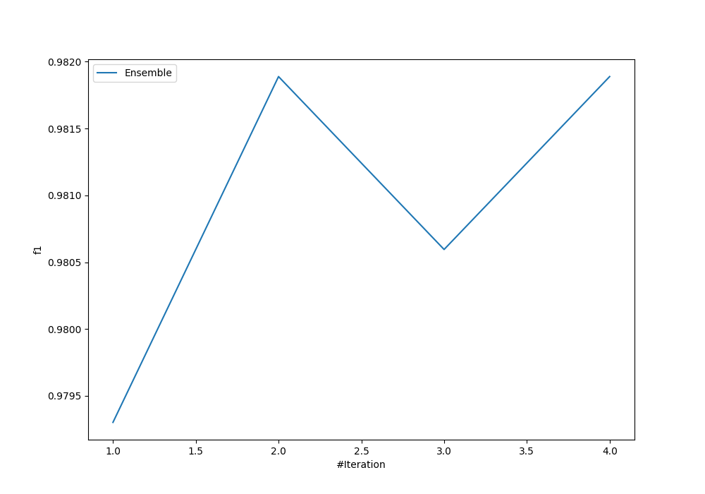
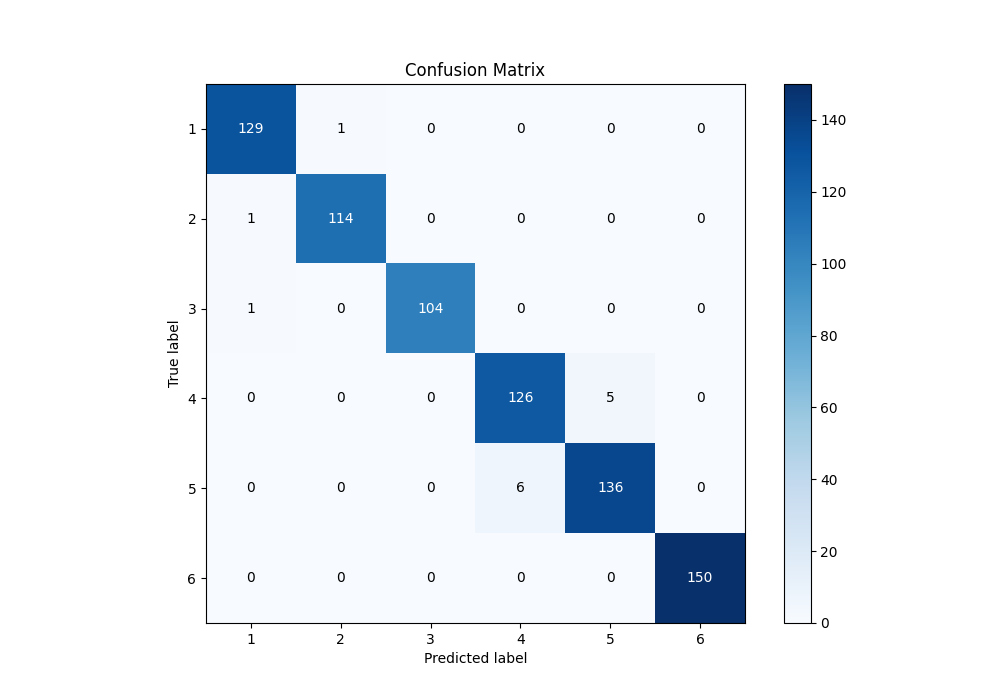
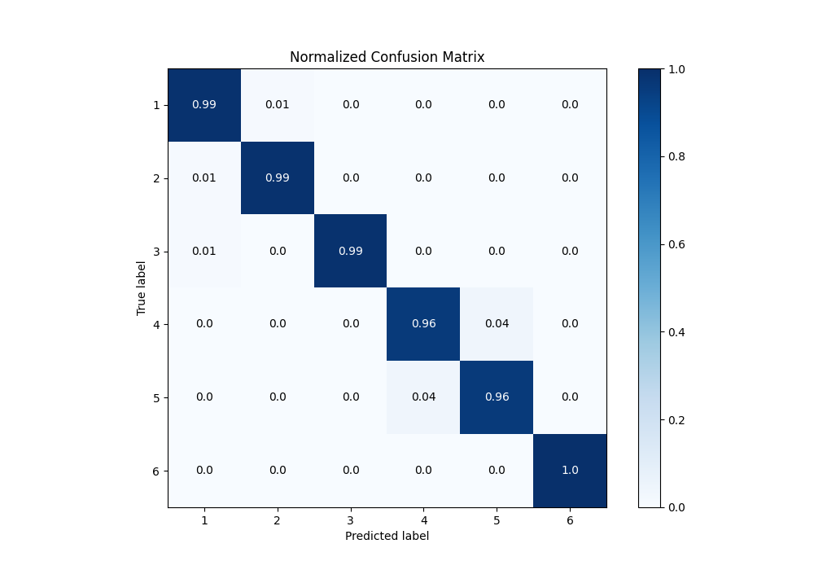
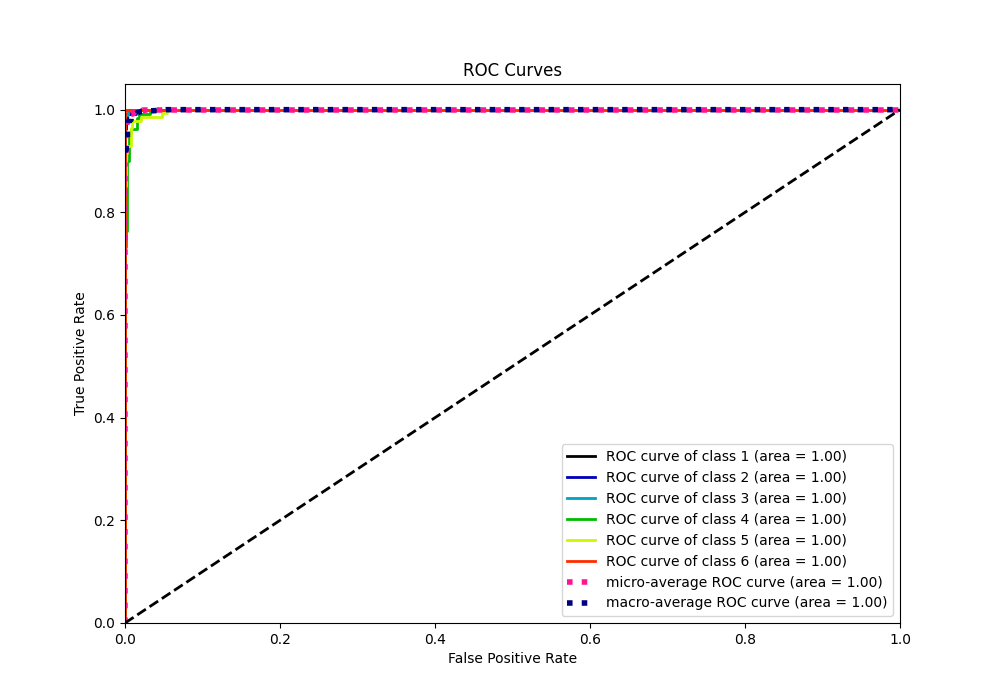
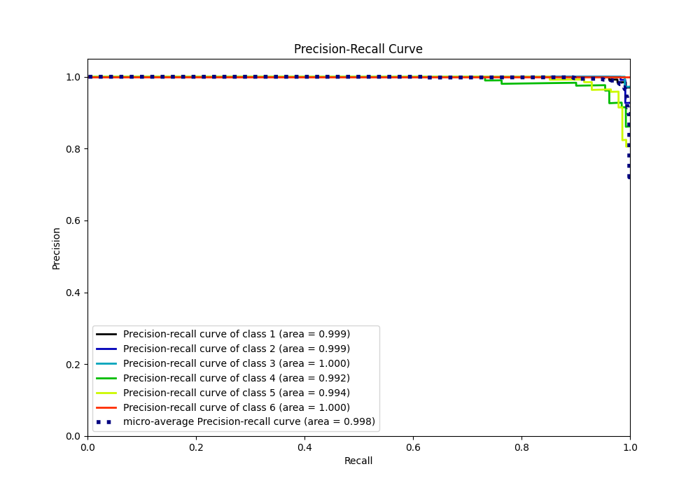

# Summary of Ensemble

[<< Go back](../README.md)

## Ensemble structure
| Model                   |   Weight |
|:------------------------|---------:|
| 2_Linear                |        1 |
| 3_Default_NeuralNetwork |        1 |

### Metric details
|           |          1 |          2 |          3 |          4 |          5 |   6 |   accuracy |   macro avg |   weighted avg |   logloss |
|:----------|-----------:|-----------:|-----------:|-----------:|-----------:|----:|-----------:|------------:|---------------:|----------:|
| precision |   0.984733 |   0.991304 |   1        |   0.954545 |   0.964539 |   1 |   0.981889 |    0.98252  |       0.981921 |  0.136876 |
| recall    |   0.992308 |   0.991304 |   0.990476 |   0.961832 |   0.957746 |   1 |   0.981889 |    0.982278 |       0.981889 |  0.136876 |
| f1-score  |   0.988506 |   0.991304 |   0.995215 |   0.958175 |   0.961131 |   1 |   0.981889 |    0.982389 |       0.981895 |  0.136876 |
| support   | 130        | 115        | 105        | 131        | 142        | 150 |   0.981889 |  773        |     773        |  0.136876 |

## Confusion matrix
|              |   Predicted as 1 |   Predicted as 2 |   Predicted as 3 |   Predicted as 4 |   Predicted as 5 |   Predicted as 6 |
|:-------------|-----------------:|-----------------:|-----------------:|-----------------:|-----------------:|-----------------:|
| Labeled as 1 |              129 |                1 |                0 |                0 |                0 |                0 |
| Labeled as 2 |                1 |              114 |                0 |                0 |                0 |                0 |
| Labeled as 3 |                1 |                0 |              104 |                0 |                0 |                0 |
| Labeled as 4 |                0 |                0 |                0 |              126 |                5 |                0 |
| Labeled as 5 |                0 |                0 |                0 |                6 |              136 |                0 |
| Labeled as 6 |                0 |                0 |                0 |                0 |                0 |              150 |

## Learning curves

## Confusion Matrix

## Normalized Confusion Matrix

## ROC Curve

## Precision Recall Curve

[<< Go back](../README.md)
