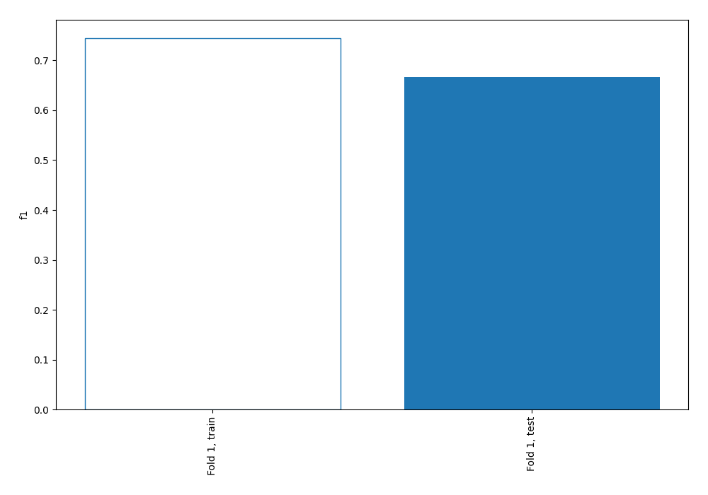
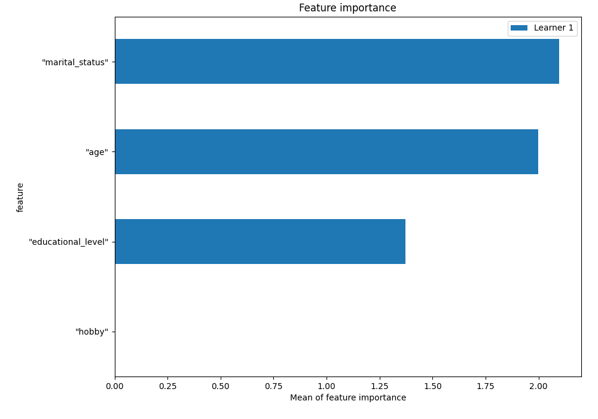
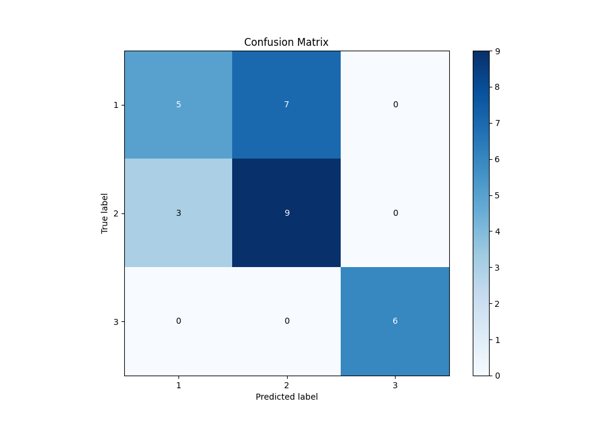
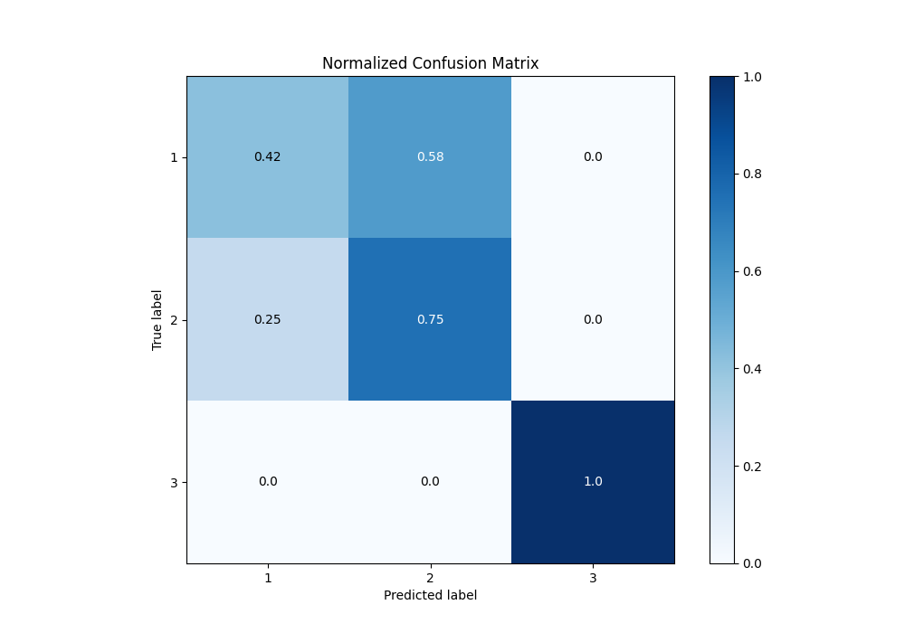
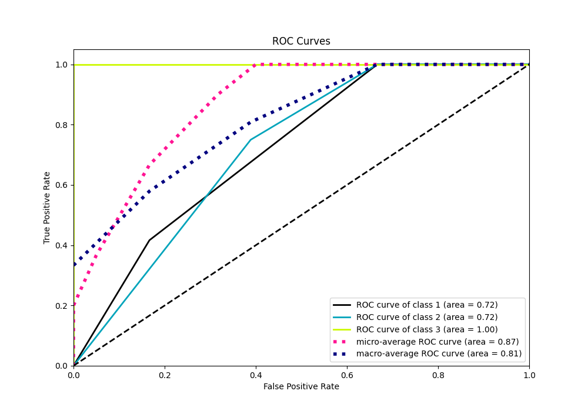
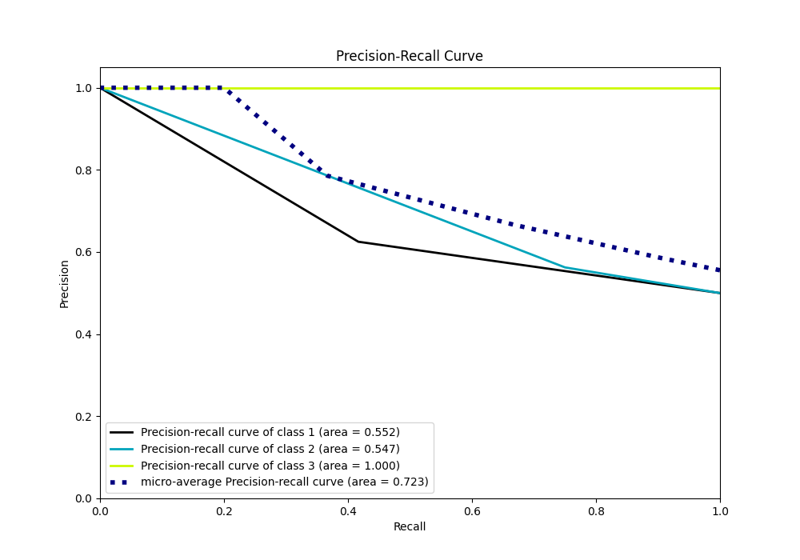

# Summary of 1_DecisionTree

[<< Go back](../README.md)

## Decision Tree
- **n_jobs**: -1
- **criterion**: entropy
- **max_depth**: 4
- **num_class**: 3
- **explain_level**: 1

## Validation
 - **validation_type**: split
 - **train_ratio**: 0.75
 - **shuffle**: True
 - **stratify**: True

## Optimized metric
f1

## Training time

1.5 seconds

### Metric details
|           |         1 |         2 |   3 |   accuracy |   macro avg |   weighted avg |   logloss |
|:----------|----------:|----------:|----:|-----------:|------------:|---------------:|----------:|
| precision |  0.625    |  0.5625   |   1 |   0.666667 |    0.729167 |       0.675    |  0.557999 |
| recall    |  0.416667 |  0.75     |   1 |   0.666667 |    0.722222 |       0.666667 |  0.557999 |
| f1-score  |  0.5      |  0.642857 |   1 |   0.666667 |    0.714286 |       0.657143 |  0.557999 |
| support   | 12        | 12        |   6 |   0.666667 |   30        |      30        |  0.557999 |

## Confusion matrix
|              |   Predicted as 1 |   Predicted as 2 |   Predicted as 3 |
|:-------------|-----------------:|-----------------:|-----------------:|
| Labeled as 1 |                5 |                7 |                0 |
| Labeled as 2 |                3 |                9 |                0 |
| Labeled as 3 |                0 |                0 |                6 |

## Learning curves

## Permutation-based Importance

## Confusion Matrix

## Normalized Confusion Matrix

## ROC Curve

## Precision Recall Curve

[<< Go back](../README.md)
