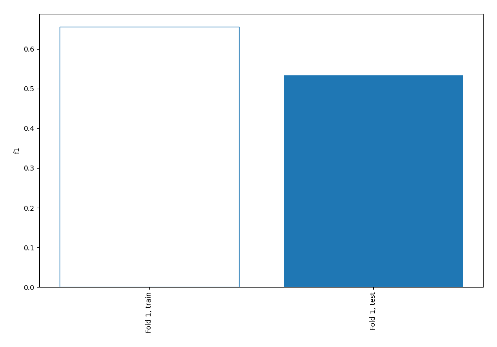
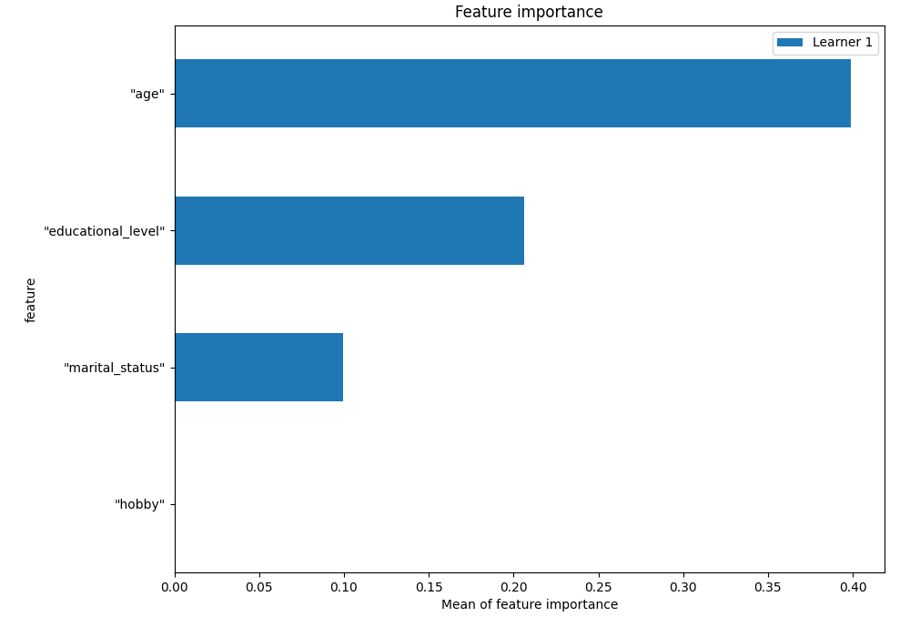
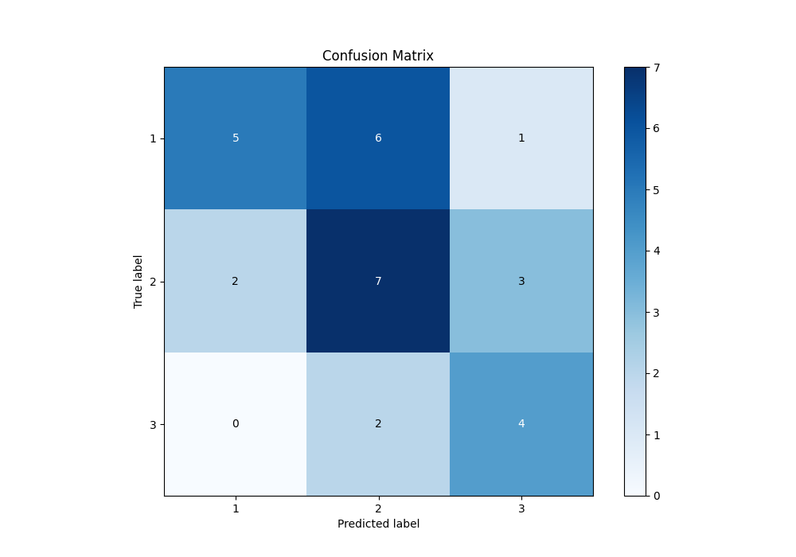
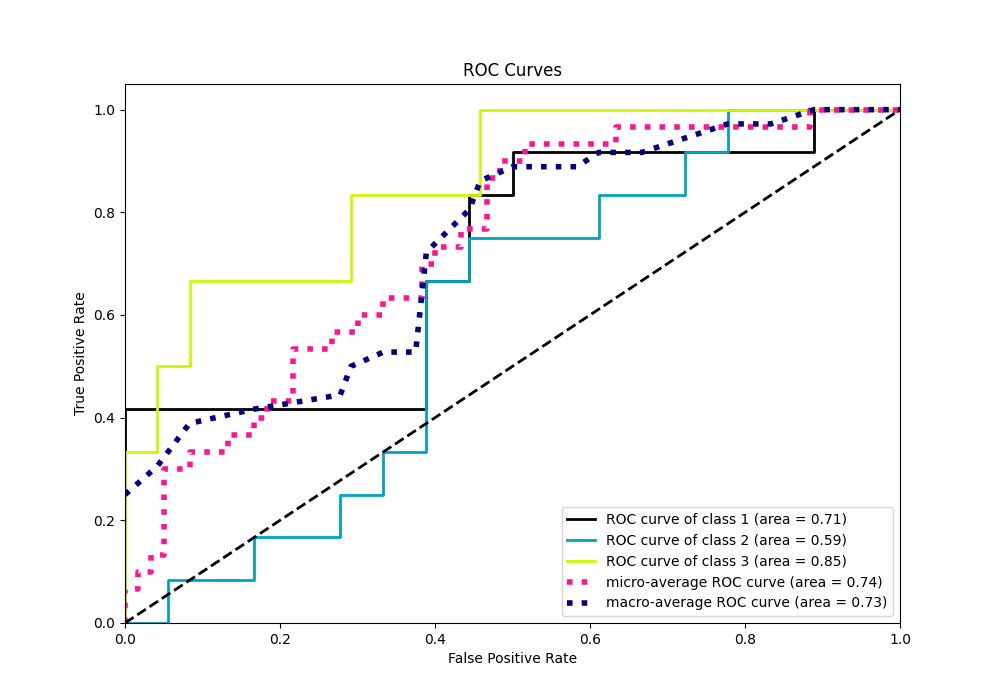
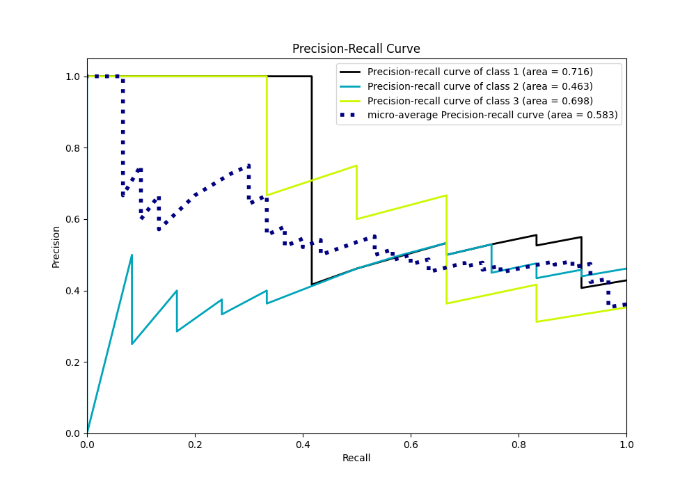

# Summary of 2_Linear

[<< Go back](../README.md)

## Logistic Regression (Linear)
- **n_jobs**: -1
- **num_class**: 3
- **explain_level**: 1

## Validation
 - **validation_type**: split
 - **train_ratio**: 0.75
 - **shuffle**: True
 - **stratify**: True

## Optimized metric
f1

## Training time

0.3 seconds

### Metric details
|           |         1 |         2 |        3 |   accuracy |   macro avg |   weighted avg |   logloss |
|:----------|----------:|----------:|---------:|-----------:|------------:|---------------:|----------:|
| precision |  0.714286 |  0.466667 | 0.5      |   0.533333 |    0.560317 |       0.572381 |  0.993428 |
| recall    |  0.416667 |  0.583333 | 0.666667 |   0.533333 |    0.555556 |       0.533333 |  0.993428 |
| f1-score  |  0.526316 |  0.518519 | 0.571429 |   0.533333 |    0.538754 |       0.532219 |  0.993428 |
| support   | 12        | 12        | 6        |   0.533333 |   30        |      30        |  0.993428 |

## Confusion matrix
|              |   Predicted as 1 |   Predicted as 2 |   Predicted as 3 |
|:-------------|-----------------:|-----------------:|-----------------:|
| Labeled as 1 |                5 |                6 |                1 |
| Labeled as 2 |                2 |                7 |                3 |
| Labeled as 3 |                0 |                2 |                4 |

## Learning curves

## Coefficients

### Coefficients learner #1
|                     |          1 |          2 |           3 |
|:--------------------|-----------:|-----------:|------------:|
| intercept           |  0.497037  |  0.867194  | -1.36423    |
| "hobby"             | -0.0959093 |  0.0931647 |  0.00274468 |
| "age"               | -0.883906  | -0.182596  |  1.0665     |
| "educational_level" | -0.878903  | -0.143565  |  1.02247    |
| "marital_status"    | -1.01226   | -0.256568  |  1.26883    |

## Permutation-based Importance

## Confusion Matrix

## Normalized Confusion Matrix

## ROC Curve

## Precision Recall Curve

[<< Go back](../README.md)
