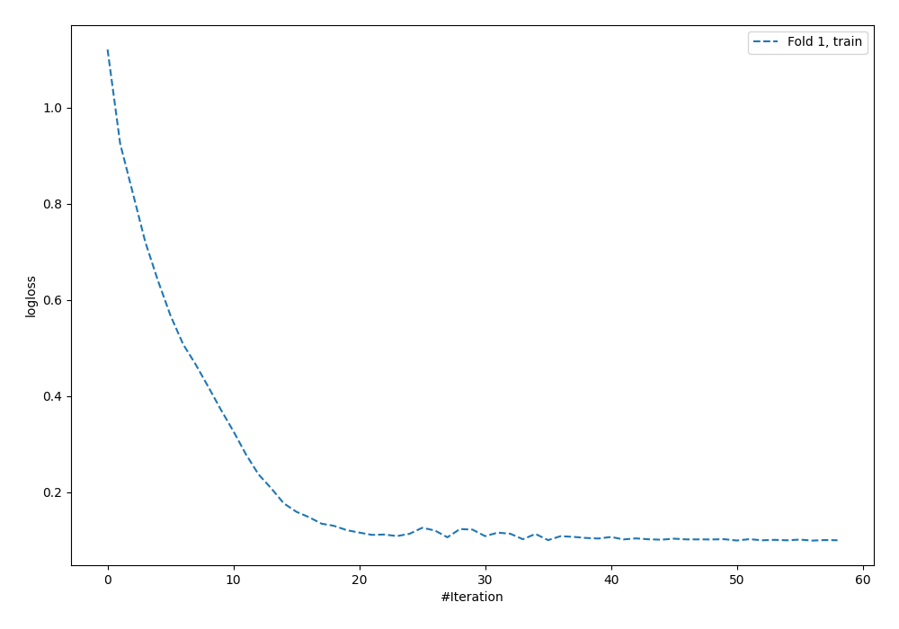
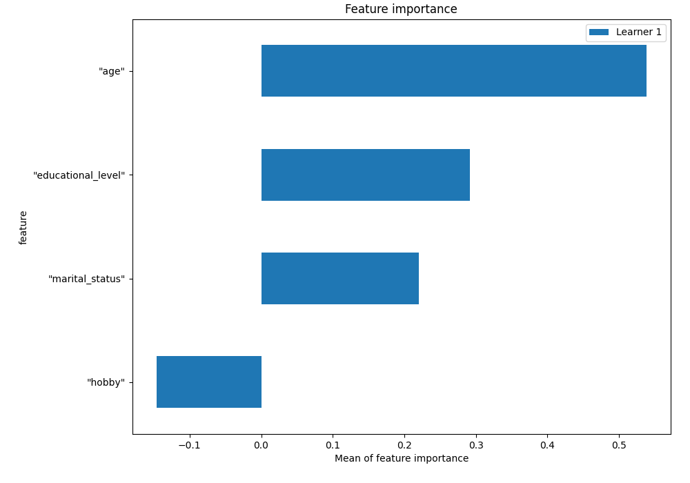
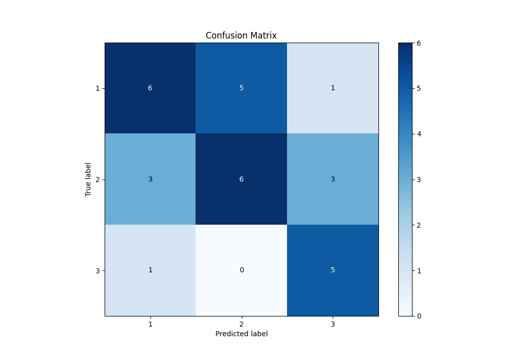
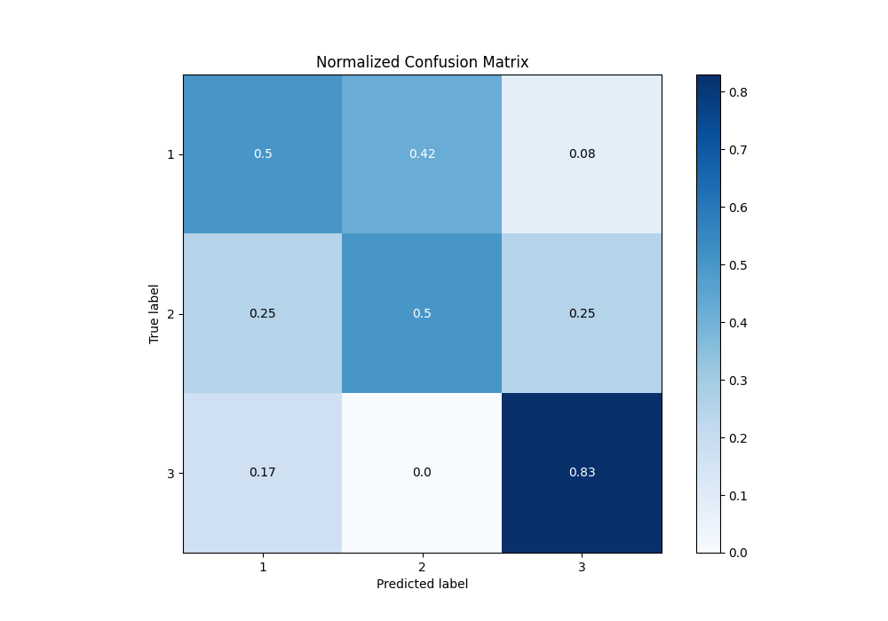
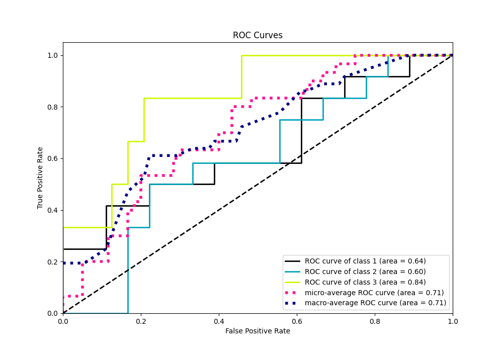
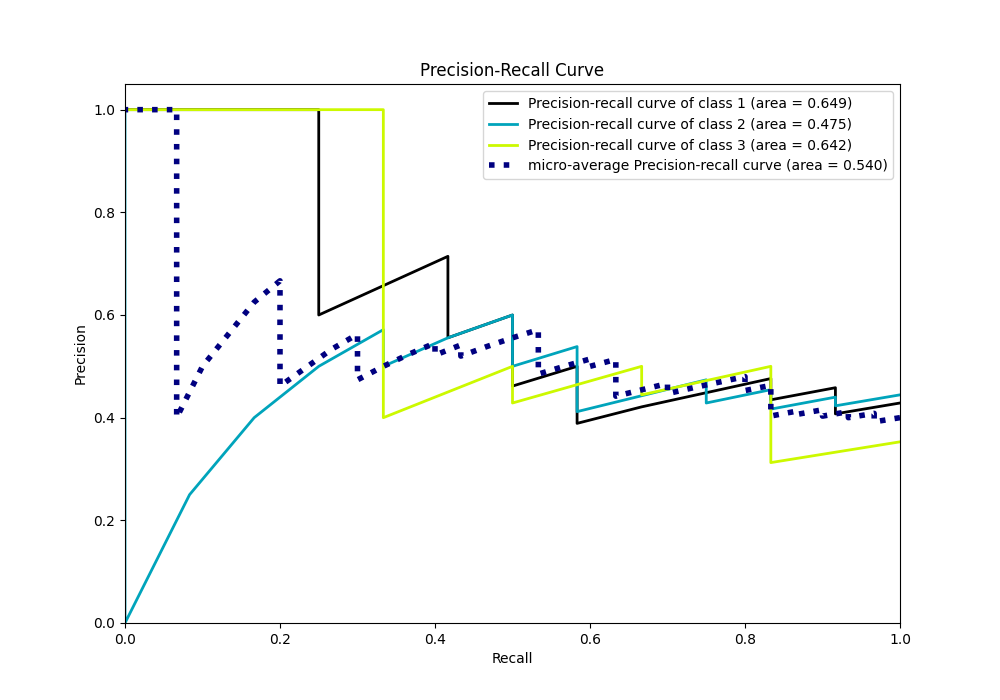

# Summary of 3_Default_NeuralNetwork

[<< Go back](../README.md)

## Neural Network
- **n_jobs**: -1
- **dense_1_size**: 32
- **dense_2_size**: 16
- **learning_rate**: 0.05
- **num_class**: 3
- **explain_level**: 1

## Validation
 - **validation_type**: split
 - **train_ratio**: 0.75
 - **shuffle**: True
 - **stratify**: True

## Optimized metric
f1

## Training time

0.4 seconds

### Metric details
|           |         1 |         2 |        3 |   accuracy |   macro avg |   weighted avg |   logloss |
|:----------|----------:|----------:|---------:|-----------:|------------:|---------------:|----------:|
| precision |  0.6      |  0.545455 | 0.555556 |   0.566667 |    0.567003 |       0.569293 |   1.15617 |
| recall    |  0.5      |  0.5      | 0.833333 |   0.566667 |    0.611111 |       0.566667 |   1.15617 |
| f1-score  |  0.545455 |  0.521739 | 0.666667 |   0.566667 |    0.577953 |       0.560211 |   1.15617 |
| support   | 12        | 12        | 6        |   0.566667 |   30        |      30        |   1.15617 |

## Confusion matrix
|              |   Predicted as 1 |   Predicted as 2 |   Predicted as 3 |
|:-------------|-----------------:|-----------------:|-----------------:|
| Labeled as 1 |                6 |                5 |                1 |
| Labeled as 2 |                3 |                6 |                3 |
| Labeled as 3 |                1 |                0 |                5 |

## Learning curves

## Permutation-based Importance

## Confusion Matrix

## Normalized Confusion Matrix

## ROC Curve

## Precision Recall Curve

[<< Go back](../README.md)
