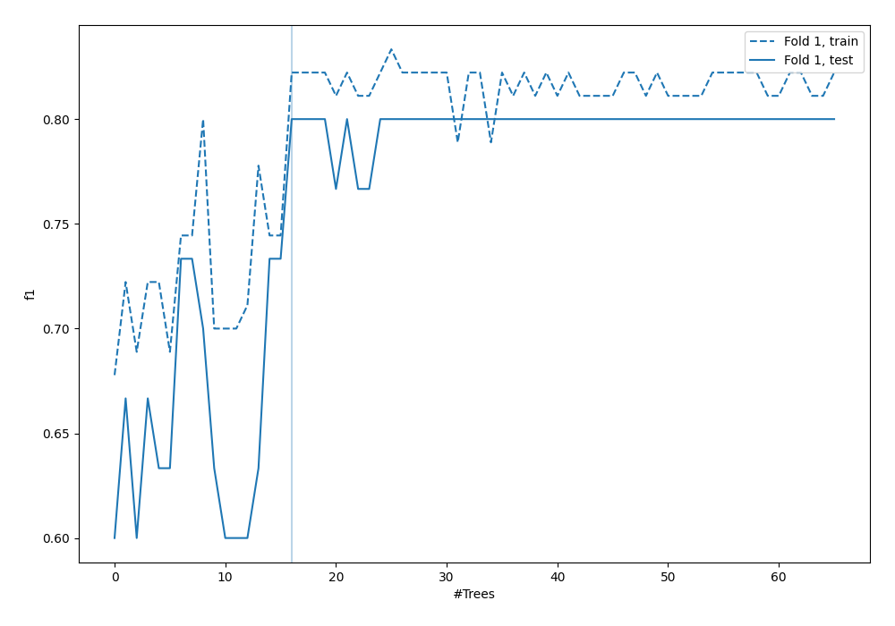
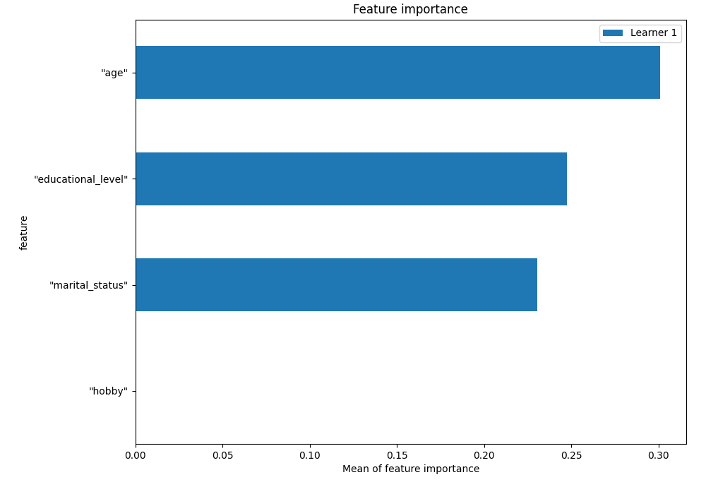
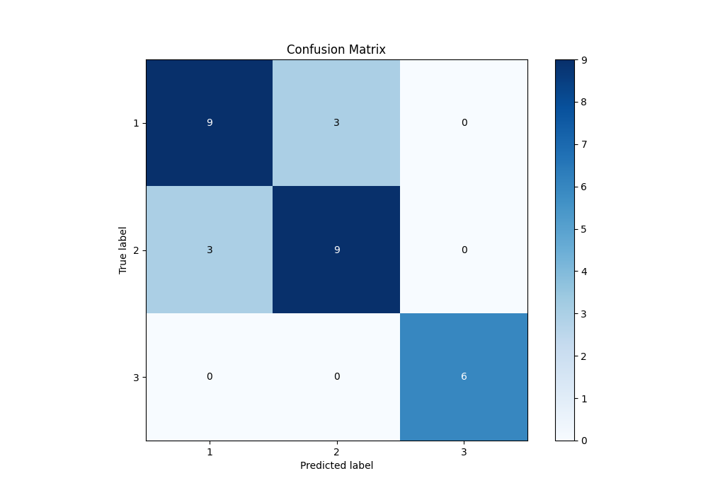
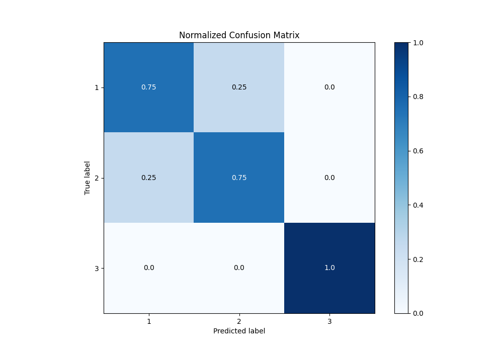
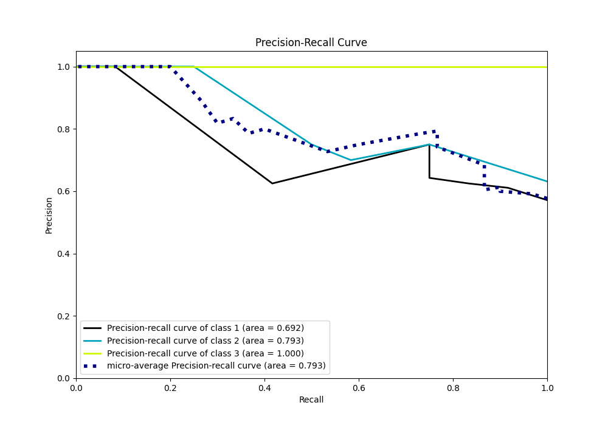

# Summary of 4_Default_RandomForest

[<< Go back](../README.md)

## Random Forest
- **n_jobs**: -1
- **criterion**: gini
- **max_features**: 0.9
- **min_samples_split**: 30
- **max_depth**: 4
- **eval_metric_name**: f1
- **num_class**: 3
- **explain_level**: 1

## Validation
 - **validation_type**: split
 - **train_ratio**: 0.75
 - **shuffle**: True
 - **stratify**: True

## Optimized metric
f1

## Training time

0.8 seconds

### Metric details
|           |     1 |     2 |   3 |   accuracy |   macro avg |   weighted avg |   logloss |
|:----------|------:|------:|----:|-----------:|------------:|---------------:|----------:|
| precision |  0.75 |  0.75 |   1 |        0.8 |    0.833333 |            0.8 |  0.627734 |
| recall    |  0.75 |  0.75 |   1 |        0.8 |    0.833333 |            0.8 |  0.627734 |
| f1-score  |  0.75 |  0.75 |   1 |        0.8 |    0.833333 |            0.8 |  0.627734 |
| support   | 12    | 12    |   6 |        0.8 |   30        |           30   |  0.627734 |

## Confusion matrix
|              |   Predicted as 1 |   Predicted as 2 |   Predicted as 3 |
|:-------------|-----------------:|-----------------:|-----------------:|
| Labeled as 1 |                9 |                3 |                0 |
| Labeled as 2 |                3 |                9 |                0 |
| Labeled as 3 |                0 |                0 |                6 |

## Learning curves

## Permutation-based Importance

## Confusion Matrix

## Normalized Confusion Matrix

## ROC Curve

## Precision Recall Curve

[<< Go back](../README.md)
