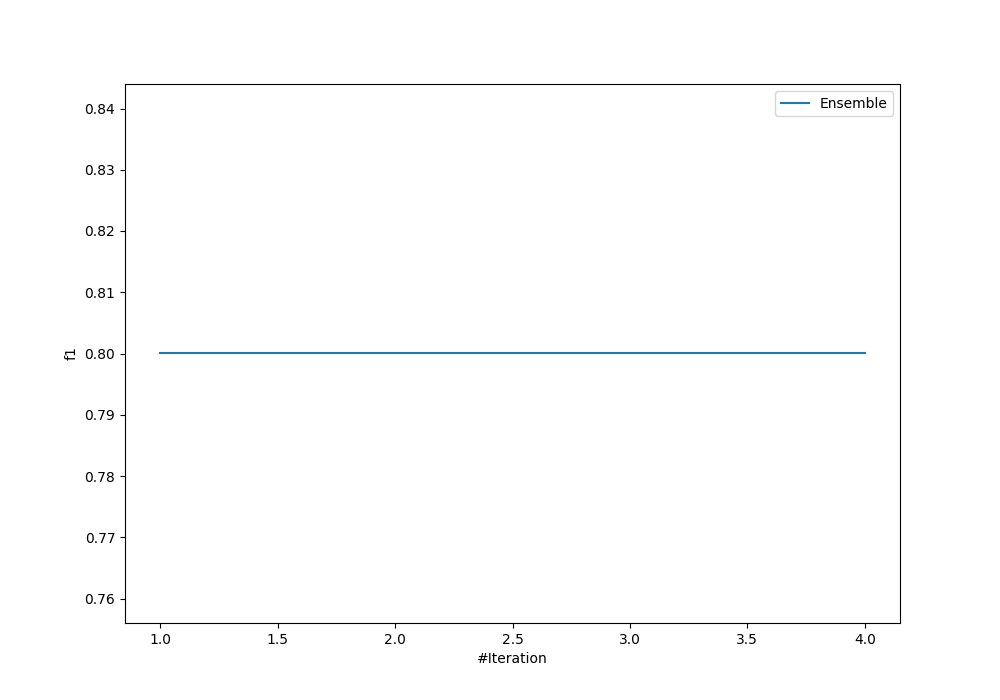
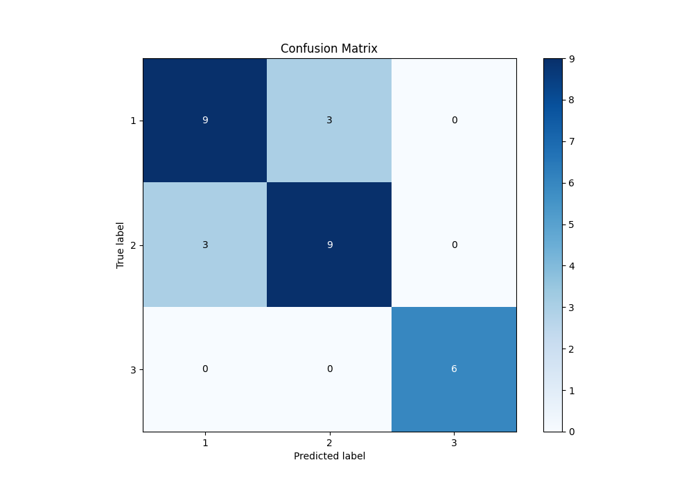
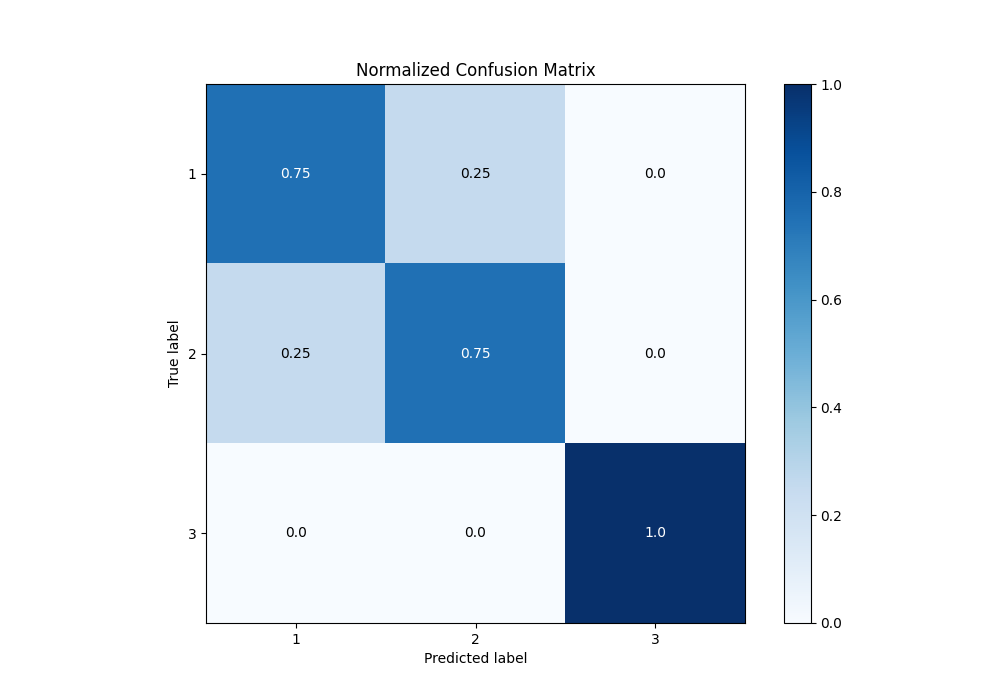
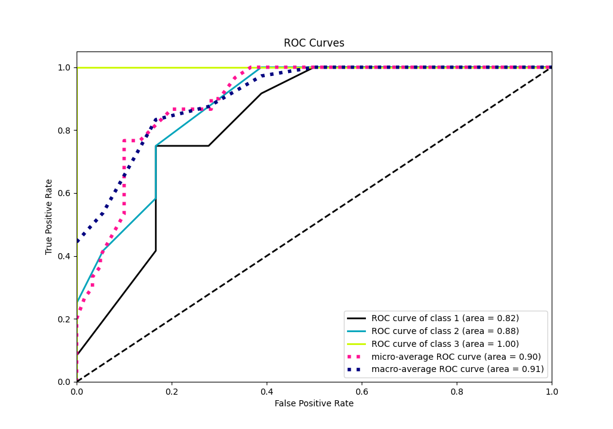
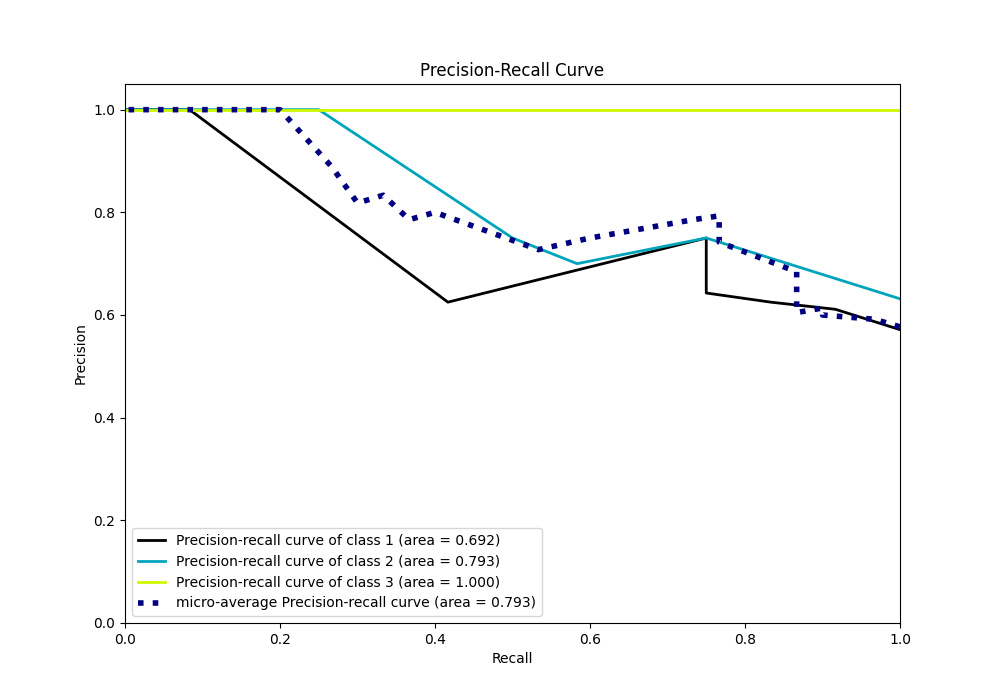

# Summary of Ensemble

[<< Go back](../README.md)

## Ensemble structure
| Model                  |   Weight |
|:-----------------------|---------:|
| 4_Default_RandomForest |        1 |

### Metric details
|           |     1 |     2 |   3 |   accuracy |   macro avg |   weighted avg |   logloss |
|:----------|------:|------:|----:|-----------:|------------:|---------------:|----------:|
| precision |  0.75 |  0.75 |   1 |        0.8 |    0.833333 |            0.8 |  0.627734 |
| recall    |  0.75 |  0.75 |   1 |        0.8 |    0.833333 |            0.8 |  0.627734 |
| f1-score  |  0.75 |  0.75 |   1 |        0.8 |    0.833333 |            0.8 |  0.627734 |
| support   | 12    | 12    |   6 |        0.8 |   30        |           30   |  0.627734 |

## Confusion matrix
|              |   Predicted as 1 |   Predicted as 2 |   Predicted as 3 |
|:-------------|-----------------:|-----------------:|-----------------:|
| Labeled as 1 |                9 |                3 |                0 |
| Labeled as 2 |                3 |                9 |                0 |
| Labeled as 3 |                0 |                0 |                6 |

## Learning curves

## Confusion Matrix

## Normalized Confusion Matrix

## ROC Curve

## Precision Recall Curve

[<< Go back](../README.md)
