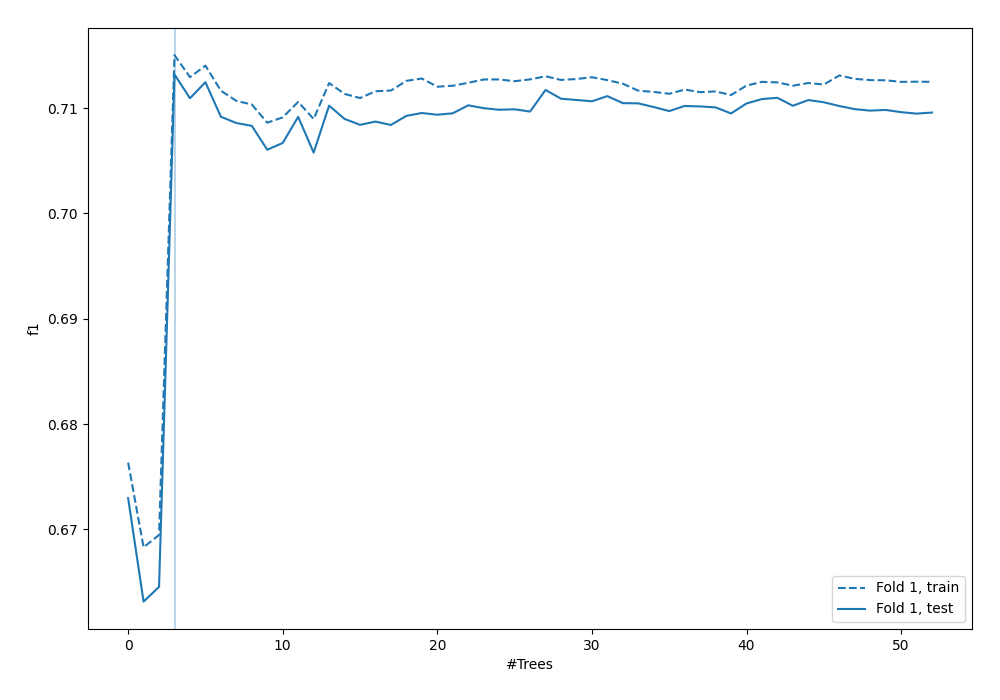
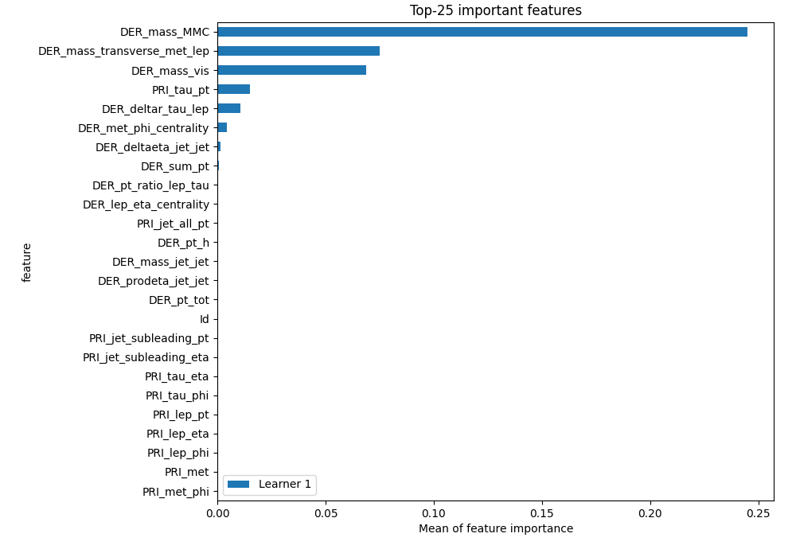
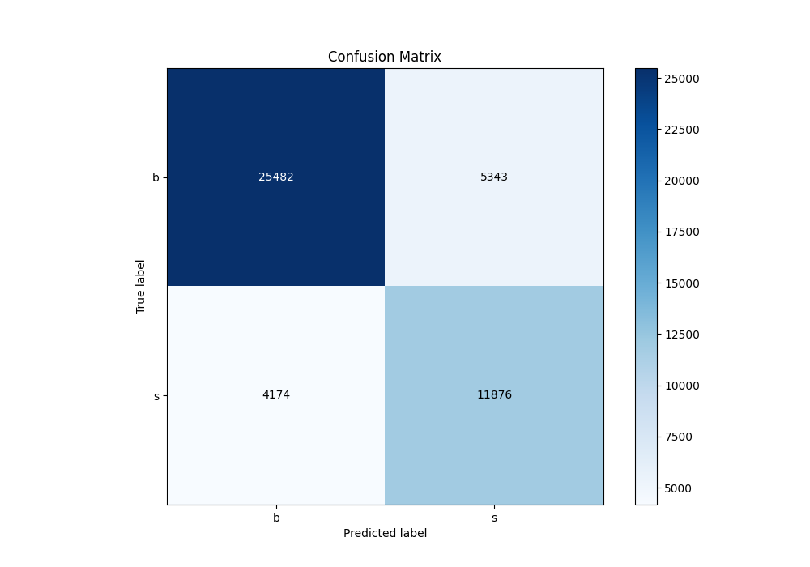
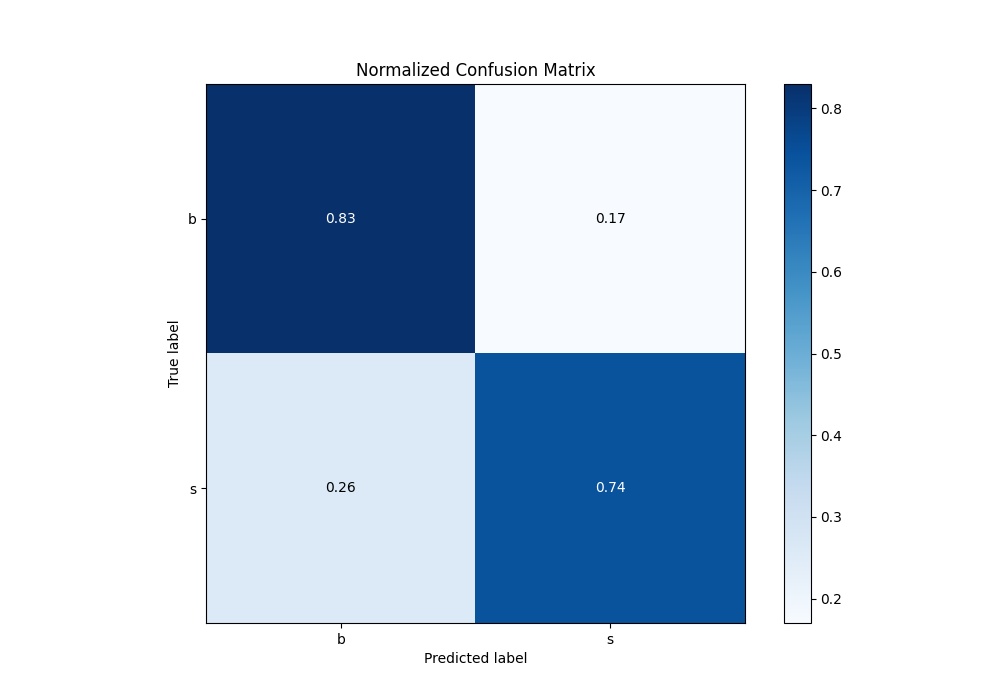
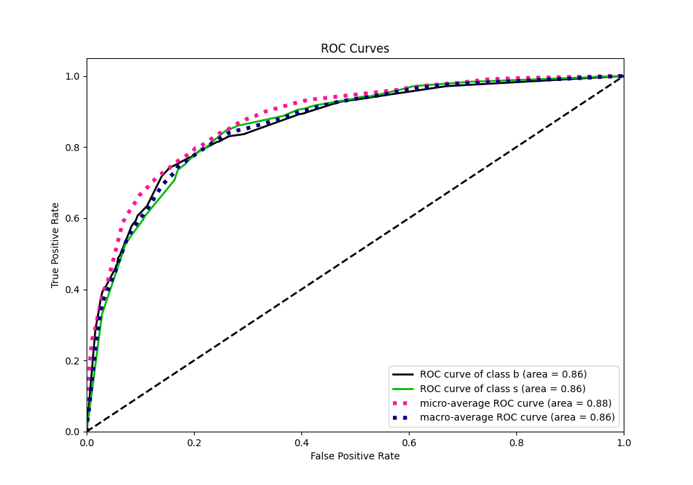
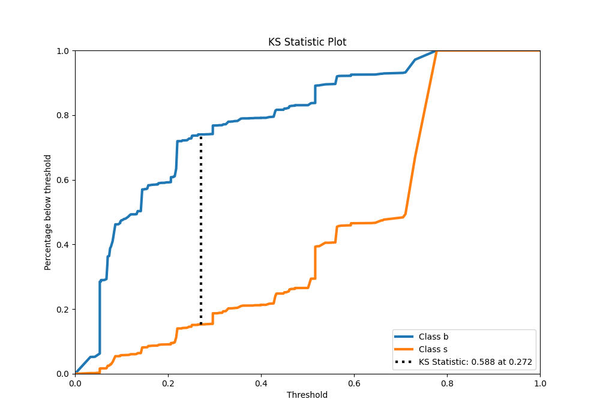
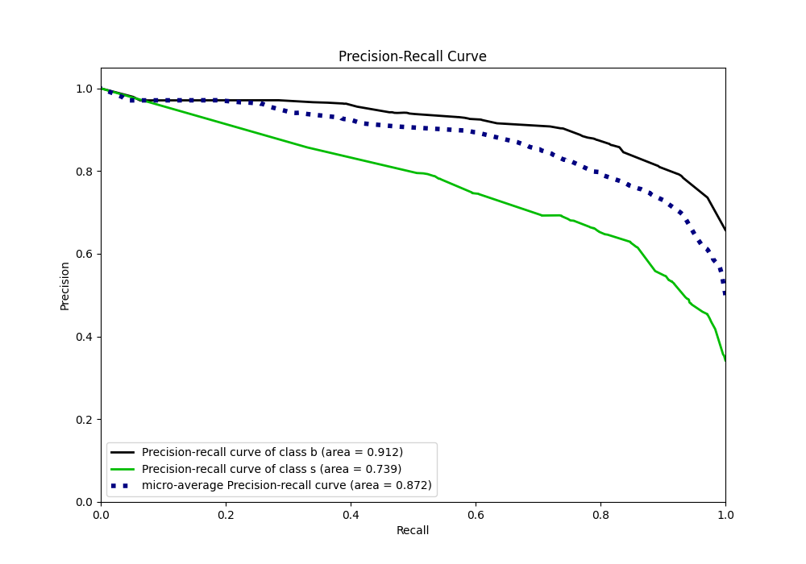
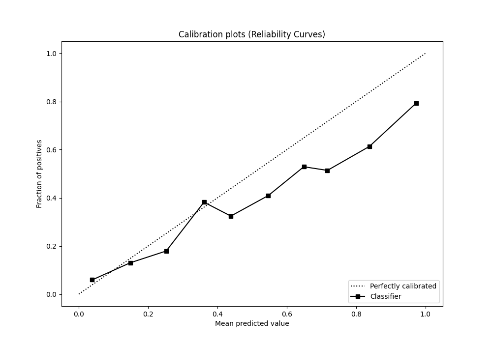
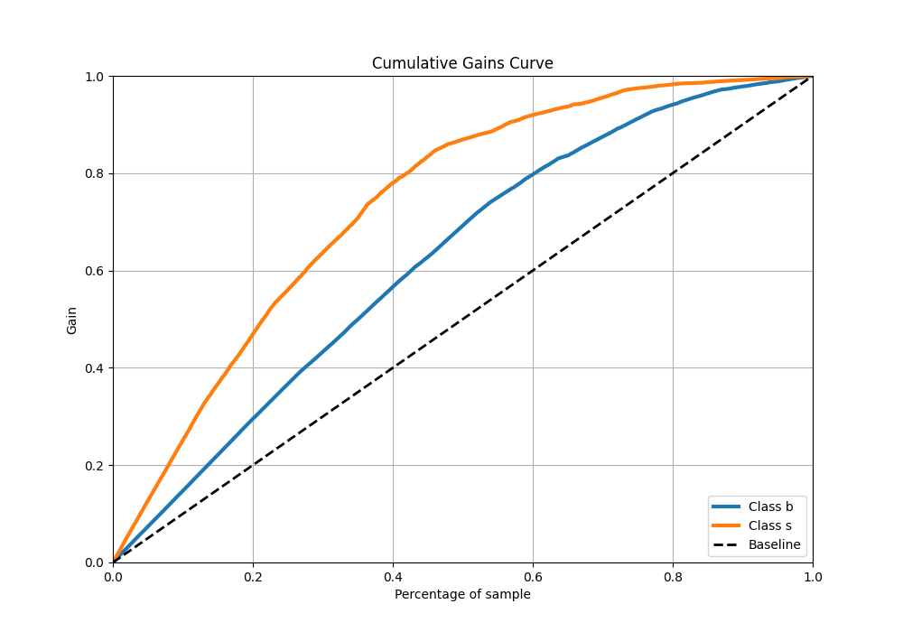
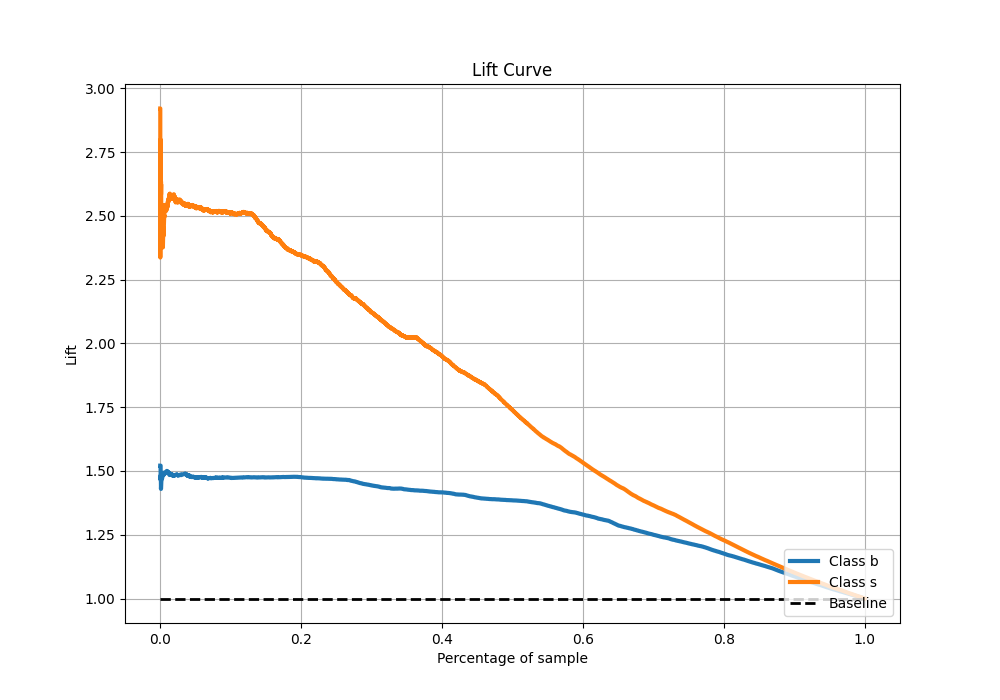

# Summary of 3_Default_RandomForest

[<< Go back](../README.md)

## Random Forest
- **n_jobs**: -1
- **criterion**: gini
- **max_features**: 0.9
- **min_samples_split**: 30
- **max_depth**: 4
- **eval_metric_name**: f1
- **explain_level**: 1

## Validation
 - **validation_type**: split
 - **train_ratio**: 0.75
 - **shuffle**: True
 - **stratify**: True

## Optimized metric
f1

## Training time

36.7 seconds

## Metric details
|           |    score |   threshold |
|:----------|---------:|------------:|
| logloss   | 0.437558 |  nan        |
| auc       | 0.861265 |  nan        |
| f1        | 0.722188 |    0.274943 |
| accuracy  | 0.796971 |    0.461266 |
| precision | 0.857212 |    0.754625 |
| recall    | 1        |    0.029891 |
| mcc       | 0.55924  |    0.391789 |

## Confusion matrix (at threshold=0.461266)
|              |   Predicted as b |   Predicted as s |
|:-------------|-----------------:|-----------------:|
| Labeled as b |            25482 |             5343 |
| Labeled as s |             4174 |            11876 |

## Learning curves

## Permutation-based Importance

## Confusion Matrix

## Normalized Confusion Matrix

## ROC Curve

## Kolmogorov-Smirnov Statistic

## Precision-Recall Curve

## Calibration Curve

## Cumulative Gains Curve

## Lift Curve

[<< Go back](../README.md)
