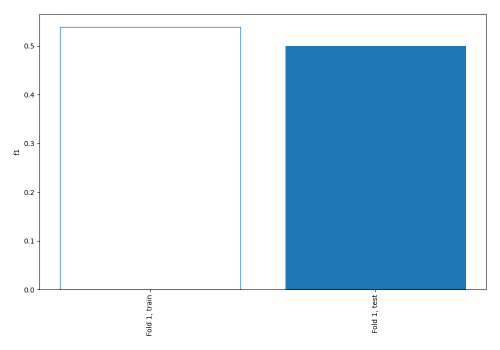
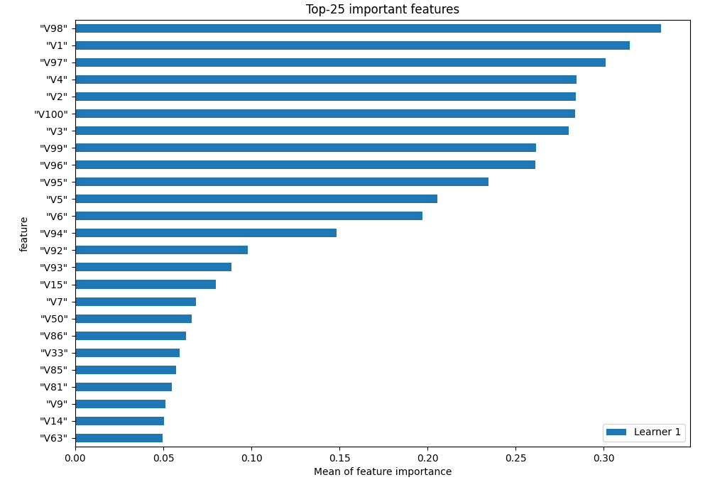
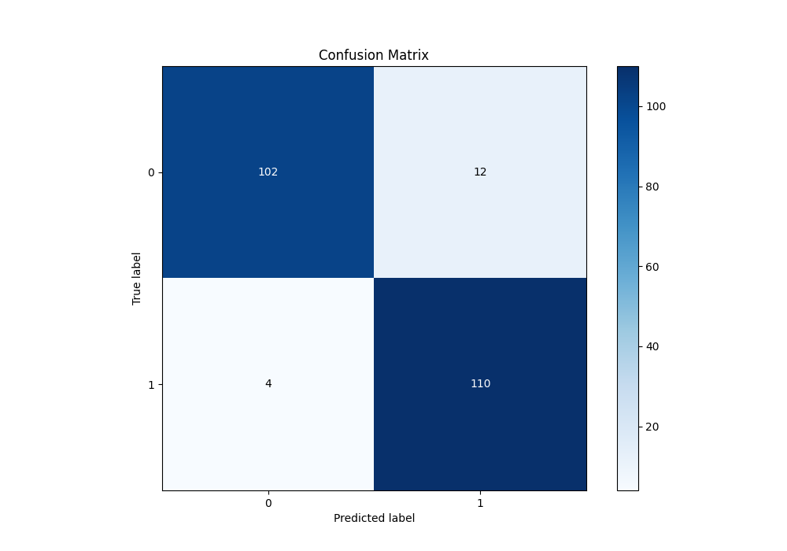
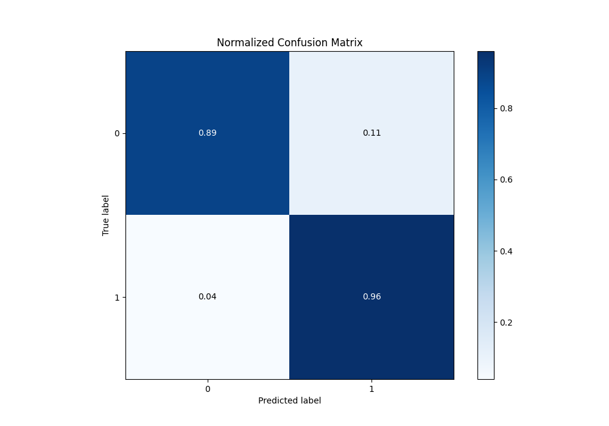
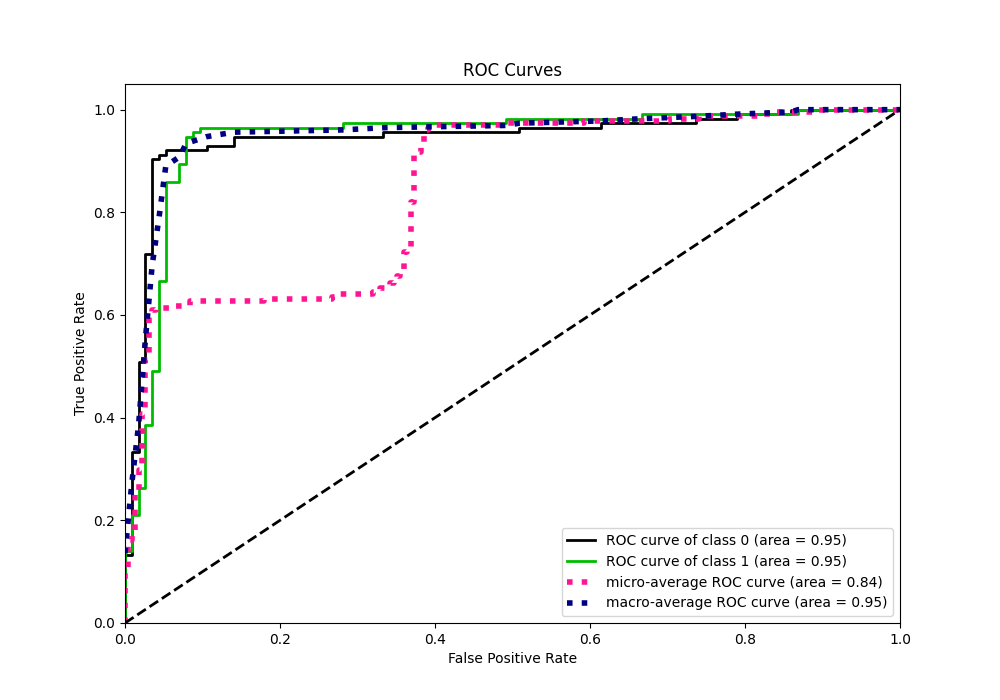
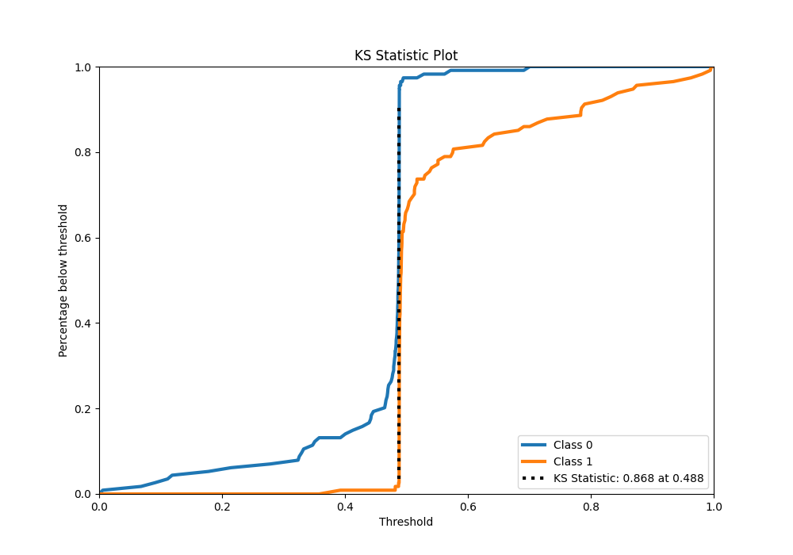
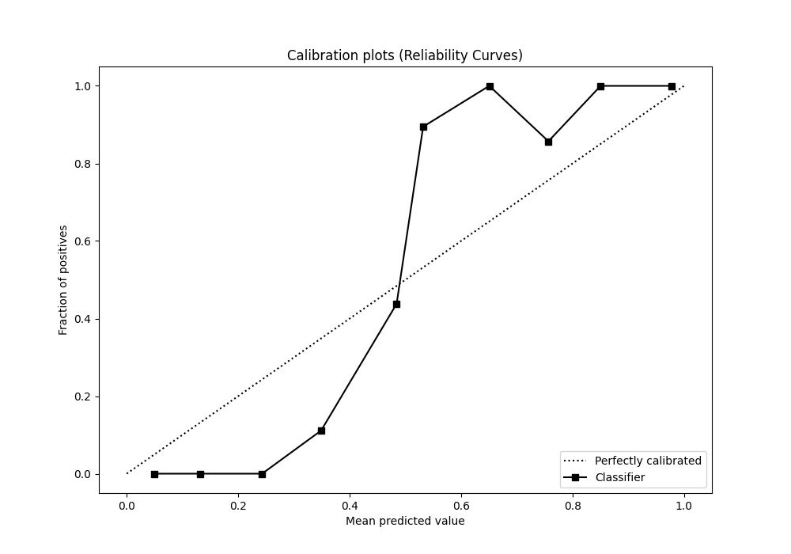
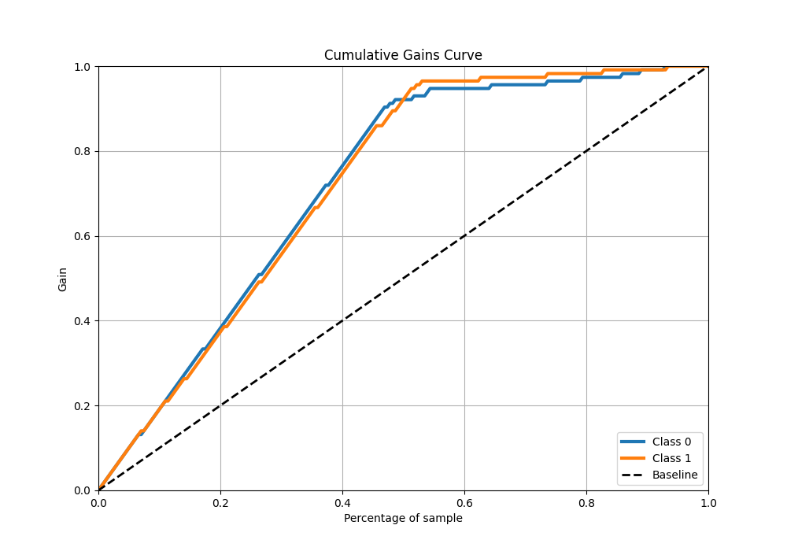
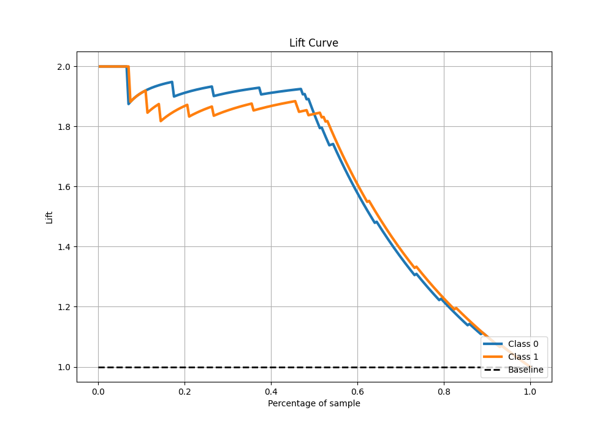

# Summary of 2_Linear

[<< Go back](../README.md)

## Logistic Regression (Linear)
- **n_jobs**: -1
- **explain_level**: 1

## Validation
 - **validation_type**: split
 - **train_ratio**: 0.75
 - **shuffle**: True
 - **stratify**: True

## Optimized metric
f1

## Training time

1.7 seconds

## Metric details
|           |    score |    threshold |
|:----------|---------:|-------------:|
| logloss   | 0.612403 | nan          |
| auc       | 0.945214 | nan          |
| f1        | 0.932203 |   0.488154   |
| accuracy  | 0.929825 |   0.488154   |
| precision | 1        |   0.725925   |
| recall    | 1        |   0.00534692 |
| mcc       | 0.861774 |   0.488154   |

## Confusion matrix (at threshold=0.488154)
|              |   Predicted as 0 |   Predicted as 1 |
|:-------------|-----------------:|-----------------:|
| Labeled as 0 |              102 |               12 |
| Labeled as 1 |                4 |              110 |

## Learning curves

## Permutation-based Importance

## Confusion Matrix

## Normalized Confusion Matrix

## ROC Curve

## Kolmogorov-Smirnov Statistic

## Precision-Recall Curve

## Calibration Curve

## Cumulative Gains Curve

## Lift Curve

[<< Go back](../README.md)
