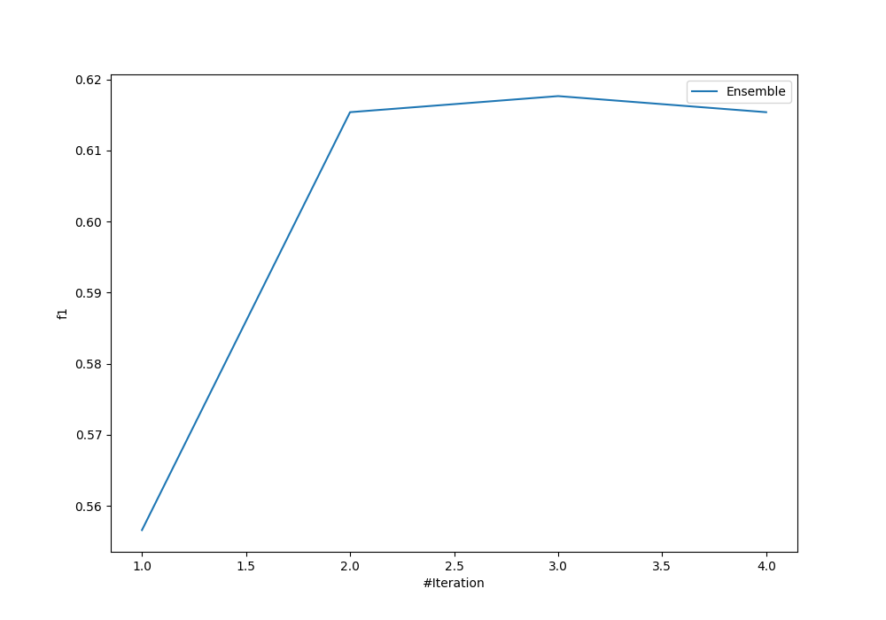
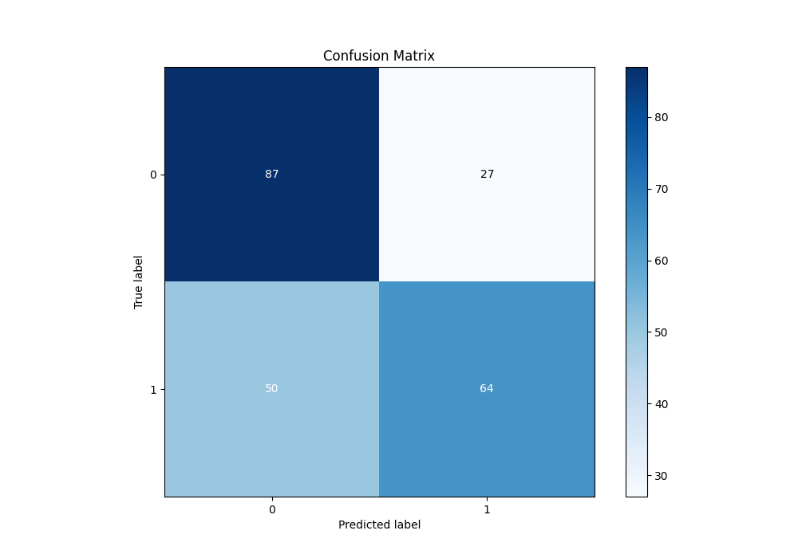
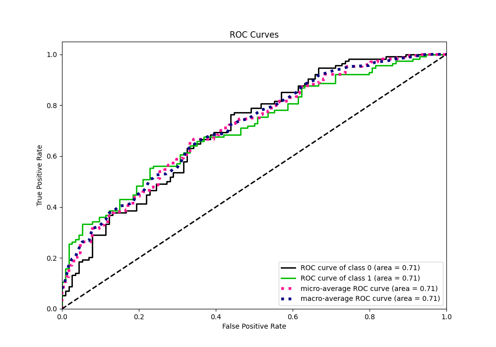
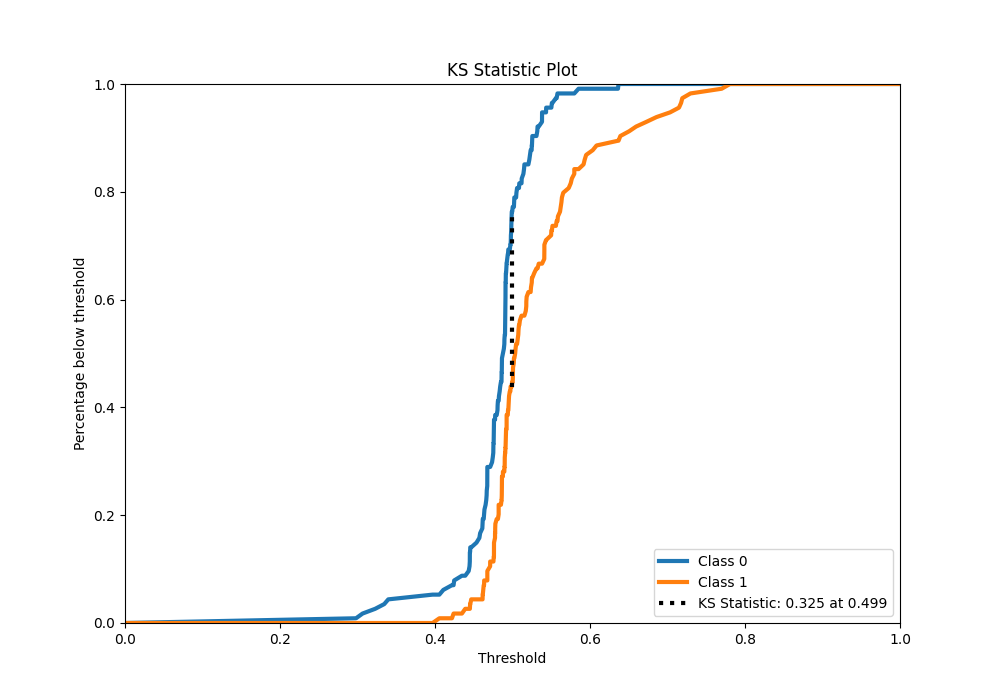
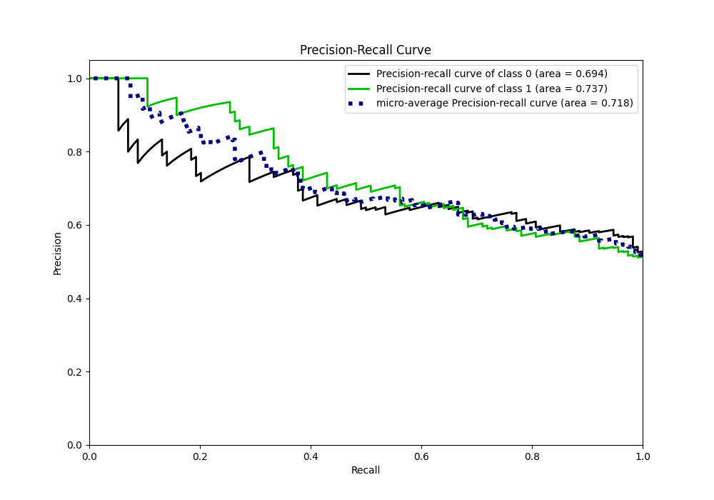
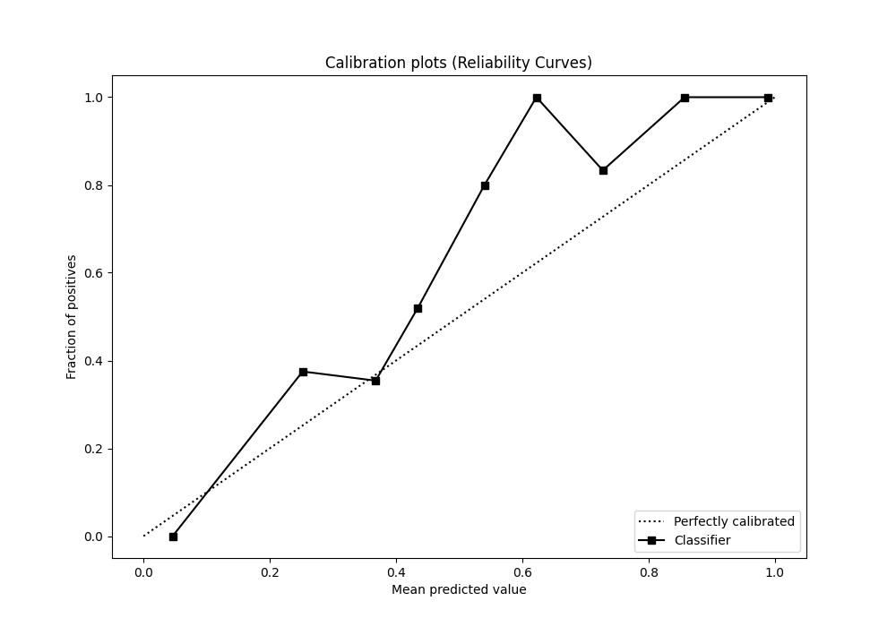
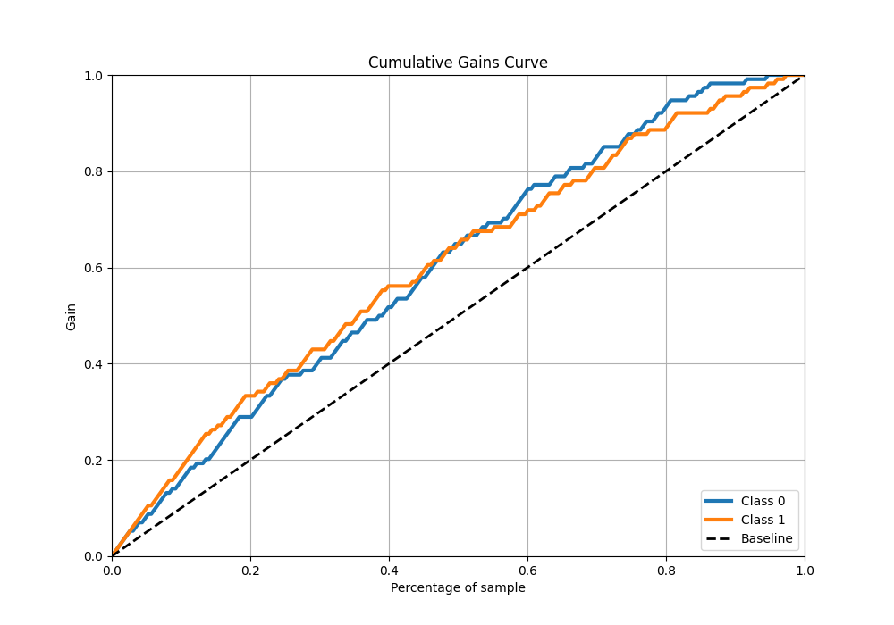
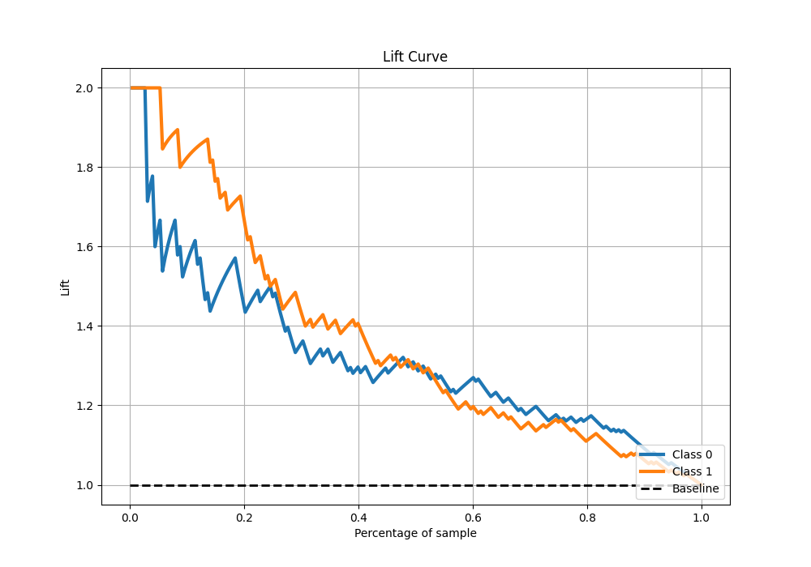

# Summary of Ensemble

[<< Go back](../README.md)

## Ensemble structure
| Model                  |   Weight |
|:-----------------------|---------:|
| 2_Linear               |        1 |
| 4_Default_RandomForest |        2 |

## Metric details
|           |    score |   threshold |
|:----------|---------:|------------:|
| logloss   | 0.651661 |  nan        |
| auc       | 0.707064 |  nan        |
| f1        | 0.691275 |    0.468798 |
| accuracy  | 0.662281 |    0.499624 |
| precision | 1        |    0.640157 |
| recall    | 1        |    0.268285 |
| mcc       | 0.355643 |    0.540694 |

## Confusion matrix (at threshold=0.499624)
|              |   Predicted as 0 |   Predicted as 1 |
|:-------------|-----------------:|-----------------:|
| Labeled as 0 |               87 |               27 |
| Labeled as 1 |               50 |               64 |

## Learning curves

## Confusion Matrix

## Normalized Confusion Matrix

## ROC Curve

## Kolmogorov-Smirnov Statistic

## Precision-Recall Curve

## Calibration Curve

## Cumulative Gains Curve

## Lift Curve

[<< Go back](../README.md)
