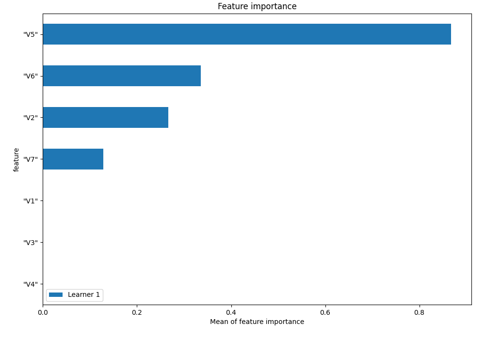
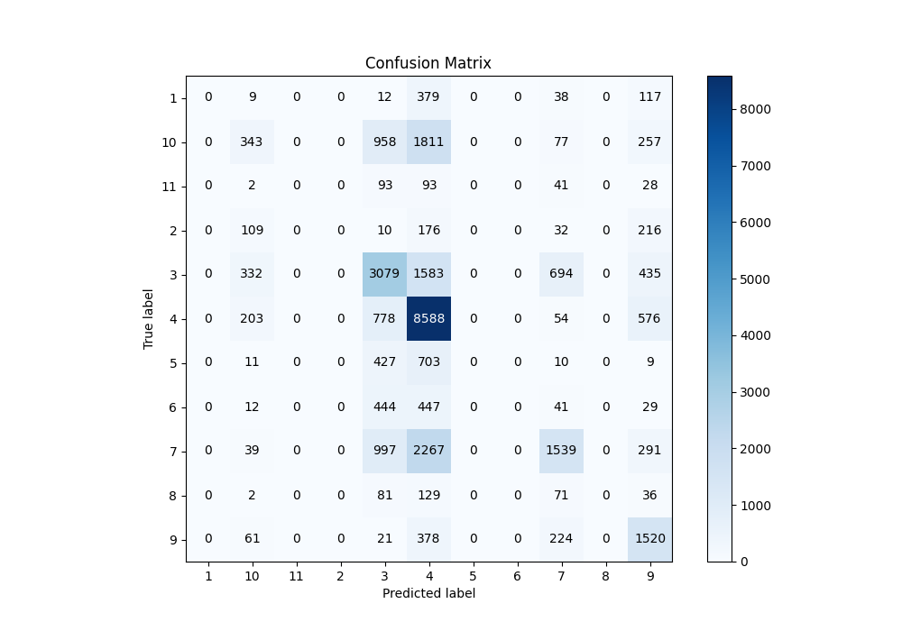
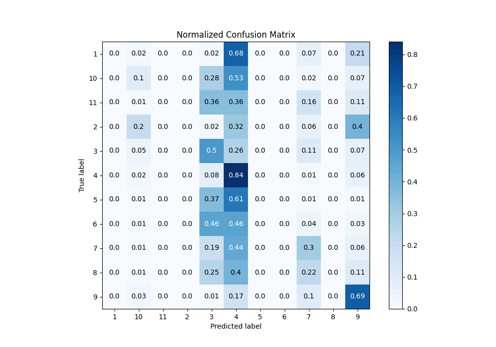
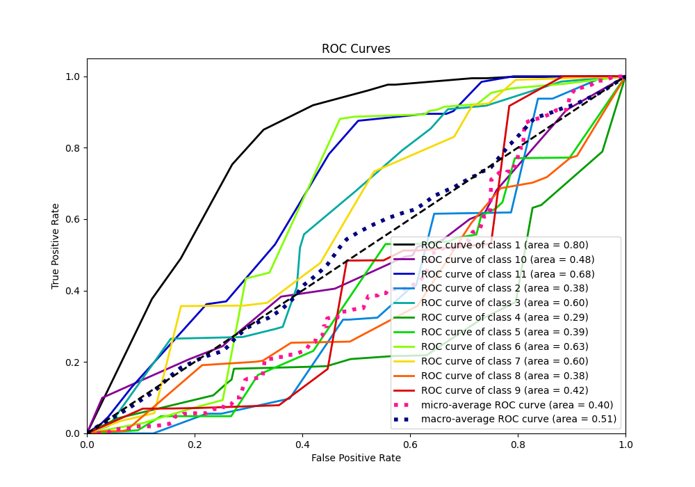
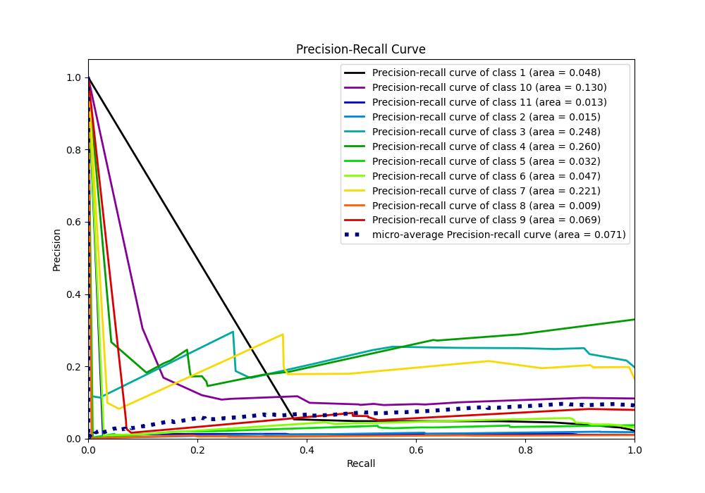

# Summary of 1_DecisionTree

[<< Go back](../README.md)

## Decision Tree
- **n_jobs**: -1
- **criterion**: entropy
- **max_depth**: 4
- **num_class**: 11
- **explain_level**: 1

## Validation
 - **validation_type**: split
 - **train_ratio**: 0.75
 - **shuffle**: True
 - **stratify**: True

## Optimized metric
f1

## Training time

3.8 seconds

### Metric details
|           |   1 |   2 |           3 |            4 |    5 |   6 |           7 |   8 |           9 |           10 |   11 |   accuracy |    macro avg |   weighted avg |   logloss |
|:----------|----:|----:|------------:|-------------:|-----:|----:|------------:|----:|------------:|-------------:|-----:|-----------:|-------------:|---------------:|----------:|
| precision |   0 |   0 |    0.446232 |     0.518787 |    0 |   0 |    0.545551 |   0 |    0.432555 |    0.305432  |    0 |   0.487481 |     0.204414 |       0.415035 |   1.42614 |
| recall    |   0 |   0 |    0.502858 |     0.842043 |    0 |   0 |    0.299825 |   0 |    0.689655 |    0.0995357 |    0 |   0.487481 |     0.221265 |       0.487481 |   1.42614 |
| f1-score  |   0 |   0 |    0.472856 |     0.642021 |    0 |   0 |    0.386975 |   0 |    0.531654 |    0.150142  |    0 |   0.487481 |     0.198514 |       0.424391 |   1.42614 |
| support   | 555 | 543 | 6123        | 10199        | 1160 | 973 | 5133        | 319 | 2204        | 3446         |  257 |   0.487481 | 30912        |   30912        |   1.42614 |

## Confusion matrix
|               |   Predicted as 1 |   Predicted as 2 |   Predicted as 3 |   Predicted as 4 |   Predicted as 5 |   Predicted as 6 |   Predicted as 7 |   Predicted as 8 |   Predicted as 9 |   Predicted as 10 |   Predicted as 11 |
|:--------------|-----------------:|-----------------:|-----------------:|-----------------:|-----------------:|-----------------:|-----------------:|-----------------:|-----------------:|------------------:|------------------:|
| Labeled as 1  |                0 |                0 |               12 |              379 |                0 |                0 |               38 |                0 |              117 |                 9 |                 0 |
| Labeled as 2  |                0 |                0 |               10 |              176 |                0 |                0 |               32 |                0 |              216 |               109 |                 0 |
| Labeled as 3  |                0 |                0 |             3079 |             1583 |                0 |                0 |              694 |                0 |              435 |               332 |                 0 |
| Labeled as 4  |                0 |                0 |              778 |             8588 |                0 |                0 |               54 |                0 |              576 |               203 |                 0 |
| Labeled as 5  |                0 |                0 |              427 |              703 |                0 |                0 |               10 |                0 |                9 |                11 |                 0 |
| Labeled as 6  |                0 |                0 |              444 |              447 |                0 |                0 |               41 |                0 |               29 |                12 |                 0 |
| Labeled as 7  |                0 |                0 |              997 |             2267 |                0 |                0 |             1539 |                0 |              291 |                39 |                 0 |
| Labeled as 8  |                0 |                0 |               81 |              129 |                0 |                0 |               71 |                0 |               36 |                 2 |                 0 |
| Labeled as 9  |                0 |                0 |               21 |              378 |                0 |                0 |              224 |                0 |             1520 |                61 |                 0 |
| Labeled as 10 |                0 |                0 |              958 |             1811 |                0 |                0 |               77 |                0 |              257 |               343 |                 0 |
| Labeled as 11 |                0 |                0 |               93 |               93 |                0 |                0 |               41 |                0 |               28 |                 2 |                 0 |

## Learning curves

## Permutation-based Importance

## Confusion Matrix

## Normalized Confusion Matrix

## ROC Curve

## Precision Recall Curve

[<< Go back](../README.md)
