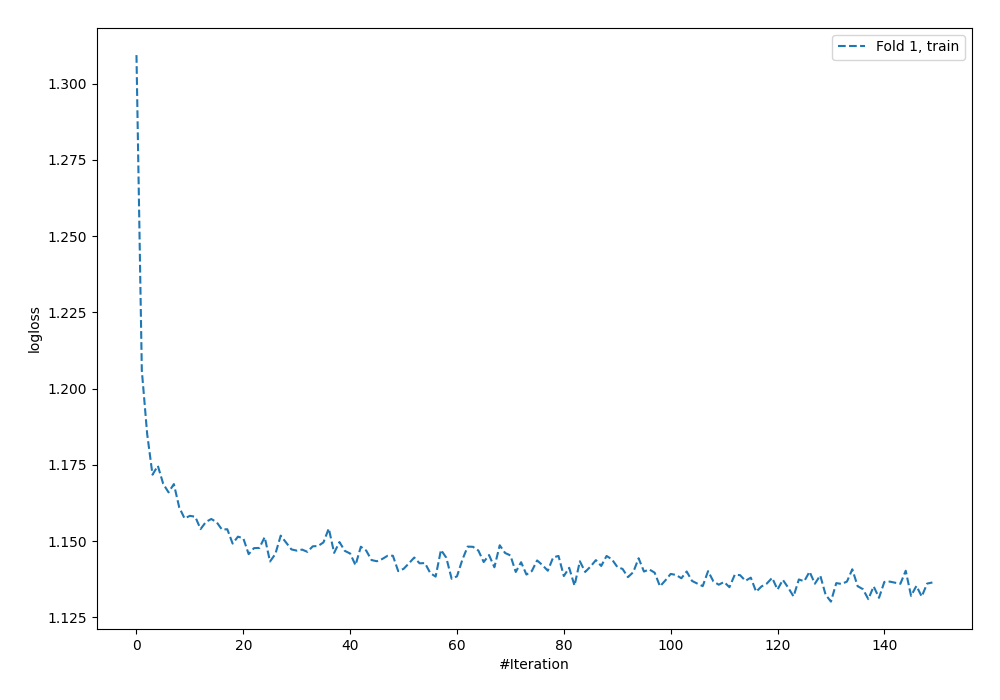
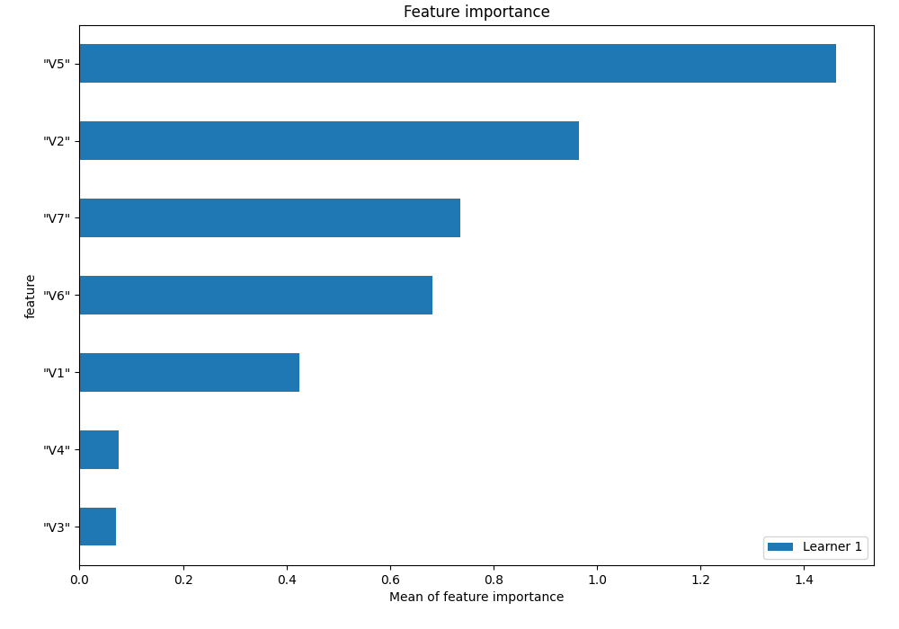
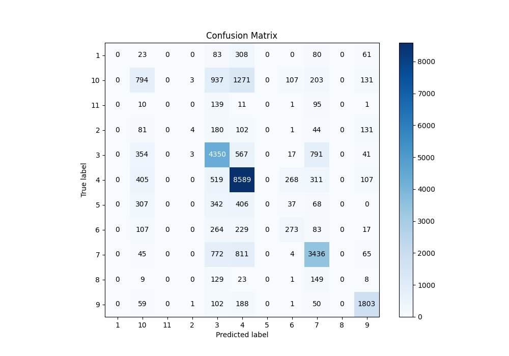
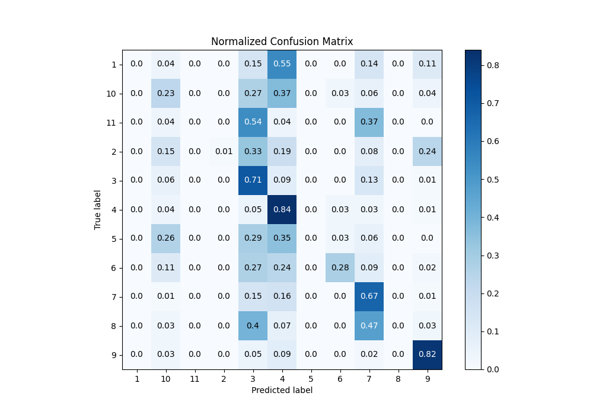
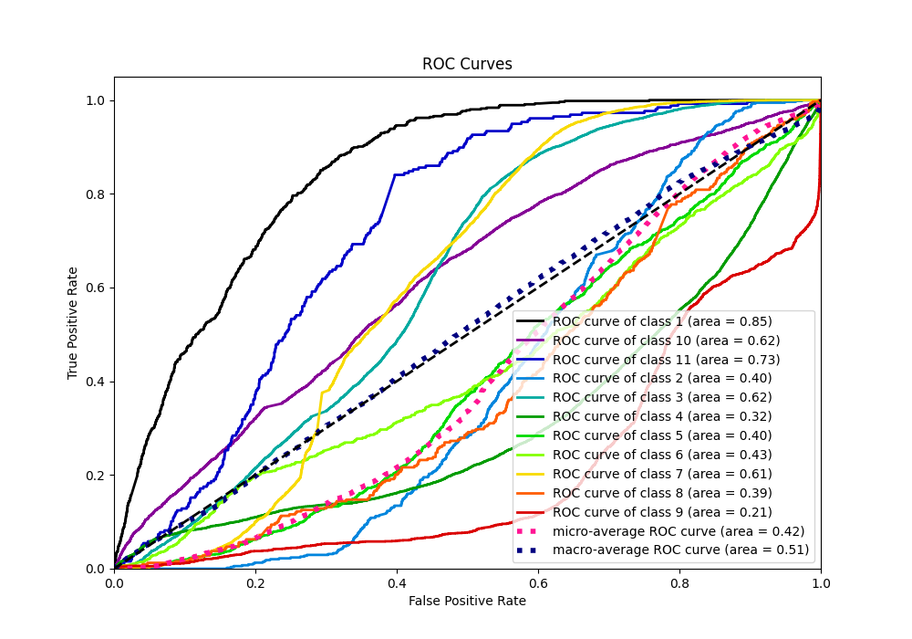
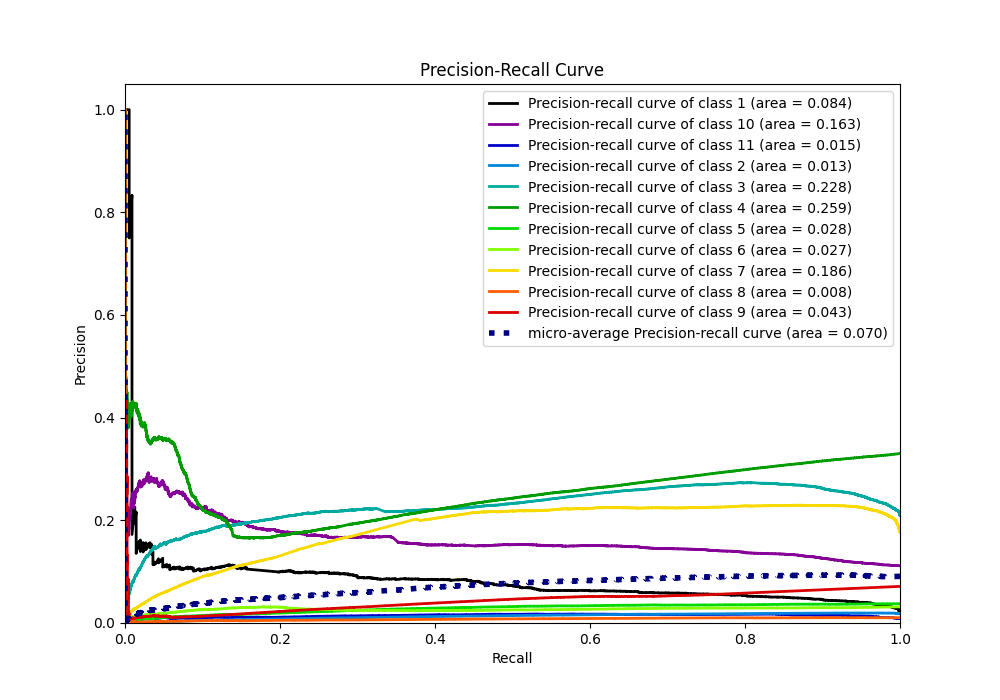

# Summary of 2_Default_NeuralNetwork

[<< Go back](../README.md)

## Neural Network
- **n_jobs**: -1
- **dense_1_size**: 32
- **dense_2_size**: 16
- **learning_rate**: 0.05
- **num_class**: 11
- **explain_level**: 1

## Validation
 - **validation_type**: split
 - **train_ratio**: 0.75
 - **shuffle**: True
 - **stratify**: True

## Optimized metric
f1

## Training time

73.2 seconds

### Metric details
|           |   1 |            2 |           3 |            4 |    5 |          6 |           7 |   8 |           9 |          10 |   11 |   accuracy |    macro avg |   weighted avg |   logloss |
|:----------|----:|-------------:|------------:|-------------:|-----:|-----------:|------------:|----:|------------:|------------:|-----:|-----------:|-------------:|---------------:|----------:|
| precision |   0 |   0.363636   |    0.556479 |     0.686845 |    0 |   0.384507 |    0.647081 |   0 |    0.762368 |    0.361896 |    0 |   0.622703 |     0.342074 |       0.557481 |   1.13116 |
| recall    |   0 |   0.00736648 |    0.710436 |     0.842141 |    0 |   0.280576 |    0.669394 |   0 |    0.818058 |    0.230412 |    0 |   0.622703 |     0.323489 |       0.622703 |   1.13116 |
| f1-score  |   0 |   0.0144404  |    0.624103 |     0.756607 |    0 |   0.324421 |    0.658048 |   0 |    0.789232 |    0.28156  |    0 |   0.622703 |     0.313492 |       0.580648 |   1.13116 |
| support   | 555 | 543          | 6123        | 10199        | 1160 | 973        | 5133        | 319 | 2204        | 3446        |  257 |   0.622703 | 30912        |   30912        |   1.13116 |

## Confusion matrix
|               |   Predicted as 1 |   Predicted as 2 |   Predicted as 3 |   Predicted as 4 |   Predicted as 5 |   Predicted as 6 |   Predicted as 7 |   Predicted as 8 |   Predicted as 9 |   Predicted as 10 |   Predicted as 11 |
|:--------------|-----------------:|-----------------:|-----------------:|-----------------:|-----------------:|-----------------:|-----------------:|-----------------:|-----------------:|------------------:|------------------:|
| Labeled as 1  |                0 |                0 |               83 |              308 |                0 |                0 |               80 |                0 |               61 |                23 |                 0 |
| Labeled as 2  |                0 |                4 |              180 |              102 |                0 |                1 |               44 |                0 |              131 |                81 |                 0 |
| Labeled as 3  |                0 |                3 |             4350 |              567 |                0 |               17 |              791 |                0 |               41 |               354 |                 0 |
| Labeled as 4  |                0 |                0 |              519 |             8589 |                0 |              268 |              311 |                0 |              107 |               405 |                 0 |
| Labeled as 5  |                0 |                0 |              342 |              406 |                0 |               37 |               68 |                0 |                0 |               307 |                 0 |
| Labeled as 6  |                0 |                0 |              264 |              229 |                0 |              273 |               83 |                0 |               17 |               107 |                 0 |
| Labeled as 7  |                0 |                0 |              772 |              811 |                0 |                4 |             3436 |                0 |               65 |                45 |                 0 |
| Labeled as 8  |                0 |                0 |              129 |               23 |                0 |                1 |              149 |                0 |                8 |                 9 |                 0 |
| Labeled as 9  |                0 |                1 |              102 |              188 |                0 |                1 |               50 |                0 |             1803 |                59 |                 0 |
| Labeled as 10 |                0 |                3 |              937 |             1271 |                0 |              107 |              203 |                0 |              131 |               794 |                 0 |
| Labeled as 11 |                0 |                0 |              139 |               11 |                0 |                1 |               95 |                0 |                1 |                10 |                 0 |

## Learning curves

## Permutation-based Importance

## Confusion Matrix

## Normalized Confusion Matrix

## ROC Curve

## Precision Recall Curve

[<< Go back](../README.md)
