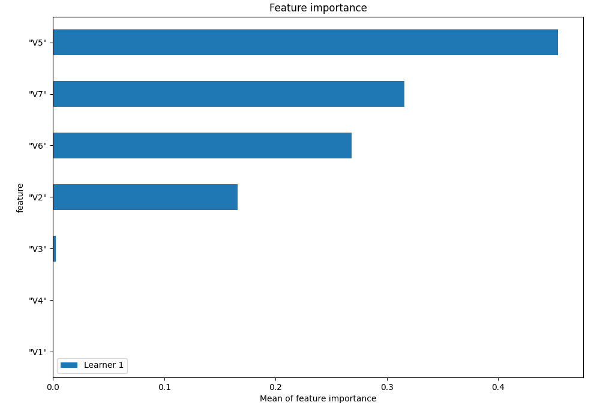
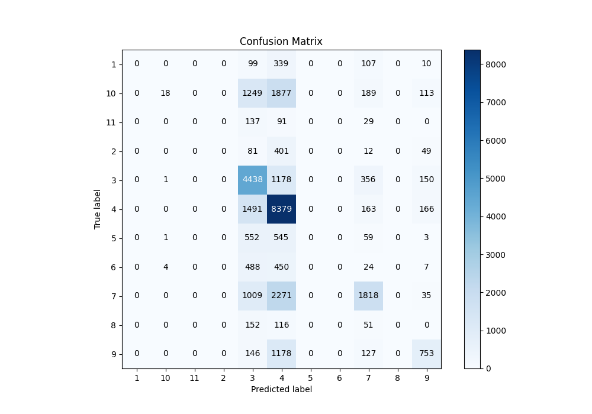
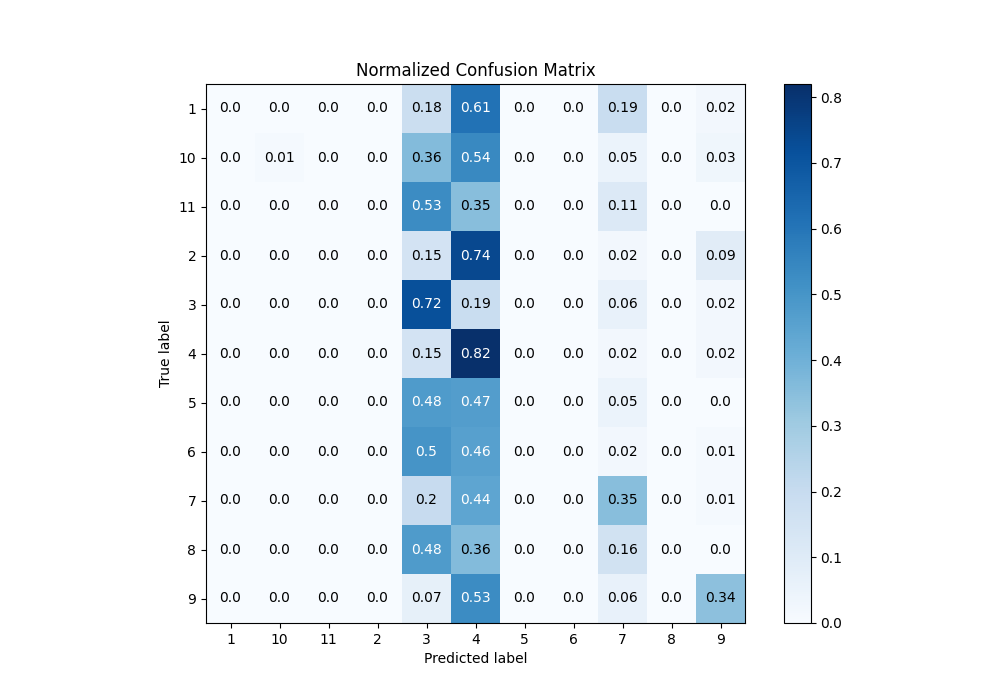
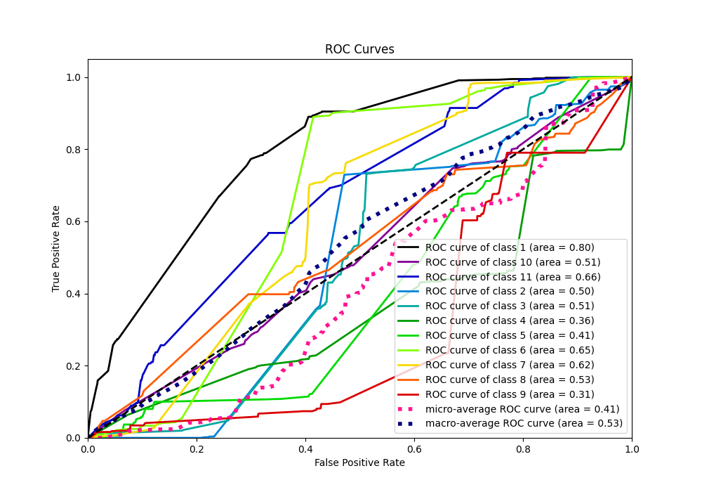
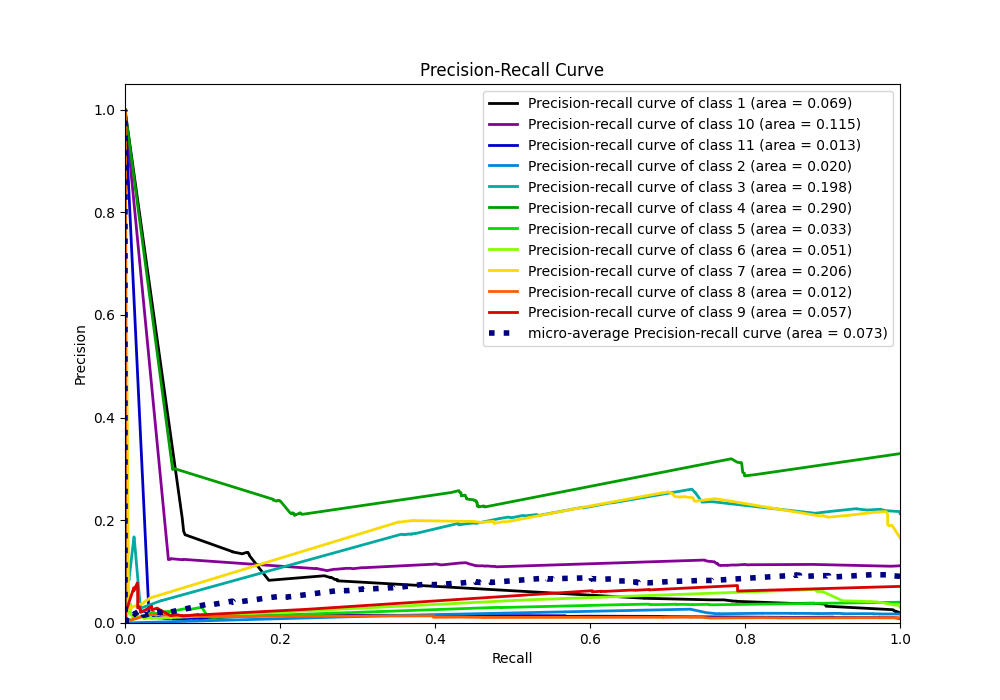

# Summary of 3_Default_RandomForest

[<< Go back](../README.md)

## Random Forest
- **n_jobs**: -1
- **criterion**: gini
- **max_features**: 0.9
- **min_samples_split**: 30
- **max_depth**: 4
- **eval_metric_name**: f1
- **num_class**: 11
- **explain_level**: 1

## Validation
 - **validation_type**: split
 - **train_ratio**: 0.75
 - **shuffle**: True
 - **stratify**: True

## Optimized metric
f1

## Training time

11.0 seconds

### Metric details
|           |   1 |   2 |           3 |            4 |    5 |   6 |           7 |   8 |           9 |            10 |   11 |   accuracy |    macro avg |   weighted avg |   logloss |
|:----------|----:|----:|------------:|-------------:|-----:|----:|------------:|----:|------------:|--------------:|-----:|-----------:|-------------:|---------------:|----------:|
| precision |   0 |   0 |    0.450925 |     0.498009 |    0 |   0 |    0.619421 |   0 |    0.585537 |    0.75       |    0 |   0.498383 |     0.26399  |       0.481842 |   1.43649 |
| recall    |   0 |   0 |    0.724808 |     0.821551 |    0 |   0 |    0.354179 |   0 |    0.341652 |    0.00522345 |    0 |   0.498383 |     0.20431  |       0.498383 |   1.43649 |
| f1-score  |   0 |   0 |    0.555966 |     0.620115 |    0 |   0 |    0.450669 |   0 |    0.431519 |    0.0103746  |    0 |   0.498383 |     0.188059 |       0.421482 |   1.43649 |
| support   | 555 | 543 | 6123        | 10199        | 1160 | 973 | 5133        | 319 | 2204        | 3446          |  257 |   0.498383 | 30912        |   30912        |   1.43649 |

## Confusion matrix
|               |   Predicted as 1 |   Predicted as 2 |   Predicted as 3 |   Predicted as 4 |   Predicted as 5 |   Predicted as 6 |   Predicted as 7 |   Predicted as 8 |   Predicted as 9 |   Predicted as 10 |   Predicted as 11 |
|:--------------|-----------------:|-----------------:|-----------------:|-----------------:|-----------------:|-----------------:|-----------------:|-----------------:|-----------------:|------------------:|------------------:|
| Labeled as 1  |                0 |                0 |               99 |              339 |                0 |                0 |              107 |                0 |               10 |                 0 |                 0 |
| Labeled as 2  |                0 |                0 |               81 |              401 |                0 |                0 |               12 |                0 |               49 |                 0 |                 0 |
| Labeled as 3  |                0 |                0 |             4438 |             1178 |                0 |                0 |              356 |                0 |              150 |                 1 |                 0 |
| Labeled as 4  |                0 |                0 |             1491 |             8379 |                0 |                0 |              163 |                0 |              166 |                 0 |                 0 |
| Labeled as 5  |                0 |                0 |              552 |              545 |                0 |                0 |               59 |                0 |                3 |                 1 |                 0 |
| Labeled as 6  |                0 |                0 |              488 |              450 |                0 |                0 |               24 |                0 |                7 |                 4 |                 0 |
| Labeled as 7  |                0 |                0 |             1009 |             2271 |                0 |                0 |             1818 |                0 |               35 |                 0 |                 0 |
| Labeled as 8  |                0 |                0 |              152 |              116 |                0 |                0 |               51 |                0 |                0 |                 0 |                 0 |
| Labeled as 9  |                0 |                0 |              146 |             1178 |                0 |                0 |              127 |                0 |              753 |                 0 |                 0 |
| Labeled as 10 |                0 |                0 |             1249 |             1877 |                0 |                0 |              189 |                0 |              113 |                18 |                 0 |
| Labeled as 11 |                0 |                0 |              137 |               91 |                0 |                0 |               29 |                0 |                0 |                 0 |                 0 |

## Learning curves

## Permutation-based Importance

## Confusion Matrix

## Normalized Confusion Matrix

## ROC Curve

## Precision Recall Curve

[<< Go back](../README.md)
