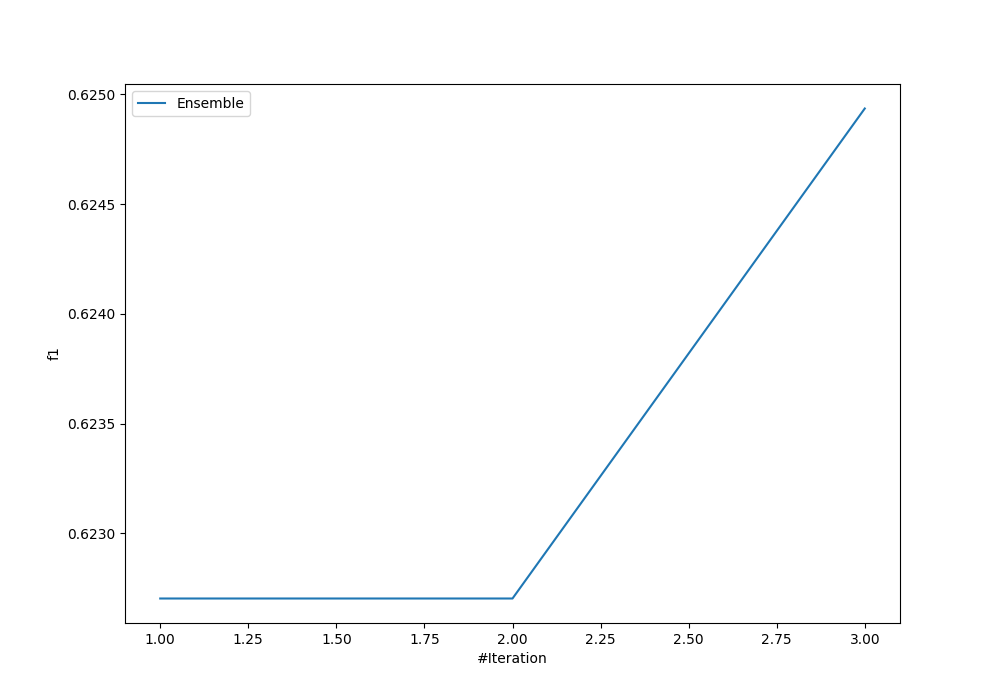
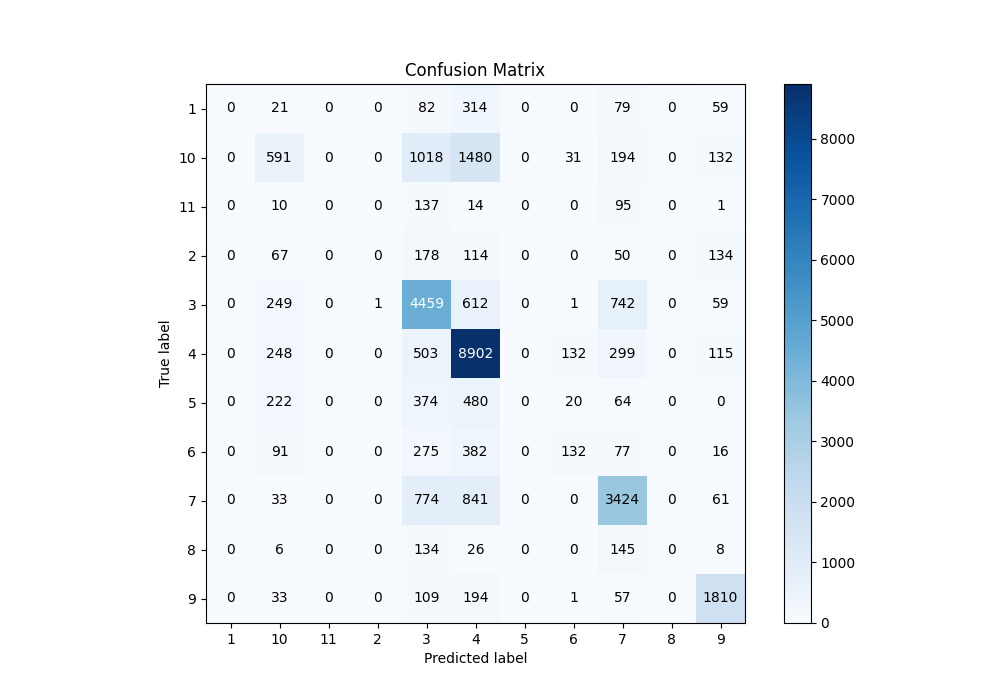
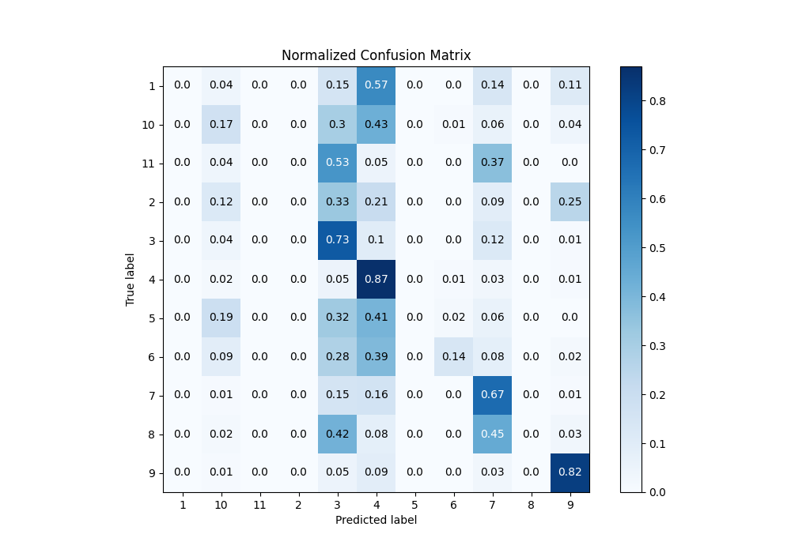
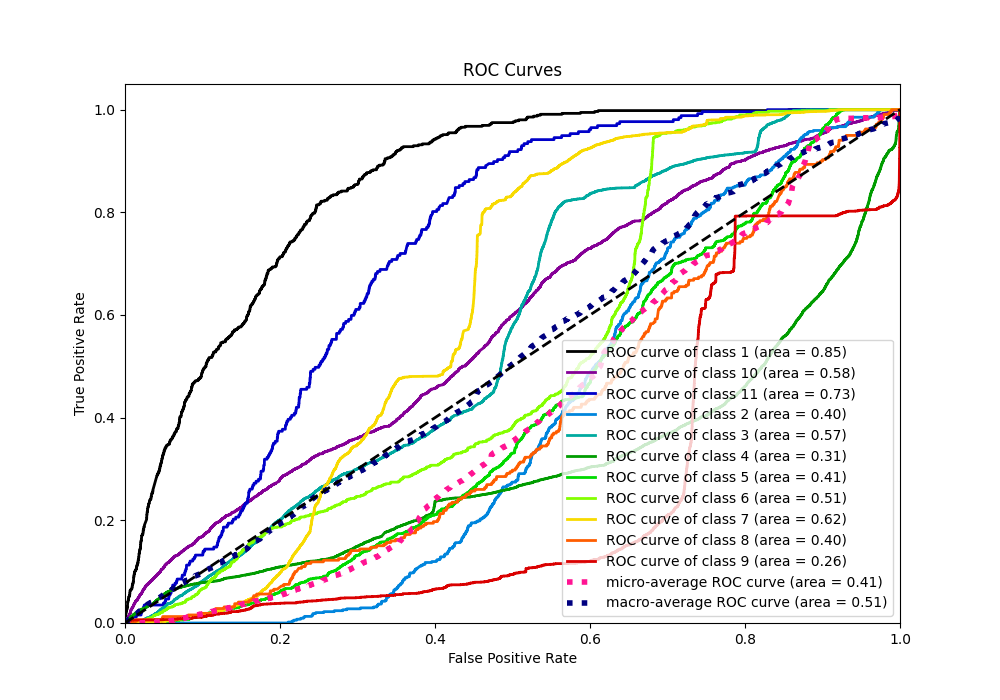
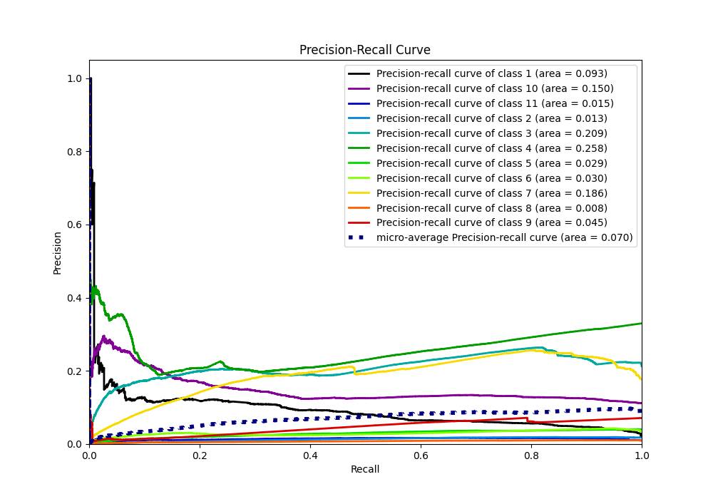

# Summary of Ensemble

[<< Go back](../README.md)

## Ensemble structure
| Model                   |   Weight |
|:------------------------|---------:|
| 2_Default_NeuralNetwork |        2 |
| 3_Default_RandomForest  |        1 |

### Metric details
|           |   1 |   2 |           3 |            4 |    5 |          6 |           7 |   8 |           9 |          10 |   11 |   accuracy |    macro avg |   weighted avg |   logloss |
|:----------|----:|----:|------------:|-------------:|-----:|-----------:|------------:|----:|------------:|------------:|-----:|-----------:|-------------:|---------------:|----------:|
| precision |   0 |   0 |    0.554395 |     0.666367 |    0 |   0.416404 |    0.655186 |   0 |    0.755741 |    0.376194 |    0 |   0.624935 |     0.311299 |       0.547395 |   1.15193 |
| recall    |   0 |   0 |    0.728238 |     0.872831 |    0 |   0.135663 |    0.667056 |   0 |    0.821234 |    0.171503 |    0 |   0.624935 |     0.308775 |       0.624935 |   1.15193 |
| f1-score  |   0 |   0 |    0.629536 |     0.755752 |    0 |   0.204651 |    0.661068 |   0 |    0.787128 |    0.235599 |    0 |   0.624935 |     0.297612 |       0.572646 |   1.15193 |
| support   | 555 | 543 | 6123        | 10199        | 1160 | 973        | 5133        | 319 | 2204        | 3446        |  257 |   0.624935 | 30912        |   30912        |   1.15193 |

## Confusion matrix
|               |   Predicted as 1 |   Predicted as 2 |   Predicted as 3 |   Predicted as 4 |   Predicted as 5 |   Predicted as 6 |   Predicted as 7 |   Predicted as 8 |   Predicted as 9 |   Predicted as 10 |   Predicted as 11 |
|:--------------|-----------------:|-----------------:|-----------------:|-----------------:|-----------------:|-----------------:|-----------------:|-----------------:|-----------------:|------------------:|------------------:|
| Labeled as 1  |                0 |                0 |               82 |              314 |                0 |                0 |               79 |                0 |               59 |                21 |                 0 |
| Labeled as 2  |                0 |                0 |              178 |              114 |                0 |                0 |               50 |                0 |              134 |                67 |                 0 |
| Labeled as 3  |                0 |                1 |             4459 |              612 |                0 |                1 |              742 |                0 |               59 |               249 |                 0 |
| Labeled as 4  |                0 |                0 |              503 |             8902 |                0 |              132 |              299 |                0 |              115 |               248 |                 0 |
| Labeled as 5  |                0 |                0 |              374 |              480 |                0 |               20 |               64 |                0 |                0 |               222 |                 0 |
| Labeled as 6  |                0 |                0 |              275 |              382 |                0 |              132 |               77 |                0 |               16 |                91 |                 0 |
| Labeled as 7  |                0 |                0 |              774 |              841 |                0 |                0 |             3424 |                0 |               61 |                33 |                 0 |
| Labeled as 8  |                0 |                0 |              134 |               26 |                0 |                0 |              145 |                0 |                8 |                 6 |                 0 |
| Labeled as 9  |                0 |                0 |              109 |              194 |                0 |                1 |               57 |                0 |             1810 |                33 |                 0 |
| Labeled as 10 |                0 |                0 |             1018 |             1480 |                0 |               31 |              194 |                0 |              132 |               591 |                 0 |
| Labeled as 11 |                0 |                0 |              137 |               14 |                0 |                0 |               95 |                0 |                1 |                10 |                 0 |

## Learning curves

## Confusion Matrix

## Normalized Confusion Matrix

## ROC Curve

## Precision Recall Curve

[<< Go back](../README.md)
