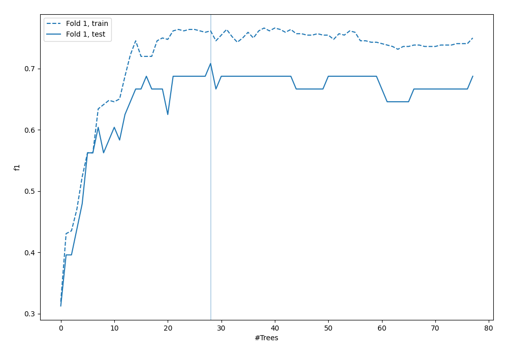
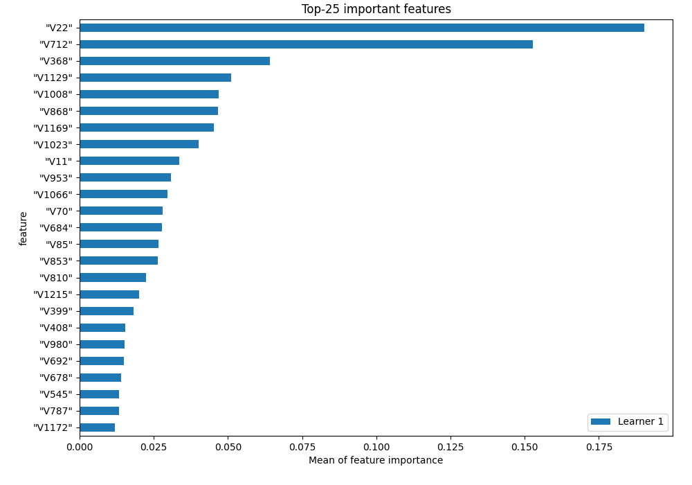
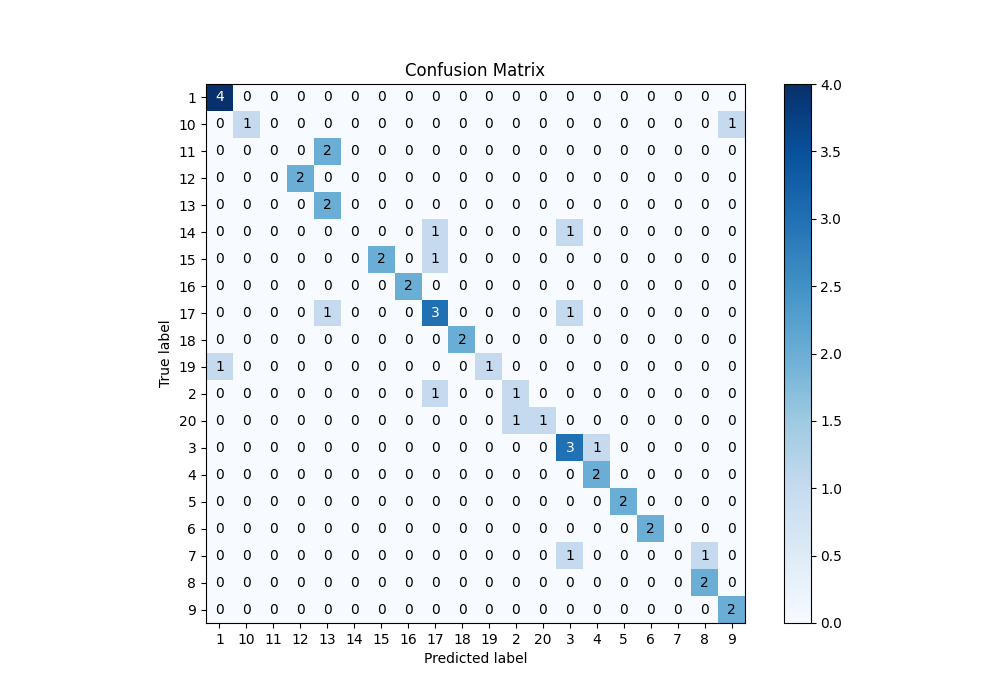
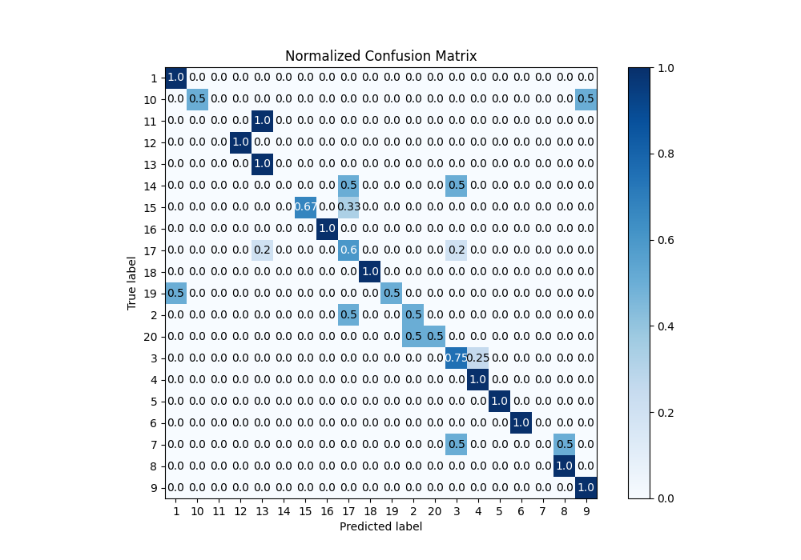
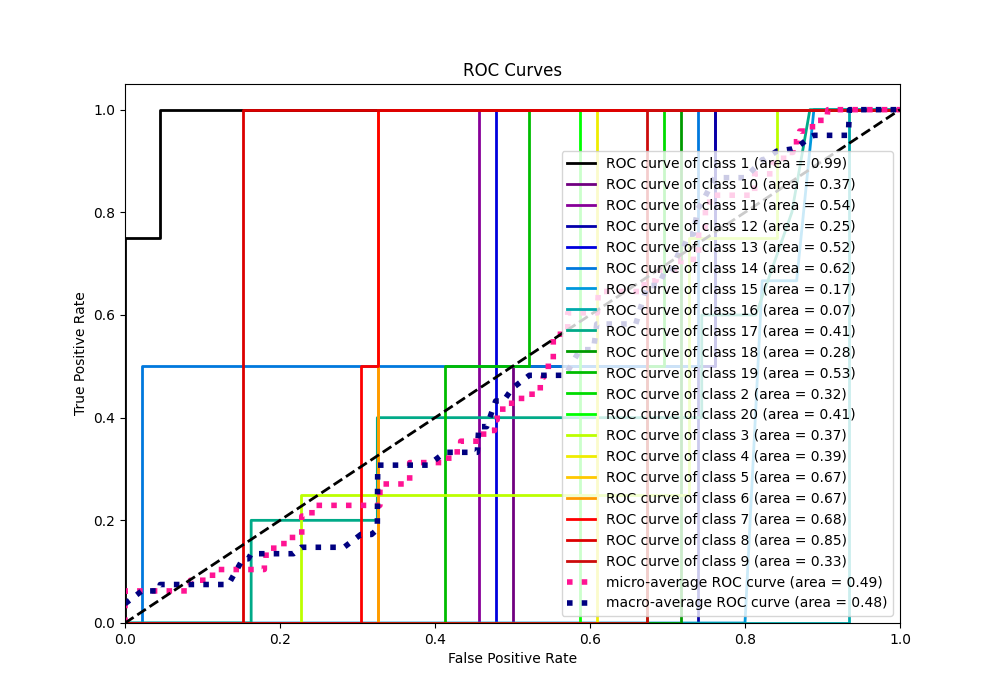
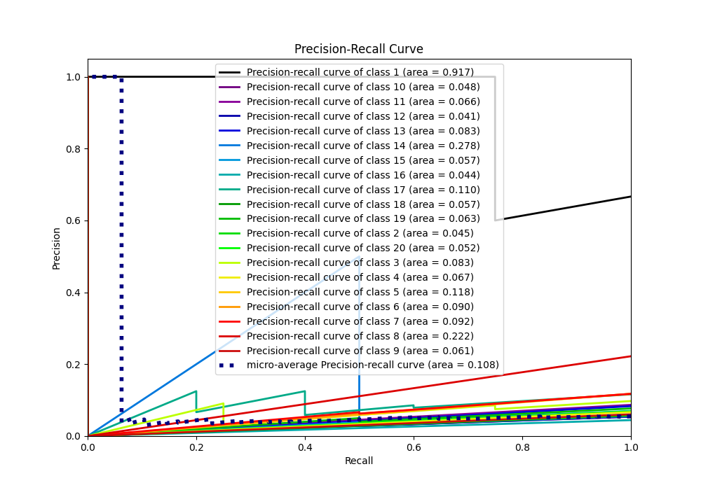

# Summary of 3_Default_RandomForest

[<< Go back](../README.md)

## Random Forest
- **n_jobs**: -1
- **criterion**: gini
- **max_features**: 0.9
- **min_samples_split**: 30
- **max_depth**: 4
- **eval_metric_name**: f1
- **num_class**: 20
- **explain_level**: 1

## Validation
 - **validation_type**: split
 - **train_ratio**: 0.9
 - **shuffle**: True
 - **stratify**: True

## Optimized metric
f1

## Training time

31.4 seconds

### Metric details
|           |        1 |   2 |    3 |        4 |   5 |   6 |   7 |        8 |        9 |       10 |   11 |   12 |       13 |   14 |       15 |   16 |       17 |   18 |       19 |       20 |   accuracy |   macro avg |   weighted avg |   logloss |
|:----------|---------:|----:|-----:|---------:|----:|----:|----:|---------:|---------:|---------:|-----:|-----:|---------:|-----:|---------:|-----:|---------:|-----:|---------:|---------:|-----------:|------------:|---------------:|----------:|
| precision | 0.8      | 0.5 | 0.5  | 0.666667 |   1 |   1 |   0 | 0.666667 | 0.666667 | 1        |    0 |    1 | 0.4      |    0 | 1        |    1 | 0.5      |    1 | 1        | 1        |   0.708333 |    0.685    |       0.677083 |     1.594 |
| recall    | 1        | 0.5 | 0.75 | 1        |   1 |   1 |   0 | 1        | 1        | 0.5      |    0 |    1 | 1        |    0 | 0.666667 |    1 | 0.6      |    1 | 0.5      | 0.5      |   0.708333 |    0.700833 |       0.708333 |     1.594 |
| f1-score  | 0.888889 | 0.5 | 0.6  | 0.8      |   1 |   1 |   0 | 0.8      | 0.8      | 0.666667 |    0 |    1 | 0.571429 |    0 | 0.8      |    1 | 0.545455 |    1 | 0.666667 | 0.666667 |   0.708333 |    0.665289 |       0.667202 |     1.594 |
| support   | 4        | 2   | 4    | 2        |   2 |   2 |   2 | 2        | 2        | 2        |    2 |    2 | 2        |    2 | 3        |    2 | 5        |    2 | 2        | 2        |   0.708333 |   48        |      48        |     1.594 |

## Confusion matrix
|               |   Predicted as 1 |   Predicted as 2 |   Predicted as 3 |   Predicted as 4 |   Predicted as 5 |   Predicted as 6 |   Predicted as 7 |   Predicted as 8 |   Predicted as 9 |   Predicted as 10 |   Predicted as 11 |   Predicted as 12 |   Predicted as 13 |   Predicted as 14 |   Predicted as 15 |   Predicted as 16 |   Predicted as 17 |   Predicted as 18 |   Predicted as 19 |   Predicted as 20 |
|:--------------|-----------------:|-----------------:|-----------------:|-----------------:|-----------------:|-----------------:|-----------------:|-----------------:|-----------------:|------------------:|------------------:|------------------:|------------------:|------------------:|------------------:|------------------:|------------------:|------------------:|------------------:|------------------:|
| Labeled as 1  |                4 |                0 |                0 |                0 |                0 |                0 |                0 |                0 |                0 |                 0 |                 0 |                 0 |                 0 |                 0 |                 0 |                 0 |                 0 |                 0 |                 0 |                 0 |
| Labeled as 2  |                0 |                1 |                0 |                0 |                0 |                0 |                0 |                0 |                0 |                 0 |                 0 |                 0 |                 0 |                 0 |                 0 |                 0 |                 1 |                 0 |                 0 |                 0 |
| Labeled as 3  |                0 |                0 |                3 |                1 |                0 |                0 |                0 |                0 |                0 |                 0 |                 0 |                 0 |                 0 |                 0 |                 0 |                 0 |                 0 |                 0 |                 0 |                 0 |
| Labeled as 4  |                0 |                0 |                0 |                2 |                0 |                0 |                0 |                0 |                0 |                 0 |                 0 |                 0 |                 0 |                 0 |                 0 |                 0 |                 0 |                 0 |                 0 |                 0 |
| Labeled as 5  |                0 |                0 |                0 |                0 |                2 |                0 |                0 |                0 |                0 |                 0 |                 0 |                 0 |                 0 |                 0 |                 0 |                 0 |                 0 |                 0 |                 0 |                 0 |
| Labeled as 6  |                0 |                0 |                0 |                0 |                0 |                2 |                0 |                0 |                0 |                 0 |                 0 |                 0 |                 0 |                 0 |                 0 |                 0 |                 0 |                 0 |                 0 |                 0 |
| Labeled as 7  |                0 |                0 |                1 |                0 |                0 |                0 |                0 |                1 |                0 |                 0 |                 0 |                 0 |                 0 |                 0 |                 0 |                 0 |                 0 |                 0 |                 0 |                 0 |
| Labeled as 8  |                0 |                0 |                0 |                0 |                0 |                0 |                0 |                2 |                0 |                 0 |                 0 |                 0 |                 0 |                 0 |                 0 |                 0 |                 0 |                 0 |                 0 |                 0 |
| Labeled as 9  |                0 |                0 |                0 |                0 |                0 |                0 |                0 |                0 |                2 |                 0 |                 0 |                 0 |                 0 |                 0 |                 0 |                 0 |                 0 |                 0 |                 0 |                 0 |
| Labeled as 10 |                0 |                0 |                0 |                0 |                0 |                0 |                0 |                0 |                1 |                 1 |                 0 |                 0 |                 0 |                 0 |                 0 |                 0 |                 0 |                 0 |                 0 |                 0 |
| Labeled as 11 |                0 |                0 |                0 |                0 |                0 |                0 |                0 |                0 |                0 |                 0 |                 0 |                 0 |                 2 |                 0 |                 0 |                 0 |                 0 |                 0 |                 0 |                 0 |
| Labeled as 12 |                0 |                0 |                0 |                0 |                0 |                0 |                0 |                0 |                0 |                 0 |                 0 |                 2 |                 0 |                 0 |                 0 |                 0 |                 0 |                 0 |                 0 |                 0 |
| Labeled as 13 |                0 |                0 |                0 |                0 |                0 |                0 |                0 |                0 |                0 |                 0 |                 0 |                 0 |                 2 |                 0 |                 0 |                 0 |                 0 |                 0 |                 0 |                 0 |
| Labeled as 14 |                0 |                0 |                1 |                0 |                0 |                0 |                0 |                0 |                0 |                 0 |                 0 |                 0 |                 0 |                 0 |                 0 |                 0 |                 1 |                 0 |                 0 |                 0 |
| Labeled as 15 |                0 |                0 |                0 |                0 |                0 |                0 |                0 |                0 |                0 |                 0 |                 0 |                 0 |                 0 |                 0 |                 2 |                 0 |                 1 |                 0 |                 0 |                 0 |
| Labeled as 16 |                0 |                0 |                0 |                0 |                0 |                0 |                0 |                0 |                0 |                 0 |                 0 |                 0 |                 0 |                 0 |                 0 |                 2 |                 0 |                 0 |                 0 |                 0 |
| Labeled as 17 |                0 |                0 |                1 |                0 |                0 |                0 |                0 |                0 |                0 |                 0 |                 0 |                 0 |                 1 |                 0 |                 0 |                 0 |                 3 |                 0 |                 0 |                 0 |
| Labeled as 18 |                0 |                0 |                0 |                0 |                0 |                0 |                0 |                0 |                0 |                 0 |                 0 |                 0 |                 0 |                 0 |                 0 |                 0 |                 0 |                 2 |                 0 |                 0 |
| Labeled as 19 |                1 |                0 |                0 |                0 |                0 |                0 |                0 |                0 |                0 |                 0 |                 0 |                 0 |                 0 |                 0 |                 0 |                 0 |                 0 |                 0 |                 1 |                 0 |
| Labeled as 20 |                0 |                1 |                0 |                0 |                0 |                0 |                0 |                0 |                0 |                 0 |                 0 |                 0 |                 0 |                 0 |                 0 |                 0 |                 0 |                 0 |                 0 |                 1 |

## Learning curves

## Permutation-based Importance

## Confusion Matrix

## Normalized Confusion Matrix

## ROC Curve

## Precision Recall Curve

[<< Go back](../README.md)
