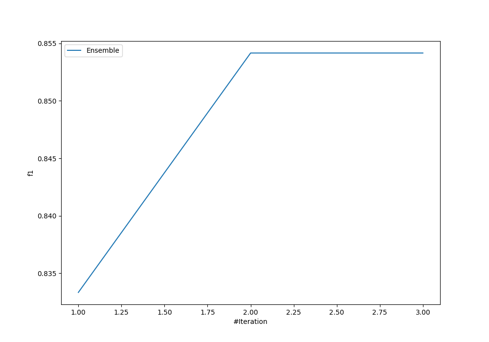
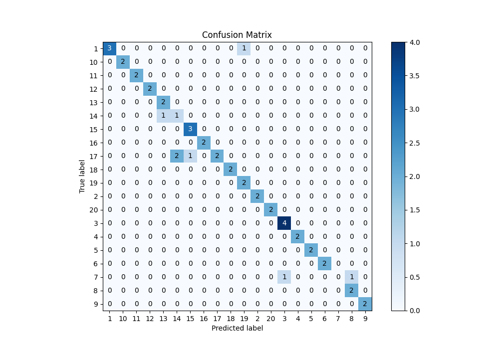
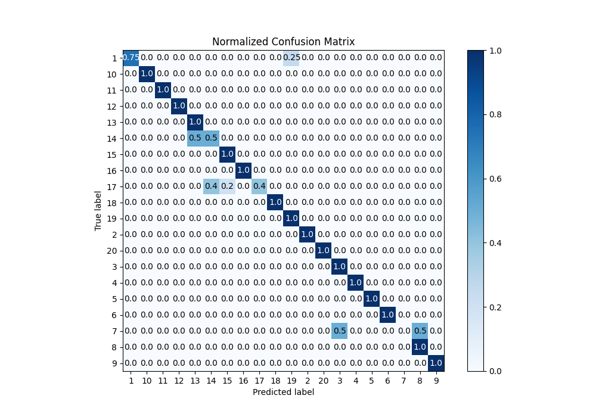
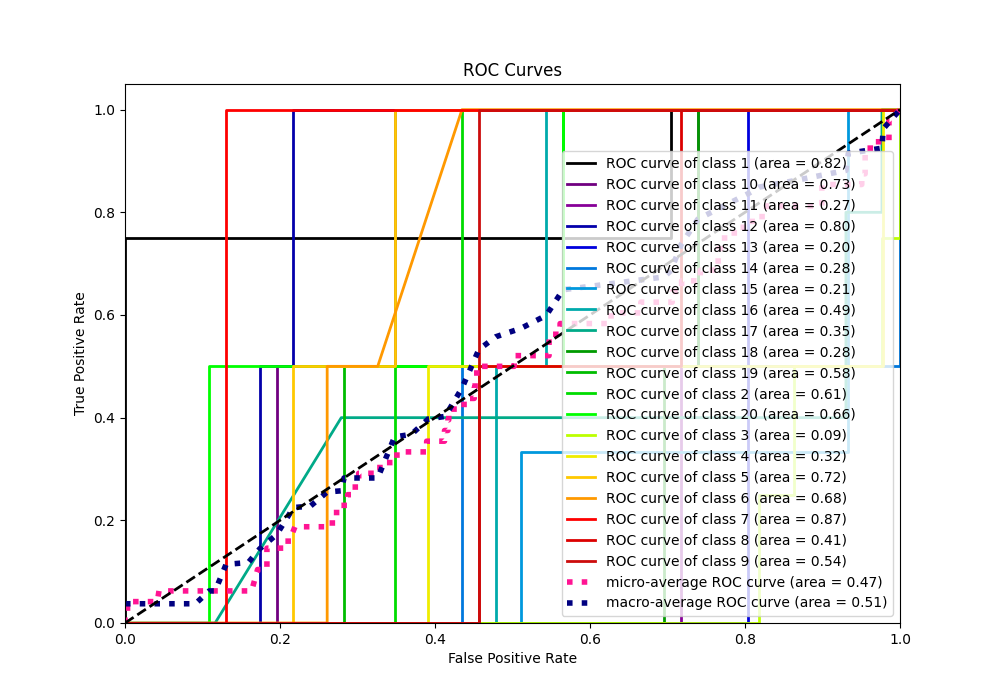
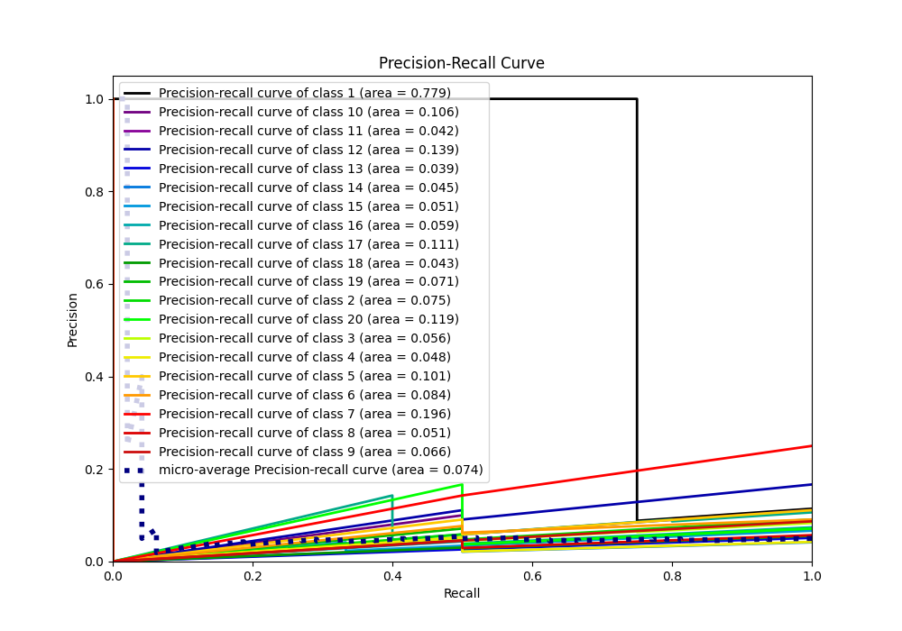

# Summary of Ensemble

[<< Go back](../README.md)

## Ensemble structure
| Model                   |   Weight |
|:------------------------|---------:|
| 1_DecisionTree          |        1 |
| 2_Default_NeuralNetwork |        1 |

### Metric details
|           |        1 |   2 |        3 |   4 |   5 |   6 |   7 |        8 |   9 |   10 |   11 |   12 |       13 |       14 |       15 |   16 |       17 |   18 |       19 |   20 |   accuracy |   macro avg |   weighted avg |   logloss |
|:----------|---------:|----:|---------:|----:|----:|----:|----:|---------:|----:|-----:|-----:|-----:|---------:|---------:|---------:|-----:|---------:|-----:|---------:|-----:|-----------:|------------:|---------------:|----------:|
| precision | 1        |   1 | 0.8      |   1 |   1 |   1 |   0 | 0.666667 |   1 |    1 |    1 |    1 | 0.666667 | 0.333333 | 0.75     |    1 | 1        |    1 | 0.666667 |    1 |   0.854167 |    0.844167 |       0.856597 |  0.867376 |
| recall    | 0.75     |   1 | 1        |   1 |   1 |   1 |   0 | 1        |   1 |    1 |    1 |    1 | 1        | 0.5      | 1        |    1 | 0.4      |    1 | 1        |    1 |   0.854167 |    0.8825   |       0.854167 |  0.867376 |
| f1-score  | 0.857143 |   1 | 0.888889 |   1 |   1 |   1 |   0 | 0.8      |   1 |    1 |    1 |    1 | 0.8      | 0.4      | 0.857143 |    1 | 0.571429 |    1 | 0.8      |    1 |   0.854167 |    0.84873  |       0.833598 |  0.867376 |
| support   | 4        |   2 | 4        |   2 |   2 |   2 |   2 | 2        |   2 |    2 |    2 |    2 | 2        | 2        | 3        |    2 | 5        |    2 | 2        |    2 |   0.854167 |   48        |      48        |  0.867376 |

## Confusion matrix
|               |   Predicted as 1 |   Predicted as 2 |   Predicted as 3 |   Predicted as 4 |   Predicted as 5 |   Predicted as 6 |   Predicted as 7 |   Predicted as 8 |   Predicted as 9 |   Predicted as 10 |   Predicted as 11 |   Predicted as 12 |   Predicted as 13 |   Predicted as 14 |   Predicted as 15 |   Predicted as 16 |   Predicted as 17 |   Predicted as 18 |   Predicted as 19 |   Predicted as 20 |
|:--------------|-----------------:|-----------------:|-----------------:|-----------------:|-----------------:|-----------------:|-----------------:|-----------------:|-----------------:|------------------:|------------------:|------------------:|------------------:|------------------:|------------------:|------------------:|------------------:|------------------:|------------------:|------------------:|
| Labeled as 1  |                3 |                0 |                0 |                0 |                0 |                0 |                0 |                0 |                0 |                 0 |                 0 |                 0 |                 0 |                 0 |                 0 |                 0 |                 0 |                 0 |                 1 |                 0 |
| Labeled as 2  |                0 |                2 |                0 |                0 |                0 |                0 |                0 |                0 |                0 |                 0 |                 0 |                 0 |                 0 |                 0 |                 0 |                 0 |                 0 |                 0 |                 0 |                 0 |
| Labeled as 3  |                0 |                0 |                4 |                0 |                0 |                0 |                0 |                0 |                0 |                 0 |                 0 |                 0 |                 0 |                 0 |                 0 |                 0 |                 0 |                 0 |                 0 |                 0 |
| Labeled as 4  |                0 |                0 |                0 |                2 |                0 |                0 |                0 |                0 |                0 |                 0 |                 0 |                 0 |                 0 |                 0 |                 0 |                 0 |                 0 |                 0 |                 0 |                 0 |
| Labeled as 5  |                0 |                0 |                0 |                0 |                2 |                0 |                0 |                0 |                0 |                 0 |                 0 |                 0 |                 0 |                 0 |                 0 |                 0 |                 0 |                 0 |                 0 |                 0 |
| Labeled as 6  |                0 |                0 |                0 |                0 |                0 |                2 |                0 |                0 |                0 |                 0 |                 0 |                 0 |                 0 |                 0 |                 0 |                 0 |                 0 |                 0 |                 0 |                 0 |
| Labeled as 7  |                0 |                0 |                1 |                0 |                0 |                0 |                0 |                1 |                0 |                 0 |                 0 |                 0 |                 0 |                 0 |                 0 |                 0 |                 0 |                 0 |                 0 |                 0 |
| Labeled as 8  |                0 |                0 |                0 |                0 |                0 |                0 |                0 |                2 |                0 |                 0 |                 0 |                 0 |                 0 |                 0 |                 0 |                 0 |                 0 |                 0 |                 0 |                 0 |
| Labeled as 9  |                0 |                0 |                0 |                0 |                0 |                0 |                0 |                0 |                2 |                 0 |                 0 |                 0 |                 0 |                 0 |                 0 |                 0 |                 0 |                 0 |                 0 |                 0 |
| Labeled as 10 |                0 |                0 |                0 |                0 |                0 |                0 |                0 |                0 |                0 |                 2 |                 0 |                 0 |                 0 |                 0 |                 0 |                 0 |                 0 |                 0 |                 0 |                 0 |
| Labeled as 11 |                0 |                0 |                0 |                0 |                0 |                0 |                0 |                0 |                0 |                 0 |                 2 |                 0 |                 0 |                 0 |                 0 |                 0 |                 0 |                 0 |                 0 |                 0 |
| Labeled as 12 |                0 |                0 |                0 |                0 |                0 |                0 |                0 |                0 |                0 |                 0 |                 0 |                 2 |                 0 |                 0 |                 0 |                 0 |                 0 |                 0 |                 0 |                 0 |
| Labeled as 13 |                0 |                0 |                0 |                0 |                0 |                0 |                0 |                0 |                0 |                 0 |                 0 |                 0 |                 2 |                 0 |                 0 |                 0 |                 0 |                 0 |                 0 |                 0 |
| Labeled as 14 |                0 |                0 |                0 |                0 |                0 |                0 |                0 |                0 |                0 |                 0 |                 0 |                 0 |                 1 |                 1 |                 0 |                 0 |                 0 |                 0 |                 0 |                 0 |
| Labeled as 15 |                0 |                0 |                0 |                0 |                0 |                0 |                0 |                0 |                0 |                 0 |                 0 |                 0 |                 0 |                 0 |                 3 |                 0 |                 0 |                 0 |                 0 |                 0 |
| Labeled as 16 |                0 |                0 |                0 |                0 |                0 |                0 |                0 |                0 |                0 |                 0 |                 0 |                 0 |                 0 |                 0 |                 0 |                 2 |                 0 |                 0 |                 0 |                 0 |
| Labeled as 17 |                0 |                0 |                0 |                0 |                0 |                0 |                0 |                0 |                0 |                 0 |                 0 |                 0 |                 0 |                 2 |                 1 |                 0 |                 2 |                 0 |                 0 |                 0 |
| Labeled as 18 |                0 |                0 |                0 |                0 |                0 |                0 |                0 |                0 |                0 |                 0 |                 0 |                 0 |                 0 |                 0 |                 0 |                 0 |                 0 |                 2 |                 0 |                 0 |
| Labeled as 19 |                0 |                0 |                0 |                0 |                0 |                0 |                0 |                0 |                0 |                 0 |                 0 |                 0 |                 0 |                 0 |                 0 |                 0 |                 0 |                 0 |                 2 |                 0 |
| Labeled as 20 |                0 |                0 |                0 |                0 |                0 |                0 |                0 |                0 |                0 |                 0 |                 0 |                 0 |                 0 |                 0 |                 0 |                 0 |                 0 |                 0 |                 0 |                 2 |

## Learning curves

## Confusion Matrix

## Normalized Confusion Matrix

## ROC Curve

## Precision Recall Curve

[<< Go back](../README.md)
