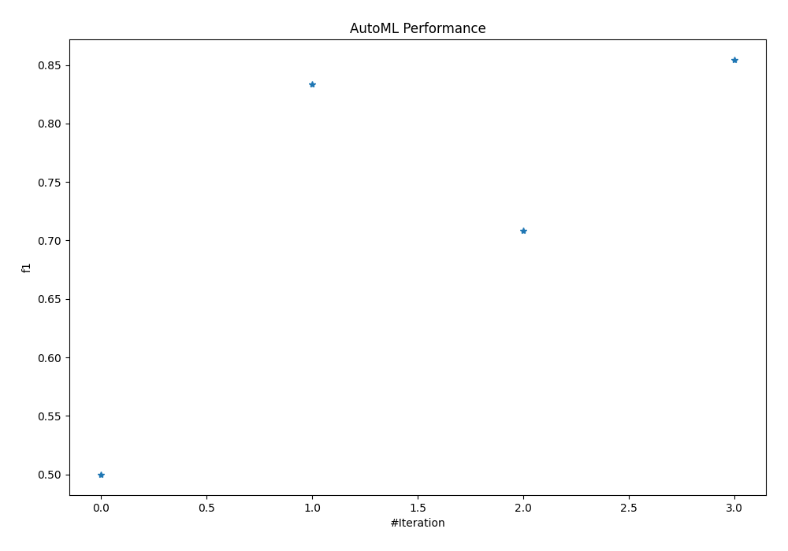
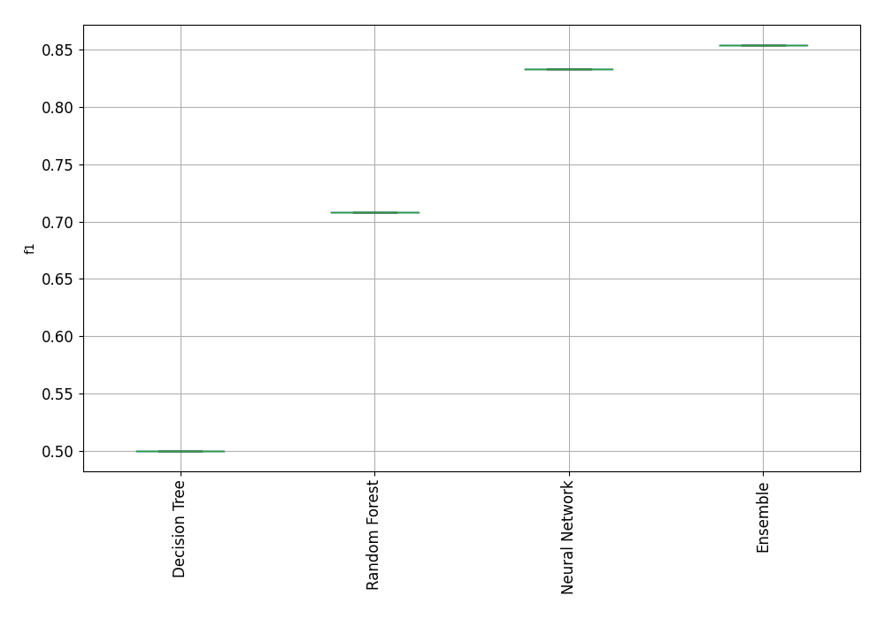
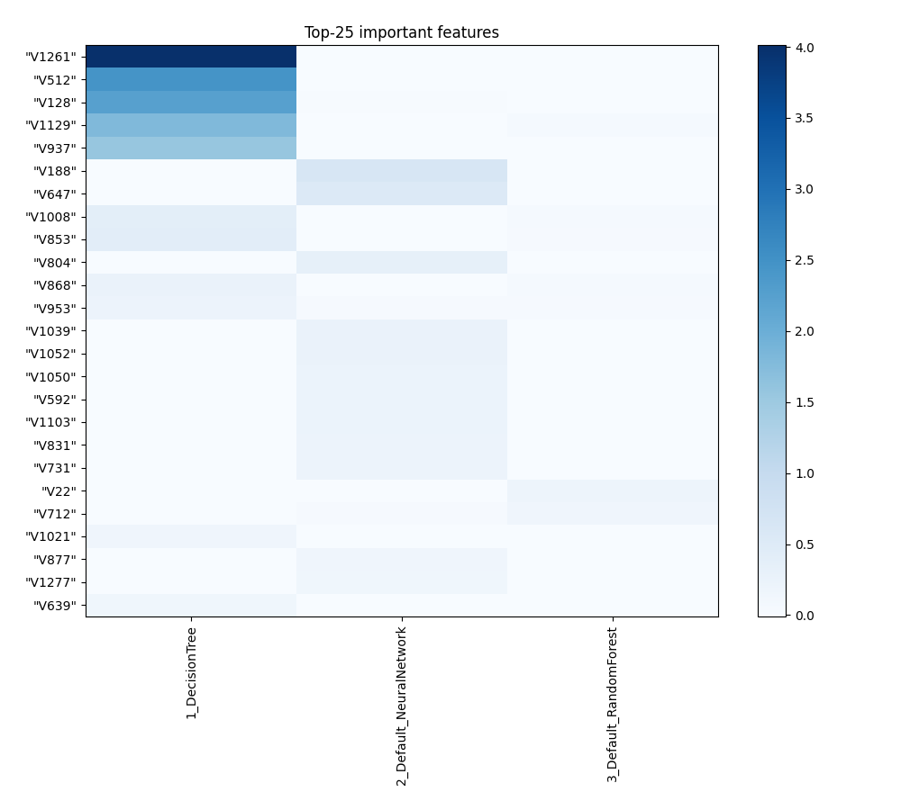
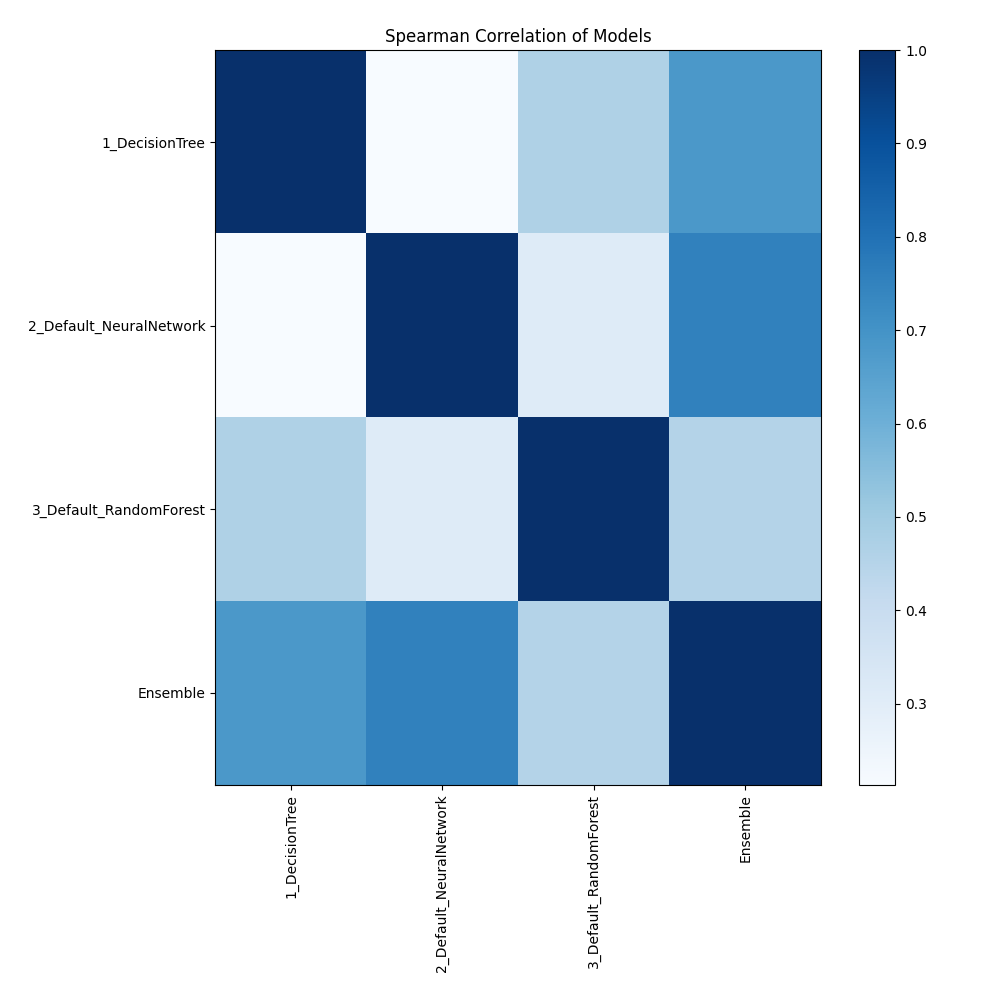

# AutoML Leaderboard

| Best model   | name                                                         | model_type     | metric_type   |   metric_value |   train_time |
|:-------------|:-------------------------------------------------------------|:---------------|:--------------|---------------:|-------------:|
|              | [1_DecisionTree](1_DecisionTree/README.md)                   | Decision Tree  | f1            |       0.5      |        18.95 |
|              | [2_Default_NeuralNetwork](2_Default_NeuralNetwork/README.md) | Neural Network | f1            |       0.833333 |        22.75 |
|              | [3_Default_RandomForest](3_Default_RandomForest/README.md)   | Random Forest  | f1            |       0.708333 |        34.19 |
| **the best** | [Ensemble](Ensemble/README.md)                               | Ensemble       | f1            |       0.854167 |         0.77 |

### AutoML Performance

### AutoML Performance Boxplot

### Features Importance

### Spearman Correlation of Models

