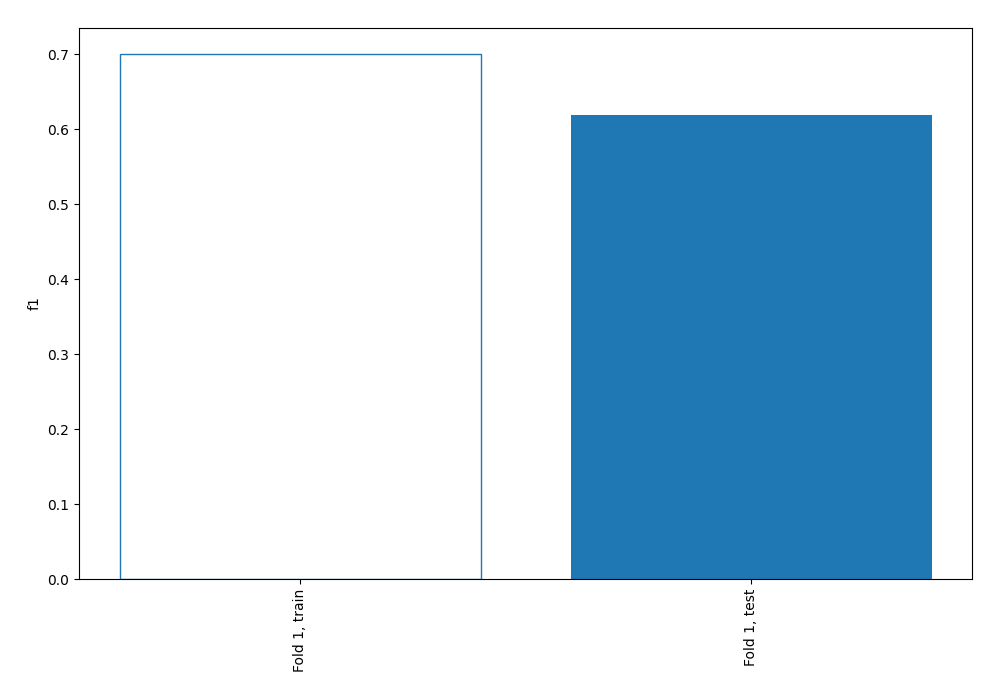
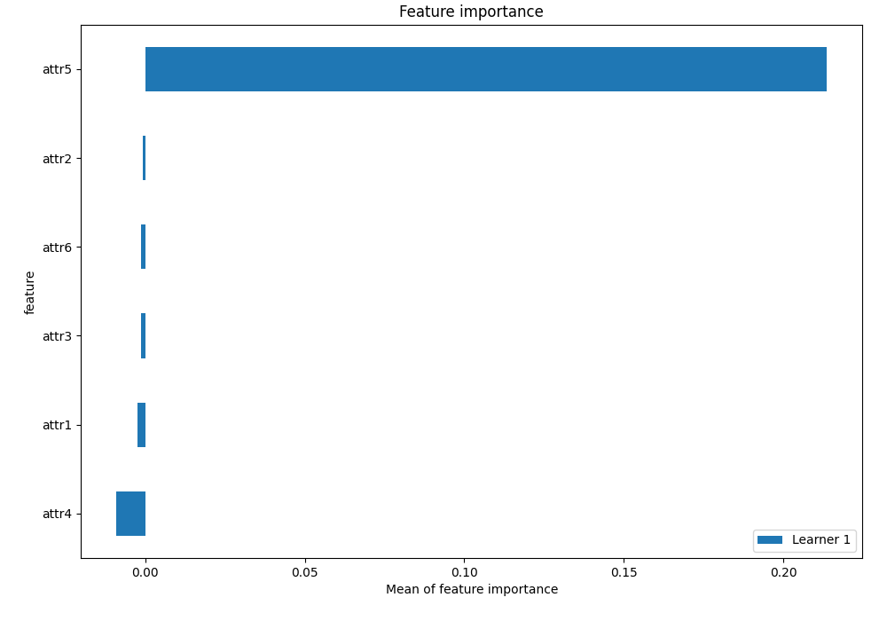
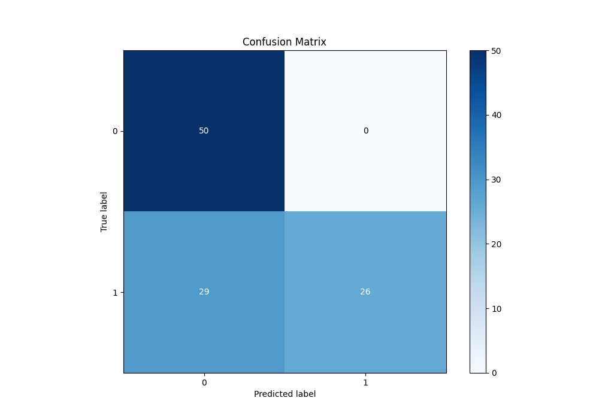
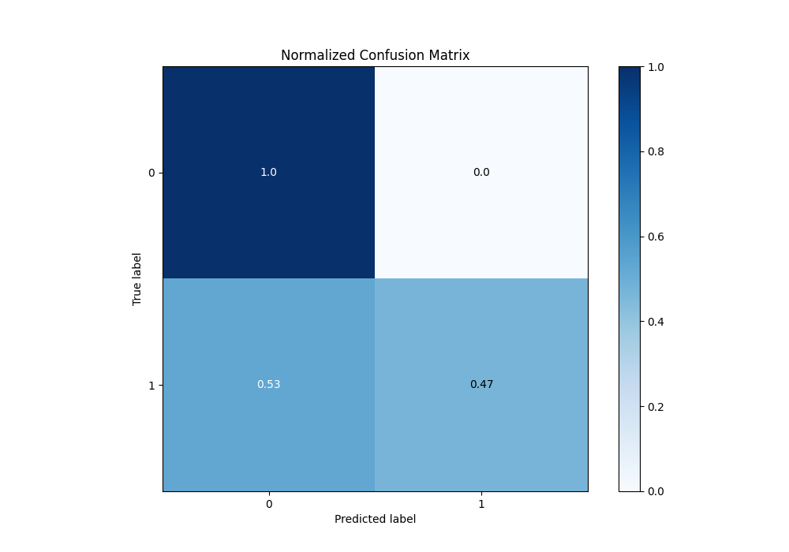
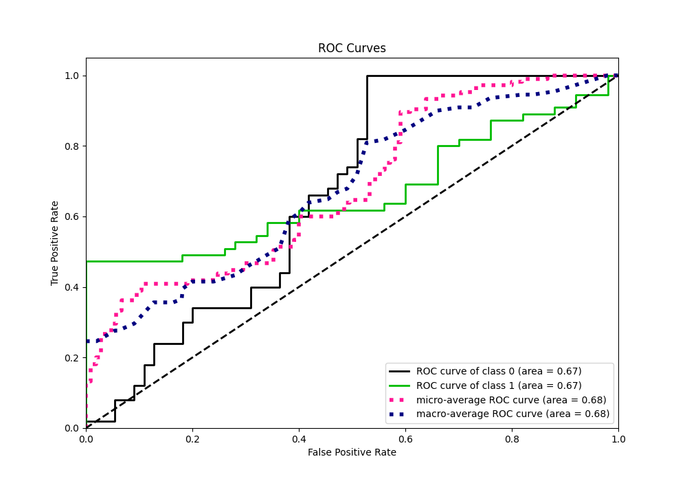
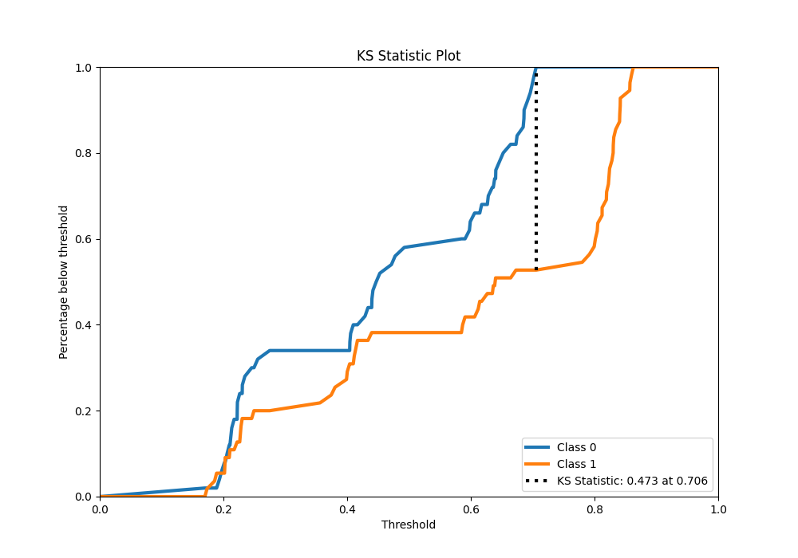
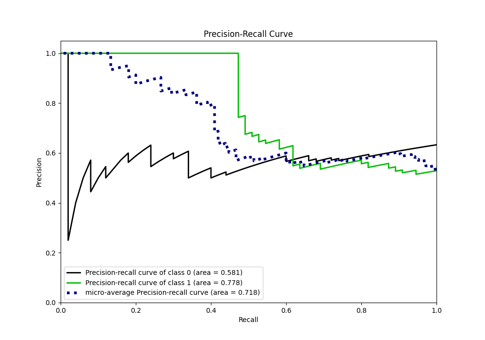
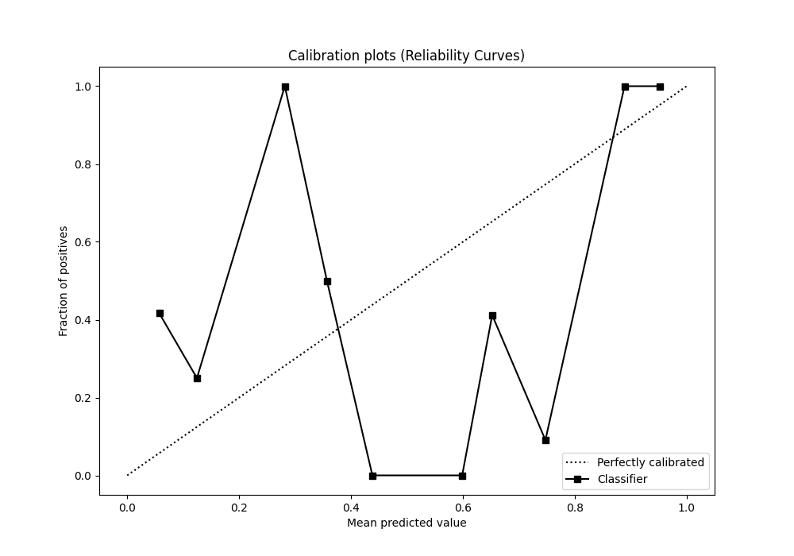
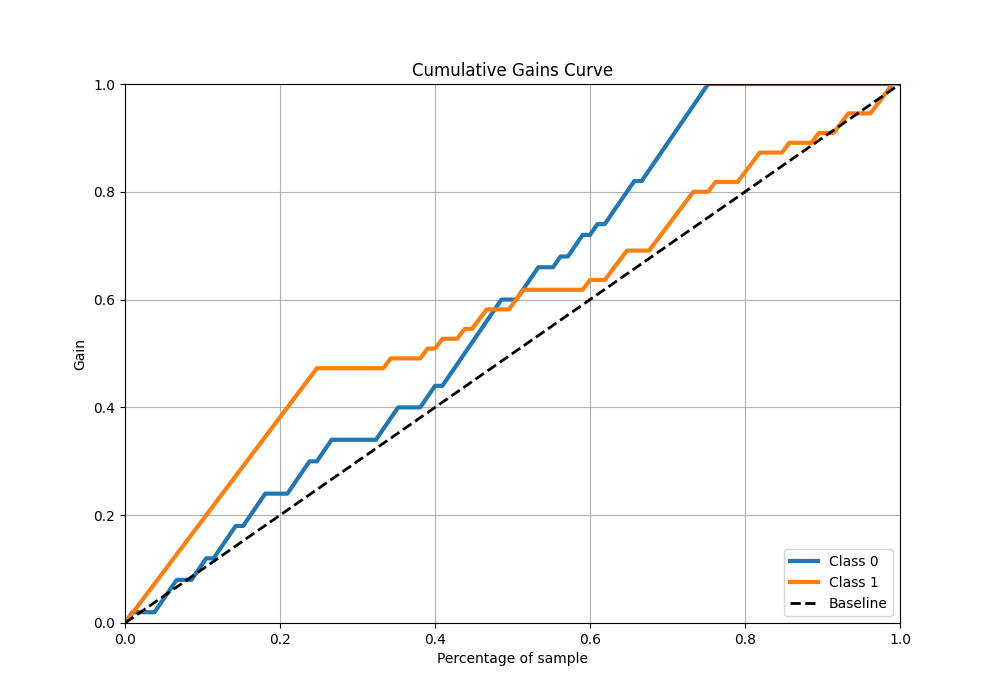
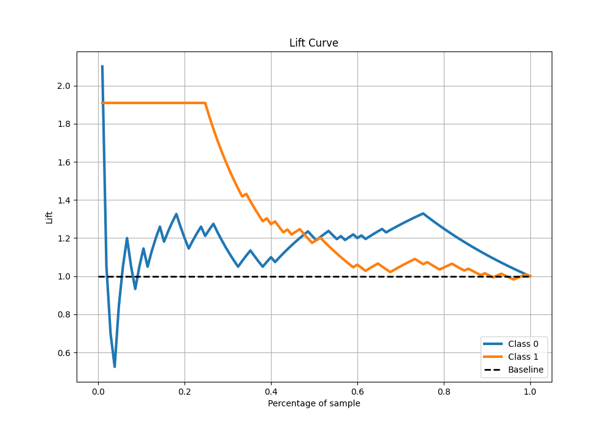

# Summary of 2_Linear

[<< Go back](../README.md)

## Logistic Regression (Linear)
- **n_jobs**: -1
- **explain_level**: 1

## Validation
 - **validation_type**: split
 - **train_ratio**: 0.75
 - **shuffle**: True
 - **stratify**: True

## Optimized metric
f1

## Training time

1.0 seconds

## Metric details
|           |    score |   threshold |
|:----------|---------:|------------:|
| logloss   | 0.655503 |  nan        |
| auc       | 0.667273 |  nan        |
| f1        | 0.6875   |    0.152994 |
| accuracy  | 0.72381  |    0.763529 |
| precision | 1        |    0.763529 |
| recall    | 1        |    0.152994 |
| mcc       | 0.546987 |    0.763529 |

## Confusion matrix (at threshold=0.763529)
|              |   Predicted as 0 |   Predicted as 1 |
|:-------------|-----------------:|-----------------:|
| Labeled as 0 |               50 |                0 |
| Labeled as 1 |               29 |               26 |

## Learning curves

## Coefficients
| feature   |   Learner_1 |
|:----------|------------:|
| intercept |   0.118719  |
| attr2     |   0.106142  |
| attr4     |   0.0790672 |
| attr6     |   0.0756633 |
| attr3     |   0.0415993 |
| attr1     |  -0.0188825 |
| attr5     |  -1.10777   |

## Permutation-based Importance

## Confusion Matrix

## Normalized Confusion Matrix

## ROC Curve

## Kolmogorov-Smirnov Statistic

## Precision-Recall Curve

## Calibration Curve

## Cumulative Gains Curve

## Lift Curve

[<< Go back](../README.md)
