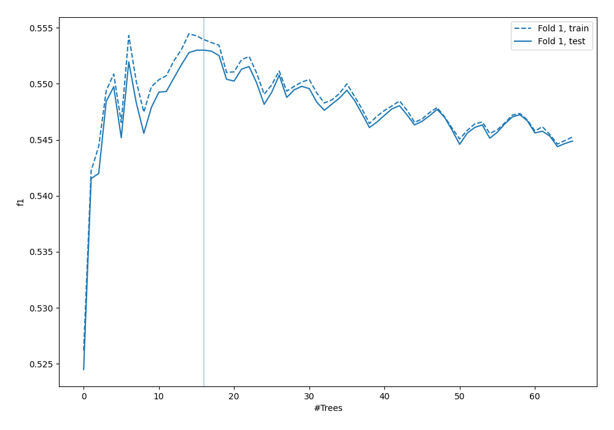
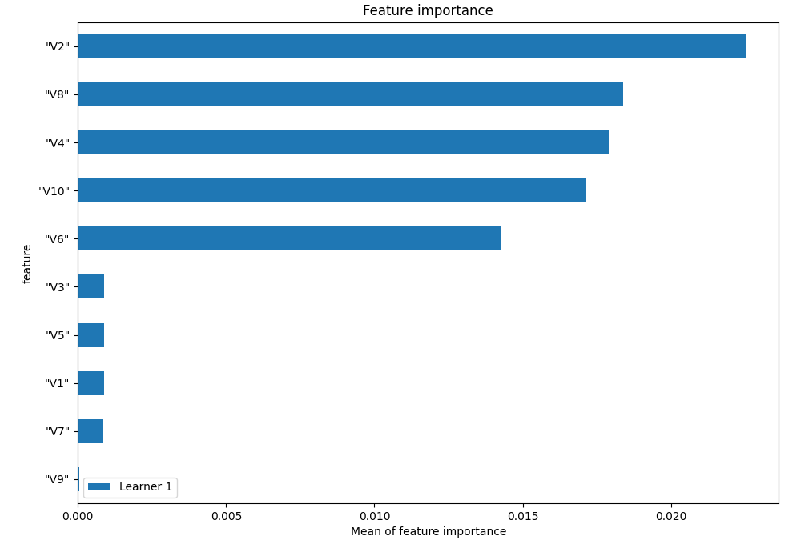
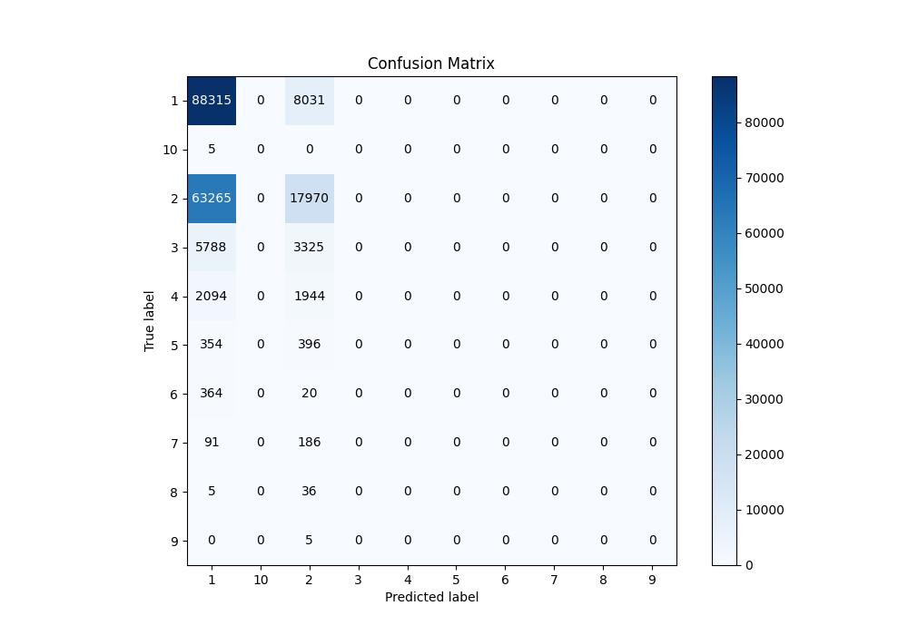
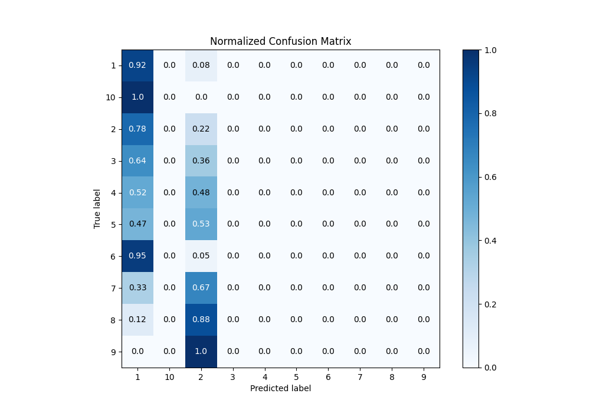
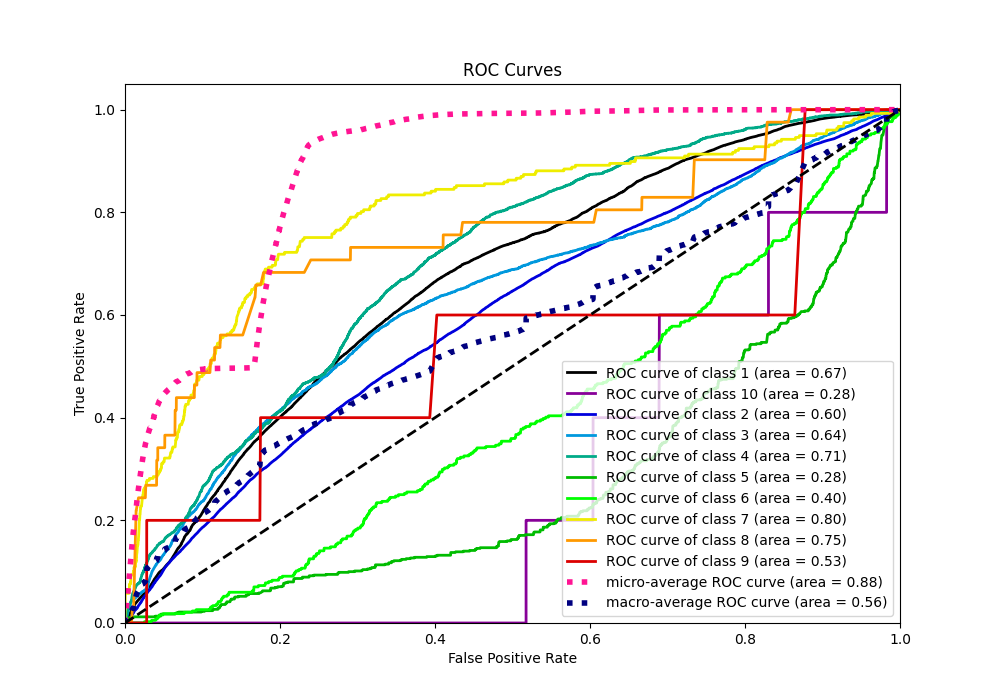
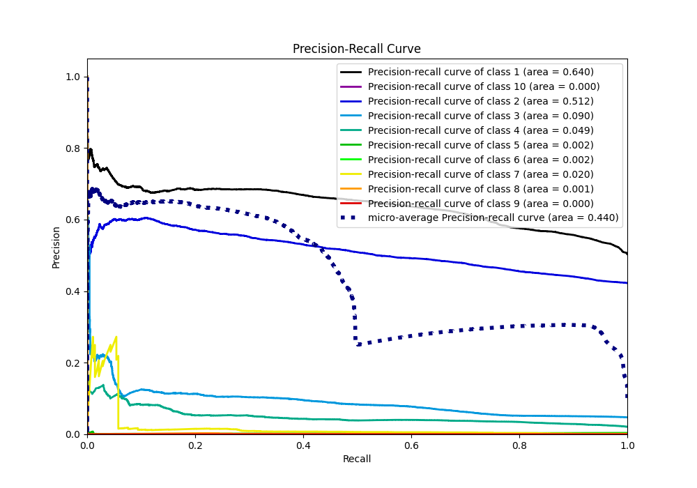

# Summary of 3_Default_RandomForest

[<< Go back](../README.md)

## Random Forest
- **n_jobs**: -1
- **criterion**: gini
- **max_features**: 0.9
- **min_samples_split**: 30
- **max_depth**: 4
- **eval_metric_name**: f1
- **num_class**: 10
- **explain_level**: 1

## Validation
 - **validation_type**: split
 - **train_ratio**: 0.75
 - **shuffle**: True
 - **stratify**: True

## Optimized metric
f1

## Training time

70.0 seconds

### Metric details
|           |            1 |            2 |    3 |    4 |   5 |   6 |   7 |   8 |   9 |   10 |   accuracy |     macro avg |   weighted avg |   logloss |
|:----------|-------------:|-------------:|-----:|-----:|----:|----:|----:|----:|----:|-----:|-----------:|--------------:|---------------:|----------:|
| precision |     0.551001 |     0.563093 |    0 |    0 |   0 |   0 |   0 |   0 |   0 |    0 |   0.553009 |      0.111409 |       0.514218 |  0.946158 |
| recall    |     0.916644 |     0.22121  |    0 |    0 |   0 |   0 |   0 |   0 |   0 |    0 |   0.553009 |      0.113785 |       0.553009 |  0.946158 |
| f1-score  |     0.688275 |     0.317637 |    0 |    0 |   0 |   0 |   0 |   0 |   0 |    0 |   0.553009 |      0.100591 |       0.479286 |  0.946158 |
| support   | 96346        | 81235        | 9113 | 4038 | 750 | 384 | 277 |  41 |   5 |    5 |   0.553009 | 192194        |  192194        |  0.946158 |

## Confusion matrix
|               |   Predicted as 1 |   Predicted as 2 |   Predicted as 3 |   Predicted as 4 |   Predicted as 5 |   Predicted as 6 |   Predicted as 7 |   Predicted as 8 |   Predicted as 9 |   Predicted as 10 |
|:--------------|-----------------:|-----------------:|-----------------:|-----------------:|-----------------:|-----------------:|-----------------:|-----------------:|-----------------:|------------------:|
| Labeled as 1  |            88315 |             8031 |                0 |                0 |                0 |                0 |                0 |                0 |                0 |                 0 |
| Labeled as 2  |            63265 |            17970 |                0 |                0 |                0 |                0 |                0 |                0 |                0 |                 0 |
| Labeled as 3  |             5788 |             3325 |                0 |                0 |                0 |                0 |                0 |                0 |                0 |                 0 |
| Labeled as 4  |             2094 |             1944 |                0 |                0 |                0 |                0 |                0 |                0 |                0 |                 0 |
| Labeled as 5  |              354 |              396 |                0 |                0 |                0 |                0 |                0 |                0 |                0 |                 0 |
| Labeled as 6  |              364 |               20 |                0 |                0 |                0 |                0 |                0 |                0 |                0 |                 0 |
| Labeled as 7  |               91 |              186 |                0 |                0 |                0 |                0 |                0 |                0 |                0 |                 0 |
| Labeled as 8  |                5 |               36 |                0 |                0 |                0 |                0 |                0 |                0 |                0 |                 0 |
| Labeled as 9  |                0 |                5 |                0 |                0 |                0 |                0 |                0 |                0 |                0 |                 0 |
| Labeled as 10 |                5 |                0 |                0 |                0 |                0 |                0 |                0 |                0 |                0 |                 0 |

## Learning curves

## Permutation-based Importance

## Confusion Matrix

## Normalized Confusion Matrix

## ROC Curve

## Precision Recall Curve

[<< Go back](../README.md)
