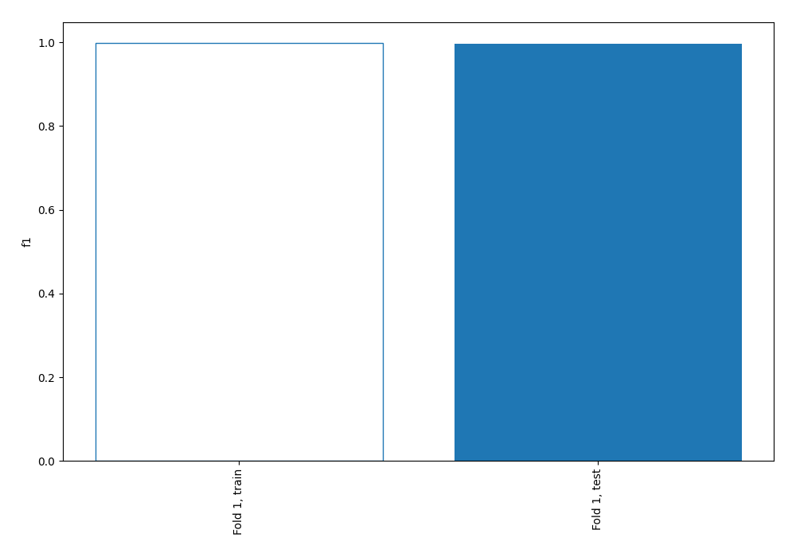
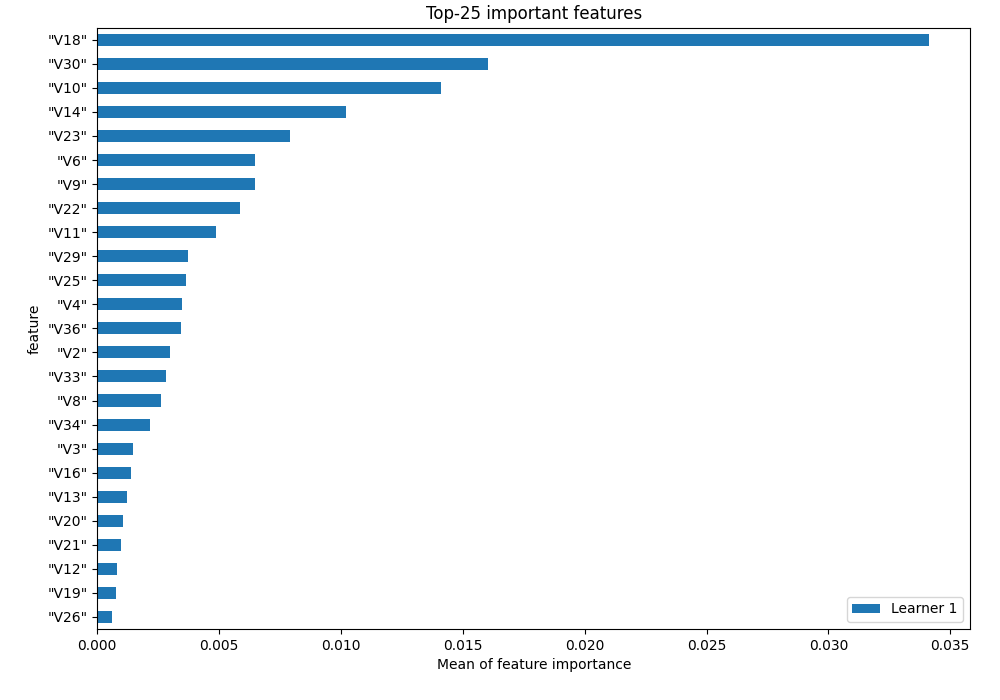
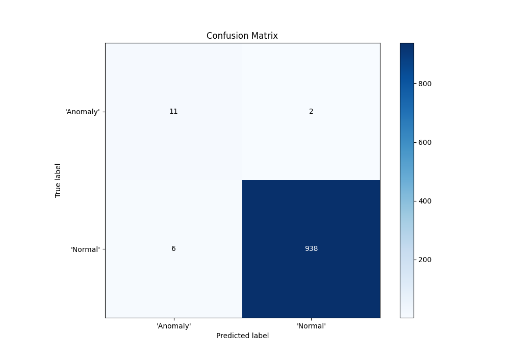
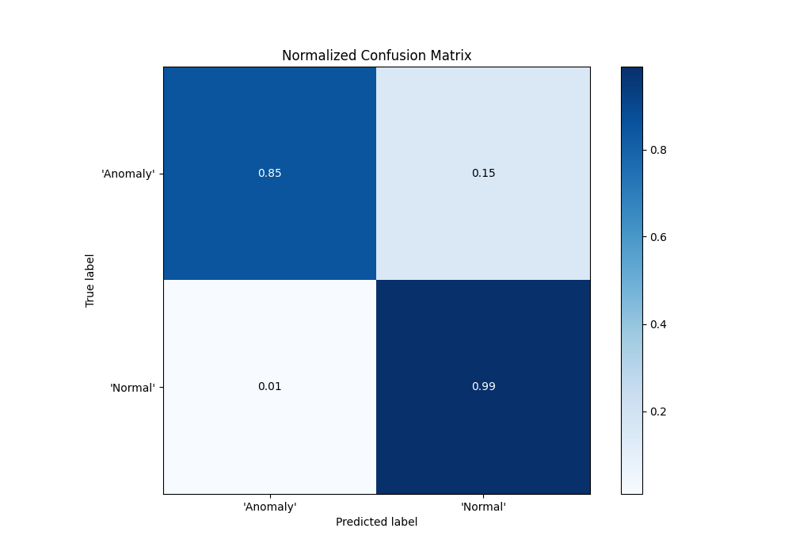
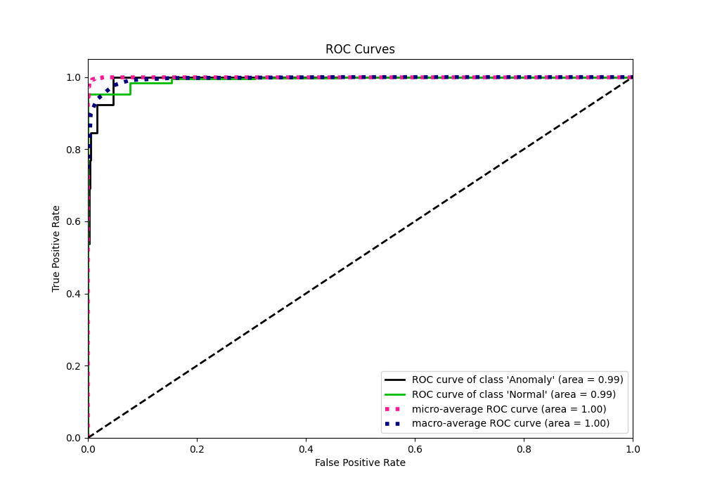
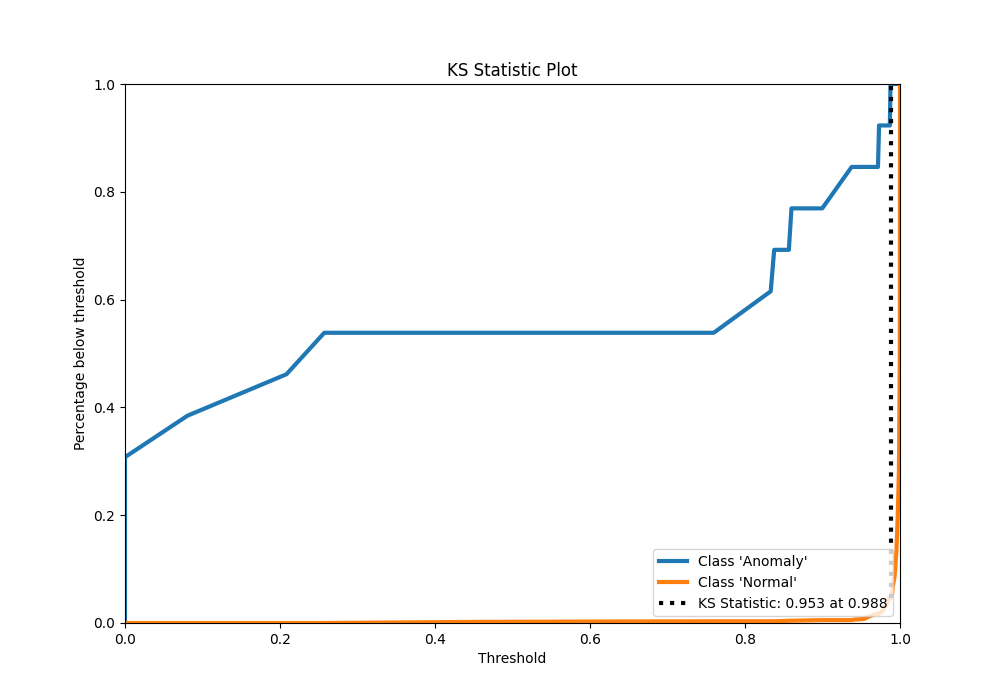
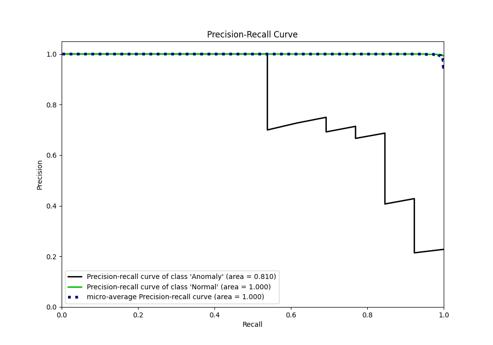
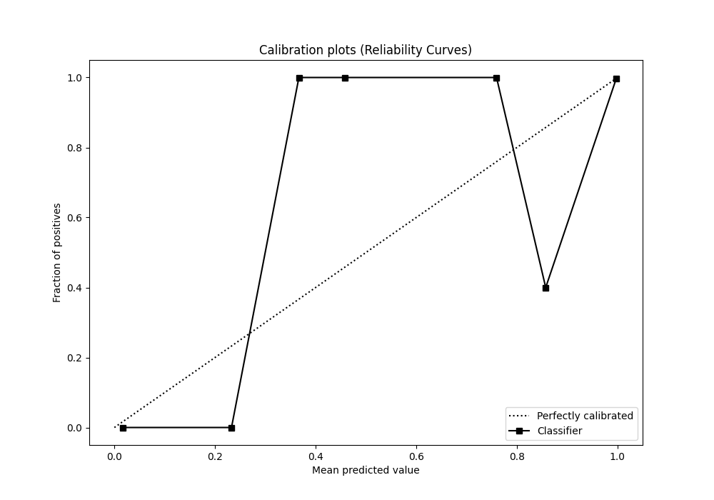
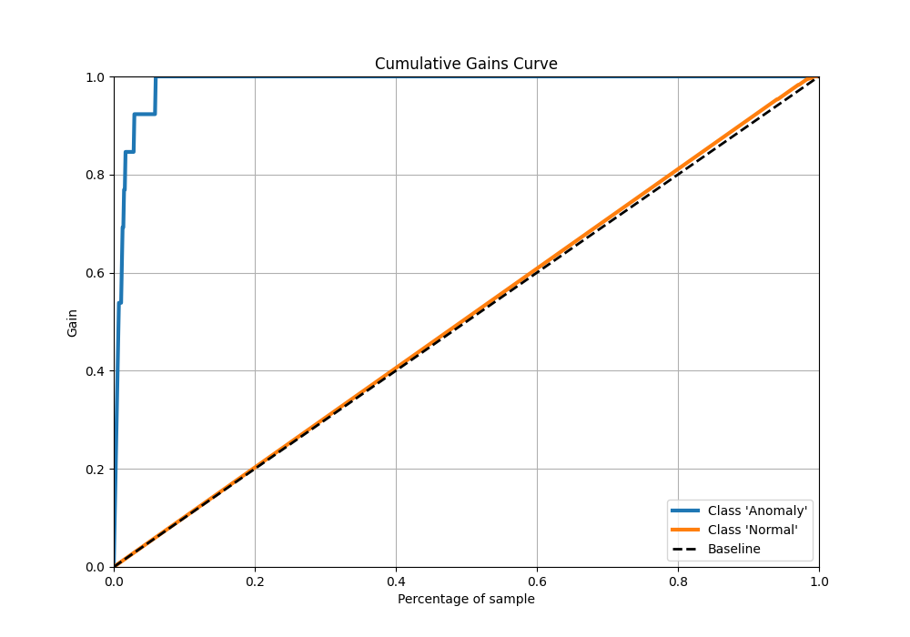
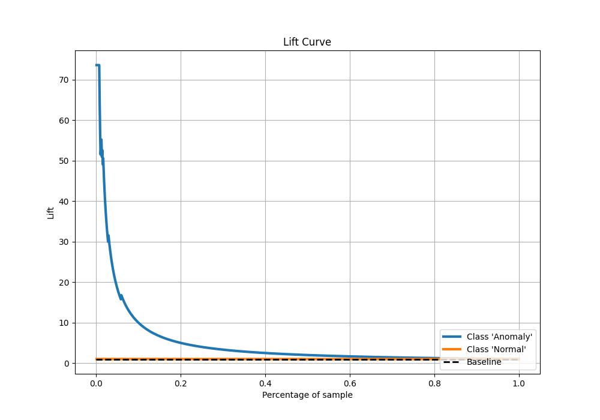

# Summary of 2_Linear

[<< Go back](../README.md)

## Logistic Regression (Linear)
- **n_jobs**: -1
- **explain_level**: 1

## Validation
 - **validation_type**: split
 - **train_ratio**: 0.75
 - **shuffle**: True
 - **stratify**: True

## Optimized metric
f1

## Training time

1.1 seconds

## Metric details
|           |     score |     threshold |
|:----------|----------:|--------------:|
| logloss   | 0.0224247 | nan           |
| auc       | 0.993889  | nan           |
| f1        | 0.995758  |   0.915033    |
| accuracy  | 0.991641  |   0.949819    |
| precision | 1         |   0.999465    |
| recall    | 1         |   2.64613e-11 |
| mcc       | 0.735943  |   0.949819    |

## Confusion matrix (at threshold=0.949819)
|                      |   Predicted as 'Anomaly' |   Predicted as 'Normal' |
|:---------------------|-------------------------:|------------------------:|
| Labeled as 'Anomaly' |                       11 |                       2 |
| Labeled as 'Normal'  |                        6 |                     938 |

## Learning curves

## Coefficients
| feature   |   Learner_1 |
|:----------|------------:|
| intercept |   7.97803   |
| "V18"     |   2.20162   |
| "V10"     |   1.3864    |
| "V30"     |   1.18386   |
| "V14"     |   1.17135   |
| "V6"      |   0.819266  |
| "V4"      |   0.755059  |
| "V36"     |   0.67098   |
| "V22"     |   0.616553  |
| "V8"      |   0.565657  |
| "V29"     |   0.546829  |
| "V2"      |   0.526321  |
| "V33"     |   0.373474  |
| "V12"     |   0.238767  |
| "V34"     |   0.218841  |
| "V21"     |   0.197016  |
| "V28"     |   0.144702  |
| "V15"     |   0.123349  |
| "V26"     |   0.0949315 |
| "V32"     |   0.0211851 |
| "V17"     |  -0.101695  |
| "V31"     |  -0.188663  |
| "V1"      |  -0.248361  |
| "V7"      |  -0.257117  |
| "V35"     |  -0.330781  |
| "V24"     |  -0.346656  |
| "V5"      |  -0.390638  |
| "V27"     |  -0.450451  |
| "V13"     |  -0.550573  |
| "V3"      |  -0.639087  |
| "V19"     |  -0.64051   |
| "V20"     |  -0.741475  |
| "V16"     |  -0.752637  |
| "V25"     |  -0.989172  |
| "V9"      |  -1.00923   |
| "V11"     |  -1.0343    |
| "V23"     |  -1.21583   |

## Permutation-based Importance

## Confusion Matrix

## Normalized Confusion Matrix

## ROC Curve

## Kolmogorov-Smirnov Statistic

## Precision-Recall Curve

## Calibration Curve

## Cumulative Gains Curve

## Lift Curve

[<< Go back](../README.md)
