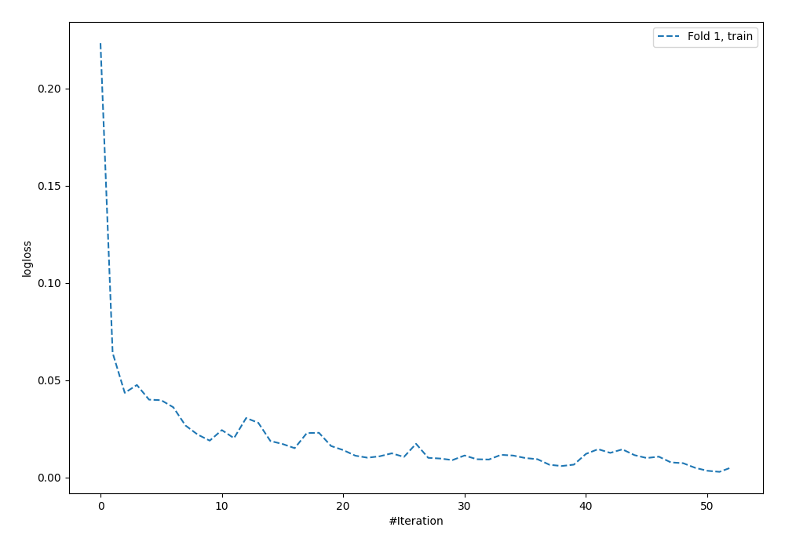
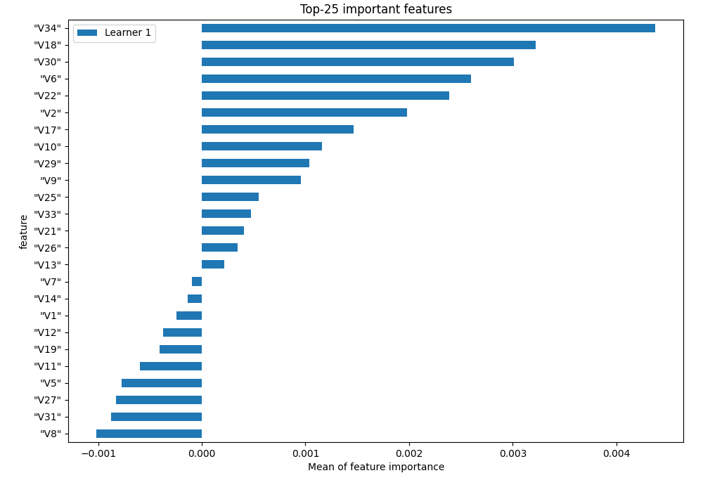
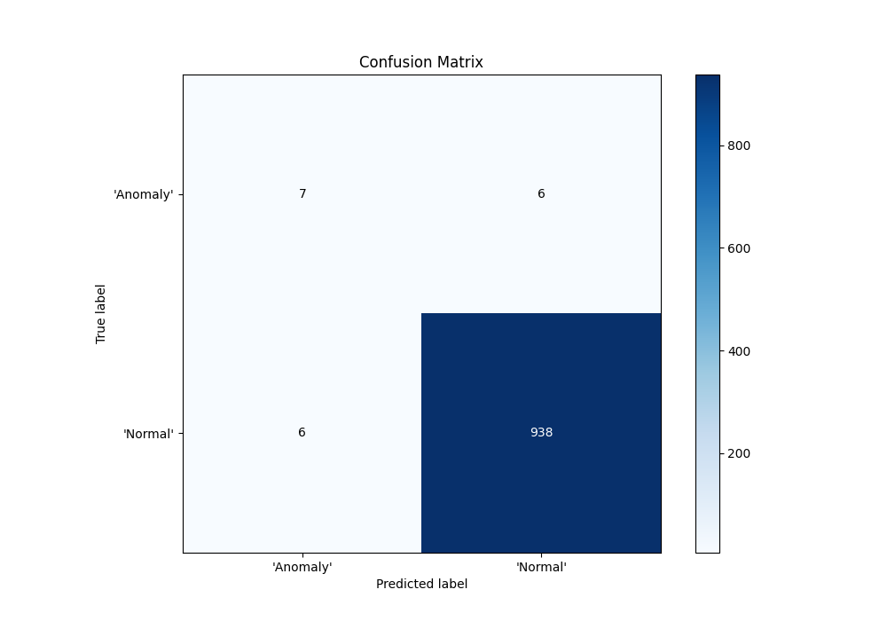
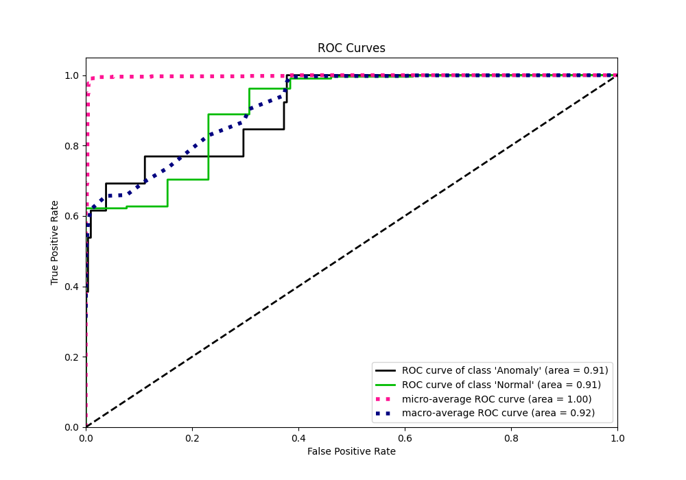
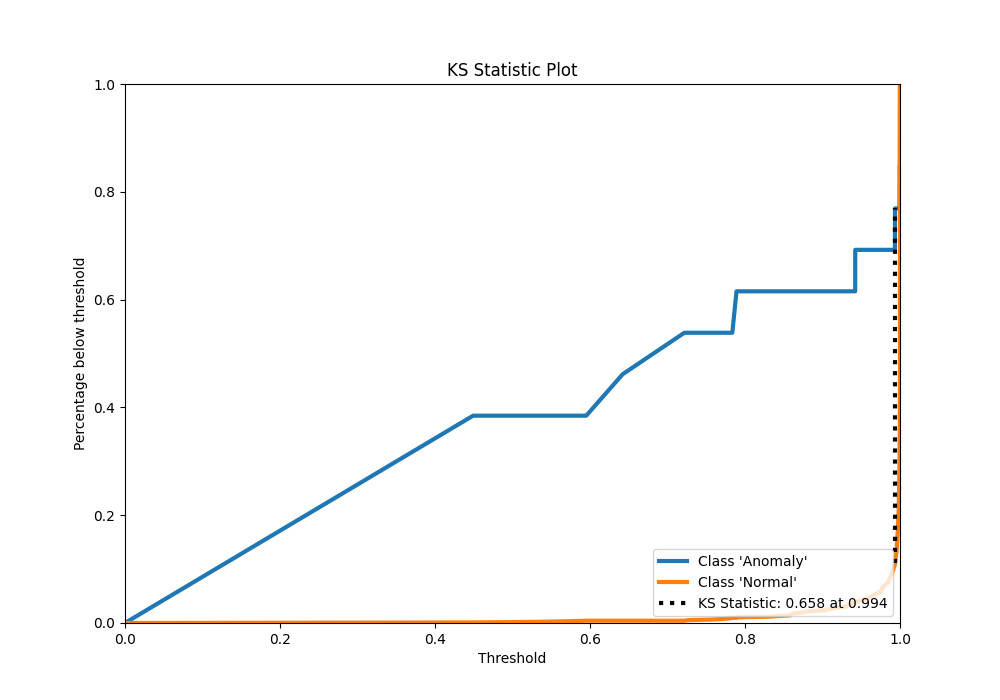
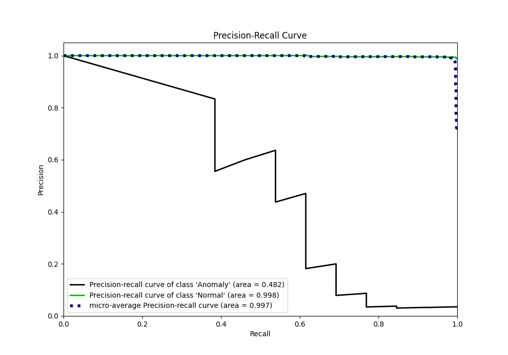
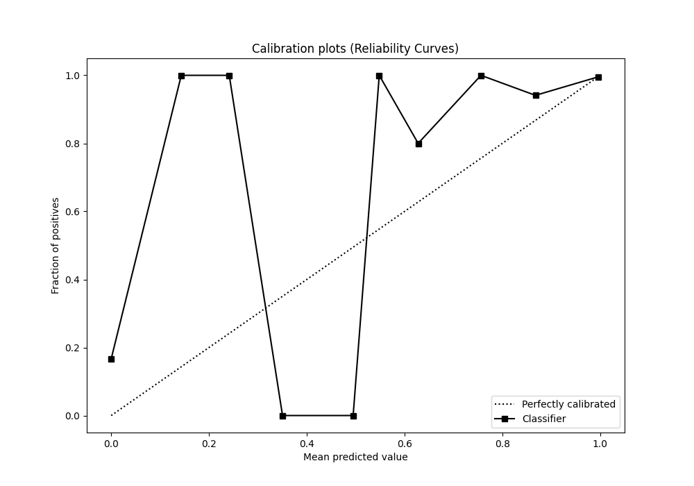
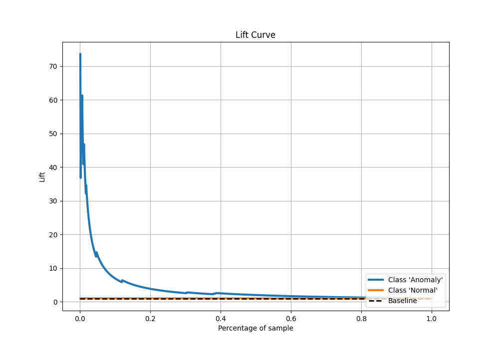

# Summary of 3_Default_NeuralNetwork

[<< Go back](../README.md)

## Neural Network
- **n_jobs**: -1
- **dense_1_size**: 32
- **dense_2_size**: 16
- **learning_rate**: 0.05
- **explain_level**: 1

## Validation
 - **validation_type**: split
 - **train_ratio**: 0.75
 - **shuffle**: True
 - **stratify**: True

## Optimized metric
f1

## Training time

1.2 seconds

## Metric details
|           |     score |   threshold |
|:----------|----------:|------------:|
| logloss   | 0.0499954 |  nan        |
| auc       | 0.906331  |  nan        |
| f1        | 0.993644  |    0.764044 |
| accuracy  | 0.987461  |    0.764044 |
| precision | 1         |    1        |
| recall    | 1         |    0.40422  |
| mcc       | 0.532106  |    0.764044 |

## Confusion matrix (at threshold=0.764044)
|                      |   Predicted as 'Anomaly' |   Predicted as 'Normal' |
|:---------------------|-------------------------:|------------------------:|
| Labeled as 'Anomaly' |                        7 |                       6 |
| Labeled as 'Normal'  |                        6 |                     938 |

## Learning curves

## Permutation-based Importance

## Confusion Matrix

## Normalized Confusion Matrix

## ROC Curve

## Kolmogorov-Smirnov Statistic

## Precision-Recall Curve

## Calibration Curve

## Cumulative Gains Curve

## Lift Curve

[<< Go back](../README.md)
