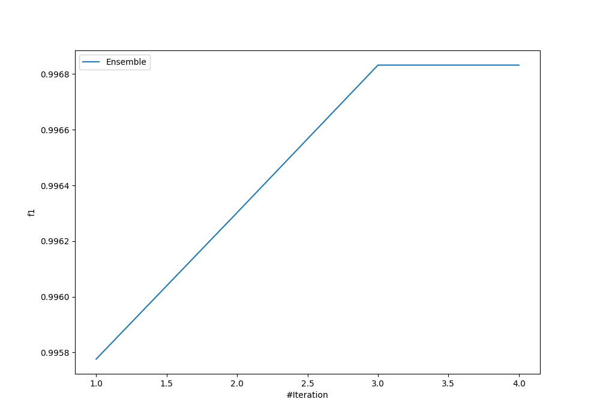
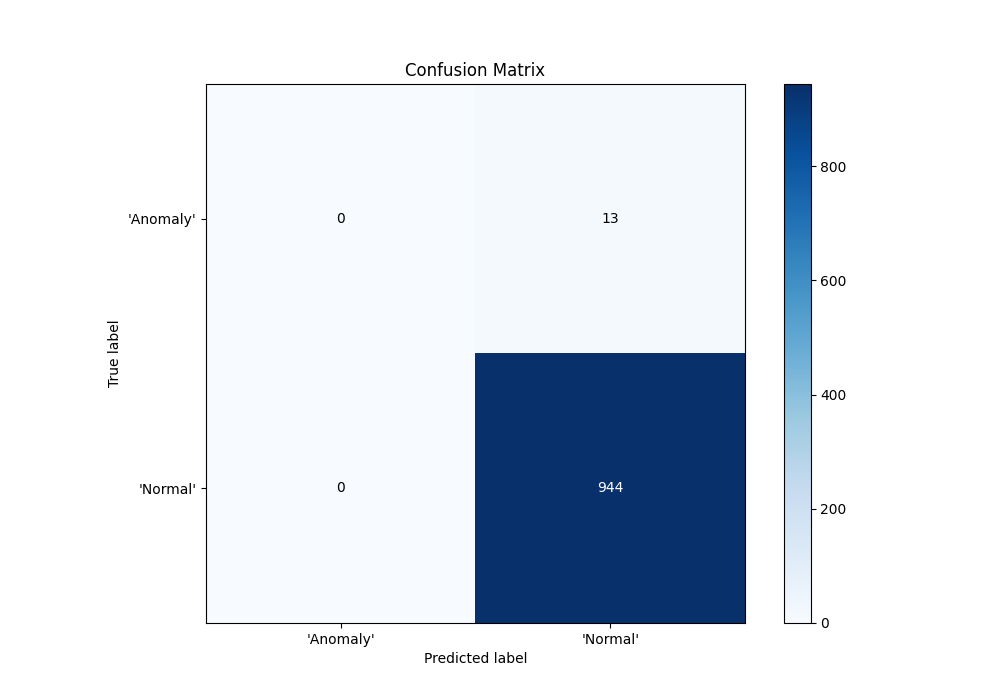
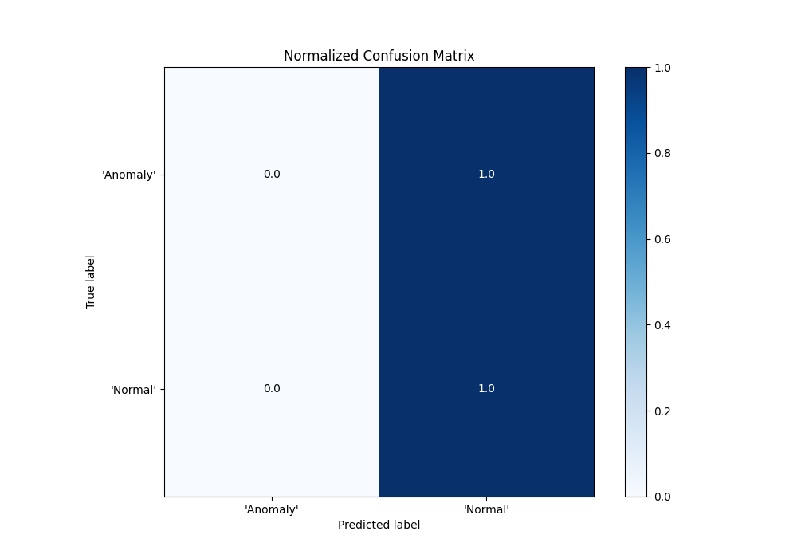
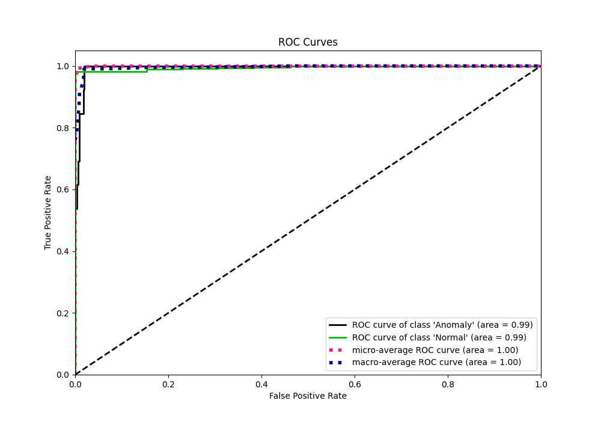
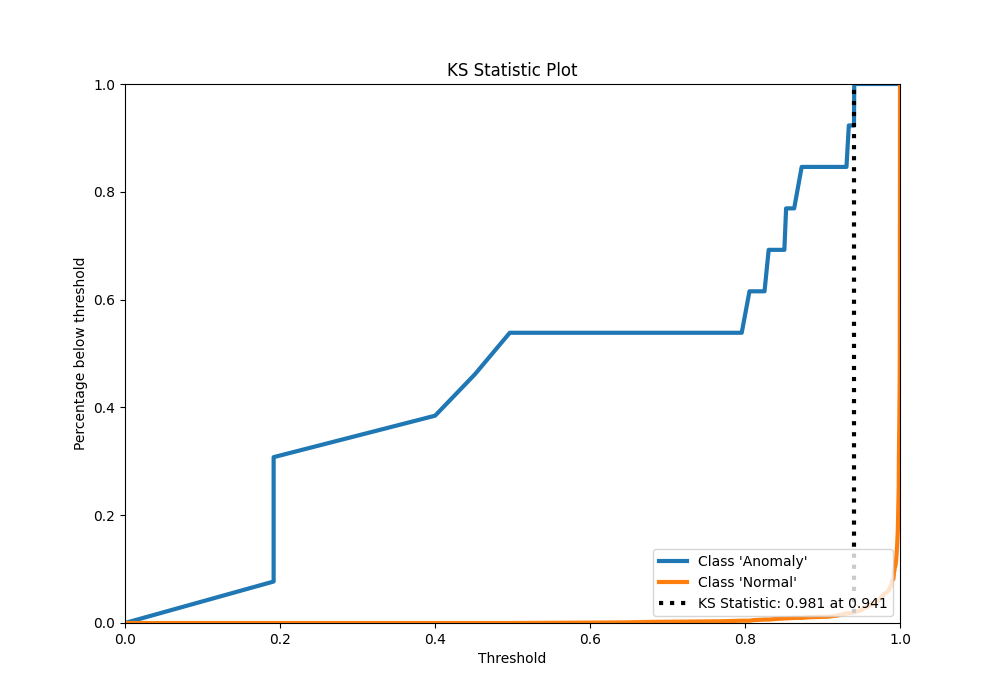
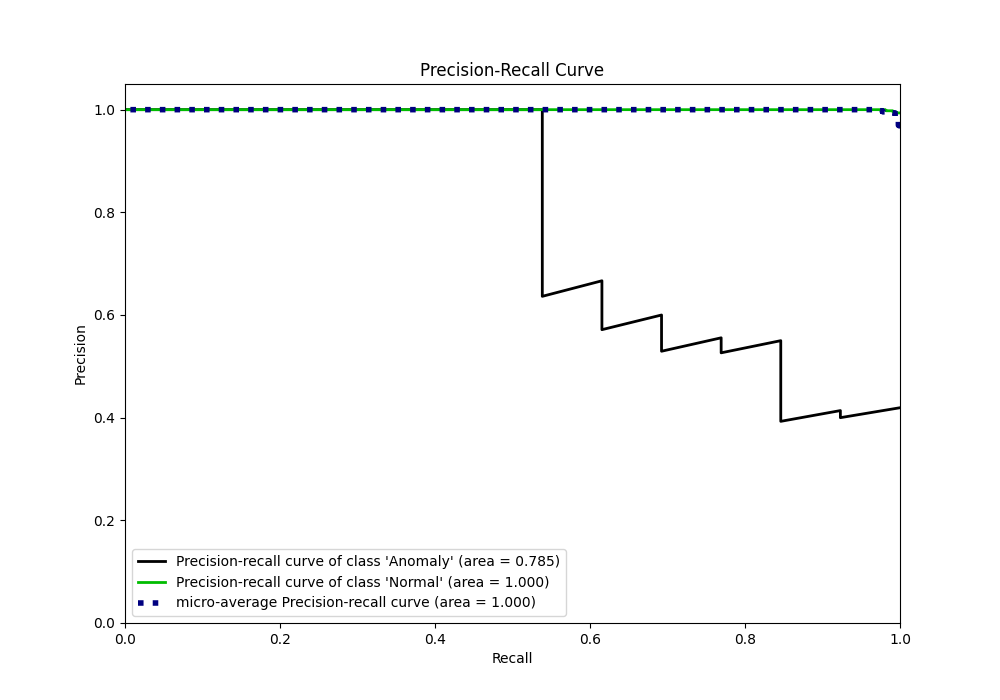
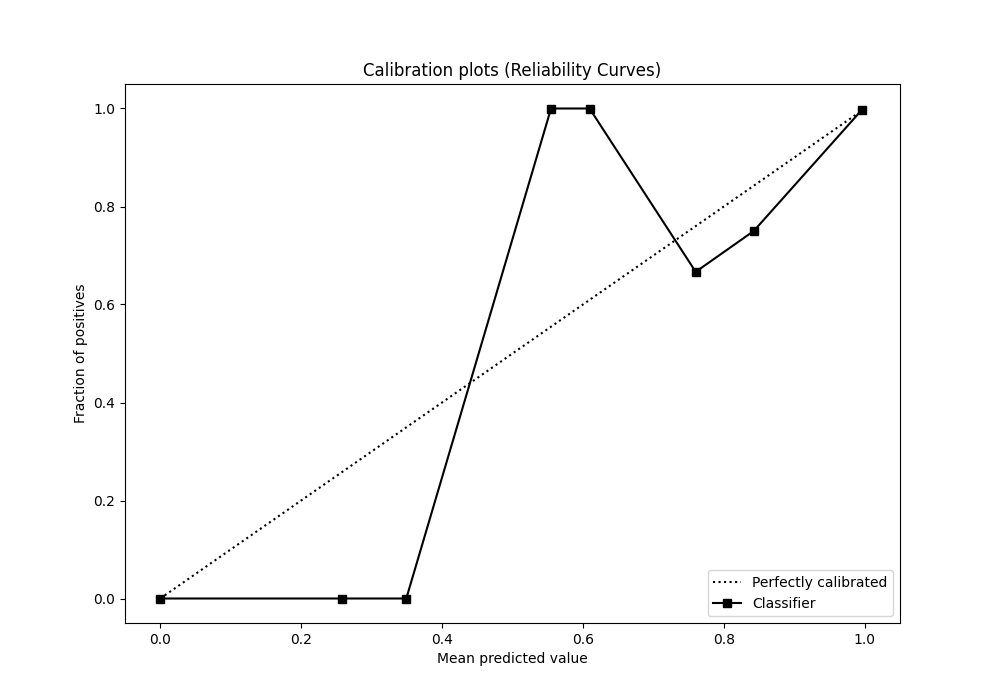
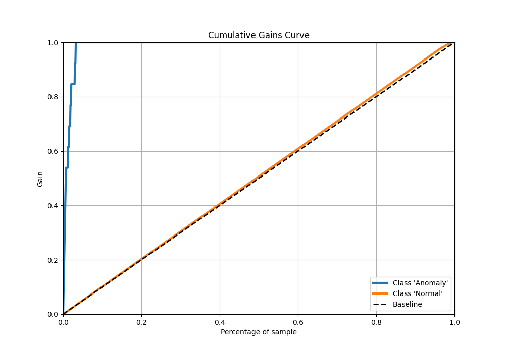
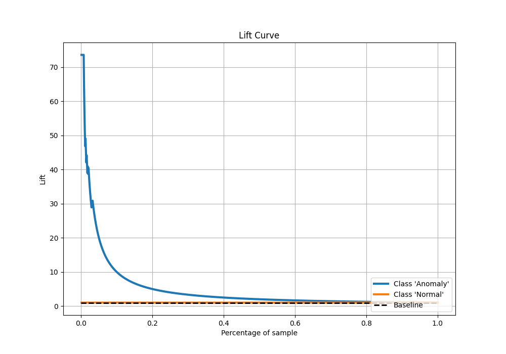

# Summary of Ensemble

[<< Go back](../README.md)

## Ensemble structure
| Model                   |   Weight |
|:------------------------|---------:|
| 2_Linear                |        1 |
| 3_Default_NeuralNetwork |        1 |
| 4_Default_RandomForest  |        1 |

## Metric details
|           |     score |   threshold |
|:----------|----------:|------------:|
| logloss   | 0.0218983 |  nan        |
| auc       | 0.994948  |  nan        |
| f1        | 0.993161  |    0.172602 |
| accuracy  | 0.986416  |    0.172602 |
| precision | 1         |    0.99465  |
| recall    | 1         |    0.172602 |
| mcc       | 0.629935  |    0.919611 |

## Confusion matrix (at threshold=0.172602)
|                      |   Predicted as 'Anomaly' |   Predicted as 'Normal' |
|:---------------------|-------------------------:|------------------------:|
| Labeled as 'Anomaly' |                        0 |                      13 |
| Labeled as 'Normal'  |                        0 |                     944 |

## Learning curves

## Confusion Matrix

## Normalized Confusion Matrix

## ROC Curve

## Kolmogorov-Smirnov Statistic

## Precision-Recall Curve

## Calibration Curve

## Cumulative Gains Curve

## Lift Curve

[<< Go back](../README.md)
