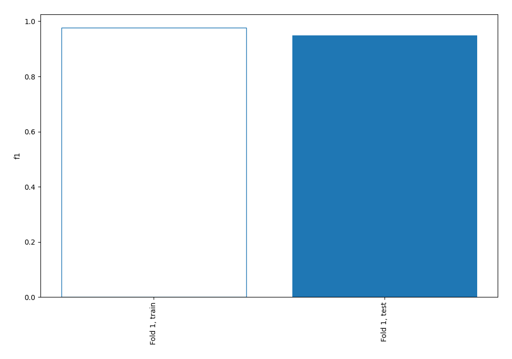
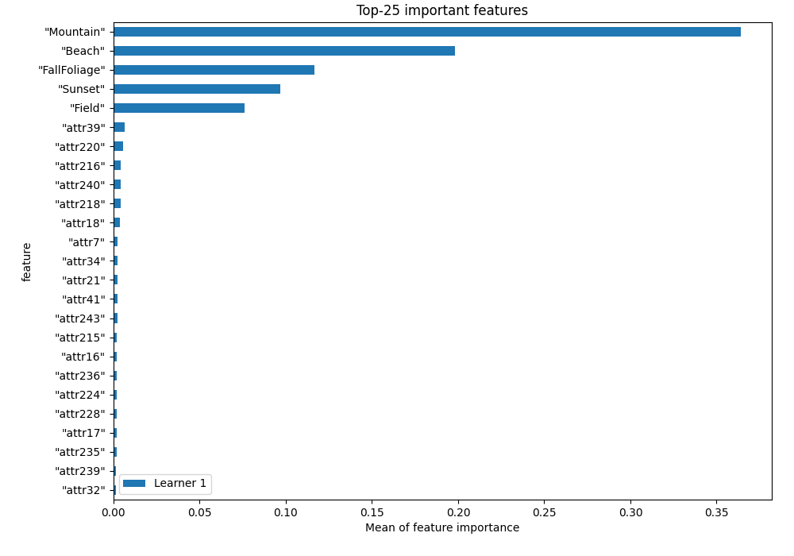
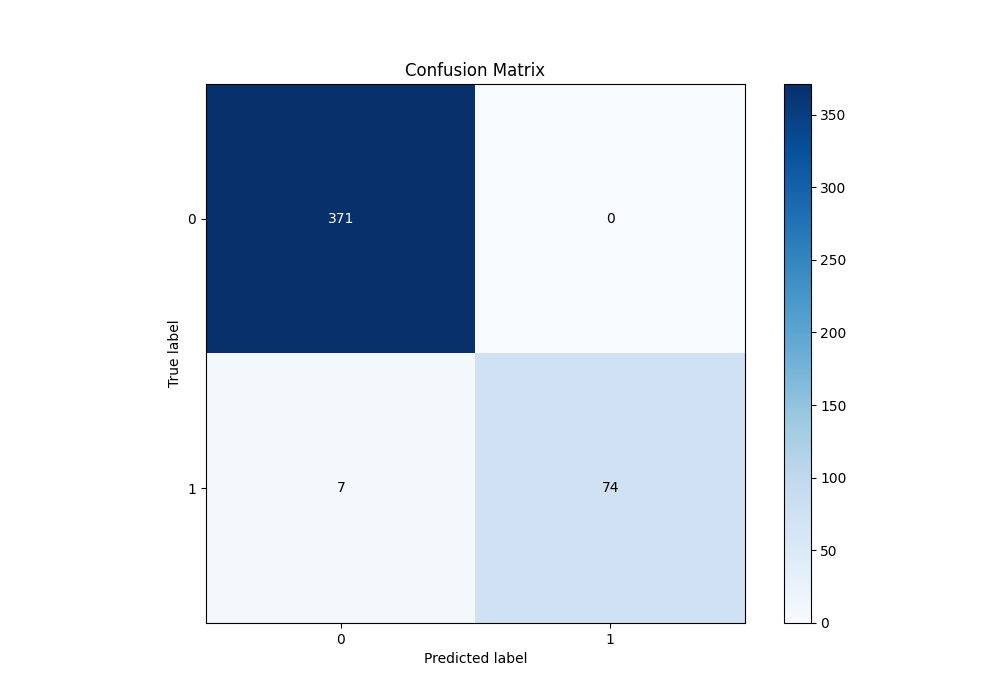
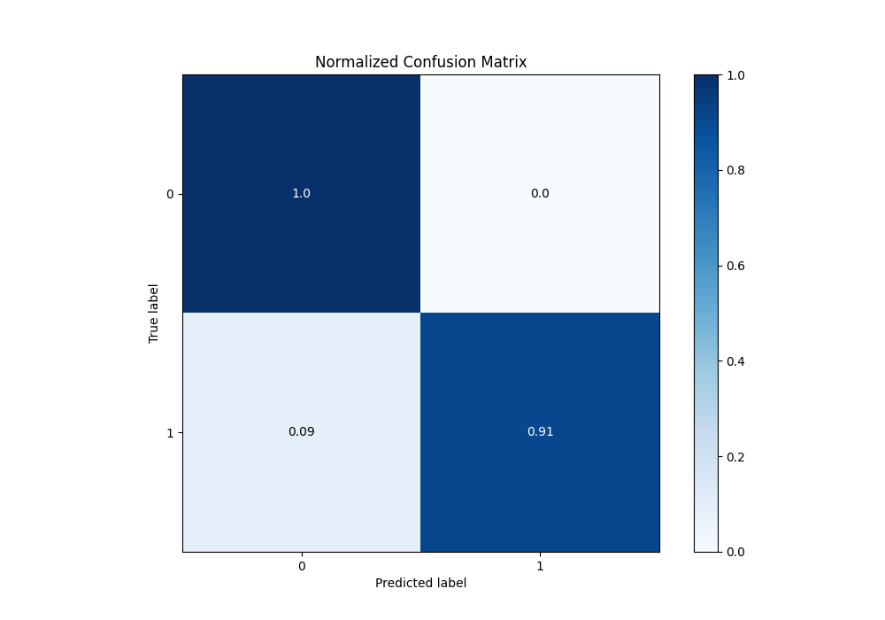
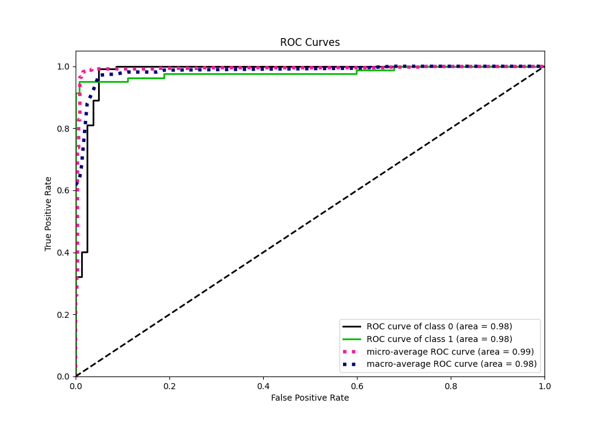
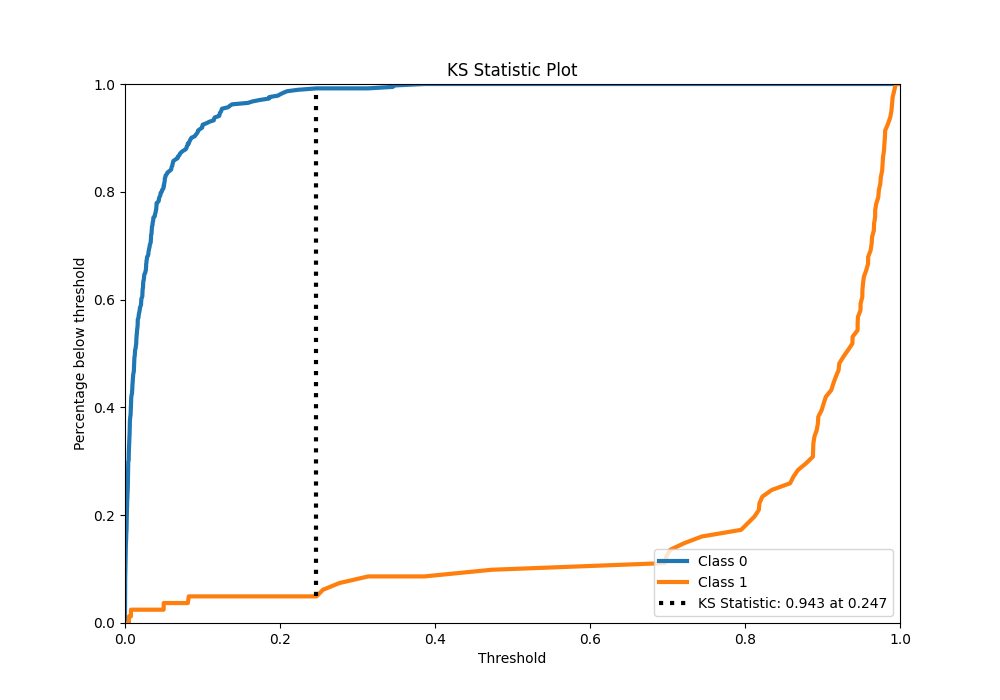
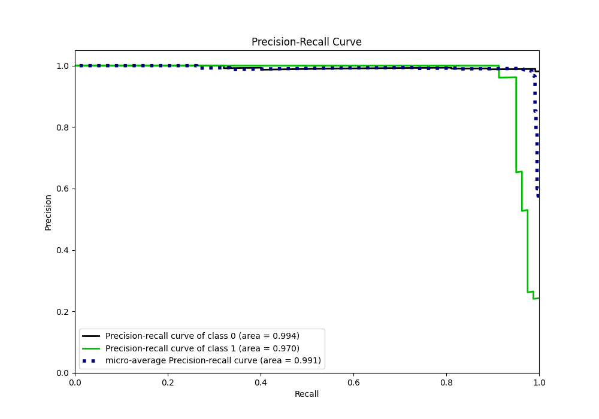
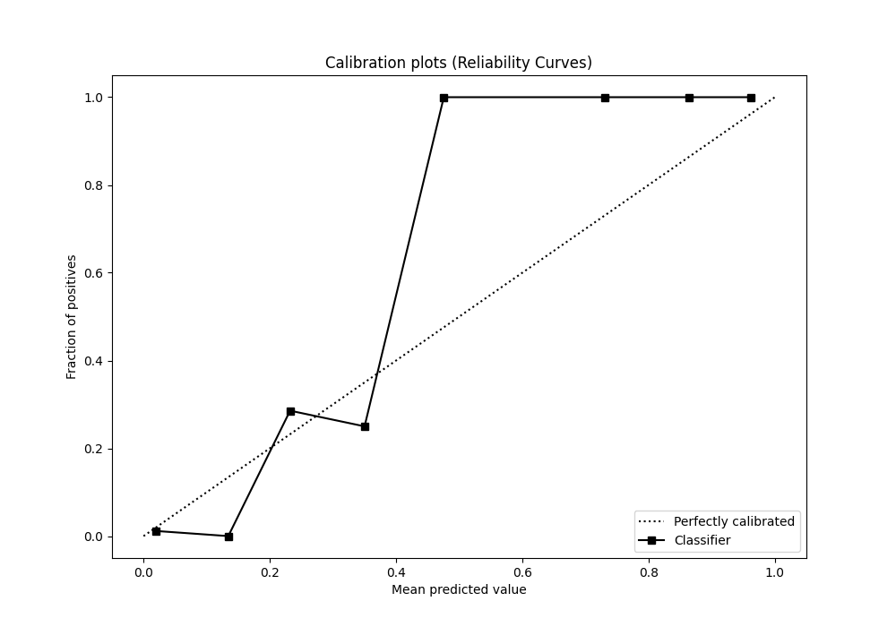
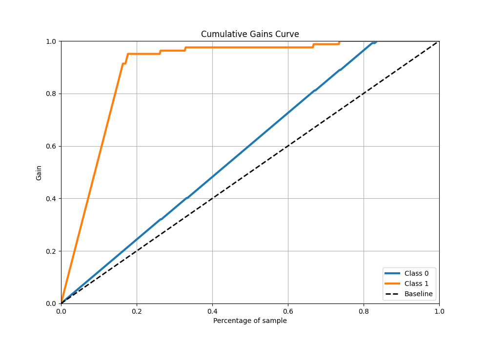
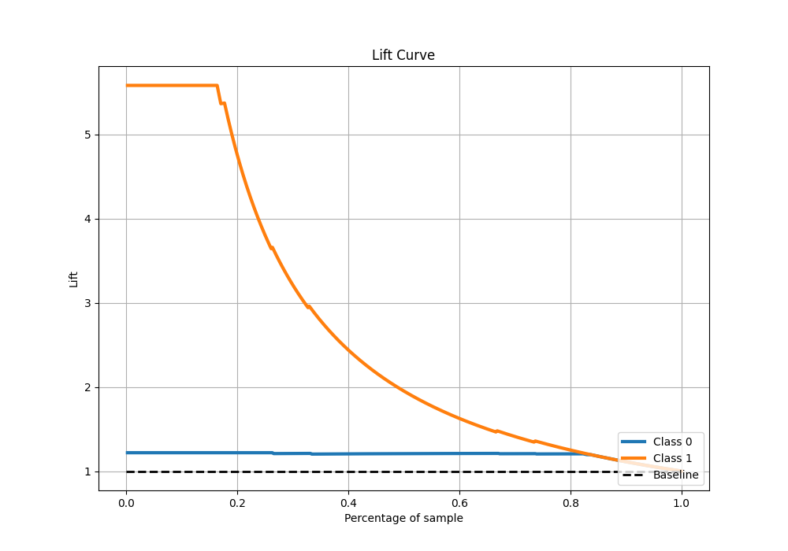

# Summary of 2_Linear

[<< Go back](../README.md)

## Logistic Regression (Linear)
- **n_jobs**: -1
- **explain_level**: 1

## Validation
 - **validation_type**: split
 - **train_ratio**: 0.75
 - **shuffle**: True
 - **stratify**: True

## Optimized metric
f1

## Training time

4.5 seconds

## Metric details
|           |     score |     threshold |
|:----------|----------:|--------------:|
| logloss   | 0.0877914 | nan           |
| auc       | 0.980234  | nan           |
| f1        | 0.954839  |   0.438735    |
| accuracy  | 0.984513  |   0.438735    |
| precision | 1         |   0.512427    |
| recall    | 1         |   1.42668e-05 |
| mcc       | 0.946922  |   0.438735    |

## Confusion matrix (at threshold=0.438735)
|              |   Predicted as 0 |   Predicted as 1 |
|:-------------|-----------------:|-----------------:|
| Labeled as 0 |              371 |                0 |
| Labeled as 1 |                7 |               74 |

## Learning curves

## Permutation-based Importance

## Confusion Matrix

## Normalized Confusion Matrix

## ROC Curve

## Kolmogorov-Smirnov Statistic

## Precision-Recall Curve

## Calibration Curve

## Cumulative Gains Curve

## Lift Curve

[<< Go back](../README.md)
