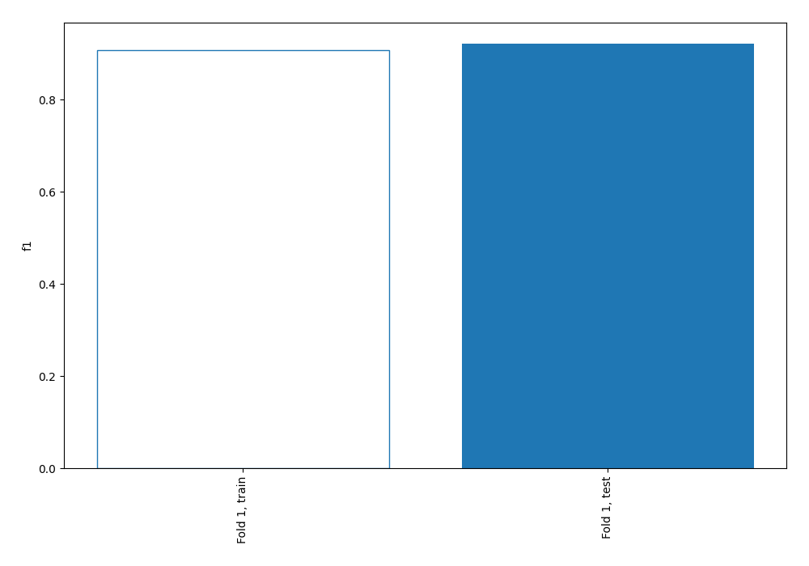
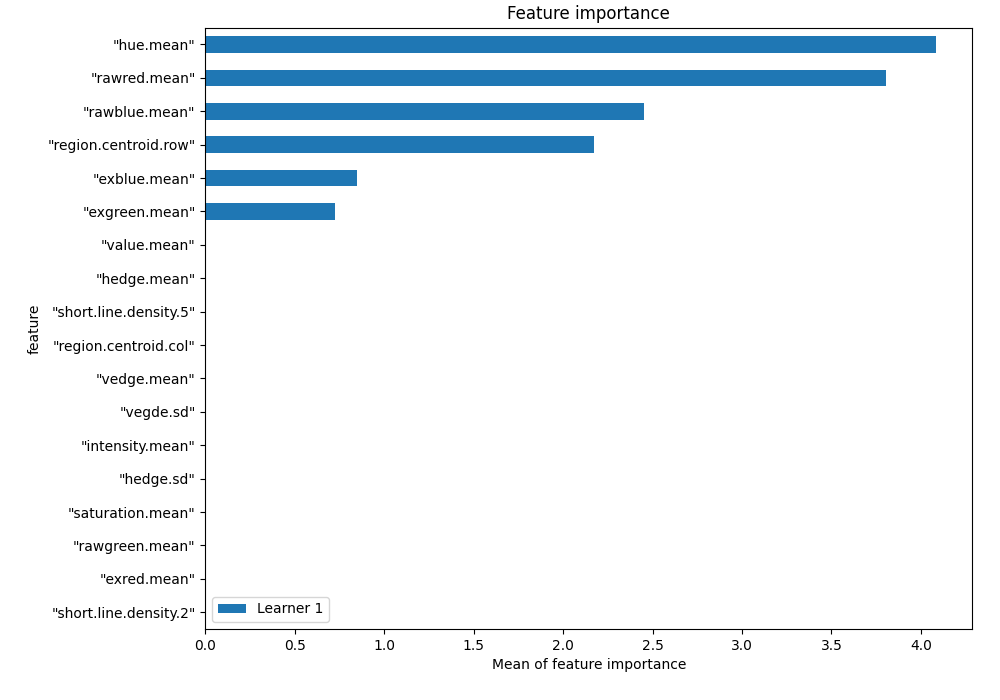
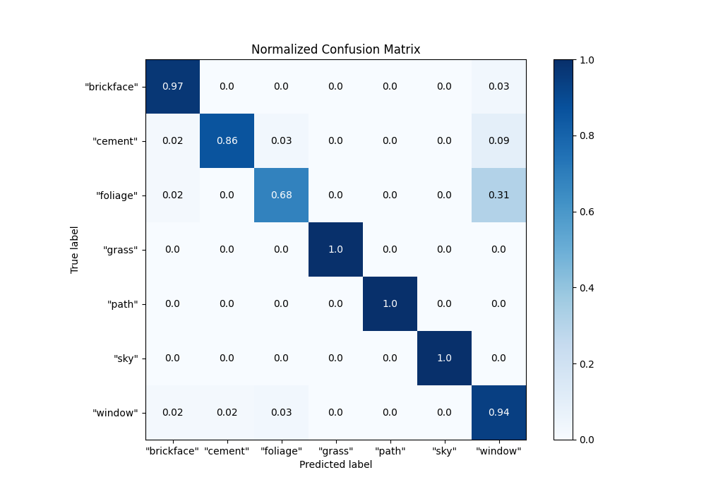
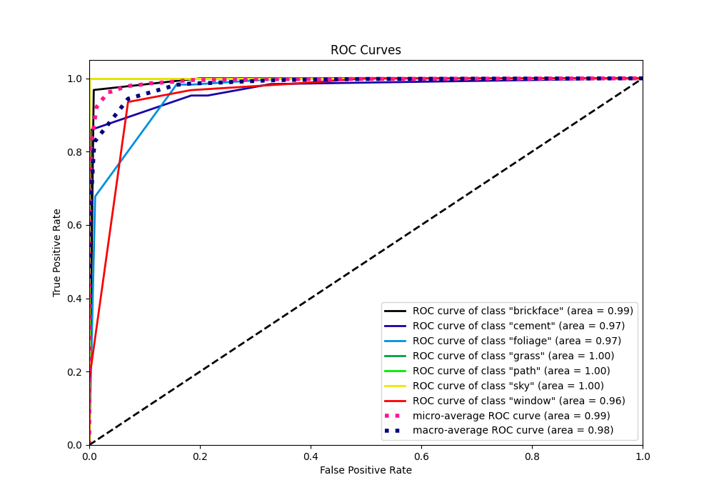
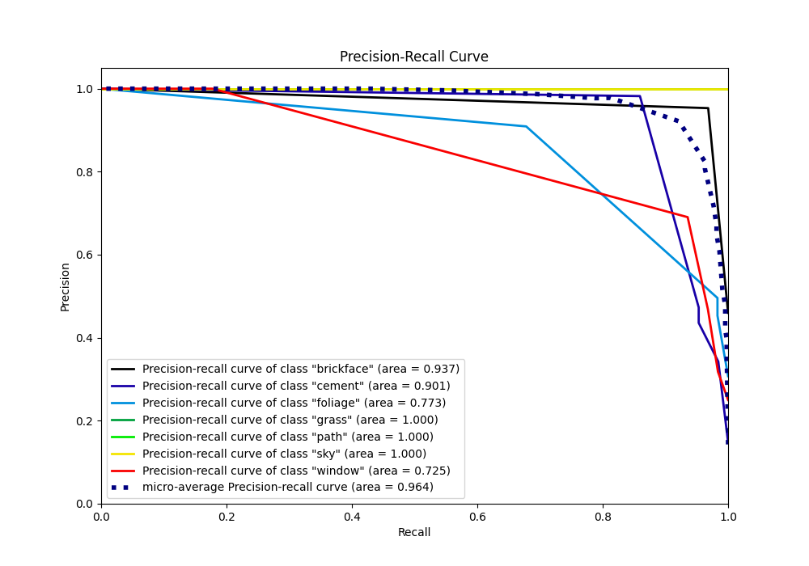

# Summary of 1_DecisionTree

[<< Go back](../README.md)

## Decision Tree
- **n_jobs**: -1
- **criterion**: entropy
- **max_depth**: 4
- **num_class**: 7
- **explain_level**: 1

## Validation
 - **validation_type**: split
 - **train_ratio**: 0.75
 - **shuffle**: True
 - **stratify**: True

## Optimized metric
f1

## Training time

4.5 seconds

### Metric details
|           |   "brickface" |   "cement" |   "foliage" |   "grass" |   "path" |   "sky" |   "window" |   accuracy |   macro avg |   weighted avg |   logloss |
|:----------|--------------:|-----------:|------------:|----------:|---------:|--------:|-----------:|-----------:|------------:|---------------:|----------:|
| precision |      0.953125 |   0.982143 |    0.909091 |         1 |        1 |       1 |   0.690476 |   0.921478 |    0.933548 |       0.933833 |   0.27536 |
| recall    |      0.968254 |   0.859375 |    0.677966 |         1 |        1 |       1 |   0.935484 |   0.921478 |    0.920154 |       0.921478 |   0.27536 |
| f1-score  |      0.96063  |   0.916667 |    0.776699 |         1 |        1 |       1 |   0.794521 |   0.921478 |    0.921217 |       0.922106 |   0.27536 |
| support   |     63        |  64        |   59        |        62 |       61 |      62 |  62        |   0.921478 |  433        |     433        |   0.27536 |

## Confusion matrix
|                        |   Predicted as "brickface" |   Predicted as "cement" |   Predicted as "foliage" |   Predicted as "grass" |   Predicted as "path" |   Predicted as "sky" |   Predicted as "window" |
|:-----------------------|---------------------------:|------------------------:|-------------------------:|-----------------------:|----------------------:|---------------------:|------------------------:|
| Labeled as "brickface" |                         61 |                       0 |                        0 |                      0 |                     0 |                    0 |                       2 |
| Labeled as "cement"    |                          1 |                      55 |                        2 |                      0 |                     0 |                    0 |                       6 |
| Labeled as "foliage"   |                          1 |                       0 |                       40 |                      0 |                     0 |                    0 |                      18 |
| Labeled as "grass"     |                          0 |                       0 |                        0 |                     62 |                     0 |                    0 |                       0 |
| Labeled as "path"      |                          0 |                       0 |                        0 |                      0 |                    61 |                    0 |                       0 |
| Labeled as "sky"       |                          0 |                       0 |                        0 |                      0 |                     0 |                   62 |                       0 |
| Labeled as "window"    |                          1 |                       1 |                        2 |                      0 |                     0 |                    0 |                      58 |

## Learning curves

## Permutation-based Importance

## Confusion Matrix

## Normalized Confusion Matrix

## ROC Curve

## Precision Recall Curve

[<< Go back](../README.md)
