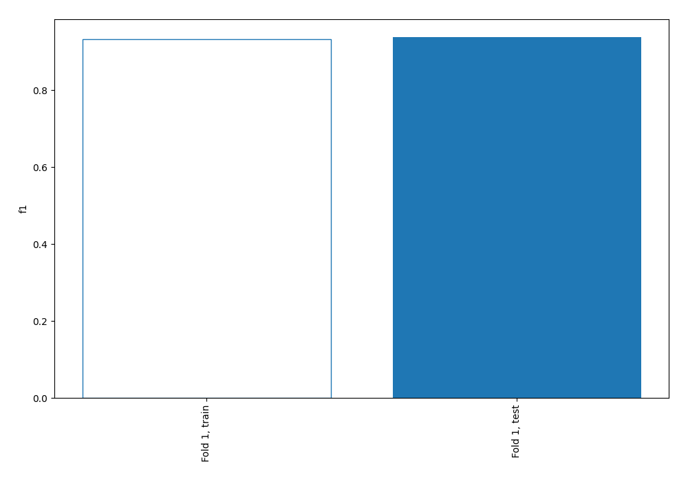
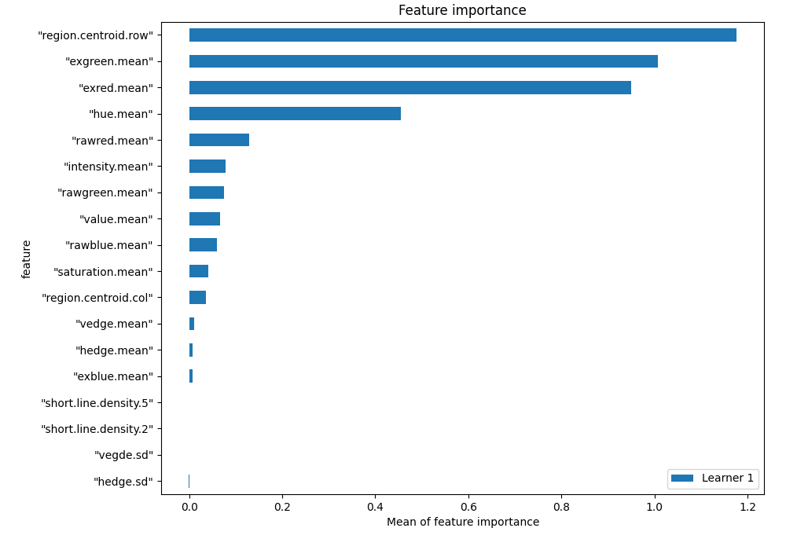
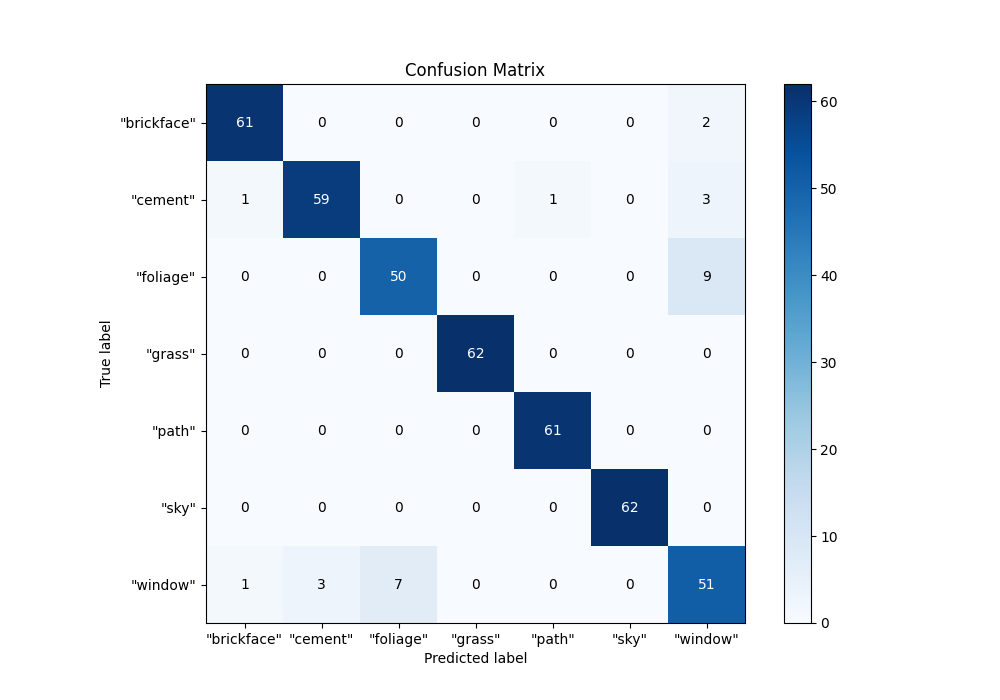
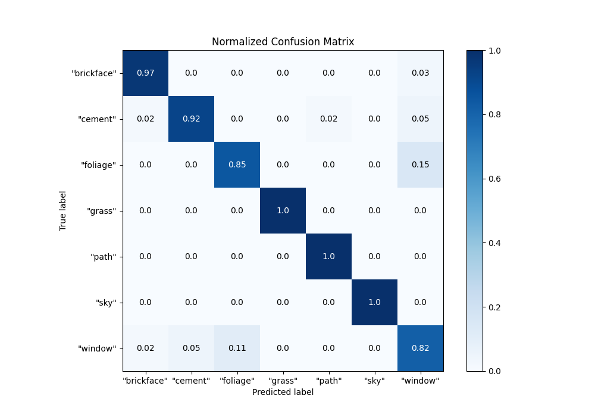
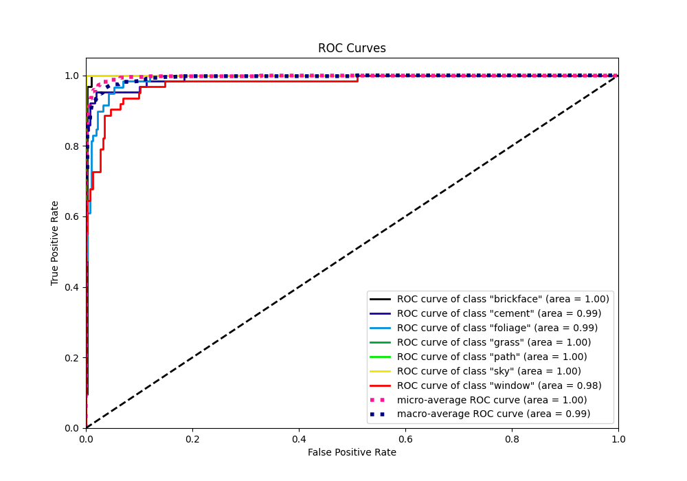
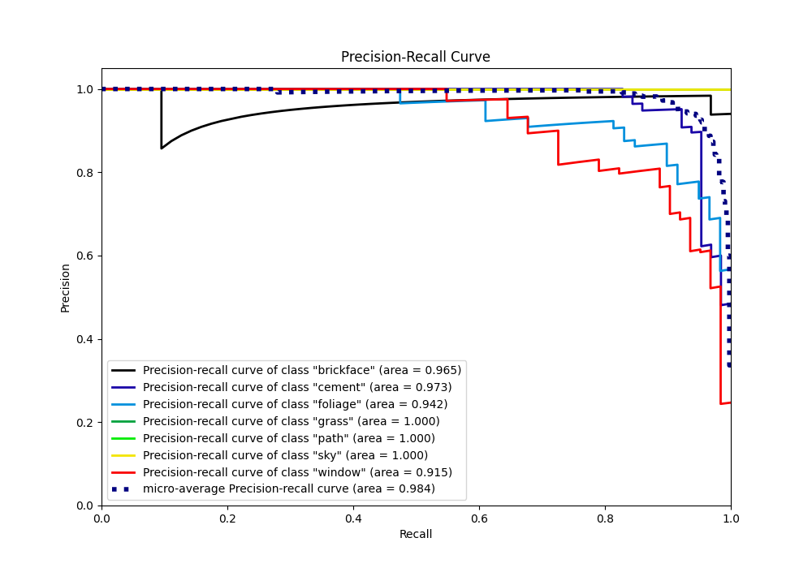

# Summary of 2_Linear

[<< Go back](../README.md)

## Logistic Regression (Linear)
- **n_jobs**: -1
- **num_class**: 7
- **explain_level**: 1

## Validation
 - **validation_type**: split
 - **train_ratio**: 0.75
 - **shuffle**: True
 - **stratify**: True

## Optimized metric
f1

## Training time

0.5 seconds

### Metric details
|           |   "brickface" |   "cement" |   "foliage" |   "grass" |    "path" |   "sky" |   "window" |   accuracy |   macro avg |   weighted avg |   logloss |
|:----------|--------------:|-----------:|------------:|----------:|----------:|--------:|-----------:|-----------:|------------:|---------------:|----------:|
| precision |      0.968254 |   0.951613 |    0.877193 |         1 |  0.983871 |       1 |   0.784615 |   0.937644 |    0.937935 |       0.938383 |  0.205865 |
| recall    |      0.968254 |   0.921875 |    0.847458 |         1 |  1        |       1 |   0.822581 |   0.937644 |    0.937167 |       0.937644 |  0.205865 |
| f1-score  |      0.968254 |   0.936508 |    0.862069 |         1 |  0.99187  |       1 |   0.80315  |   0.937644 |    0.937407 |       0.93787  |  0.205865 |
| support   |     63        |  64        |   59        |        62 | 61        |      62 |  62        |   0.937644 |  433        |     433        |  0.205865 |

## Confusion matrix
|                        |   Predicted as "brickface" |   Predicted as "cement" |   Predicted as "foliage" |   Predicted as "grass" |   Predicted as "path" |   Predicted as "sky" |   Predicted as "window" |
|:-----------------------|---------------------------:|------------------------:|-------------------------:|-----------------------:|----------------------:|---------------------:|------------------------:|
| Labeled as "brickface" |                         61 |                       0 |                        0 |                      0 |                     0 |                    0 |                       2 |
| Labeled as "cement"    |                          1 |                      59 |                        0 |                      0 |                     1 |                    0 |                       3 |
| Labeled as "foliage"   |                          0 |                       0 |                       50 |                      0 |                     0 |                    0 |                       9 |
| Labeled as "grass"     |                          0 |                       0 |                        0 |                     62 |                     0 |                    0 |                       0 |
| Labeled as "path"      |                          0 |                       0 |                        0 |                      0 |                    61 |                    0 |                       0 |
| Labeled as "sky"       |                          0 |                       0 |                        0 |                      0 |                     0 |                   62 |                       0 |
| Labeled as "window"    |                          1 |                       3 |                        7 |                      0 |                     0 |                    0 |                      51 |

## Learning curves

## Coefficients

### Coefficients learner #1
|                        |   "brickface" |   "cement" |   "foliage" |     "grass" |     "path" |       "sky" |   "window" |
|:-----------------------|--------------:|-----------:|------------:|------------:|-----------:|------------:|-----------:|
| intercept              |    -1.42658   |  4.28442   |   -1.20207  | -0.25097    |  0.107112  | -3.7877     |  2.27579   |
| "region.centroid.col"  |    -0.478965  |  0.190001  |   -0.589768 | -0.478362   |  0.532322  |  0.536164   |  0.288608  |
| "region.centroid.row"  |    -1.48099   | -0.58219   |   -2.37825  |  1.77671    |  4.8374    | -0.224317   | -1.94836   |
| "short.line.density.5" |     0.0895629 |  0.374807  |   -0.071101 |  0.0865828  | -0.175032  | -0.0256527  | -0.279167  |
| "short.line.density.2" |    -0.0152585 | -0.0944624 |    0.162503 | -0.00228693 | -0.0727132 | -0.00111896 |  0.0233367 |
| "vedge.mean"           |    -0.359088  |  0.330254  |    0.500714 |  0.336207   | -0.389373  | -0.261326   | -0.157388  |
| "vegde.sd"             |    -0.184784  |  0.155747  |    0.302806 | -0.0581176  | -0.300784  | -0.0447326  |  0.129865  |
| "hedge.mean"           |    -0.0955699 | -0.208103  |    0.210263 |  0.0404197  |  0.547206  | -0.0832154  | -0.411001  |
| "hedge.sd"             |    -0.249079  | -0.777904  |    0.295447 | -0.136423   |  0.256803  | -0.0382881  |  0.649444  |
| "intensity.mean"       |    -0.6612    |  0.453348  |   -1.40874  |  0.217361   |  0.826825  |  1.52232    | -0.949911  |
| "rawred.mean"          |    -0.267152  |  0.569601  |   -1.88488  |  0.195436   |  0.954933  |  1.55599    | -1.12393   |
| "rawblue.mean"         |    -0.535873  |  0.404134  |   -1.28812  |  0.0723534  |  0.767069  |  1.41166    | -0.831228  |
| "rawgreen.mean"        |    -1.18382   |  0.395106  |   -1.07828  |  0.409522   |  0.765618  |  1.6054     | -0.913546  |
| "exred.mean"           |     4.15056   |  0.69825   |   -3.22346  | -0.377496   |  0.503932  | -0.92665    | -0.825142  |
| "exblue.mean"          |     0.297705  |  0.0412144 |   -0.344179 | -0.791669   |  0.275834  |  0.503556   |  0.0175395 |
| "exgreen.mean"         |    -4.63571   | -0.76484   |    3.79157  |  1.71663    | -0.968793  |  0.0695025  |  0.791644  |
| "value.mean"           |    -0.506426  |  0.368725  |   -1.39925  |  0.218232   |  0.764172  |  1.43192    | -0.877368  |
| "saturation.mean"      |     0.914446  | -0.875498  |    1.25308  |  0.170435   | -0.234716  | -0.0910396  | -1.1367    |
| "hue.mean"             |     1.17248   | -0.556709  |   -1.18939  |  1.9947     | -0.599845  | -0.0854945  | -0.735737  |

## Permutation-based Importance

## Confusion Matrix

## Normalized Confusion Matrix

## ROC Curve

## Precision Recall Curve

[<< Go back](../README.md)
