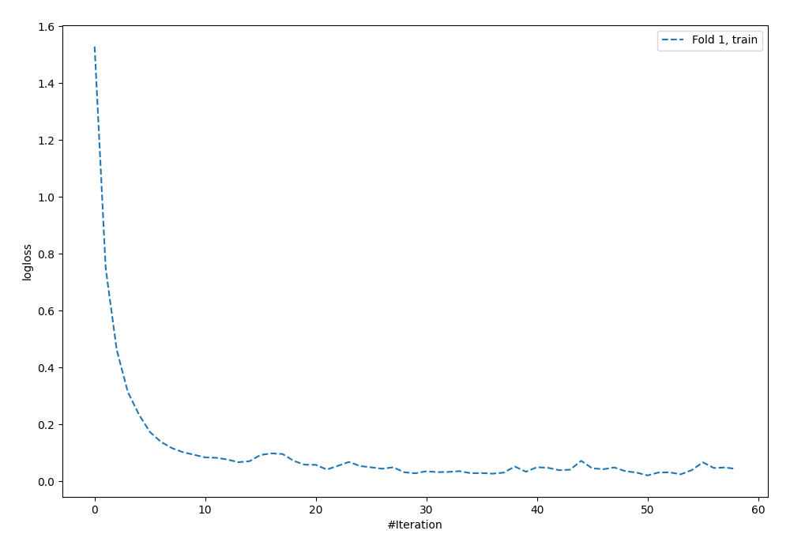
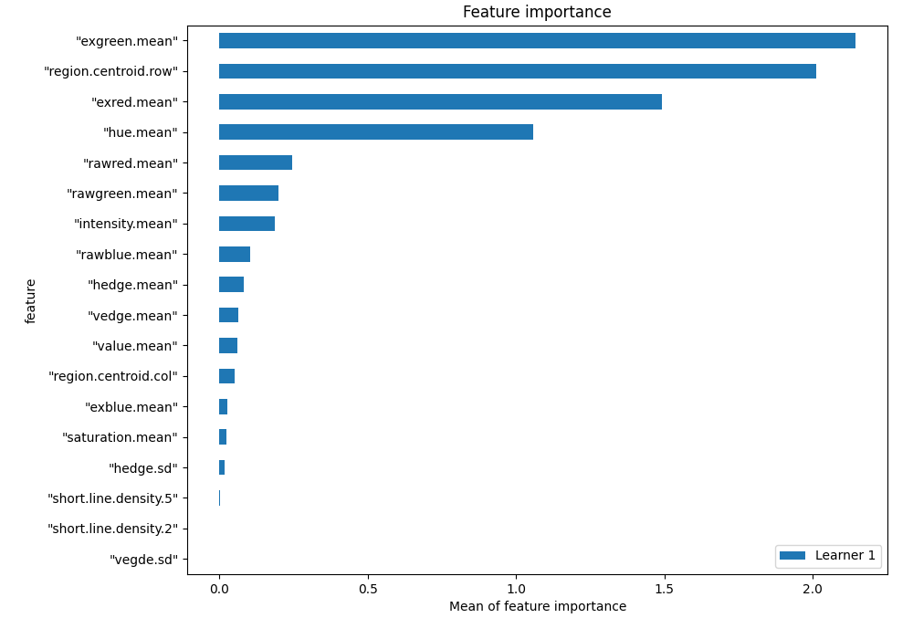
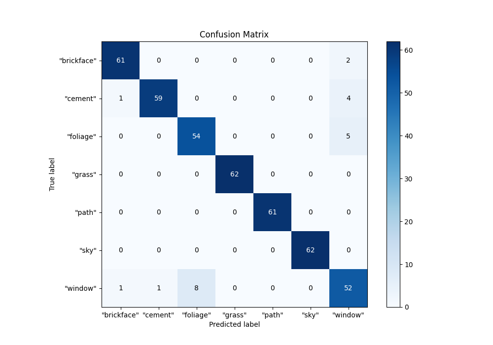
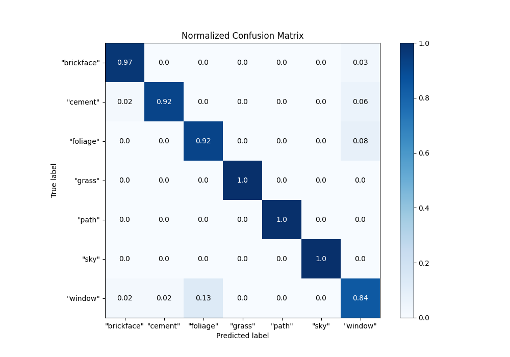
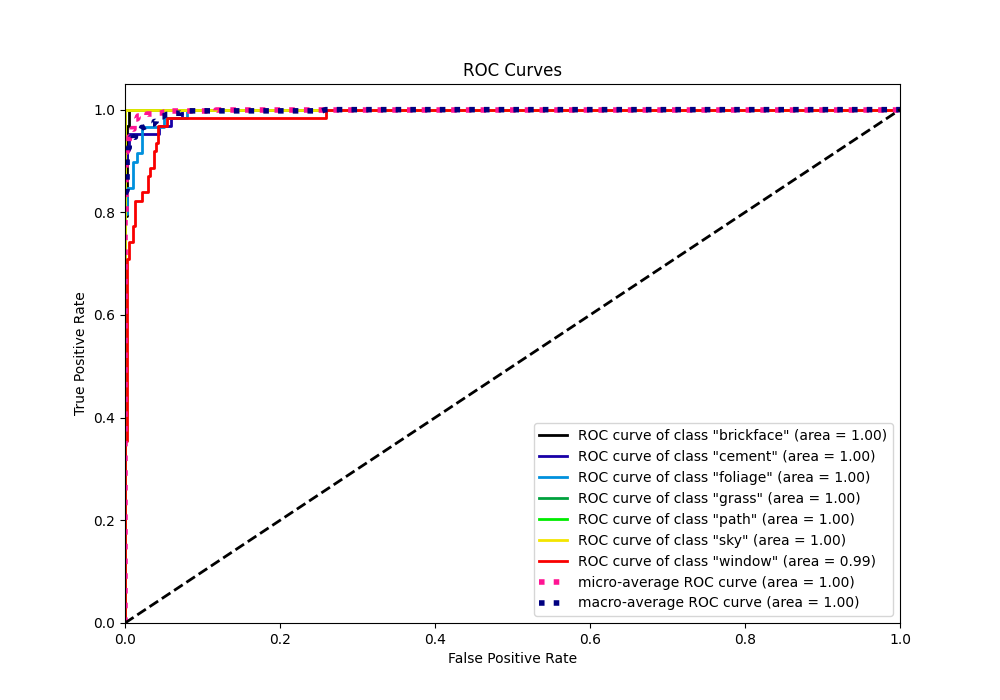
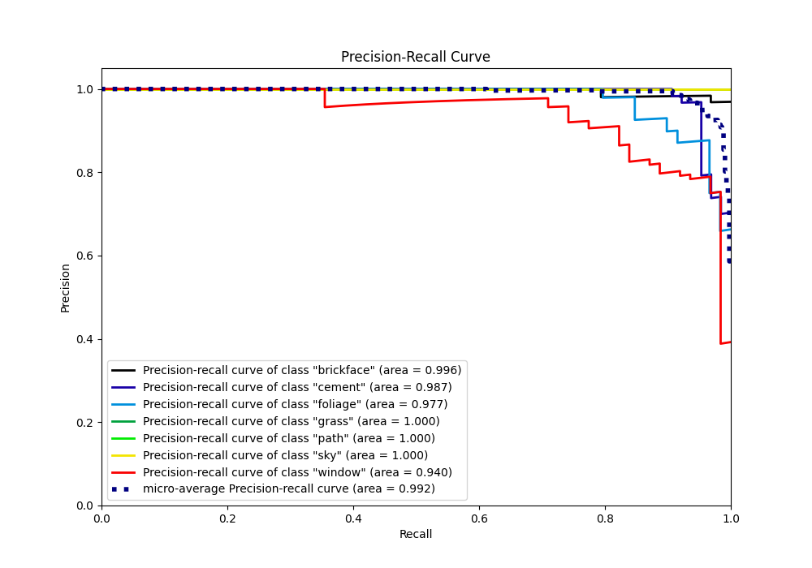

# Summary of 3_Default_NeuralNetwork

[<< Go back](../README.md)

## Neural Network
- **n_jobs**: -1
- **dense_1_size**: 32
- **dense_2_size**: 16
- **learning_rate**: 0.05
- **num_class**: 7
- **explain_level**: 1

## Validation
 - **validation_type**: split
 - **train_ratio**: 0.75
 - **shuffle**: True
 - **stratify**: True

## Optimized metric
f1

## Training time

1.6 seconds

### Metric details
|           |   "brickface" |   "cement" |   "foliage" |   "grass" |   "path" |   "sky" |   "window" |   accuracy |   macro avg |   weighted avg |   logloss |
|:----------|--------------:|-----------:|------------:|----------:|---------:|--------:|-----------:|-----------:|------------:|---------------:|----------:|
| precision |      0.968254 |   0.983333 |    0.870968 |         1 |        1 |       1 |   0.825397 |   0.949192 |    0.949707 |       0.950335 |  0.124334 |
| recall    |      0.968254 |   0.921875 |    0.915254 |         1 |        1 |       1 |   0.83871  |   0.949192 |    0.949156 |       0.949192 |  0.124334 |
| f1-score  |      0.968254 |   0.951613 |    0.892562 |         1 |        1 |       1 |   0.832    |   0.949192 |    0.949204 |       0.949534 |  0.124334 |
| support   |     63        |  64        |   59        |        62 |       61 |      62 |  62        |   0.949192 |  433        |     433        |  0.124334 |

## Confusion matrix
|                        |   Predicted as "brickface" |   Predicted as "cement" |   Predicted as "foliage" |   Predicted as "grass" |   Predicted as "path" |   Predicted as "sky" |   Predicted as "window" |
|:-----------------------|---------------------------:|------------------------:|-------------------------:|-----------------------:|----------------------:|---------------------:|------------------------:|
| Labeled as "brickface" |                         61 |                       0 |                        0 |                      0 |                     0 |                    0 |                       2 |
| Labeled as "cement"    |                          1 |                      59 |                        0 |                      0 |                     0 |                    0 |                       4 |
| Labeled as "foliage"   |                          0 |                       0 |                       54 |                      0 |                     0 |                    0 |                       5 |
| Labeled as "grass"     |                          0 |                       0 |                        0 |                     62 |                     0 |                    0 |                       0 |
| Labeled as "path"      |                          0 |                       0 |                        0 |                      0 |                    61 |                    0 |                       0 |
| Labeled as "sky"       |                          0 |                       0 |                        0 |                      0 |                     0 |                   62 |                       0 |
| Labeled as "window"    |                          1 |                       1 |                        8 |                      0 |                     0 |                    0 |                      52 |

## Learning curves

## Permutation-based Importance

## Confusion Matrix

## Normalized Confusion Matrix

## ROC Curve

## Precision Recall Curve

[<< Go back](../README.md)
