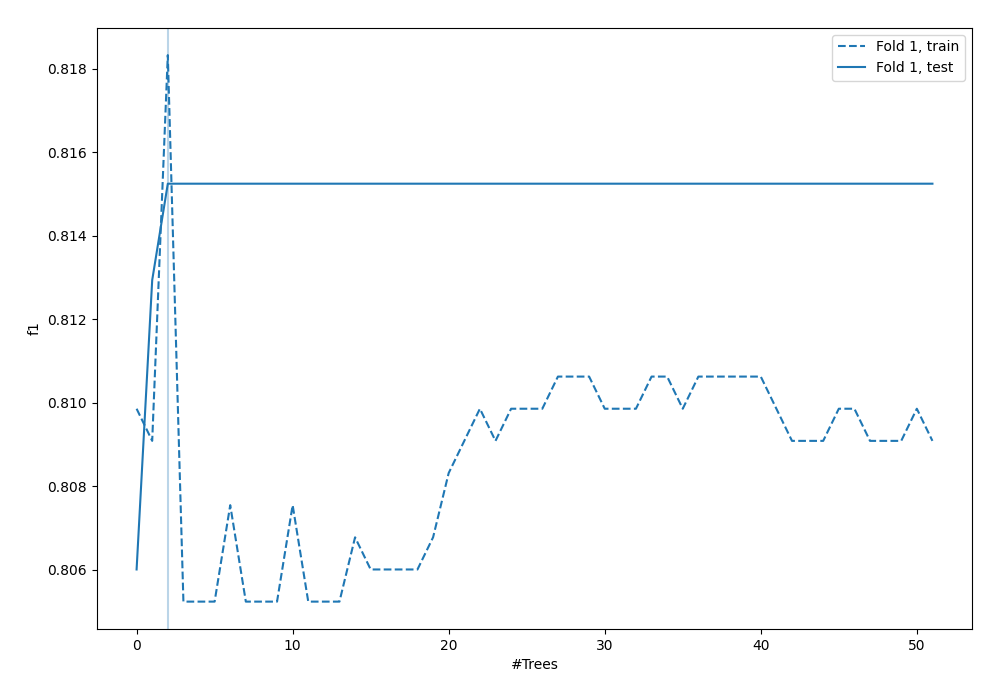
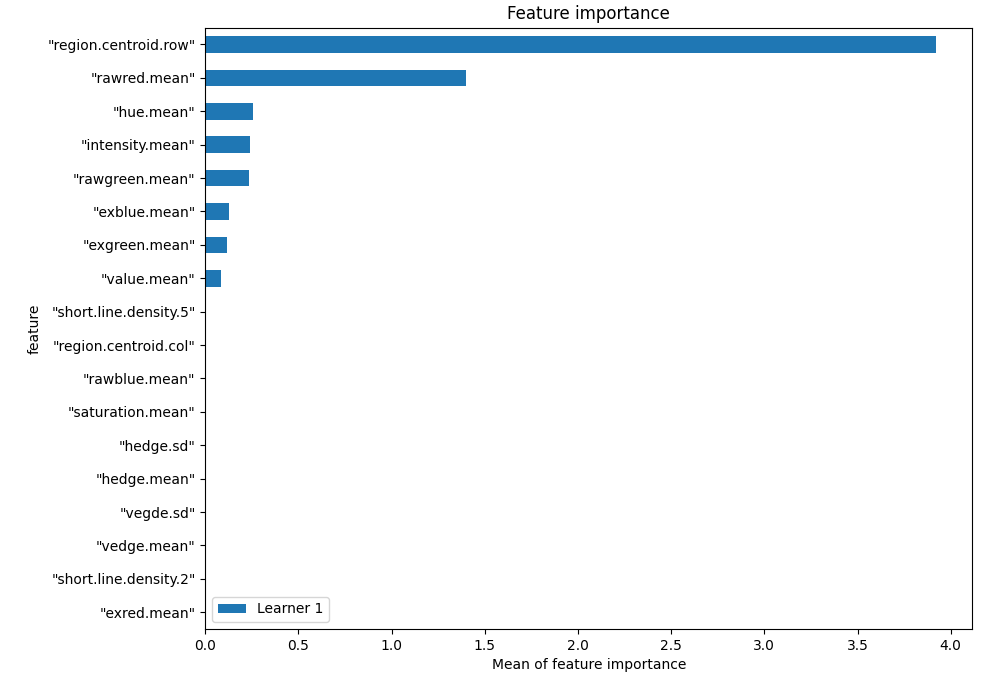
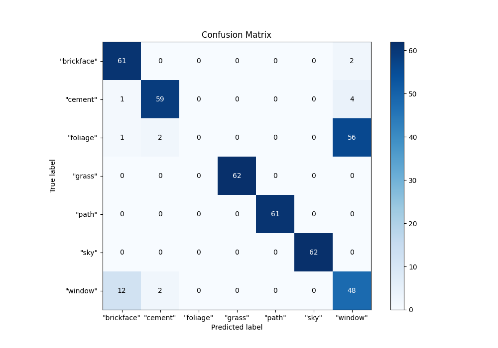
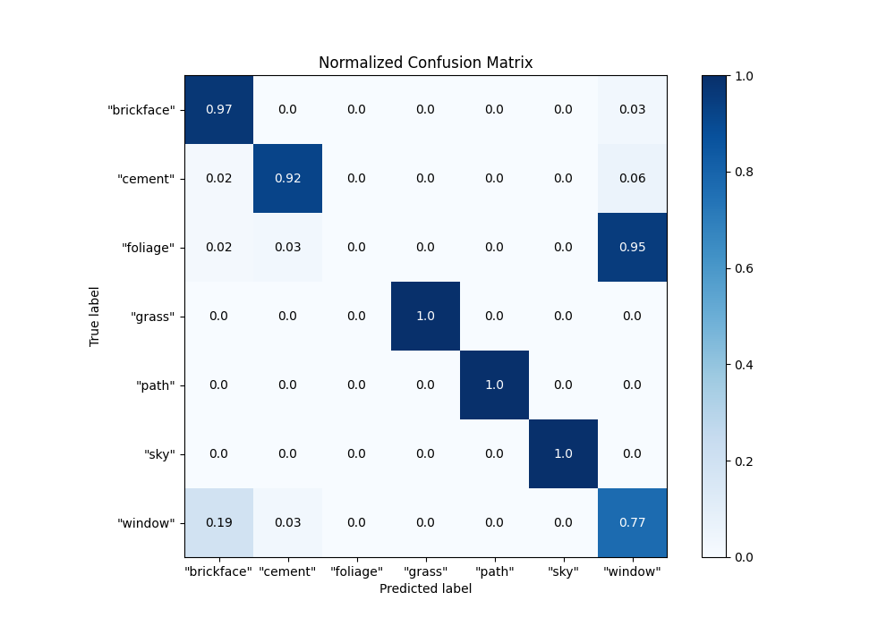
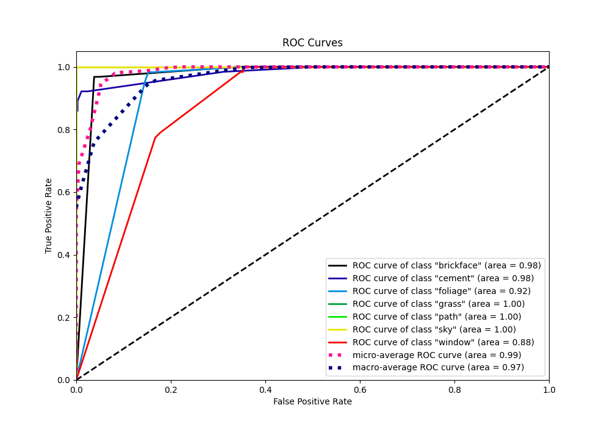
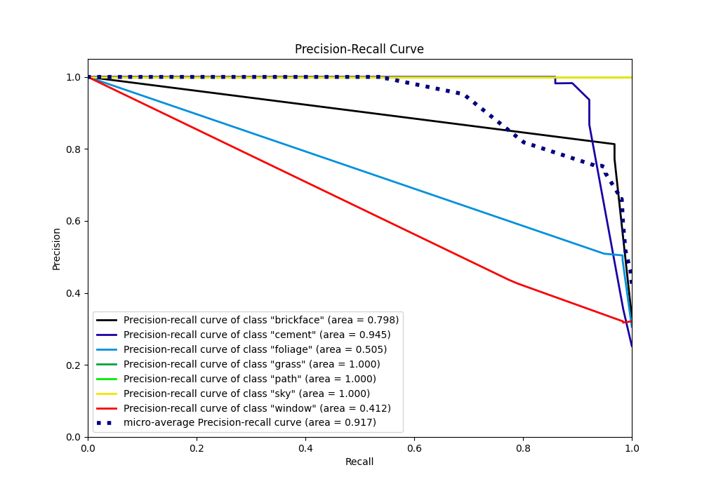

# Summary of 4_Default_RandomForest

[<< Go back](../README.md)

## Random Forest
- **n_jobs**: -1
- **criterion**: gini
- **max_features**: 0.9
- **min_samples_split**: 30
- **max_depth**: 4
- **eval_metric_name**: f1
- **num_class**: 7
- **explain_level**: 1

## Validation
 - **validation_type**: split
 - **train_ratio**: 0.75
 - **shuffle**: True
 - **stratify**: True

## Optimized metric
f1

## Training time

1.1 seconds

### Metric details
|           |   "brickface" |   "cement" |   "foliage" |   "grass" |   "path" |   "sky" |   "window" |   accuracy |   macro avg |   weighted avg |   logloss |
|:----------|--------------:|-----------:|------------:|----------:|---------:|--------:|-----------:|-----------:|------------:|---------------:|----------:|
| precision |      0.813333 |   0.936508 |           0 |         1 |        1 |       1 |   0.436364 |   0.815242 |    0.740886 |       0.746492 |  0.402276 |
| recall    |      0.968254 |   0.921875 |           0 |         1 |        1 |       1 |   0.774194 |   0.815242 |    0.809189 |       0.815242 |  0.402276 |
| f1-score  |      0.884058 |   0.929134 |           0 |         1 |        1 |       1 |   0.55814  |   0.815242 |    0.767333 |       0.773129 |  0.402276 |
| support   |     63        |  64        |          59 |        62 |       61 |      62 |  62        |   0.815242 |  433        |     433        |  0.402276 |

## Confusion matrix
|                        |   Predicted as "brickface" |   Predicted as "cement" |   Predicted as "foliage" |   Predicted as "grass" |   Predicted as "path" |   Predicted as "sky" |   Predicted as "window" |
|:-----------------------|---------------------------:|------------------------:|-------------------------:|-----------------------:|----------------------:|---------------------:|------------------------:|
| Labeled as "brickface" |                         61 |                       0 |                        0 |                      0 |                     0 |                    0 |                       2 |
| Labeled as "cement"    |                          1 |                      59 |                        0 |                      0 |                     0 |                    0 |                       4 |
| Labeled as "foliage"   |                          1 |                       2 |                        0 |                      0 |                     0 |                    0 |                      56 |
| Labeled as "grass"     |                          0 |                       0 |                        0 |                     62 |                     0 |                    0 |                       0 |
| Labeled as "path"      |                          0 |                       0 |                        0 |                      0 |                    61 |                    0 |                       0 |
| Labeled as "sky"       |                          0 |                       0 |                        0 |                      0 |                     0 |                   62 |                       0 |
| Labeled as "window"    |                         12 |                       2 |                        0 |                      0 |                     0 |                    0 |                      48 |

## Learning curves

## Permutation-based Importance

## Confusion Matrix

## Normalized Confusion Matrix

## ROC Curve

## Precision Recall Curve

[<< Go back](../README.md)
