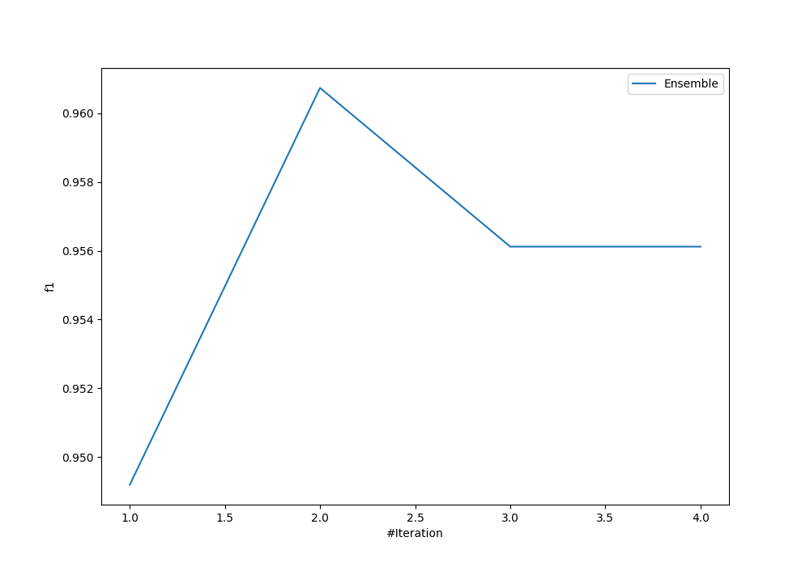
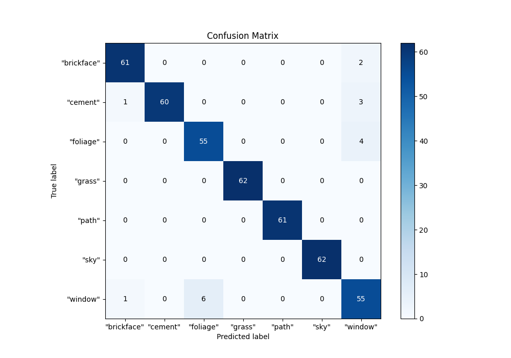
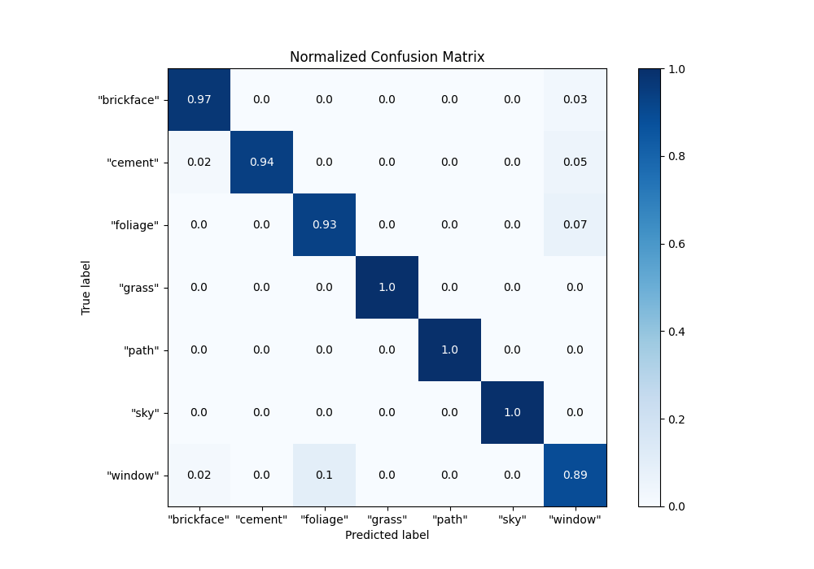
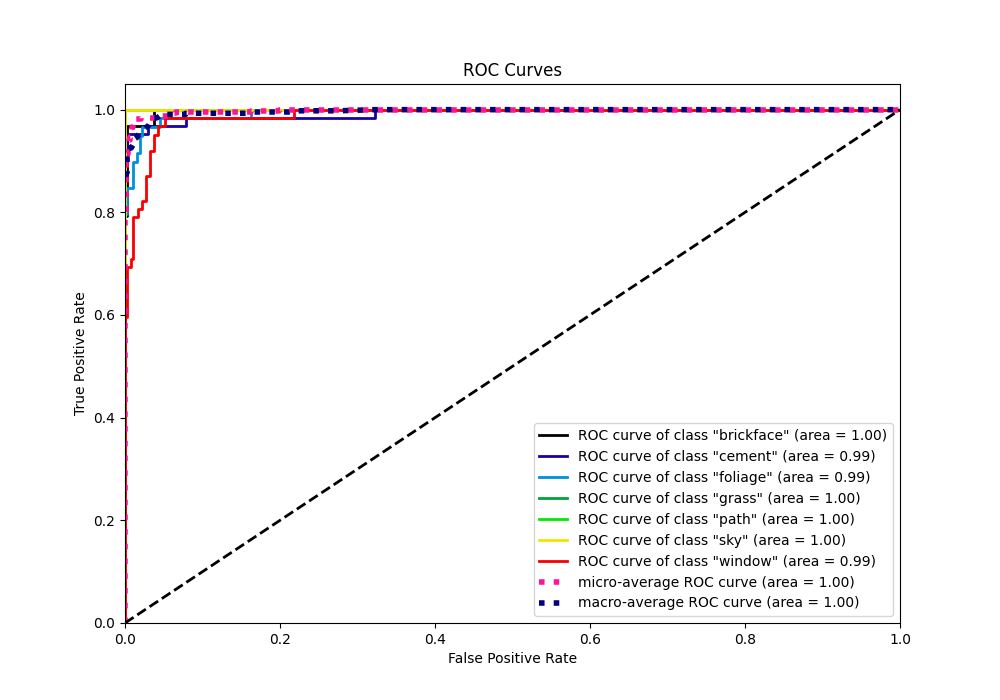
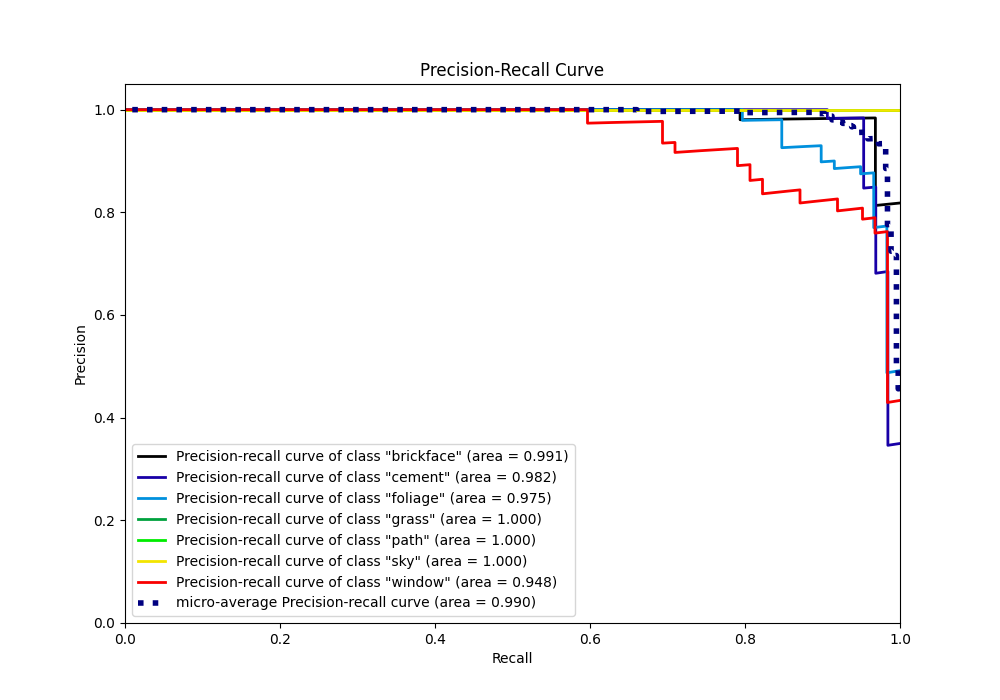

# Summary of Ensemble

[<< Go back](../README.md)

## Ensemble structure
| Model                   |   Weight |
|:------------------------|---------:|
| 3_Default_NeuralNetwork |        1 |
| 4_Default_RandomForest  |        1 |

### Metric details
|           |   "brickface" |   "cement" |   "foliage" |   "grass" |   "path" |   "sky" |   "window" |   accuracy |   macro avg |   weighted avg |   logloss |
|:----------|--------------:|-----------:|------------:|----------:|---------:|--------:|-----------:|-----------:|------------:|---------------:|----------:|
| precision |      0.968254 |   1        |    0.901639 |         1 |        1 |       1 |   0.859375 |   0.960739 |    0.961324 |       0.961843 |   0.22451 |
| recall    |      0.968254 |   0.9375   |    0.932203 |         1 |        1 |       1 |   0.887097 |   0.960739 |    0.960722 |       0.960739 |   0.22451 |
| f1-score  |      0.968254 |   0.967742 |    0.916667 |         1 |        1 |       1 |   0.873016 |   0.960739 |    0.960811 |       0.961076 |   0.22451 |
| support   |     63        |  64        |   59        |        62 |       61 |      62 |  62        |   0.960739 |  433        |     433        |   0.22451 |

## Confusion matrix
|                        |   Predicted as "brickface" |   Predicted as "cement" |   Predicted as "foliage" |   Predicted as "grass" |   Predicted as "path" |   Predicted as "sky" |   Predicted as "window" |
|:-----------------------|---------------------------:|------------------------:|-------------------------:|-----------------------:|----------------------:|---------------------:|------------------------:|
| Labeled as "brickface" |                         61 |                       0 |                        0 |                      0 |                     0 |                    0 |                       2 |
| Labeled as "cement"    |                          1 |                      60 |                        0 |                      0 |                     0 |                    0 |                       3 |
| Labeled as "foliage"   |                          0 |                       0 |                       55 |                      0 |                     0 |                    0 |                       4 |
| Labeled as "grass"     |                          0 |                       0 |                        0 |                     62 |                     0 |                    0 |                       0 |
| Labeled as "path"      |                          0 |                       0 |                        0 |                      0 |                    61 |                    0 |                       0 |
| Labeled as "sky"       |                          0 |                       0 |                        0 |                      0 |                     0 |                   62 |                       0 |
| Labeled as "window"    |                          1 |                       0 |                        6 |                      0 |                     0 |                    0 |                      55 |

## Learning curves

## Confusion Matrix

## Normalized Confusion Matrix

## ROC Curve

## Precision Recall Curve

[<< Go back](../README.md)
