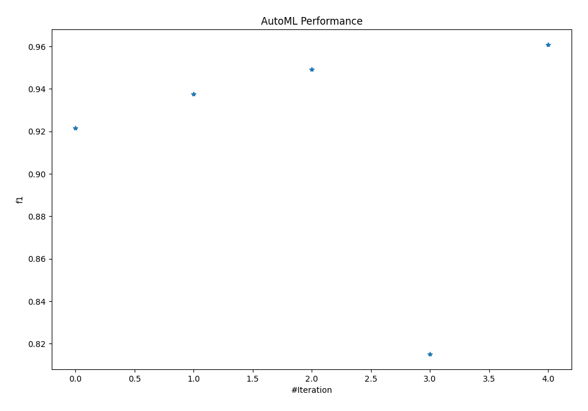
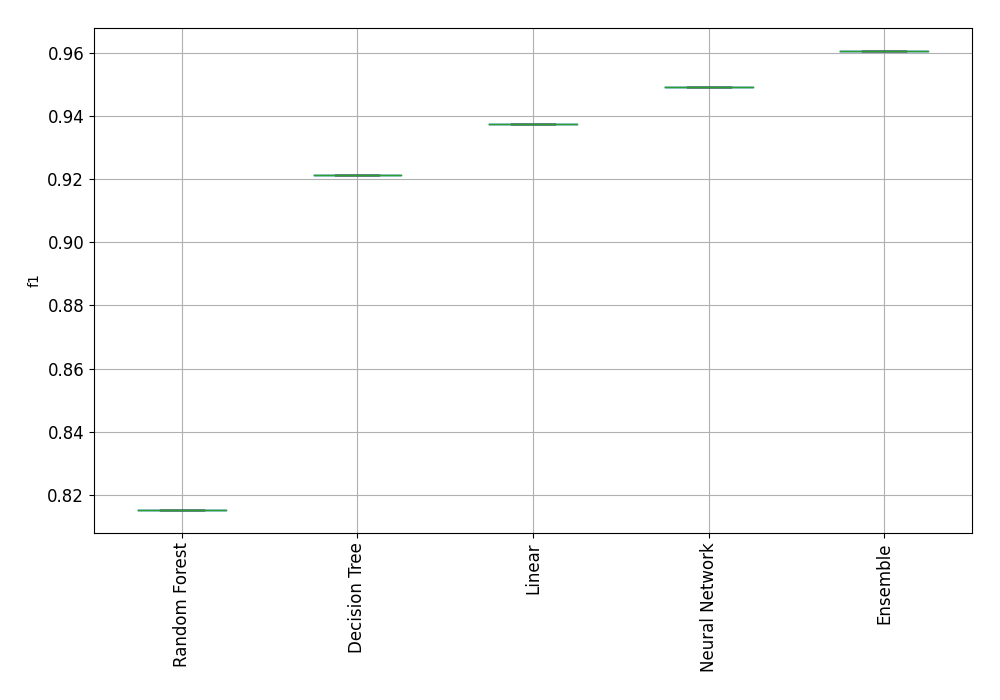
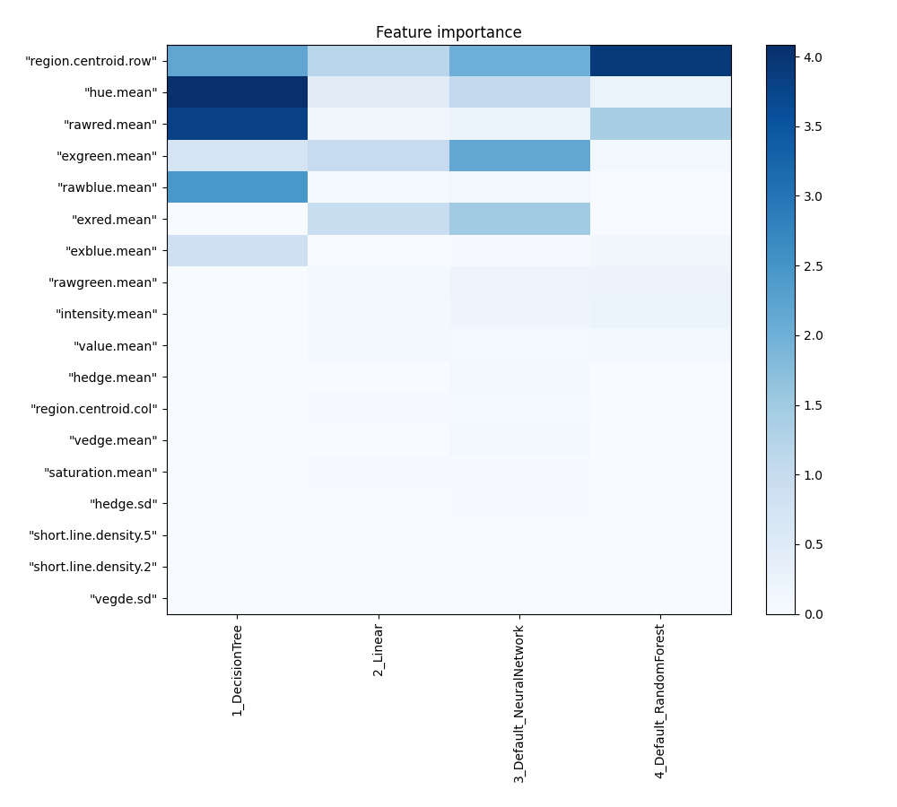
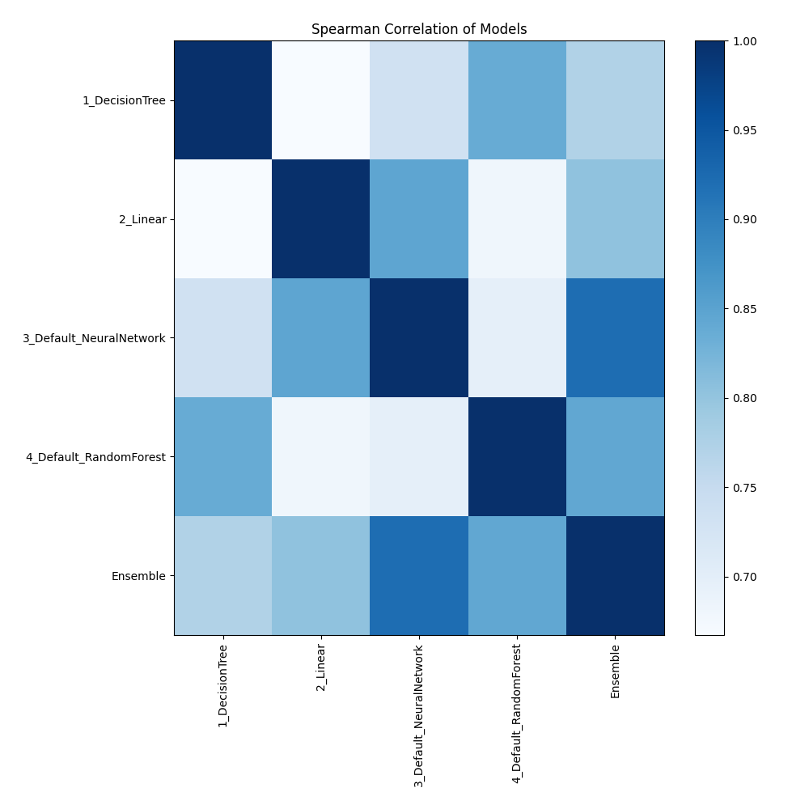

# AutoML Leaderboard

| Best model   | name                                                         | model_type     | metric_type   |   metric_value |   train_time |
|:-------------|:-------------------------------------------------------------|:---------------|:--------------|---------------:|-------------:|
|              | [1_DecisionTree](1_DecisionTree/README.md)                   | Decision Tree  | f1            |       0.921478 |         5.84 |
|              | [2_Linear](2_Linear/README.md)                               | Linear         | f1            |       0.937644 |         2.07 |
|              | [3_Default_NeuralNetwork](3_Default_NeuralNetwork/README.md) | Neural Network | f1            |       0.949192 |         3.07 |
|              | [4_Default_RandomForest](4_Default_RandomForest/README.md)   | Random Forest  | f1            |       0.815242 |         2.5  |
| **the best** | [Ensemble](Ensemble/README.md)                               | Ensemble       | f1            |       0.960739 |         0.22 |

### AutoML Performance

### AutoML Performance Boxplot

### Features Importance

### Spearman Correlation of Models

