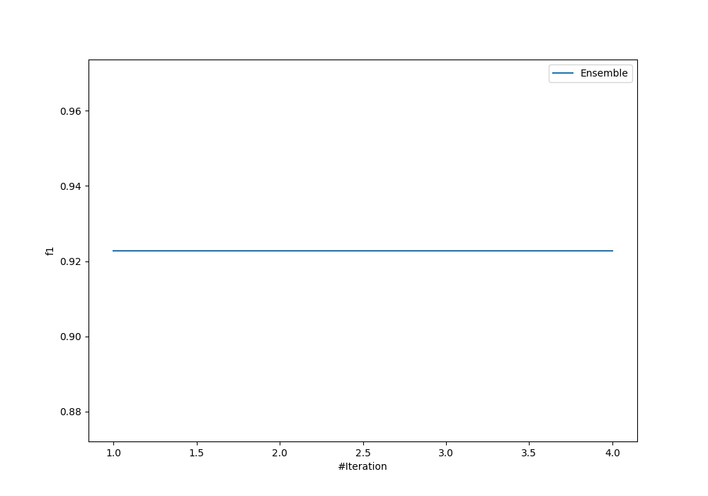
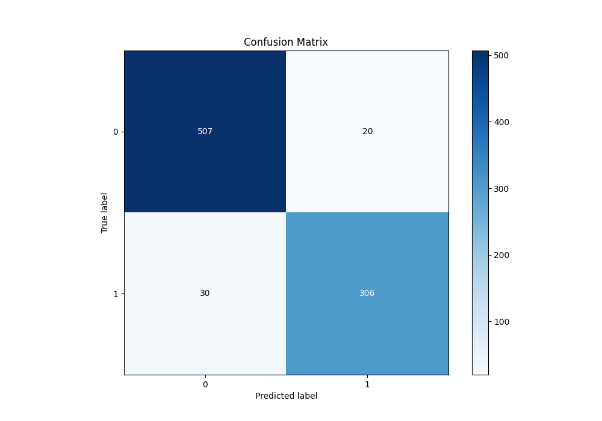
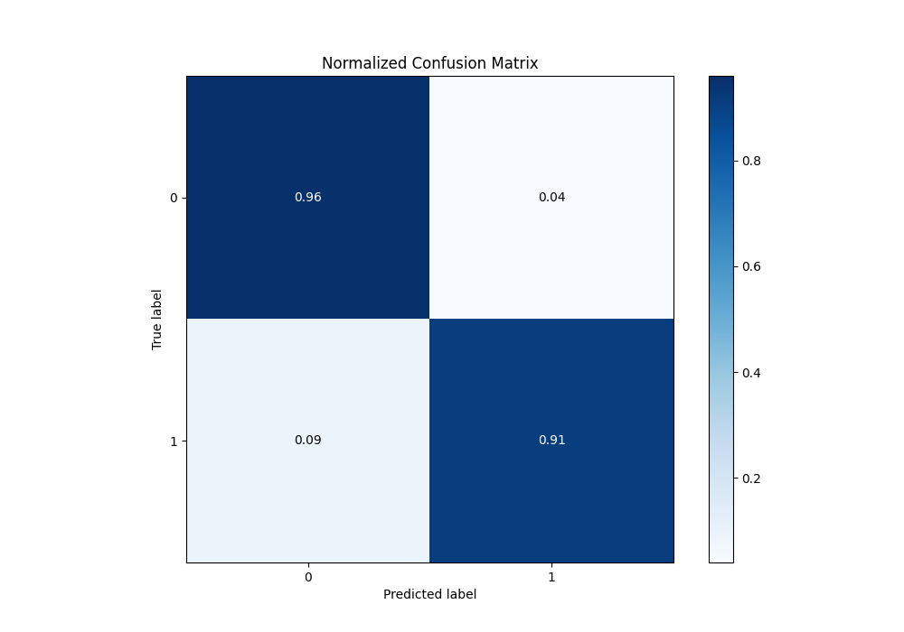
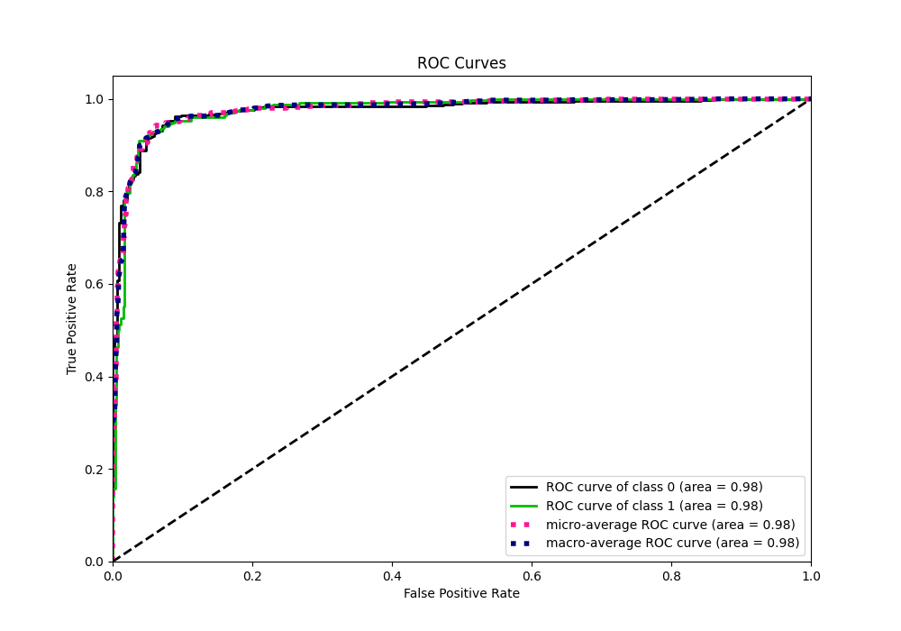
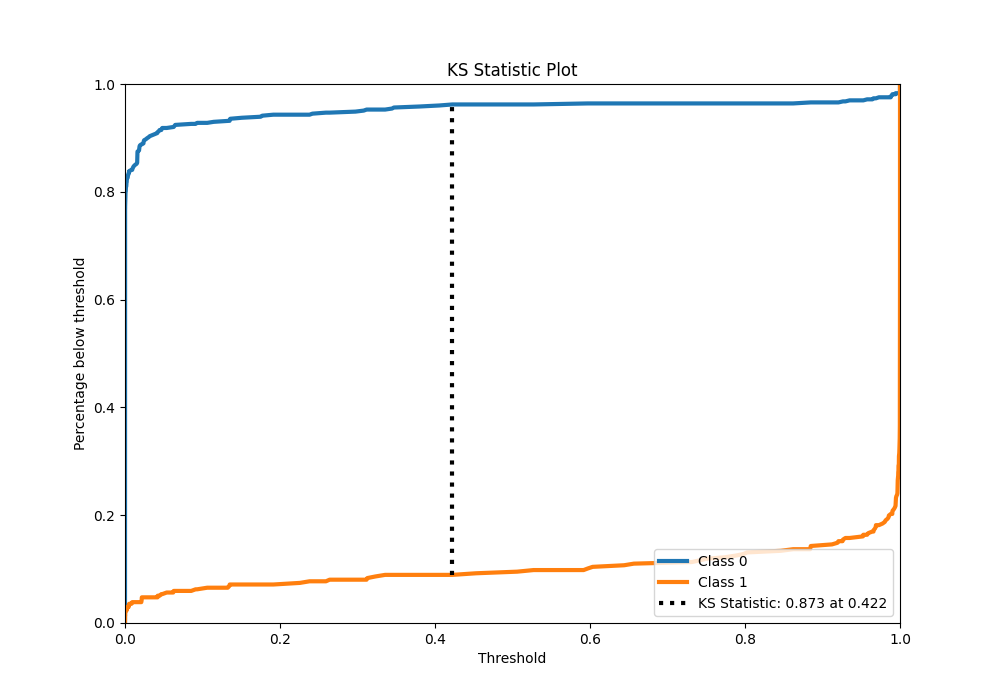
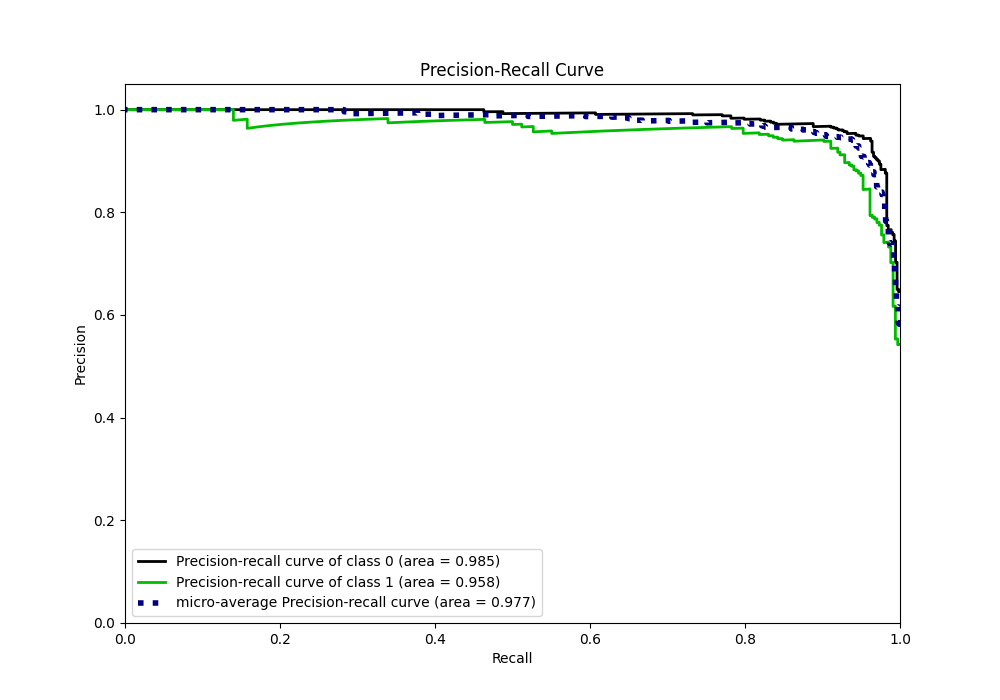
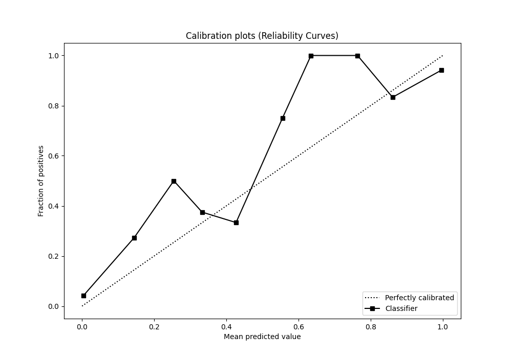
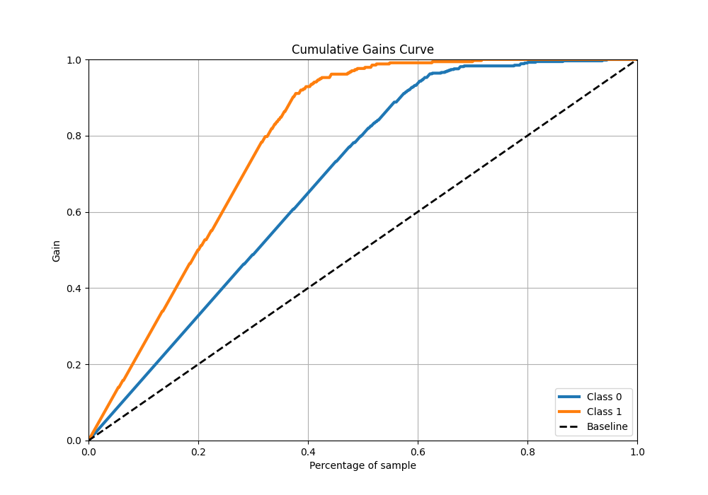
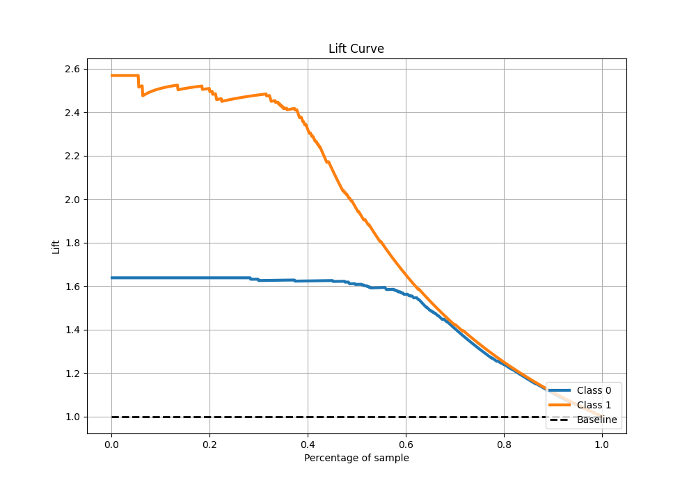

# Summary of Ensemble

[<< Go back](../README.md)

## Ensemble structure
| Model                   |   Weight |
|:------------------------|---------:|
| 3_Default_NeuralNetwork |        1 |

## Metric details
|           |    score |      threshold |
|:----------|---------:|---------------:|
| logloss   | 0.363135 | nan            |
| auc       | 0.975846 | nan            |
| f1        | 0.924471 |   0.44748      |
| accuracy  | 0.942063 |   0.44748      |
| precision | 0.980392 |   0.999999     |
| recall    | 1        |   2.33044e-212 |
| mcc       | 0.87776  |   0.44748      |

## Confusion matrix (at threshold=0.44748)
|              |   Predicted as 0 |   Predicted as 1 |
|:-------------|-----------------:|-----------------:|
| Labeled as 0 |              507 |               20 |
| Labeled as 1 |               30 |              306 |

## Learning curves

## Confusion Matrix

## Normalized Confusion Matrix

## ROC Curve

## Kolmogorov-Smirnov Statistic

## Precision-Recall Curve

## Calibration Curve

## Cumulative Gains Curve

## Lift Curve

[<< Go back](../README.md)
