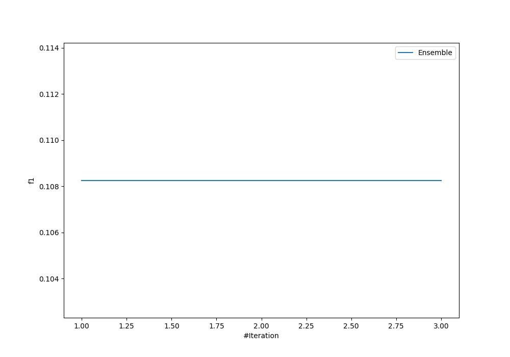
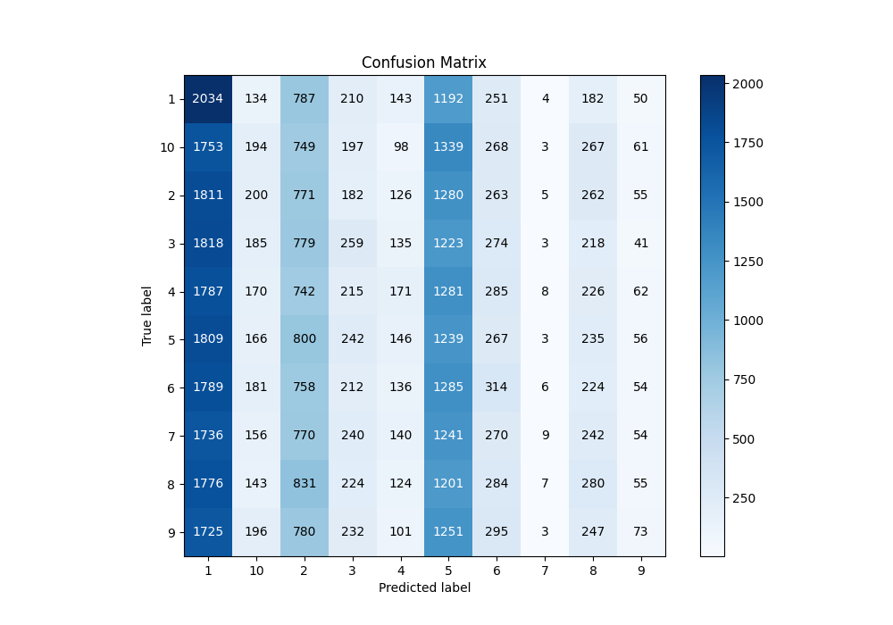
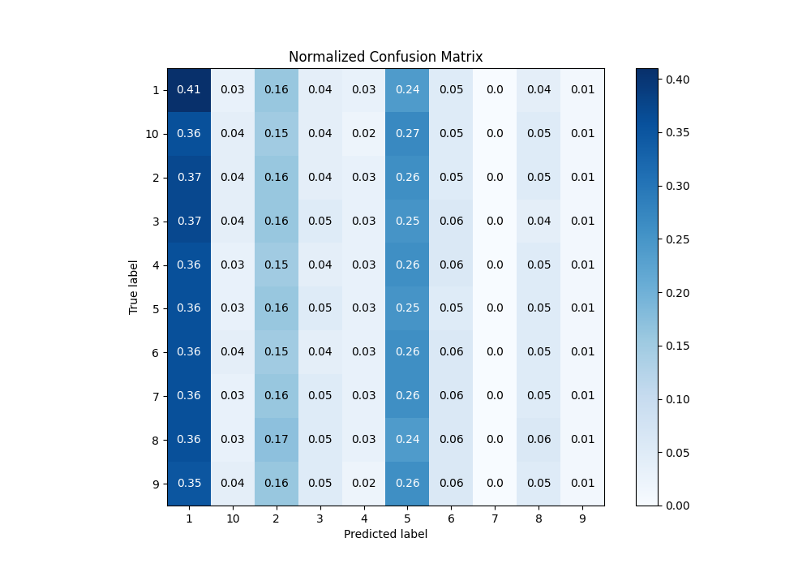
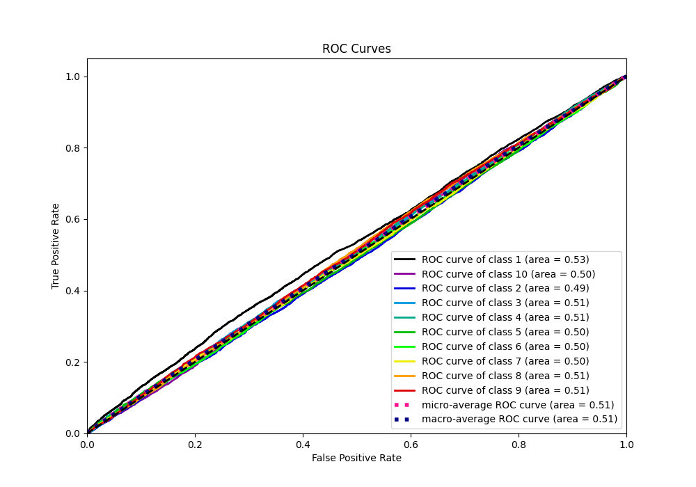
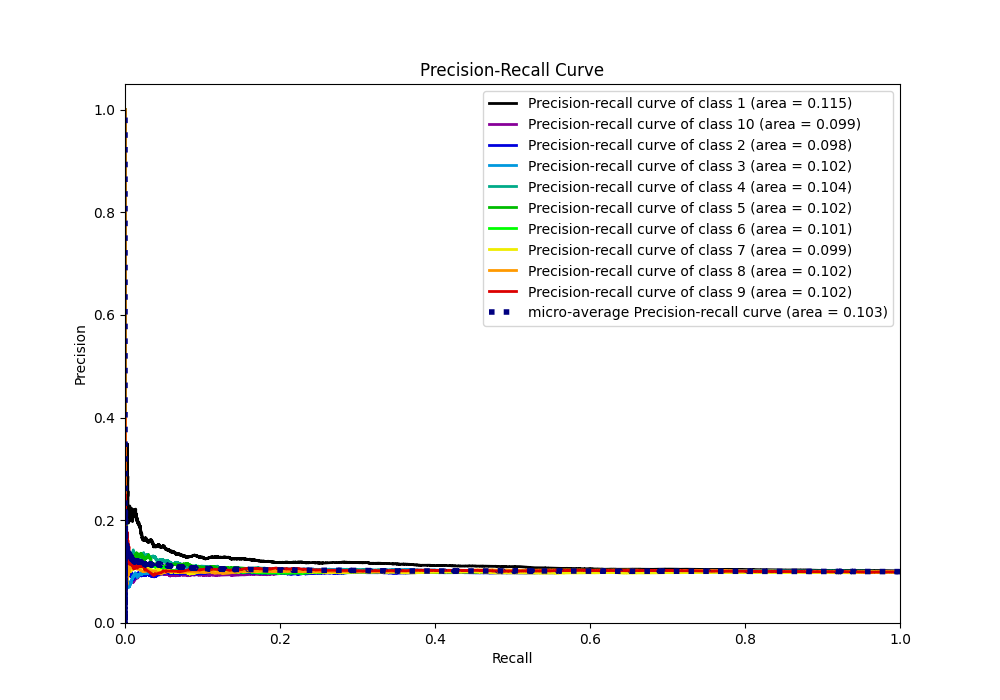

# Summary of Ensemble

[<< Go back](../README.md)

## Ensemble structure
| Model                  |   Weight |
|:-----------------------|---------:|
| 3_Default_RandomForest |        1 |

### Metric details
|           |           1 |            2 |            3 |            4 |            5 |            6 |             7 |            8 |            9 |           10 |   accuracy |     macro avg |   weighted avg |   logloss |
|:----------|------------:|-------------:|-------------:|-------------:|-------------:|-------------:|--------------:|-------------:|-------------:|-------------:|-----------:|--------------:|---------------:|----------:|
| precision |    0.112762 |    0.0992661 |    0.117036  |    0.129545  |    0.0988669 |    0.113316  |    0.176471   |    0.117499  |    0.130125  |    0.112464  |   0.108264 |     0.120735  |      0.120613  |   2.30139 |
| recall    |    0.40786  |    0.1556    |    0.0524823 |    0.0345664 |    0.249647  |    0.0633192 |    0.00185261 |    0.0568528 |    0.0148888 |    0.0393589 |   0.108264 |     0.107643  |      0.108264  |   2.30139 |
| f1-score  |    0.176678 |    0.121207  |    0.0724678 |    0.0545716 |    0.14164   |    0.0812419 |    0.00366673 |    0.0766284 |    0.0267204 |    0.0583108 |   0.108264 |     0.0813133 |      0.0816179 |   2.30139 |
| support   | 4987        | 4955         | 4935         | 4947         | 4963         | 4959         | 4858          | 4925         | 4903         | 4929         |   0.108264 | 49361         |  49361         |   2.30139 |

## Confusion matrix
|               |   Predicted as 1 |   Predicted as 2 |   Predicted as 3 |   Predicted as 4 |   Predicted as 5 |   Predicted as 6 |   Predicted as 7 |   Predicted as 8 |   Predicted as 9 |   Predicted as 10 |
|:--------------|-----------------:|-----------------:|-----------------:|-----------------:|-----------------:|-----------------:|-----------------:|-----------------:|-----------------:|------------------:|
| Labeled as 1  |             2034 |              787 |              210 |              143 |             1192 |              251 |                4 |              182 |               50 |               134 |
| Labeled as 2  |             1811 |              771 |              182 |              126 |             1280 |              263 |                5 |              262 |               55 |               200 |
| Labeled as 3  |             1818 |              779 |              259 |              135 |             1223 |              274 |                3 |              218 |               41 |               185 |
| Labeled as 4  |             1787 |              742 |              215 |              171 |             1281 |              285 |                8 |              226 |               62 |               170 |
| Labeled as 5  |             1809 |              800 |              242 |              146 |             1239 |              267 |                3 |              235 |               56 |               166 |
| Labeled as 6  |             1789 |              758 |              212 |              136 |             1285 |              314 |                6 |              224 |               54 |               181 |
| Labeled as 7  |             1736 |              770 |              240 |              140 |             1241 |              270 |                9 |              242 |               54 |               156 |
| Labeled as 8  |             1776 |              831 |              224 |              124 |             1201 |              284 |                7 |              280 |               55 |               143 |
| Labeled as 9  |             1725 |              780 |              232 |              101 |             1251 |              295 |                3 |              247 |               73 |               196 |
| Labeled as 10 |             1753 |              749 |              197 |               98 |             1339 |              268 |                3 |              267 |               61 |               194 |

## Learning curves

## Confusion Matrix

## Normalized Confusion Matrix

## ROC Curve

## Precision Recall Curve

[<< Go back](../README.md)
