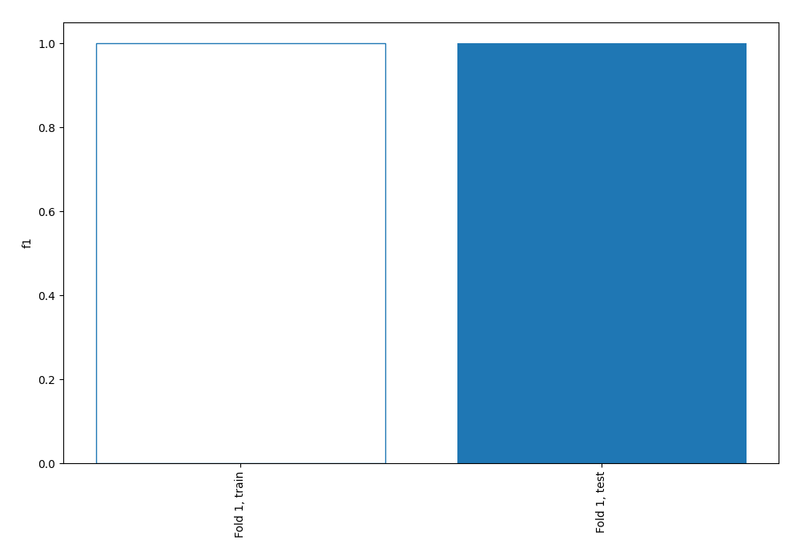
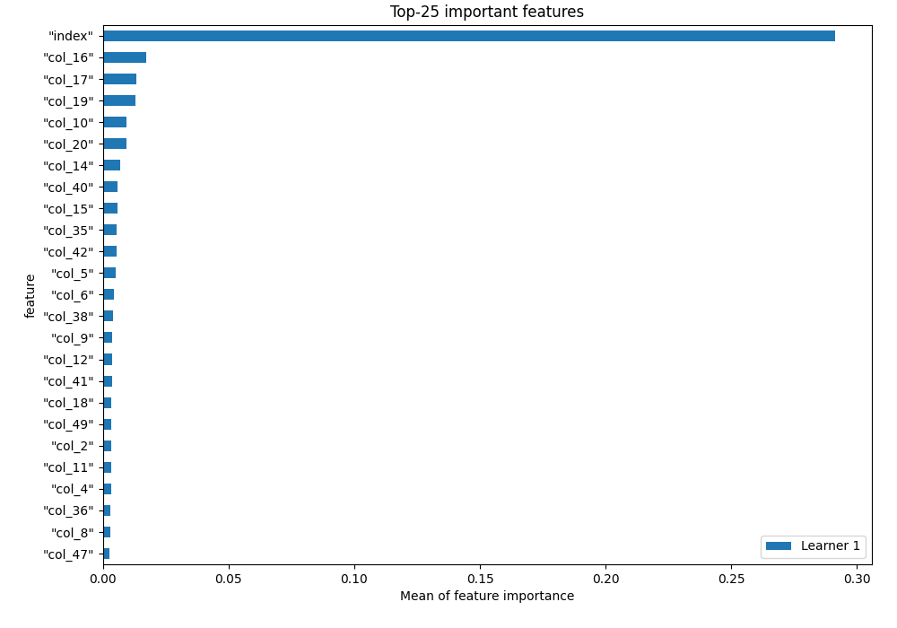
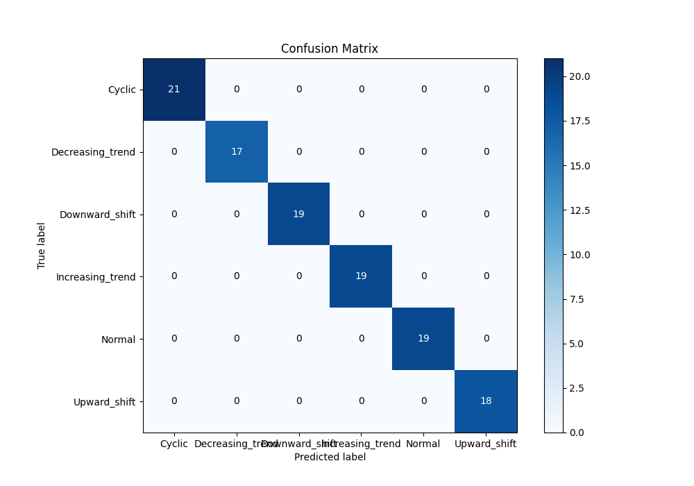
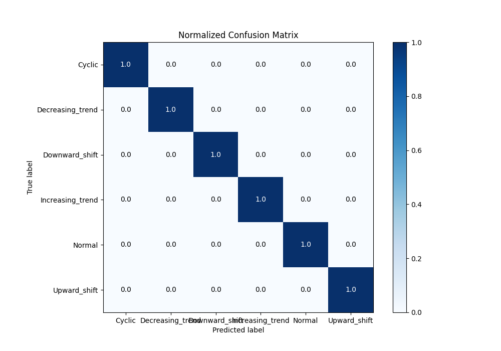
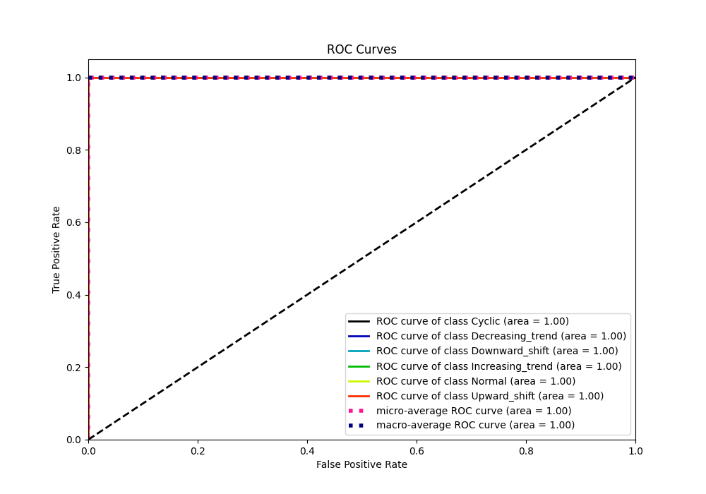
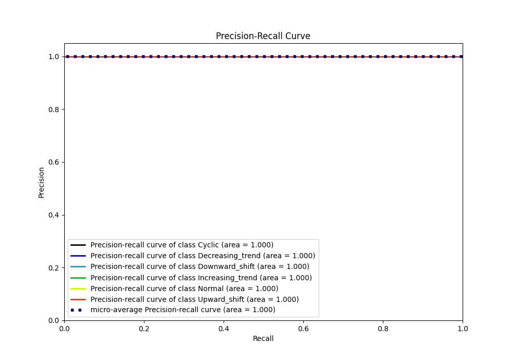

# Summary of 2_Linear

[<< Go back](../README.md)

## Logistic Regression (Linear)
- **n_jobs**: -1
- **num_class**: 6
- **explain_level**: 1

## Validation
 - **validation_type**: split
 - **train_ratio**: 0.75
 - **shuffle**: True
 - **stratify**: True

## Optimized metric
f1

## Training time

0.7 seconds

### Metric details
|           |   Cyclic |   Decreasing_trend |   Downward_shift |   Increasing_trend |   Normal |   Upward_shift |   accuracy |   macro avg |   weighted avg |   logloss |
|:----------|---------:|-------------------:|-----------------:|-------------------:|---------:|---------------:|-----------:|------------:|---------------:|----------:|
| precision |        1 |                  1 |                1 |                  1 |        1 |              1 |          1 |           1 |              1 |  0.023658 |
| recall    |        1 |                  1 |                1 |                  1 |        1 |              1 |          1 |           1 |              1 |  0.023658 |
| f1-score  |        1 |                  1 |                1 |                  1 |        1 |              1 |          1 |           1 |              1 |  0.023658 |
| support   |       21 |                 17 |               19 |                 19 |       19 |             18 |          1 |         113 |            113 |  0.023658 |

## Confusion matrix
|                             |   Predicted as Cyclic |   Predicted as Decreasing_trend |   Predicted as Downward_shift |   Predicted as Increasing_trend |   Predicted as Normal |   Predicted as Upward_shift |
|:----------------------------|----------------------:|--------------------------------:|------------------------------:|--------------------------------:|----------------------:|----------------------------:|
| Labeled as Cyclic           |                    21 |                               0 |                             0 |                               0 |                     0 |                           0 |
| Labeled as Decreasing_trend |                     0 |                              17 |                             0 |                               0 |                     0 |                           0 |
| Labeled as Downward_shift   |                     0 |                               0 |                            19 |                               0 |                     0 |                           0 |
| Labeled as Increasing_trend |                     0 |                               0 |                             0 |                              19 |                     0 |                           0 |
| Labeled as Normal           |                     0 |                               0 |                             0 |                               0 |                    19 |                           0 |
| Labeled as Upward_shift     |                     0 |                               0 |                             0 |                               0 |                     0 |                          18 |

## Learning curves

## Coefficients

### Coefficients learner #1
|           |      Cyclic |   Decreasing_trend |   Downward_shift |   Increasing_trend |      Normal |   Upward_shift |
|:----------|------------:|-------------------:|-----------------:|-------------------:|------------:|---------------:|
| intercept |  0.51971    |        -1.87762    |       0.303163   |       -1.62208     |  2.12789    |     0.548939   |
| "index"   | -0.00192416 |        -0.550302   |       1.37127    |       -0.600452    | -1.49175    |     1.27316    |
| "col_1"   | -0.0113296  |         0.0421655  |      -0.134547   |        6.33469e-05 |  0.0444861  |     0.0591613  |
| "col_2"   |  0.301112   |        -0.0311078  |      -0.0682522  |        0.096342    | -0.0588648  |    -0.239229   |
| "col_3"   |  0.505886   |        -0.0569247  |      -0.0842919  |       -0.176298    | -0.238366   |     0.0499945  |
| "col_4"   |  0.544674   |        -0.142153   |       0.0166743  |       -0.12817     | -0.271936   |    -0.0190894  |
| "col_5"   |  0.430593   |        -0.216713   |       0.0346012  |        0.146483    | -0.1278     |    -0.267164   |
| "col_6"   |  0.351401   |        -0.266739   |       0.134253   |        0.0673332   | -0.175067   |    -0.11118    |
| "col_7"   |  0.0717286  |        -0.0729648  |       0.0217994  |        0.138541    | -0.155498   |    -0.0036064  |
| "col_8"   | -0.339605   |        -0.0958454  |       0.212929   |        0.271276    | -0.0102864  |    -0.0384687  |
| "col_9"   | -0.374899   |        -0.163267   |       0.132351   |        0.178245    |  0.282868   |    -0.0552976  |
| "col_10"  | -0.425098   |        -0.486846   |       0.467251   |        0.533249    |  0.171809   |    -0.260366   |
| "col_11"  | -0.442928   |        -0.202451   |       0.227761   |        0.257148    |  0.221693   |    -0.0612234  |
| "col_12"  | -0.198281   |        -0.346678   |       0.268541   |        0.204274    |  0.0801321  |    -0.00798868 |
| "col_13"  | -0.0030766  |        -0.233063   |       0.0818222  |        0.34485     |  0.0205574  |    -0.21109    |
| "col_14"  |  0.157686   |        -0.56228    |       0.380978   |        0.194876    | -0.116469   |    -0.054791   |
| "col_15"  |  0.214      |        -0.237983   |      -0.0100032  |        0.525851    | -0.085249   |    -0.406616   |
| "col_16"  |  0.314368   |        -0.558259   |       0.385614   |        0.270182    | -0.173471   |    -0.238434   |
| "col_17"  |  0.3386     |        -0.399125   |       0.265188   |        0.486195    | -0.345603   |    -0.345254   |
| "col_18"  |  0.133108   |        -0.371487   |       0.229395   |        0.480602    | -0.0939513  |    -0.377666   |
| "col_19"  |  0.0986769  |        -0.512704   |       0.280649   |        0.473641    | -0.0220335  |    -0.318229   |
| "col_20"  | -0.0558812  |        -0.30191    |       0.210266   |        0.570033    | -0.0367031  |    -0.385804   |
| "col_21"  | -0.0648911  |        -0.347691   |       0.237066   |        0.451553    | -0.0584042  |    -0.217633   |
| "col_22"  |  0.023642   |        -0.371253   |       0.142957   |        0.318406    |  0.0106542  |    -0.124406   |
| "col_23"  | -0.0663039  |        -0.151314   |      -0.0119225  |        0.262626    |  0.0249891  |    -0.0580751  |
| "col_24"  | -0.0352804  |        -0.269813   |       0.0697402  |        0.0904548   | -0.0463563  |     0.191255   |
| "col_25"  |  0.0329366  |        -0.207295   |      -0.0205976  |        0.0673886   | -0.112511   |     0.240078   |
| "col_26"  |  0.0347526  |        -0.11729    |      -0.13495    |        0.214987    | -0.0844691  |     0.0869691  |
| "col_27"  |  0.0351646  |        -0.191532   |      -0.0525816  |        0.0228496   |  0.0150363  |     0.171063   |
| "col_28"  | -0.0811474  |        -0.321068   |       0.0475685  |        0.147472    |  0.147975   |     0.0591999  |
| "col_29"  | -0.0926738  |        -0.0583702  |      -0.123774   |        0.209411    | -0.0442772  |     0.109684   |
| "col_30"  | -0.0230425  |        -0.0529128  |      -0.205618   |        0.0435576   |  0.0295232  |     0.208492   |
| "col_31"  | -0.0104743  |        -0.18999    |      -0.104944   |        0.043675    |  0.0734942  |     0.188239   |
| "col_32"  |  0.064265   |        -0.155142   |      -0.142002   |        0.0932002   | -0.00671601 |     0.146395   |
| "col_33"  |  0.0678054  |        -0.0304659  |      -0.26284    |        0.0971712   |  0.0260671  |     0.102262   |
| "col_34"  |  0.0908029  |        -0.124049   |      -0.213176   |        0.270391    | -0.0366309  |     0.0126626  |
| "col_35"  |  0.0872287  |         0.0546756  |      -0.43681    |        0.0492786   |  0.0515001  |     0.194127   |
| "col_36"  |  0.0928957  |        -0.0282315  |      -0.318425   |        0.0547609   |  0.0407203  |     0.158279   |
| "col_37"  | -0.0115757  |        -0.0961097  |      -0.269699   |        0.140647    | -0.0084833  |     0.245221   |
| "col_38"  | -0.0511963  |        -0.0869239  |      -0.261418   |       -0.040585    |  0.0751164  |     0.365007   |
| "col_39"  | -0.0969494  |        -0.00137766 |      -0.313055   |        0.140463    | -0.0116428  |     0.282562   |
| "col_40"  | -0.0818059  |        -0.026075   |      -0.314655   |       -0.0737403   |  0.0148922  |     0.481384   |
| "col_41"  | -0.0665322  |        -0.140698   |      -0.210905   |        0.023745    |  0.0109651  |     0.383425   |
| "col_42"  | -0.0828211  |         0.038232   |      -0.379749   |        0.000579389 |  0.0489006  |     0.374858   |
| "col_43"  | -0.0131525  |        -0.270556   |      -0.163166   |        0.115835    |  0.0571028  |     0.273936   |
| "col_44"  |  0.0705284  |        -0.0903711  |      -0.269925   |        0.0605262   | -0.0984204  |     0.327662   |
| "col_45"  |  0.0874641  |        -0.0952468  |      -0.270839   |        0.120534    | -0.0261237  |     0.184212   |
| "col_46"  |  0.0675333  |        -0.199334   |      -0.173865   |        0.244547    | -0.0663502  |     0.127469   |
| "col_47"  |  0.0747028  |         0.0221757  |      -0.337183   |        0.088987    | -0.134609   |     0.285926   |
| "col_48"  |  0.0180055  |        -0.281694   |      -0.145982   |        0.159271    |  0.0167668  |     0.233633   |
| "col_49"  |  0.00376098 |        -0.0107484  |      -0.32413    |        0.0356334   | -0.0245786  |     0.320063   |
| "col_50"  | -0.0249302  |        -0.409977   |      -0.0280942  |        0.261682    |  0.0361709  |     0.165149   |
| "col_51"  | -0.0674445  |        -0.268931   |      -0.137742   |        0.368628    |  0.0645462  |     0.0409426  |
| "col_52"  | -0.00826267 |        -0.226008   |      -0.144977   |        0.211066    |  0.00395411 |     0.164227   |
| "col_53"  | -0.0290141  |        -0.277165   |      -0.0877186  |        0.253261    | -0.0107745  |     0.151412   |
| "col_54"  | -0.0311727  |        -0.341102   |      -0.0439228  |        0.399783    | -0.0404762  |     0.0568905  |
| "col_55"  |  0.0147802  |        -0.178232   |      -0.197467   |        0.321661    | -0.071622   |     0.110879   |
| "col_56"  |  0.00249316 |        -0.20361    |      -0.187805   |        0.315536    | -0.0296528  |     0.103039   |
| "col_57"  | -0.0176662  |        -0.340709   |      -0.0634896  |        0.276344    |  0.0841621  |     0.0613581  |
| "col_58"  | -0.0298902  |        -0.371303   |      -0.00582084 |        0.278248    |  0.0428131  |     0.0859526  |
| "col_59"  | -0.0526505  |        -0.405337   |       0.0677903  |        0.377233    | -0.0582126  |     0.0711773  |
| "col_60"  | -0.0874982  |        -0.45835    |       0.068699   |        0.37        |  0.0534331  |     0.0537169  |

## Permutation-based Importance

## Confusion Matrix

## Normalized Confusion Matrix

## ROC Curve

## Precision Recall Curve

[<< Go back](../README.md)
