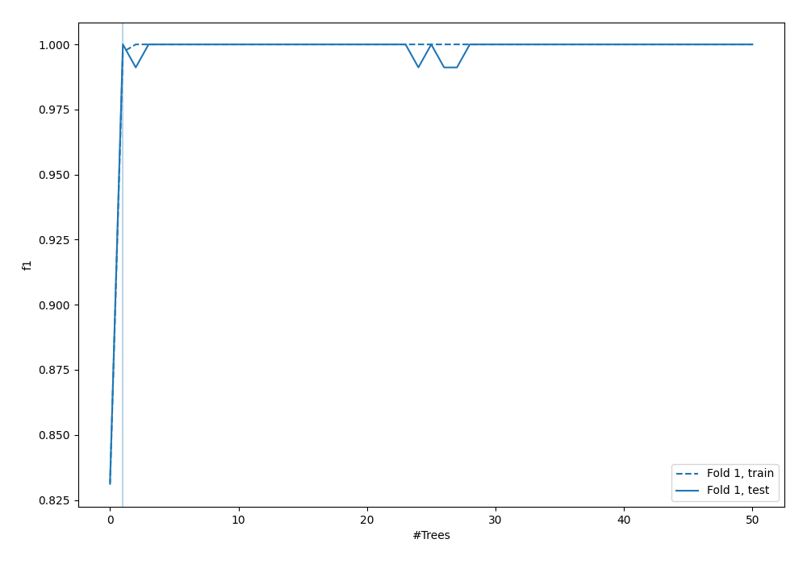
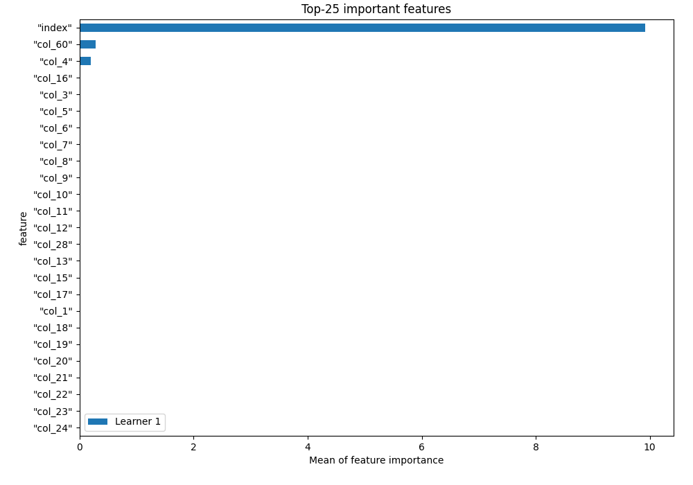
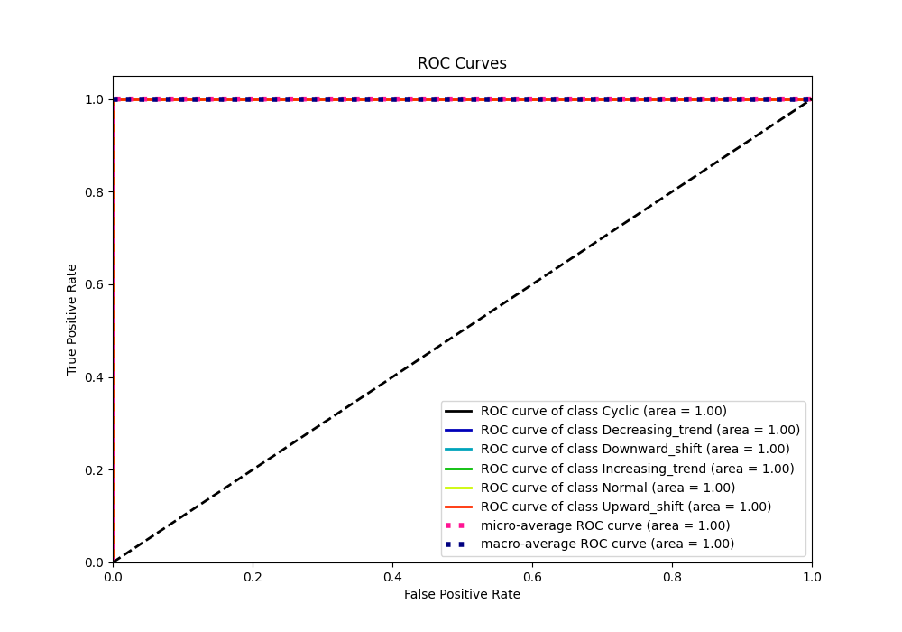
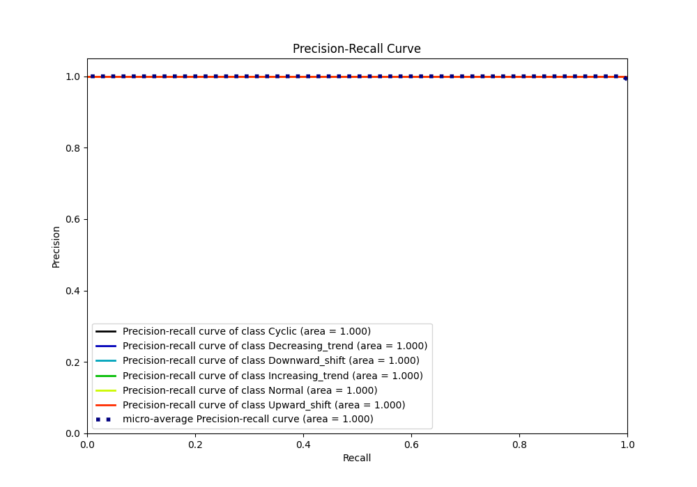

# Summary of 4_Default_RandomForest

[<< Go back](../README.md)

## Random Forest
- **n_jobs**: -1
- **criterion**: gini
- **max_features**: 0.9
- **min_samples_split**: 30
- **max_depth**: 4
- **eval_metric_name**: f1
- **num_class**: 6
- **explain_level**: 1

## Validation
 - **validation_type**: split
 - **train_ratio**: 0.75
 - **shuffle**: True
 - **stratify**: True

## Optimized metric
f1

## Training time

1.4 seconds

### Metric details
|           |   Cyclic |   Decreasing_trend |   Downward_shift |   Increasing_trend |   Normal |   Upward_shift |   accuracy |   macro avg |   weighted avg |   logloss |
|:----------|---------:|-------------------:|-----------------:|-------------------:|---------:|---------------:|-----------:|------------:|---------------:|----------:|
| precision |        1 |                  1 |                1 |                  1 |        1 |              1 |          1 |           1 |              1 |  0.108138 |
| recall    |        1 |                  1 |                1 |                  1 |        1 |              1 |          1 |           1 |              1 |  0.108138 |
| f1-score  |        1 |                  1 |                1 |                  1 |        1 |              1 |          1 |           1 |              1 |  0.108138 |
| support   |       21 |                 17 |               19 |                 19 |       19 |             18 |          1 |         113 |            113 |  0.108138 |

## Confusion matrix
|                             |   Predicted as Cyclic |   Predicted as Decreasing_trend |   Predicted as Downward_shift |   Predicted as Increasing_trend |   Predicted as Normal |   Predicted as Upward_shift |
|:----------------------------|----------------------:|--------------------------------:|------------------------------:|--------------------------------:|----------------------:|----------------------------:|
| Labeled as Cyclic           |                    21 |                               0 |                             0 |                               0 |                     0 |                           0 |
| Labeled as Decreasing_trend |                     0 |                              17 |                             0 |                               0 |                     0 |                           0 |
| Labeled as Downward_shift   |                     0 |                               0 |                            19 |                               0 |                     0 |                           0 |
| Labeled as Increasing_trend |                     0 |                               0 |                             0 |                              19 |                     0 |                           0 |
| Labeled as Normal           |                     0 |                               0 |                             0 |                               0 |                    19 |                           0 |
| Labeled as Upward_shift     |                     0 |                               0 |                             0 |                               0 |                     0 |                          18 |

## Learning curves

## Permutation-based Importance

## Confusion Matrix

## Normalized Confusion Matrix

## ROC Curve

## Precision Recall Curve

[<< Go back](../README.md)
