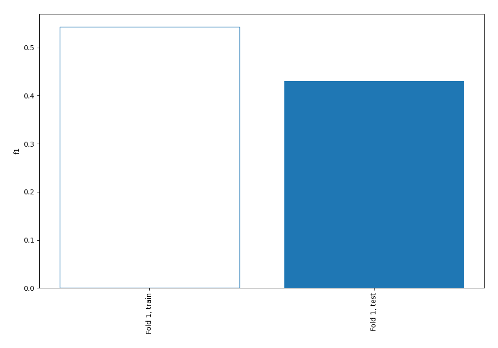
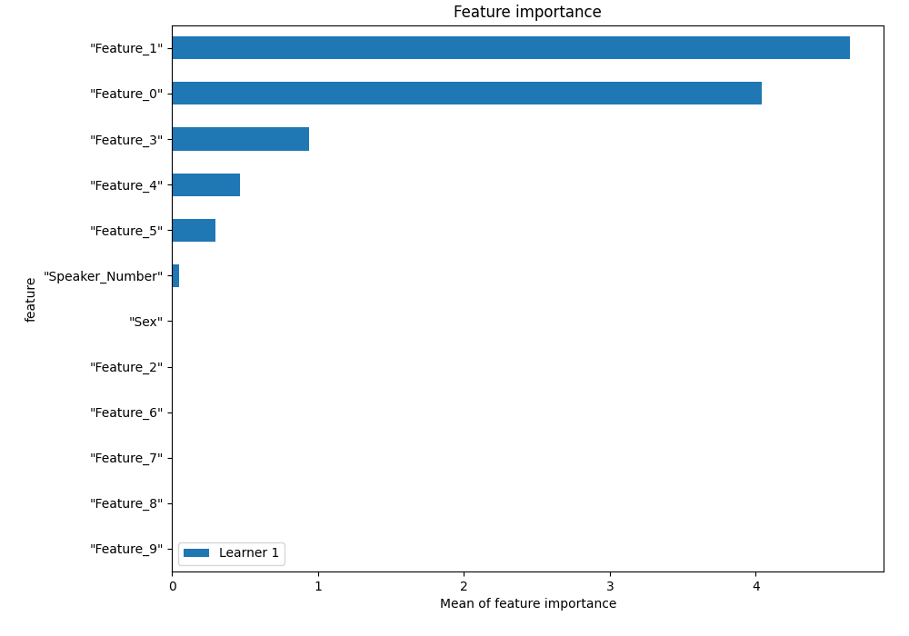
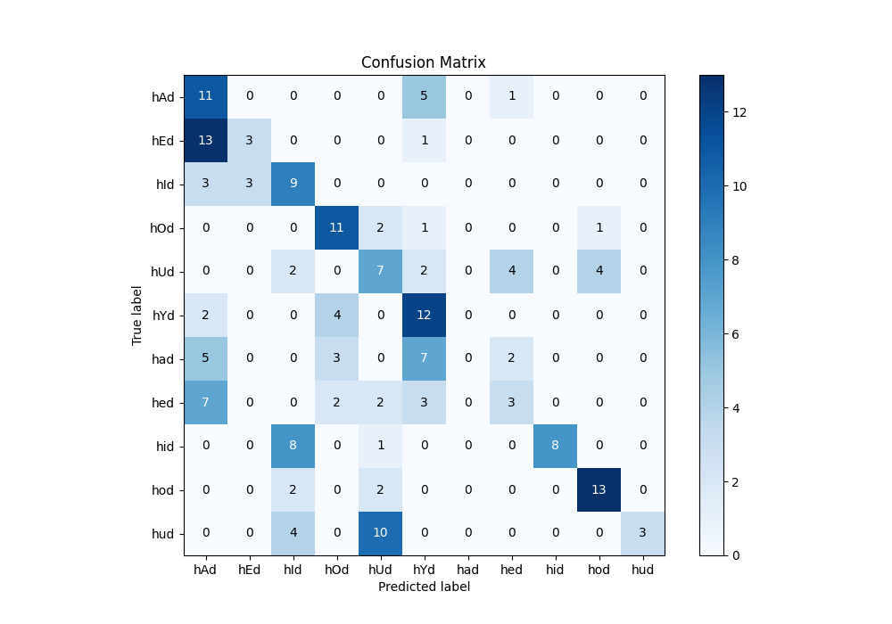
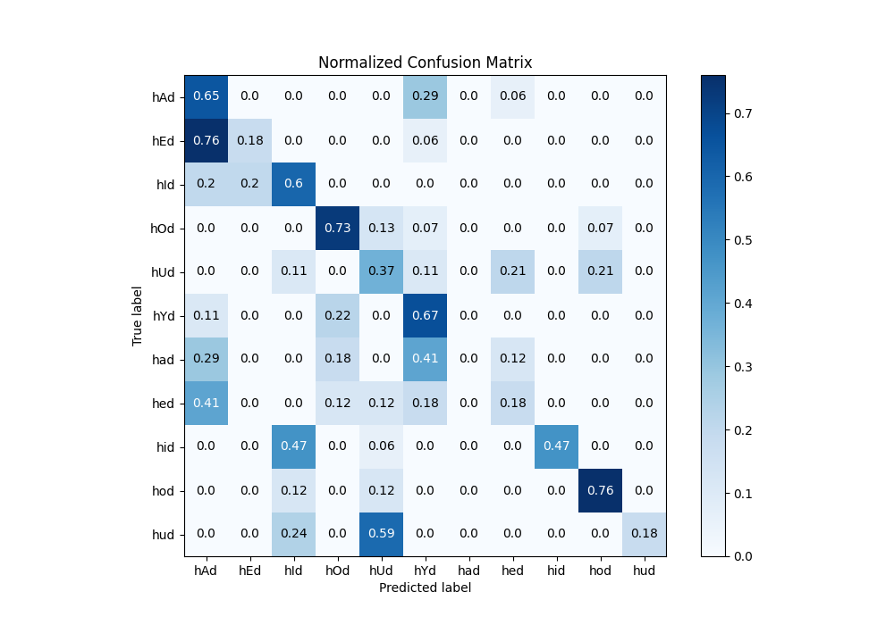
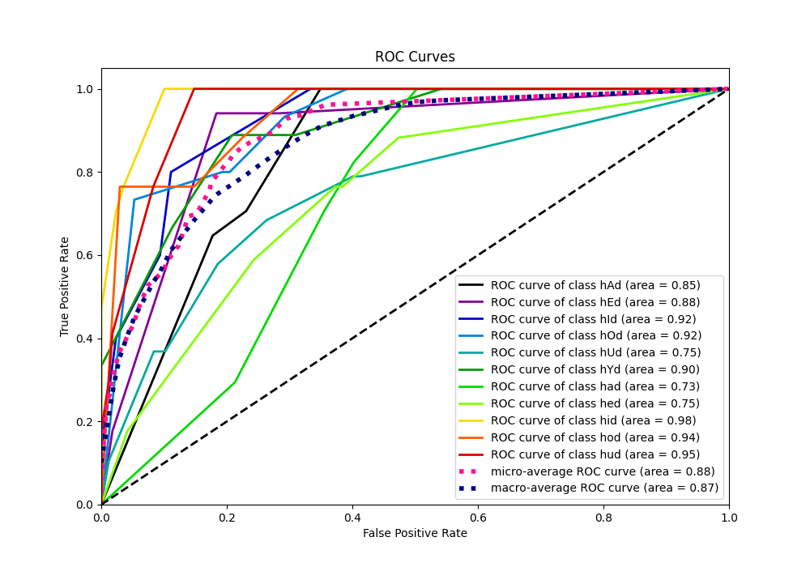
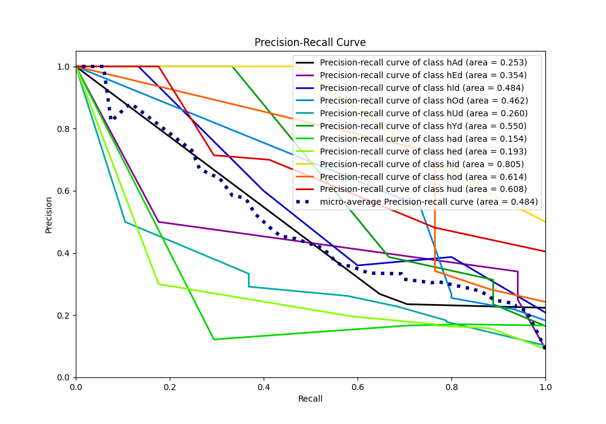

# Summary of 1_DecisionTree

[<< Go back](../README.md)

## Decision Tree
- **n_jobs**: -1
- **criterion**: entropy
- **max_depth**: 4
- **num_class**: 11
- **explain_level**: 1

## Validation
 - **validation_type**: split
 - **train_ratio**: 0.75
 - **shuffle**: True
 - **stratify**: True

## Optimized metric
f1

## Training time

0.6 seconds

### Metric details
|           |       hAd |       hEd |   hId |       hOd |       hUd |       hYd |   had |       hed |       hid |       hod |       hud |   accuracy |   macro avg |   weighted avg |   logloss |
|:----------|----------:|----------:|------:|----------:|----------:|----------:|------:|----------:|----------:|----------:|----------:|-----------:|------------:|---------------:|----------:|
| precision |  0.268293 |  0.5      |  0.36 |  0.55     |  0.291667 |  0.387097 |     0 |  0.3      |  1        |  0.722222 |  1        |   0.430108 |    0.489025 |       0.487087 |   1.76271 |
| recall    |  0.647059 |  0.176471 |  0.6  |  0.733333 |  0.368421 |  0.666667 |     0 |  0.176471 |  0.470588 |  0.764706 |  0.176471 |   0.430108 |    0.434562 |       0.430108 |   1.76271 |
| f1-score  |  0.37931  |  0.26087  |  0.45 |  0.628571 |  0.325581 |  0.489796 |     0 |  0.222222 |  0.64     |  0.742857 |  0.3      |   0.430108 |    0.403564 |       0.400271 |   1.76271 |
| support   | 17        | 17        | 15    | 15        | 19        | 18        |    17 | 17        | 17        | 17        | 17        |   0.430108 |  186        |     186        |   1.76271 |

## Confusion matrix
|                |   Predicted as hAd |   Predicted as hEd |   Predicted as hId |   Predicted as hOd |   Predicted as hUd |   Predicted as hYd |   Predicted as had |   Predicted as hed |   Predicted as hid |   Predicted as hod |   Predicted as hud |
|:---------------|-------------------:|-------------------:|-------------------:|-------------------:|-------------------:|-------------------:|-------------------:|-------------------:|-------------------:|-------------------:|-------------------:|
| Labeled as hAd |                 11 |                  0 |                  0 |                  0 |                  0 |                  5 |                  0 |                  1 |                  0 |                  0 |                  0 |
| Labeled as hEd |                 13 |                  3 |                  0 |                  0 |                  0 |                  1 |                  0 |                  0 |                  0 |                  0 |                  0 |
| Labeled as hId |                  3 |                  3 |                  9 |                  0 |                  0 |                  0 |                  0 |                  0 |                  0 |                  0 |                  0 |
| Labeled as hOd |                  0 |                  0 |                  0 |                 11 |                  2 |                  1 |                  0 |                  0 |                  0 |                  1 |                  0 |
| Labeled as hUd |                  0 |                  0 |                  2 |                  0 |                  7 |                  2 |                  0 |                  4 |                  0 |                  4 |                  0 |
| Labeled as hYd |                  2 |                  0 |                  0 |                  4 |                  0 |                 12 |                  0 |                  0 |                  0 |                  0 |                  0 |
| Labeled as had |                  5 |                  0 |                  0 |                  3 |                  0 |                  7 |                  0 |                  2 |                  0 |                  0 |                  0 |
| Labeled as hed |                  7 |                  0 |                  0 |                  2 |                  2 |                  3 |                  0 |                  3 |                  0 |                  0 |                  0 |
| Labeled as hid |                  0 |                  0 |                  8 |                  0 |                  1 |                  0 |                  0 |                  0 |                  8 |                  0 |                  0 |
| Labeled as hod |                  0 |                  0 |                  2 |                  0 |                  2 |                  0 |                  0 |                  0 |                  0 |                 13 |                  0 |
| Labeled as hud |                  0 |                  0 |                  4 |                  0 |                 10 |                  0 |                  0 |                  0 |                  0 |                  0 |                  3 |

## Learning curves

## Permutation-based Importance

## Confusion Matrix

## Normalized Confusion Matrix

## ROC Curve

## Precision Recall Curve

[<< Go back](../README.md)
