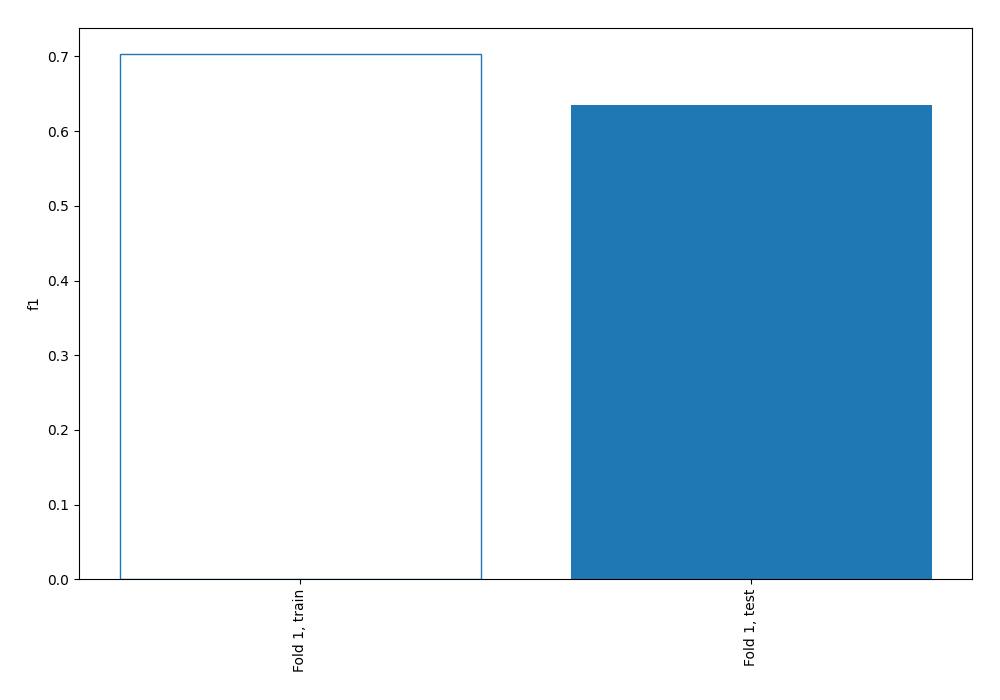
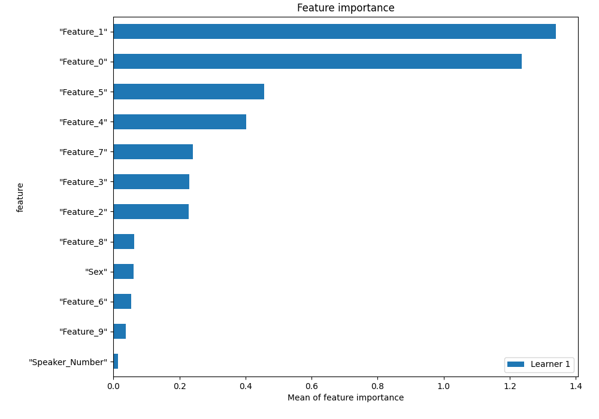
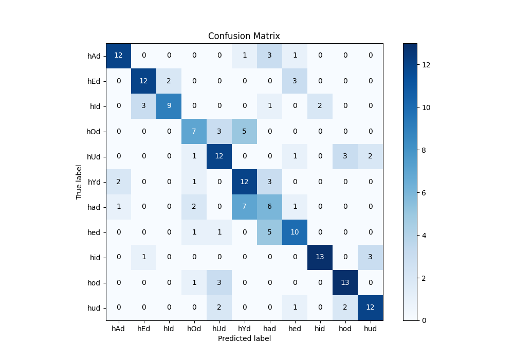
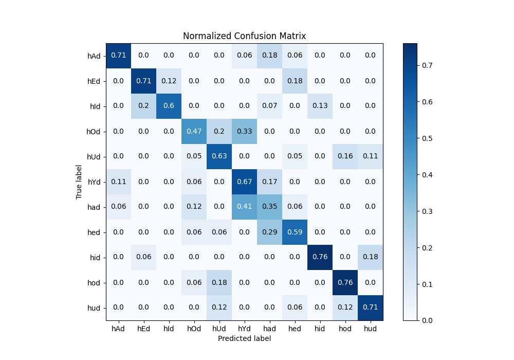
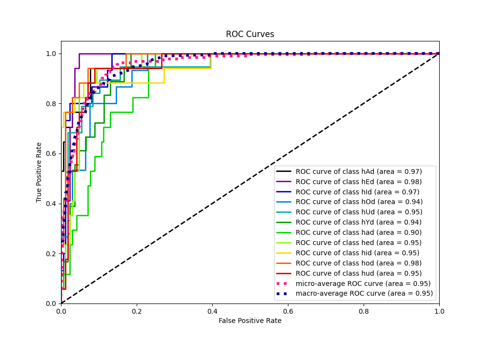
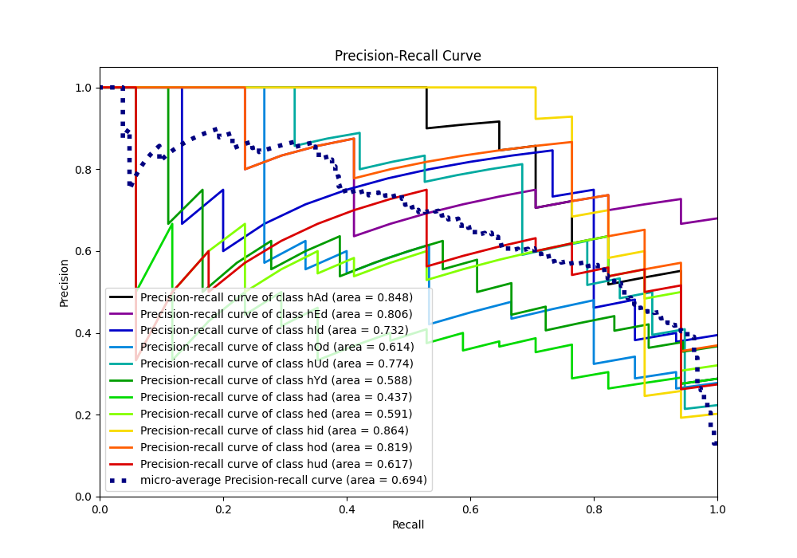

# Summary of 2_Linear

[<< Go back](../README.md)

## Logistic Regression (Linear)
- **n_jobs**: -1
- **num_class**: 11
- **explain_level**: 1

## Validation
 - **validation_type**: split
 - **train_ratio**: 0.75
 - **shuffle**: True
 - **stratify**: True

## Optimized metric
f1

## Training time

1.2 seconds

### Metric details
|           |       hAd |       hEd |       hId |       hOd |       hUd |       hYd |       had |       hed |       hid |       hod |       hud |   accuracy |   macro avg |   weighted avg |   logloss |
|:----------|----------:|----------:|----------:|----------:|----------:|----------:|----------:|----------:|----------:|----------:|----------:|-----------:|------------:|---------------:|----------:|
| precision |  0.8      |  0.75     |  0.818182 |  0.538462 |  0.571429 |  0.48     |  0.333333 |  0.588235 |  0.866667 |  0.722222 |  0.705882 |   0.634409 |    0.652219 |       0.649863 |   1.01847 |
| recall    |  0.705882 |  0.705882 |  0.6      |  0.466667 |  0.631579 |  0.666667 |  0.352941 |  0.588235 |  0.764706 |  0.764706 |  0.705882 |   0.634409 |    0.632104 |       0.634409 |   1.01847 |
| f1-score  |  0.75     |  0.727273 |  0.692308 |  0.5      |  0.6      |  0.55814  |  0.342857 |  0.588235 |  0.8125   |  0.742857 |  0.705882 |   0.634409 |    0.638187 |       0.638249 |   1.01847 |
| support   | 17        | 17        | 15        | 15        | 19        | 18        | 17        | 17        | 17        | 17        | 17        |   0.634409 |  186        |     186        |   1.01847 |

## Confusion matrix
|                |   Predicted as hAd |   Predicted as hEd |   Predicted as hId |   Predicted as hOd |   Predicted as hUd |   Predicted as hYd |   Predicted as had |   Predicted as hed |   Predicted as hid |   Predicted as hod |   Predicted as hud |
|:---------------|-------------------:|-------------------:|-------------------:|-------------------:|-------------------:|-------------------:|-------------------:|-------------------:|-------------------:|-------------------:|-------------------:|
| Labeled as hAd |                 12 |                  0 |                  0 |                  0 |                  0 |                  1 |                  3 |                  1 |                  0 |                  0 |                  0 |
| Labeled as hEd |                  0 |                 12 |                  2 |                  0 |                  0 |                  0 |                  0 |                  3 |                  0 |                  0 |                  0 |
| Labeled as hId |                  0 |                  3 |                  9 |                  0 |                  0 |                  0 |                  1 |                  0 |                  2 |                  0 |                  0 |
| Labeled as hOd |                  0 |                  0 |                  0 |                  7 |                  3 |                  5 |                  0 |                  0 |                  0 |                  0 |                  0 |
| Labeled as hUd |                  0 |                  0 |                  0 |                  1 |                 12 |                  0 |                  0 |                  1 |                  0 |                  3 |                  2 |
| Labeled as hYd |                  2 |                  0 |                  0 |                  1 |                  0 |                 12 |                  3 |                  0 |                  0 |                  0 |                  0 |
| Labeled as had |                  1 |                  0 |                  0 |                  2 |                  0 |                  7 |                  6 |                  1 |                  0 |                  0 |                  0 |
| Labeled as hed |                  0 |                  0 |                  0 |                  1 |                  1 |                  0 |                  5 |                 10 |                  0 |                  0 |                  0 |
| Labeled as hid |                  0 |                  1 |                  0 |                  0 |                  0 |                  0 |                  0 |                  0 |                 13 |                  0 |                  3 |
| Labeled as hod |                  0 |                  0 |                  0 |                  1 |                  3 |                  0 |                  0 |                  0 |                  0 |                 13 |                  0 |
| Labeled as hud |                  0 |                  0 |                  0 |                  0 |                  2 |                  0 |                  0 |                  1 |                  0 |                  2 |                 12 |

## Learning curves

## Coefficients

### Coefficients learner #1
|                  |       hAd |       hEd |       hId |        hOd |        hUd |          hYd |        had |        hed |       hid |       hod |       hud |
|:-----------------|----------:|----------:|----------:|-----------:|-----------:|-------------:|-----------:|-----------:|----------:|----------:|----------:|
| intercept        | -0.376421 | -0.155576 |  0.647936 |  0.890947  |  1.08405   |  0.000807423 |  1.81595   |  1.88774   | -2.48017  | -2.51122  | -0.804045 |
| "Speaker_Number" |  0.182971 |  0.266392 |  0.102067 |  0.0935997 | -0.226889  | -0.254197    | -0.039644  | -0.0265873 |  0.402334 | -0.150736 | -0.349309 |
| "Sex"            | -0.280178 |  0.464283 | -0.273122 |  0.229737  |  0.131295  | -0.220038    |  0.211291  |  0.171639  | -0.684861 | -0.371631 |  0.621585 |
| "Feature_0"      |  2.30683  |  1.87563  |  0.509322 |  0.233156  | -1.80322   |  1.74283     |  1.53951   | -0.324525  | -0.595446 | -1.48883  | -3.99526  |
| "Feature_1"      | -0.845262 | -2.46832  | -1.83772  |  1.86438   |  1.66811   |  1.89174     |  0.52092   | -0.698183  | -4.74793  |  3.35853  |  1.29374  |
| "Feature_2"      | -1.75822  | -1.04688  |  0.739735 |  0.450321  |  0.578056  | -0.202529    |  0.180023  |  0.0310283 |  0.593566 | -0.147126 |  0.582022 |
| "Feature_3"      | -0.758241 |  0.410132 |  1.13997  | -0.276571  |  0.0112681 | -1.10787     | -0.57517   | -0.503761  |  1.82642  | -0.732446 |  0.566264 |
| "Feature_4"      | -0.978453 |  1.3635   |  2.65945  | -1.33322   |  0.598734  | -2.20879     | -0.521404  |  0.303013  |  0.725815 | -1.95558  |  1.34693  |
| "Feature_5"      | -2.39144  | -1.4725   |  0.910623 | -0.0506122 |  1.11222   | -0.502162    | -0.471784  | -0.0109017 |  0.759705 |  0.702056 |  1.4148   |
| "Feature_6"      | -1.0138   | -0.994828 |  0.356468 |  0.346635  |  0.222226  | -0.223711    |  0.477073  | -0.552977  |  1.34343  | -0.15991  |  0.199386 |
| "Feature_7"      | -1.72918  | -1.42009  |  0.495859 |  0.256883  |  1.34678   | -0.57965     | -1.42988   |  0.41931   |  0.186452 |  2.25043  |  0.203087 |
| "Feature_8"      |  0.178273 | -1.03059  | -0.253399 | -0.247609  |  0.30102   |  0.451572    | -0.228168  | -0.887483  | -0.228612 |  1.38655  |  0.558441 |
| "Feature_9"      | -0.496494 |  0.258994 | -0.024552 |  0.275273  |  0.23704   |  0.240857    | -0.0420756 | -0.511029  | -0.66162  |  1.24551  | -0.521901 |

## Permutation-based Importance

## Confusion Matrix

## Normalized Confusion Matrix

## ROC Curve

## Precision Recall Curve

[<< Go back](../README.md)
