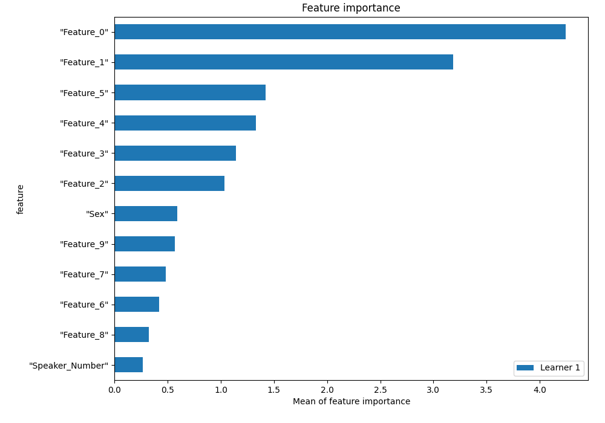
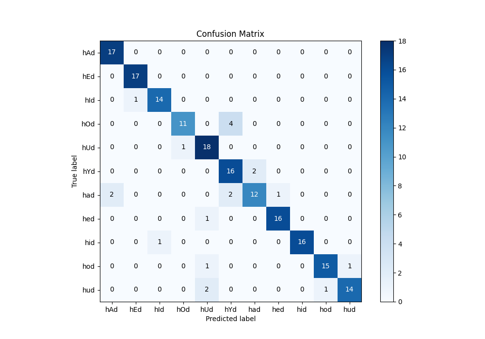
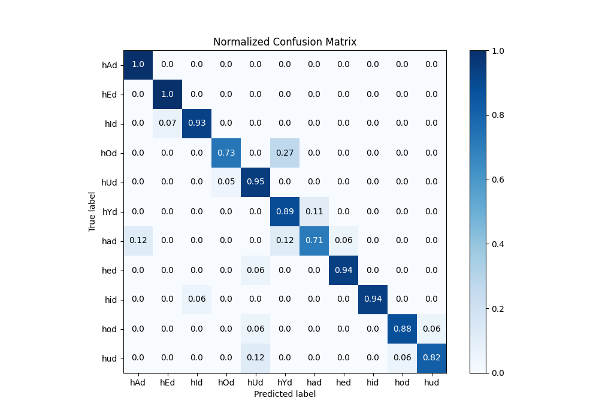
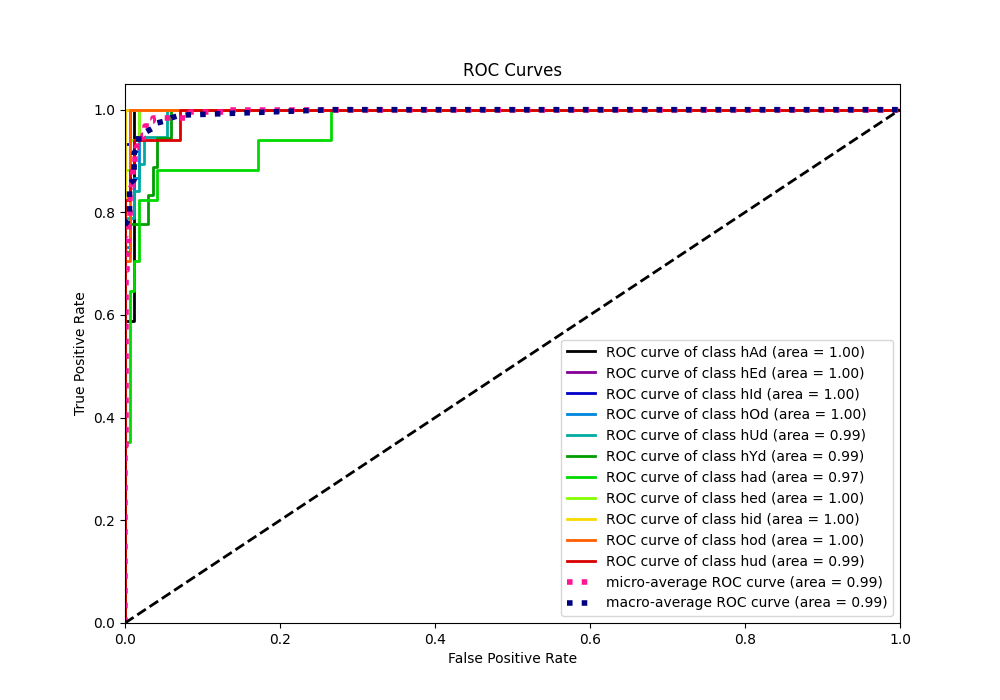
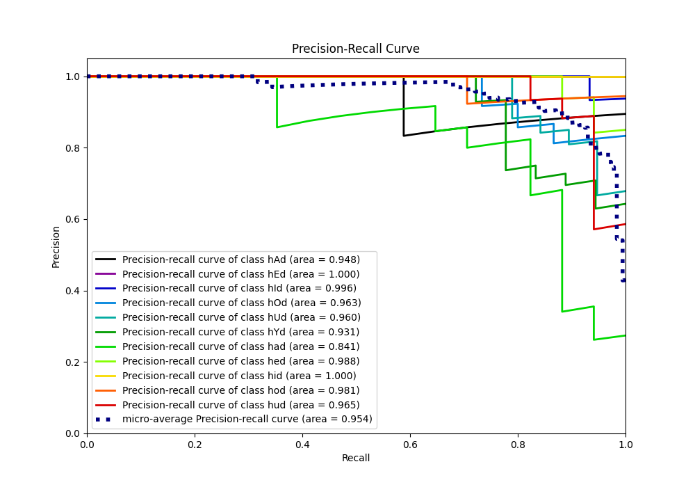

# Summary of 3_Default_NeuralNetwork

[<< Go back](../README.md)

## Neural Network
- **n_jobs**: -1
- **dense_1_size**: 32
- **dense_2_size**: 16
- **learning_rate**: 0.05
- **num_class**: 11
- **explain_level**: 1

## Validation
 - **validation_type**: split
 - **train_ratio**: 0.75
 - **shuffle**: True
 - **stratify**: True

## Optimized metric
f1

## Training time

0.9 seconds

### Metric details
|           |       hAd |       hEd |       hId |       hOd |       hUd |       hYd |       had |       hed |       hid |       hod |       hud |   accuracy |   macro avg |   weighted avg |   logloss |
|:----------|----------:|----------:|----------:|----------:|----------:|----------:|----------:|----------:|----------:|----------:|----------:|-----------:|------------:|---------------:|----------:|
| precision |  0.894737 |  0.944444 |  0.933333 |  0.916667 |  0.818182 |  0.727273 |  0.857143 |  0.941176 |  1        |  0.9375   |  0.933333 |   0.892473 |    0.900344 |       0.898    |  0.309054 |
| recall    |  1        |  1        |  0.933333 |  0.733333 |  0.947368 |  0.888889 |  0.705882 |  0.941176 |  0.941176 |  0.882353 |  0.823529 |   0.892473 |    0.89064  |       0.892473 |  0.309054 |
| f1-score  |  0.944444 |  0.971429 |  0.933333 |  0.814815 |  0.878049 |  0.8      |  0.774194 |  0.941176 |  0.969697 |  0.909091 |  0.875    |   0.892473 |    0.89193  |       0.89167  |  0.309054 |
| support   | 17        | 17        | 15        | 15        | 19        | 18        | 17        | 17        | 17        | 17        | 17        |   0.892473 |  186        |     186        |  0.309054 |

## Confusion matrix
|                |   Predicted as hAd |   Predicted as hEd |   Predicted as hId |   Predicted as hOd |   Predicted as hUd |   Predicted as hYd |   Predicted as had |   Predicted as hed |   Predicted as hid |   Predicted as hod |   Predicted as hud |
|:---------------|-------------------:|-------------------:|-------------------:|-------------------:|-------------------:|-------------------:|-------------------:|-------------------:|-------------------:|-------------------:|-------------------:|
| Labeled as hAd |                 17 |                  0 |                  0 |                  0 |                  0 |                  0 |                  0 |                  0 |                  0 |                  0 |                  0 |
| Labeled as hEd |                  0 |                 17 |                  0 |                  0 |                  0 |                  0 |                  0 |                  0 |                  0 |                  0 |                  0 |
| Labeled as hId |                  0 |                  1 |                 14 |                  0 |                  0 |                  0 |                  0 |                  0 |                  0 |                  0 |                  0 |
| Labeled as hOd |                  0 |                  0 |                  0 |                 11 |                  0 |                  4 |                  0 |                  0 |                  0 |                  0 |                  0 |
| Labeled as hUd |                  0 |                  0 |                  0 |                  1 |                 18 |                  0 |                  0 |                  0 |                  0 |                  0 |                  0 |
| Labeled as hYd |                  0 |                  0 |                  0 |                  0 |                  0 |                 16 |                  2 |                  0 |                  0 |                  0 |                  0 |
| Labeled as had |                  2 |                  0 |                  0 |                  0 |                  0 |                  2 |                 12 |                  1 |                  0 |                  0 |                  0 |
| Labeled as hed |                  0 |                  0 |                  0 |                  0 |                  1 |                  0 |                  0 |                 16 |                  0 |                  0 |                  0 |
| Labeled as hid |                  0 |                  0 |                  1 |                  0 |                  0 |                  0 |                  0 |                  0 |                 16 |                  0 |                  0 |
| Labeled as hod |                  0 |                  0 |                  0 |                  0 |                  1 |                  0 |                  0 |                  0 |                  0 |                 15 |                  1 |
| Labeled as hud |                  0 |                  0 |                  0 |                  0 |                  2 |                  0 |                  0 |                  0 |                  0 |                  1 |                 14 |

## Learning curves

## Permutation-based Importance

## Confusion Matrix

## Normalized Confusion Matrix

## ROC Curve

## Precision Recall Curve

[<< Go back](../README.md)
