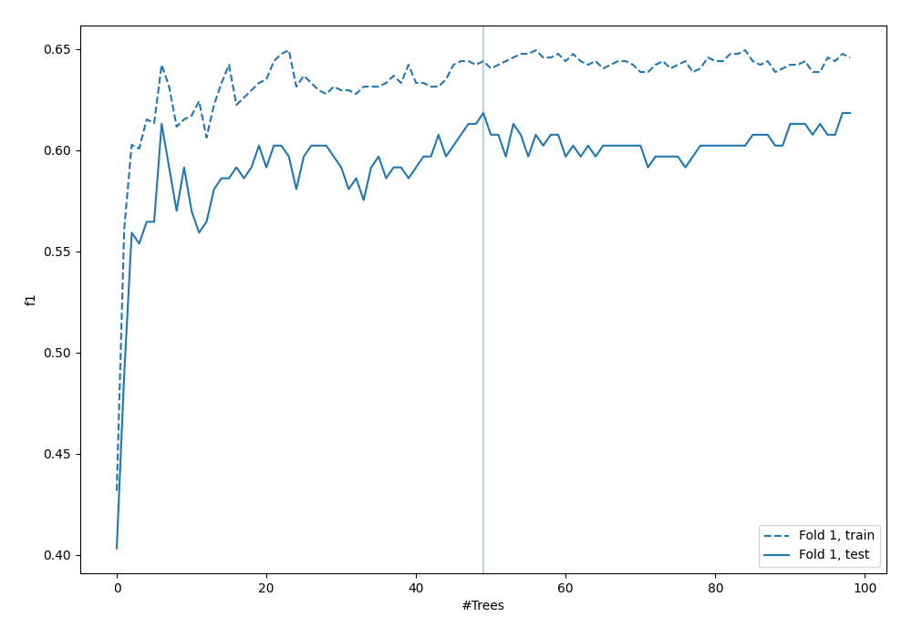
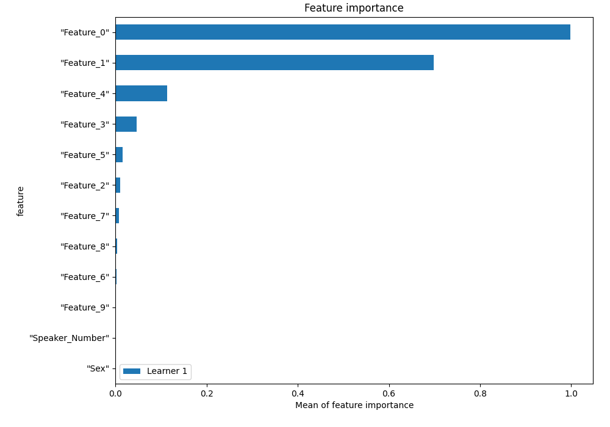
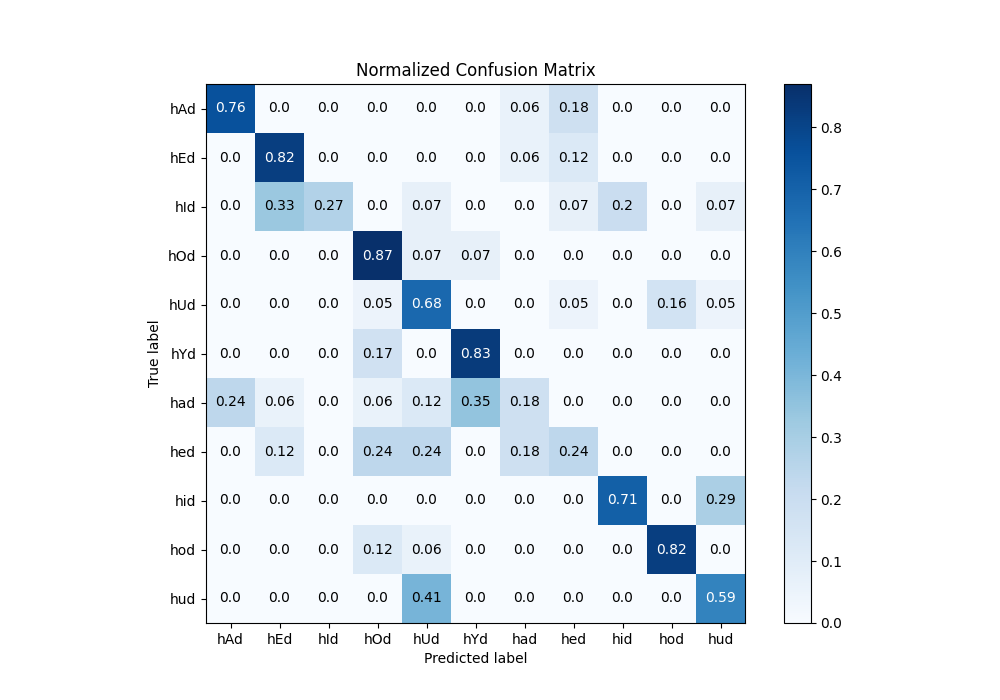
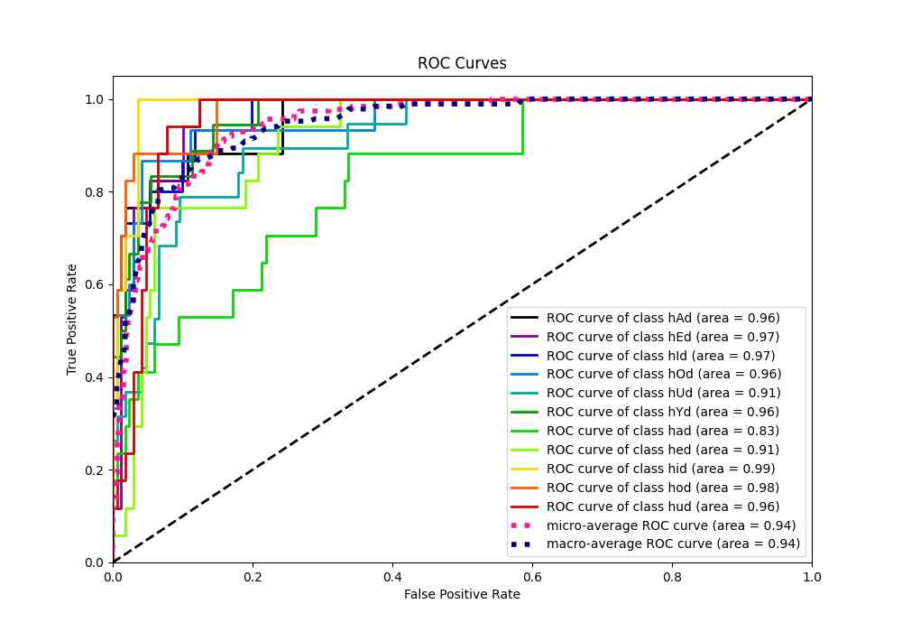
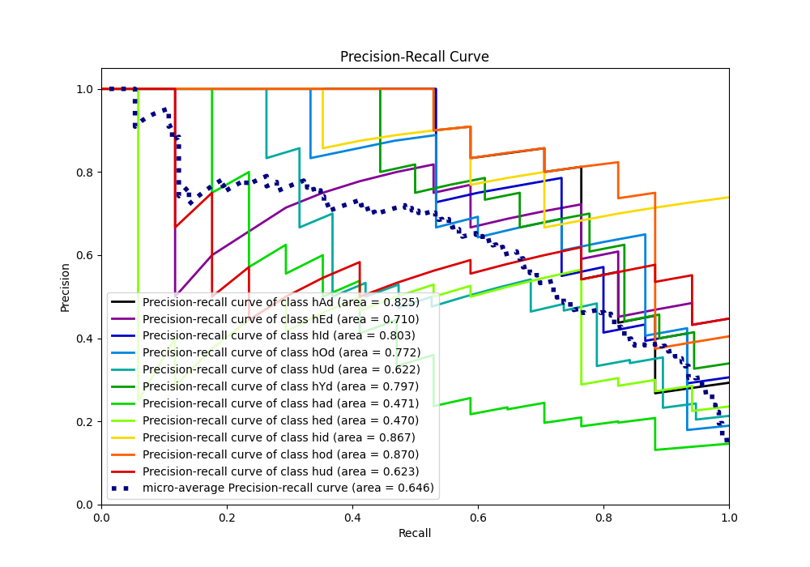

# Summary of 4_Default_RandomForest

[<< Go back](../README.md)

## Random Forest
- **n_jobs**: -1
- **criterion**: gini
- **max_features**: 0.9
- **min_samples_split**: 30
- **max_depth**: 4
- **eval_metric_name**: f1
- **num_class**: 11
- **explain_level**: 1

## Validation
 - **validation_type**: split
 - **train_ratio**: 0.75
 - **shuffle**: True
 - **stratify**: True

## Optimized metric
f1

## Training time

1.6 seconds

### Metric details
|           |       hAd |       hEd |       hId |       hOd |       hUd |       hYd |       had |       hed |       hid |       hod |       hud |   accuracy |   macro avg |   weighted avg |   logloss |
|:----------|----------:|----------:|----------:|----------:|----------:|----------:|----------:|----------:|----------:|----------:|----------:|-----------:|------------:|---------------:|----------:|
| precision |  0.764706 |  0.636364 |  1        |  0.541667 |  0.448276 |  0.681818 |  0.375    |  0.363636 |  0.8      |  0.823529 |  0.588235 |    0.61828 |    0.638476 |       0.633817 |   1.26668 |
| recall    |  0.764706 |  0.823529 |  0.266667 |  0.866667 |  0.684211 |  0.833333 |  0.176471 |  0.235294 |  0.705882 |  0.823529 |  0.588235 |    0.61828 |    0.61532  |       0.61828  |   1.26668 |
| f1-score  |  0.764706 |  0.717949 |  0.421053 |  0.666667 |  0.541667 |  0.75     |  0.24     |  0.285714 |  0.75     |  0.823529 |  0.588235 |    0.61828 |    0.595411 |       0.596773 |   1.26668 |
| support   | 17        | 17        | 15        | 15        | 19        | 18        | 17        | 17        | 17        | 17        | 17        |    0.61828 |  186        |     186        |   1.26668 |

## Confusion matrix
|                |   Predicted as hAd |   Predicted as hEd |   Predicted as hId |   Predicted as hOd |   Predicted as hUd |   Predicted as hYd |   Predicted as had |   Predicted as hed |   Predicted as hid |   Predicted as hod |   Predicted as hud |
|:---------------|-------------------:|-------------------:|-------------------:|-------------------:|-------------------:|-------------------:|-------------------:|-------------------:|-------------------:|-------------------:|-------------------:|
| Labeled as hAd |                 13 |                  0 |                  0 |                  0 |                  0 |                  0 |                  1 |                  3 |                  0 |                  0 |                  0 |
| Labeled as hEd |                  0 |                 14 |                  0 |                  0 |                  0 |                  0 |                  1 |                  2 |                  0 |                  0 |                  0 |
| Labeled as hId |                  0 |                  5 |                  4 |                  0 |                  1 |                  0 |                  0 |                  1 |                  3 |                  0 |                  1 |
| Labeled as hOd |                  0 |                  0 |                  0 |                 13 |                  1 |                  1 |                  0 |                  0 |                  0 |                  0 |                  0 |
| Labeled as hUd |                  0 |                  0 |                  0 |                  1 |                 13 |                  0 |                  0 |                  1 |                  0 |                  3 |                  1 |
| Labeled as hYd |                  0 |                  0 |                  0 |                  3 |                  0 |                 15 |                  0 |                  0 |                  0 |                  0 |                  0 |
| Labeled as had |                  4 |                  1 |                  0 |                  1 |                  2 |                  6 |                  3 |                  0 |                  0 |                  0 |                  0 |
| Labeled as hed |                  0 |                  2 |                  0 |                  4 |                  4 |                  0 |                  3 |                  4 |                  0 |                  0 |                  0 |
| Labeled as hid |                  0 |                  0 |                  0 |                  0 |                  0 |                  0 |                  0 |                  0 |                 12 |                  0 |                  5 |
| Labeled as hod |                  0 |                  0 |                  0 |                  2 |                  1 |                  0 |                  0 |                  0 |                  0 |                 14 |                  0 |
| Labeled as hud |                  0 |                  0 |                  0 |                  0 |                  7 |                  0 |                  0 |                  0 |                  0 |                  0 |                 10 |

## Learning curves

## Permutation-based Importance

## Confusion Matrix

## Normalized Confusion Matrix

## ROC Curve

## Precision Recall Curve

[<< Go back](../README.md)
