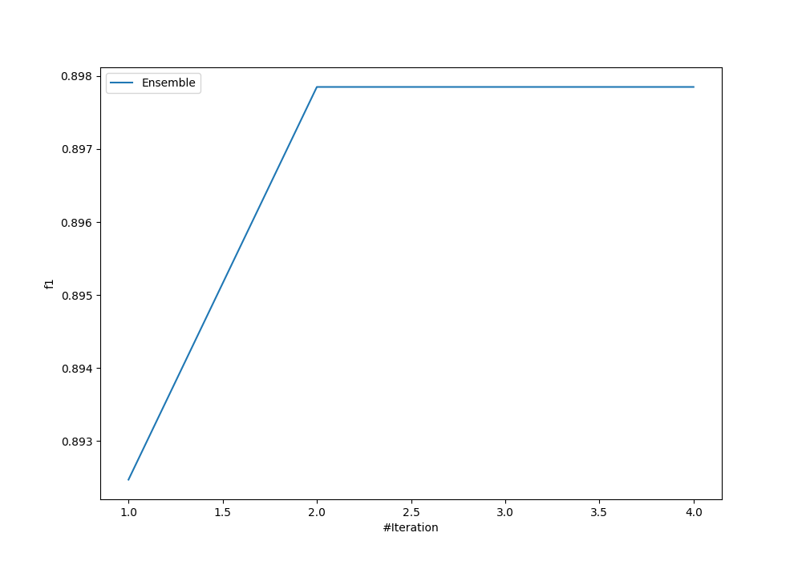
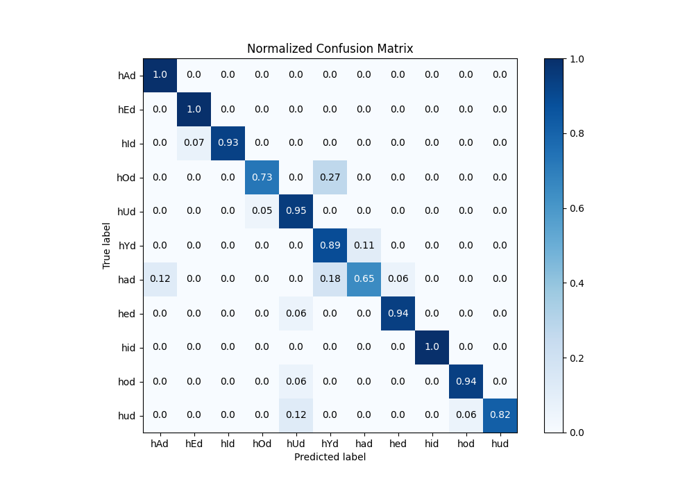
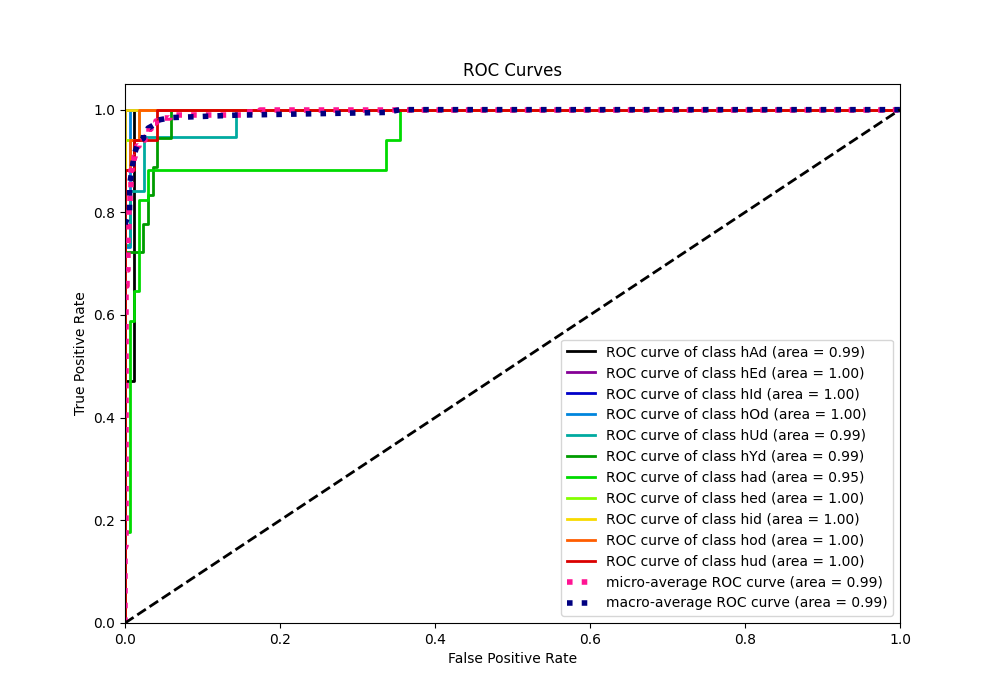
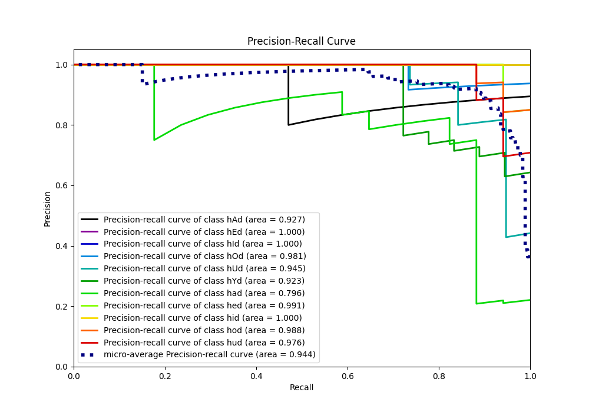

# Summary of Ensemble

[<< Go back](../README.md)

## Ensemble structure
| Model                   |   Weight |
|:------------------------|---------:|
| 3_Default_NeuralNetwork |        1 |
| 4_Default_RandomForest  |        1 |

### Metric details
|           |       hAd |       hEd |       hId |       hOd |       hUd |       hYd |       had |       hed |   hid |       hod |       hud |   accuracy |   macro avg |   weighted avg |   logloss |
|:----------|----------:|----------:|----------:|----------:|----------:|----------:|----------:|----------:|------:|----------:|----------:|-----------:|------------:|---------------:|----------:|
| precision |  0.894737 |  0.944444 |  1        |  0.916667 |  0.818182 |  0.695652 |  0.846154 |  0.941176 |     1 |  0.941176 |  1        |   0.897849 |    0.908926 |       0.905741 |  0.590139 |
| recall    |  1        |  1        |  0.933333 |  0.733333 |  0.947368 |  0.888889 |  0.647059 |  0.941176 |     1 |  0.941176 |  0.823529 |   0.897849 |    0.895988 |       0.897849 |  0.590139 |
| f1-score  |  0.944444 |  0.971429 |  0.965517 |  0.814815 |  0.878049 |  0.780488 |  0.733333 |  0.941176 |     1 |  0.941176 |  0.903226 |   0.897849 |    0.897605 |       0.896925 |  0.590139 |
| support   | 17        | 17        | 15        | 15        | 19        | 18        | 17        | 17        |    17 | 17        | 17        |   0.897849 |  186        |     186        |  0.590139 |

## Confusion matrix
|                |   Predicted as hAd |   Predicted as hEd |   Predicted as hId |   Predicted as hOd |   Predicted as hUd |   Predicted as hYd |   Predicted as had |   Predicted as hed |   Predicted as hid |   Predicted as hod |   Predicted as hud |
|:---------------|-------------------:|-------------------:|-------------------:|-------------------:|-------------------:|-------------------:|-------------------:|-------------------:|-------------------:|-------------------:|-------------------:|
| Labeled as hAd |                 17 |                  0 |                  0 |                  0 |                  0 |                  0 |                  0 |                  0 |                  0 |                  0 |                  0 |
| Labeled as hEd |                  0 |                 17 |                  0 |                  0 |                  0 |                  0 |                  0 |                  0 |                  0 |                  0 |                  0 |
| Labeled as hId |                  0 |                  1 |                 14 |                  0 |                  0 |                  0 |                  0 |                  0 |                  0 |                  0 |                  0 |
| Labeled as hOd |                  0 |                  0 |                  0 |                 11 |                  0 |                  4 |                  0 |                  0 |                  0 |                  0 |                  0 |
| Labeled as hUd |                  0 |                  0 |                  0 |                  1 |                 18 |                  0 |                  0 |                  0 |                  0 |                  0 |                  0 |
| Labeled as hYd |                  0 |                  0 |                  0 |                  0 |                  0 |                 16 |                  2 |                  0 |                  0 |                  0 |                  0 |
| Labeled as had |                  2 |                  0 |                  0 |                  0 |                  0 |                  3 |                 11 |                  1 |                  0 |                  0 |                  0 |
| Labeled as hed |                  0 |                  0 |                  0 |                  0 |                  1 |                  0 |                  0 |                 16 |                  0 |                  0 |                  0 |
| Labeled as hid |                  0 |                  0 |                  0 |                  0 |                  0 |                  0 |                  0 |                  0 |                 17 |                  0 |                  0 |
| Labeled as hod |                  0 |                  0 |                  0 |                  0 |                  1 |                  0 |                  0 |                  0 |                  0 |                 16 |                  0 |
| Labeled as hud |                  0 |                  0 |                  0 |                  0 |                  2 |                  0 |                  0 |                  0 |                  0 |                  1 |                 14 |

## Learning curves

## Confusion Matrix

## Normalized Confusion Matrix

## ROC Curve

## Precision Recall Curve

[<< Go back](../README.md)
