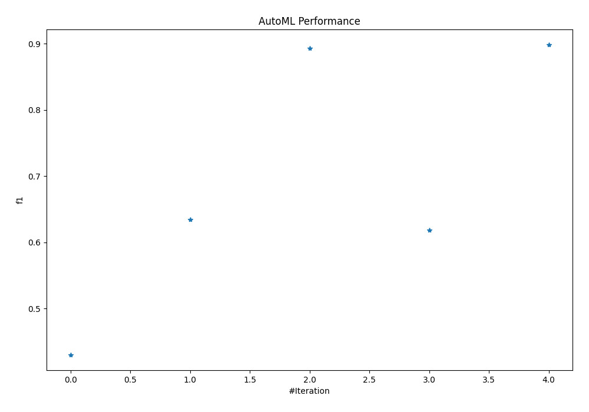
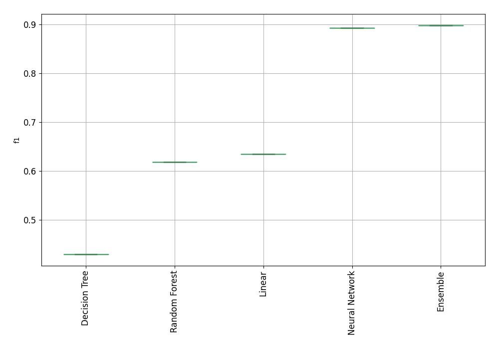
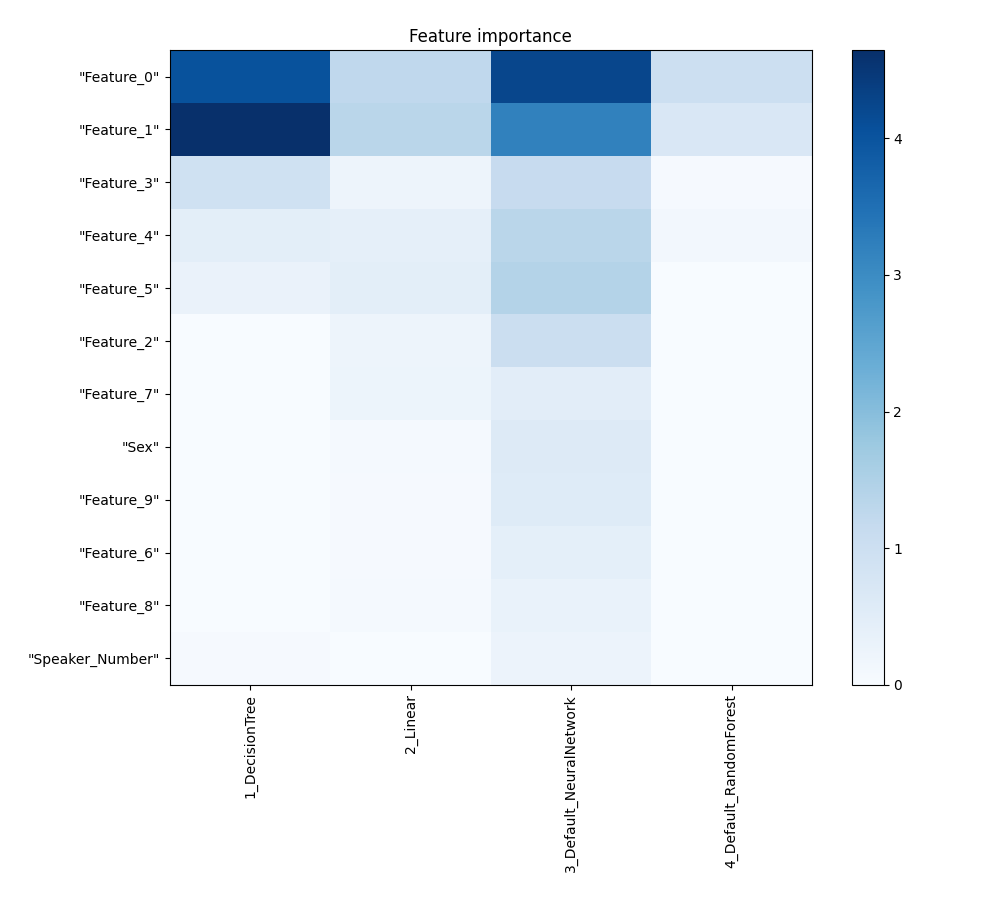
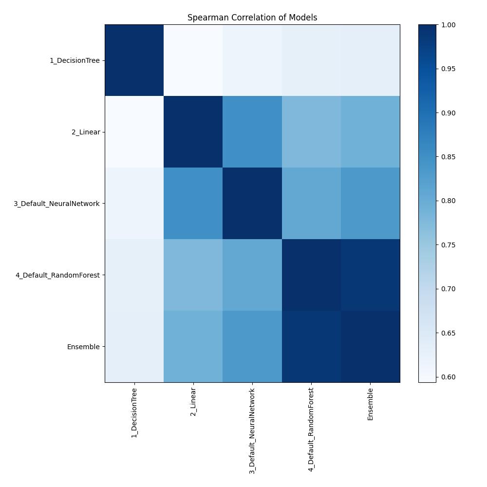

# AutoML Leaderboard

| Best model   | name                                                         | model_type     | metric_type   |   metric_value |   train_time |
|:-------------|:-------------------------------------------------------------|:---------------|:--------------|---------------:|-------------:|
|              | [1_DecisionTree](1_DecisionTree/README.md)                   | Decision Tree  | f1            |       0.430108 |         2.2  |
|              | [2_Linear](2_Linear/README.md)                               | Linear         | f1            |       0.634409 |         3.34 |
|              | [3_Default_NeuralNetwork](3_Default_NeuralNetwork/README.md) | Neural Network | f1            |       0.892473 |         2.66 |
|              | [4_Default_RandomForest](4_Default_RandomForest/README.md)   | Random Forest  | f1            |       0.61828  |         3.53 |
| **the best** | [Ensemble](Ensemble/README.md)                               | Ensemble       | f1            |       0.897849 |         0.32 |

### AutoML Performance

### AutoML Performance Boxplot

### Features Importance

### Spearman Correlation of Models

