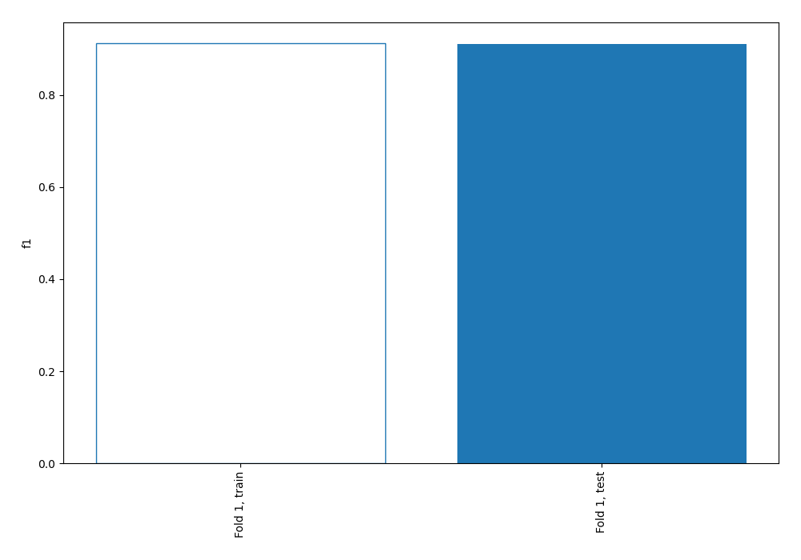
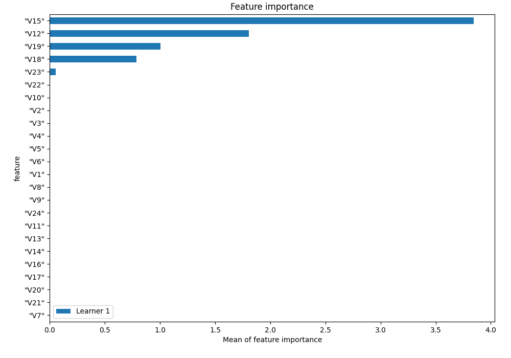
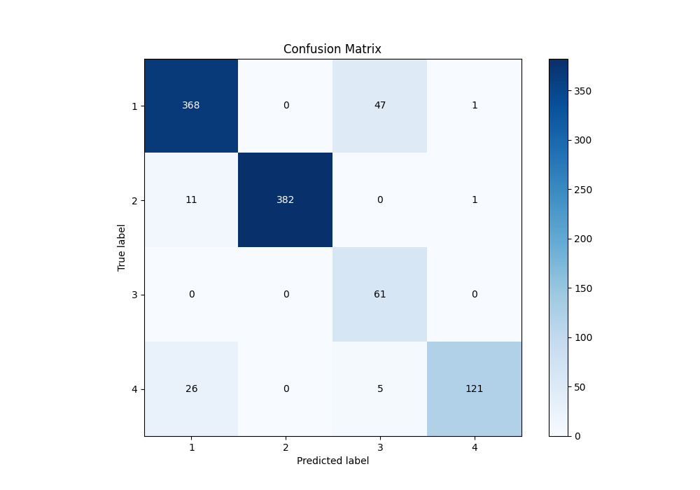
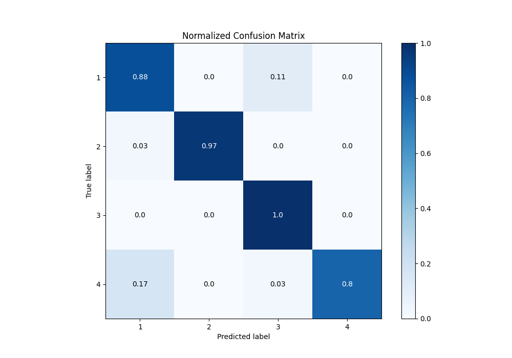
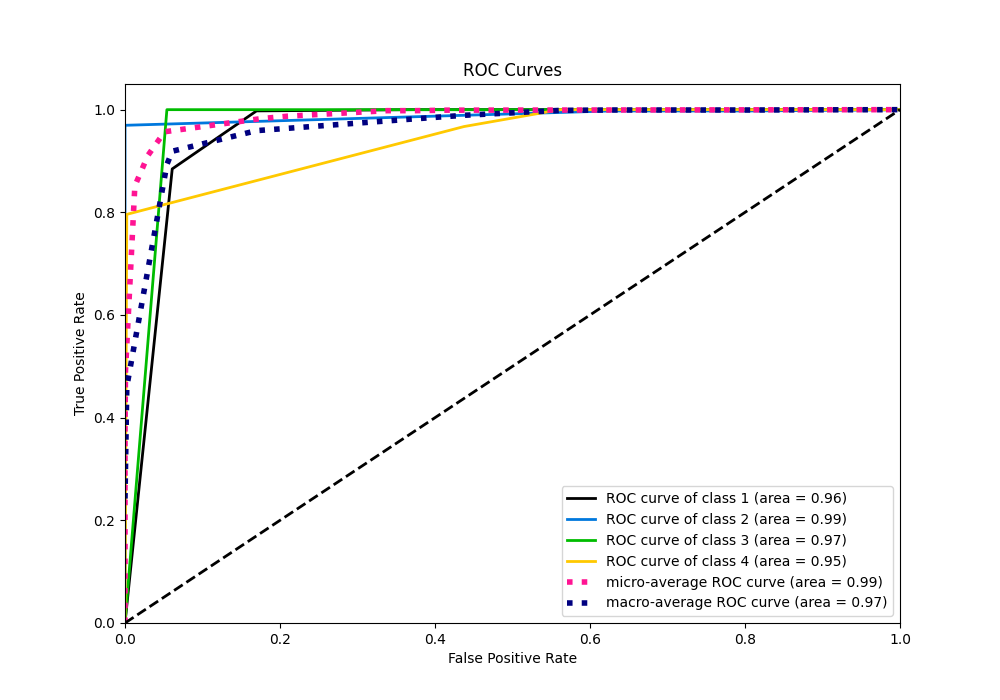
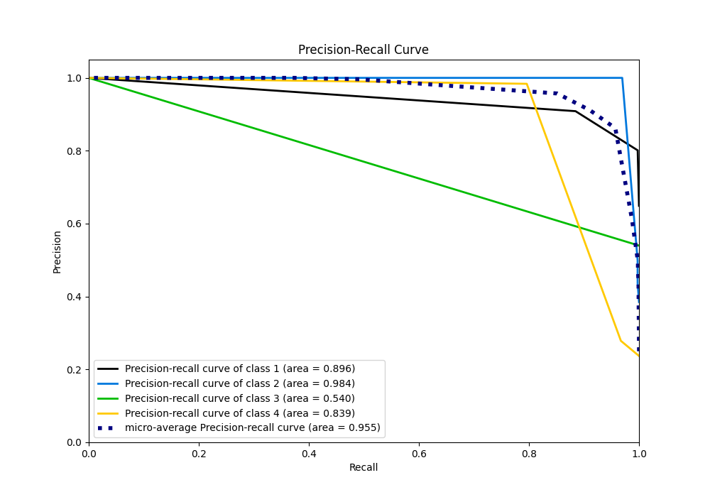

# Summary of 1_DecisionTree

[<< Go back](../README.md)

## Decision Tree
- **n_jobs**: -1
- **criterion**: entropy
- **max_depth**: 4
- **num_class**: 4
- **explain_level**: 1

## Validation
 - **validation_type**: split
 - **train_ratio**: 0.75
 - **shuffle**: True
 - **stratify**: True

## Optimized metric
f1

## Training time

3.2 seconds

### Metric details
|           |          1 |          2 |         3 |          4 |   accuracy |   macro avg |   weighted avg |   logloss |
|:----------|-----------:|-----------:|----------:|-----------:|-----------:|------------:|---------------:|----------:|
| precision |   0.908642 |   1        |  0.539823 |   0.98374  |   0.911046 |    0.858051 |       0.932994 |  0.255848 |
| recall    |   0.884615 |   0.969543 |  1        |   0.796053 |   0.911046 |    0.912553 |       0.911046 |  0.255848 |
| f1-score  |   0.896468 |   0.984536 |  0.701149 |   0.88     |   0.911046 |    0.865538 |       0.916293 |  0.255848 |
| support   | 416        | 394        | 61        | 152        |   0.911046 | 1023        |    1023        |  0.255848 |

## Confusion matrix
|              |   Predicted as 1 |   Predicted as 2 |   Predicted as 3 |   Predicted as 4 |
|:-------------|-----------------:|-----------------:|-----------------:|-----------------:|
| Labeled as 1 |              368 |                0 |               47 |                1 |
| Labeled as 2 |               11 |              382 |                0 |                1 |
| Labeled as 3 |                0 |                0 |               61 |                0 |
| Labeled as 4 |               26 |                0 |                5 |              121 |

## Learning curves

## Permutation-based Importance

## Confusion Matrix

## Normalized Confusion Matrix

## ROC Curve

## Precision Recall Curve

[<< Go back](../README.md)
