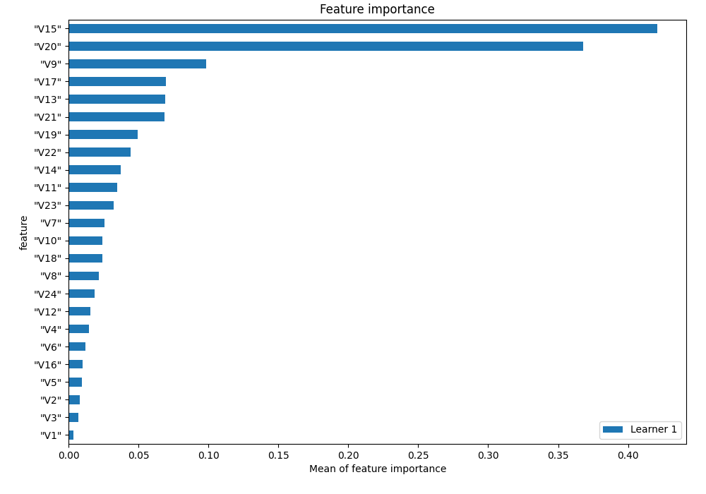
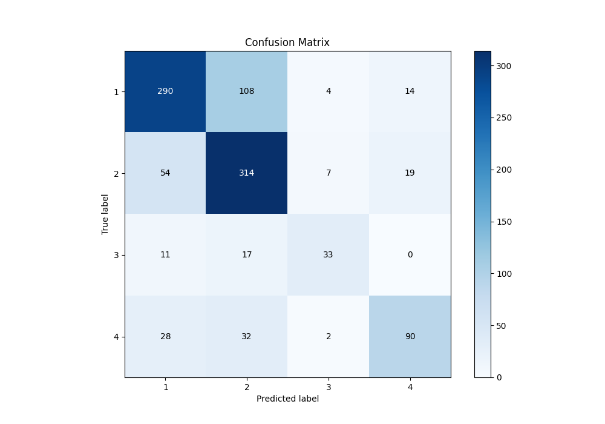
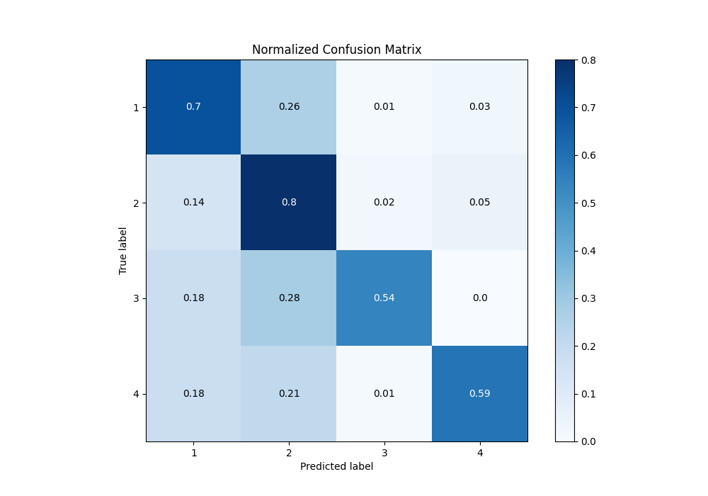
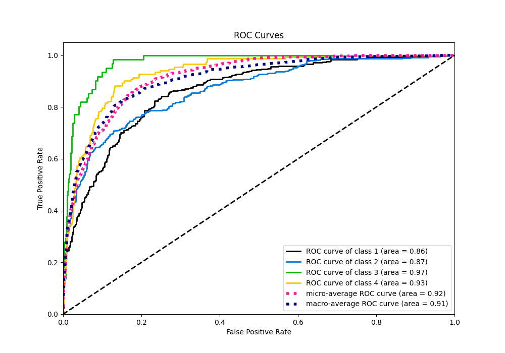
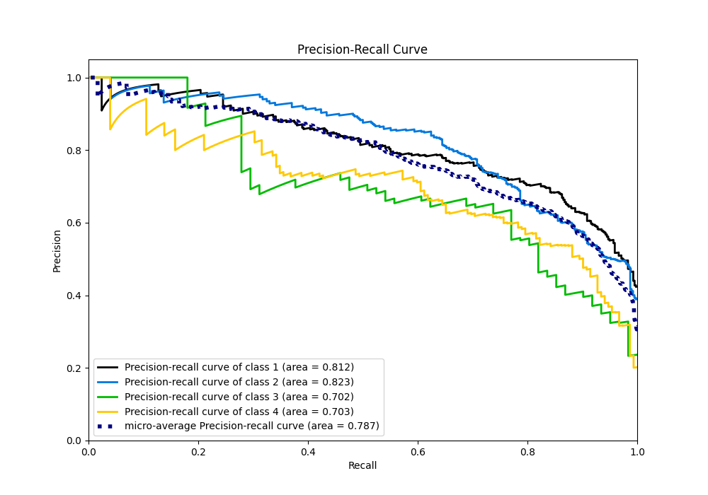

# Summary of 2_Linear

[<< Go back](../README.md)

## Logistic Regression (Linear)
- **n_jobs**: -1
- **num_class**: 4
- **explain_level**: 1

## Validation
 - **validation_type**: split
 - **train_ratio**: 0.75
 - **shuffle**: True
 - **stratify**: True

## Optimized metric
f1

## Training time

0.6 seconds

### Metric details
|           |          1 |          2 |         3 |          4 |   accuracy |   macro avg |   weighted avg |   logloss |
|:----------|-----------:|-----------:|----------:|-----------:|-----------:|------------:|---------------:|----------:|
| precision |   0.75718  |   0.666667 |  0.717391 |   0.731707 |   0.710655 |    0.718236 |       0.716162 |  0.690096 |
| recall    |   0.697115 |   0.796954 |  0.540984 |   0.592105 |   0.710655 |    0.65679  |       0.710655 |  0.690096 |
| f1-score  |   0.725907 |   0.726012 |  0.616822 |   0.654545 |   0.710655 |    0.680822 |       0.70884  |  0.690096 |
| support   | 416        | 394        | 61        | 152        |   0.710655 | 1023        |    1023        |  0.690096 |

## Confusion matrix
|              |   Predicted as 1 |   Predicted as 2 |   Predicted as 3 |   Predicted as 4 |
|:-------------|-----------------:|-----------------:|-----------------:|-----------------:|
| Labeled as 1 |              290 |              108 |                4 |               14 |
| Labeled as 2 |               54 |              314 |                7 |               19 |
| Labeled as 3 |               11 |               17 |               33 |                0 |
| Labeled as 4 |               28 |               32 |                2 |               90 |

## Learning curves

## Coefficients

### Coefficients learner #1
|           |          1 |           2 |          3 |          4 |
|:----------|-----------:|------------:|-----------:|-----------:|
| intercept |  2.36786   |  1.94625    | -2.04064   | -2.27348   |
| "V1"      | -0.0649037 | -0.0522909  |  0.0913406 |  0.0258541 |
| "V2"      |  0.173796  | -0.0345405  | -0.293626  |  0.154371  |
| "V3"      | -0.0637107 |  0.135336   | -0.230478  |  0.158853  |
| "V4"      |  0.111192  | -0.164629   | -0.1502    |  0.203637  |
| "V5"      |  0.173368  |  0.00490979 | -0.334268  |  0.155991  |
| "V6"      | -0.0966259 |  0.0246445  | -0.156376  |  0.228357  |
| "V7"      |  0.230461  | -0.0203582  | -0.459435  |  0.249333  |
| "V8"      | -0.257054  |  0.0447416  |  0.405728  | -0.193415  |
| "V9"      |  0.719795  |  0.252164   | -0.991067  |  0.0191084 |
| "V10"     | -0.0489325 |  0.247901   | -0.385919  |  0.18695   |
| "V11"     |  0.160627  | -0.11945    | -0.489671  |  0.448494  |
| "V12"     | -0.033225  | -0.282798   |  0.483455  | -0.167432  |
| "V13"     |  0.463967  |  0.324458   | -0.372142  | -0.416283  |
| "V14"     | -0.152702  | -0.196358   | -0.181255  |  0.530315  |
| "V15"     |  0.727609  | -1.28898    |  0.0916716 |  0.469698  |
| "V16"     |  0.11199   | -0.176736   |  0.139979  | -0.0752328 |
| "V17"     | -0.334185  | -0.189267   |  0.103754  |  0.419698  |
| "V18"     |  0.134781  | -0.284596   |  0.192612  | -0.0427976 |
| "V19"     |  0.281916  |  0.0219995  |  0.433906  | -0.737822  |
| "V20"     |  1.68131   |  1.76868    |  2.53237   | -5.98236   |
| "V21"     | -0.124772  |  0.557958   | -0.658043  |  0.224856  |
| "V22"     |  0.419276  | -0.0412519  | -0.134752  | -0.243272  |
| "V23"     | -0.0151514 |  0.188245   |  0.355607  | -0.5287    |
| "V24"     | -0.0810076 |  0.181617   |  0.168824  | -0.269433  |

## Permutation-based Importance

## Confusion Matrix

## Normalized Confusion Matrix

## ROC Curve

## Precision Recall Curve

[<< Go back](../README.md)
