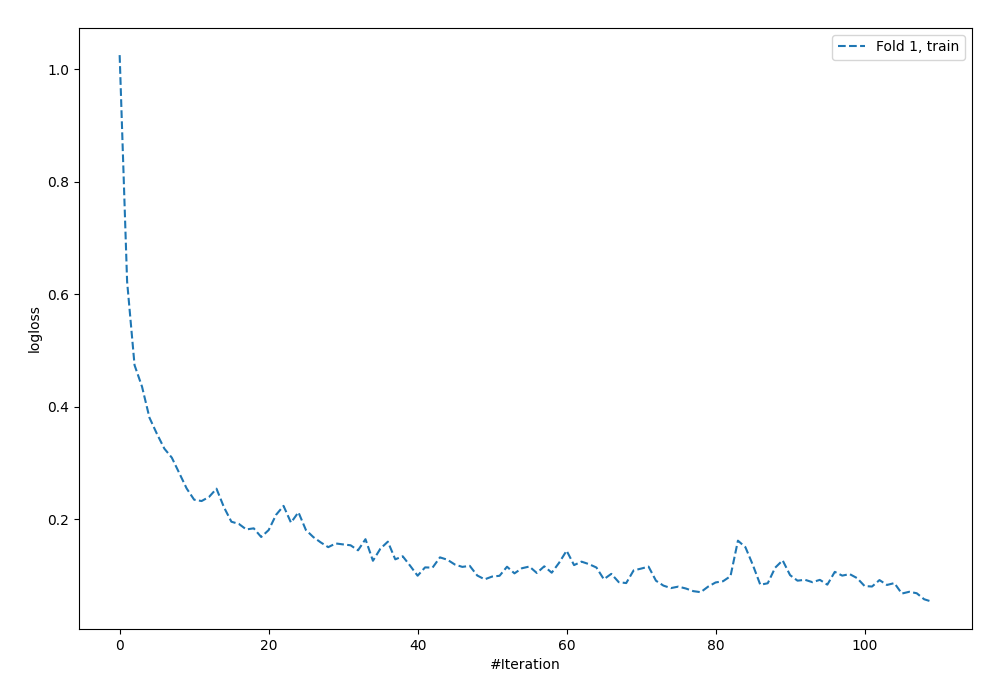
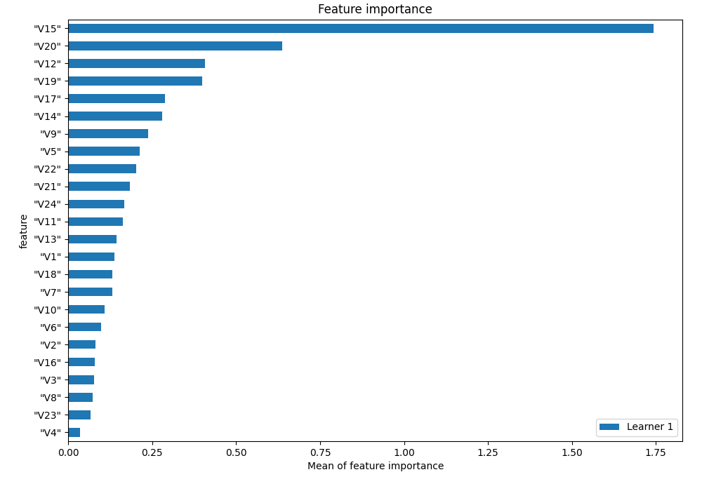
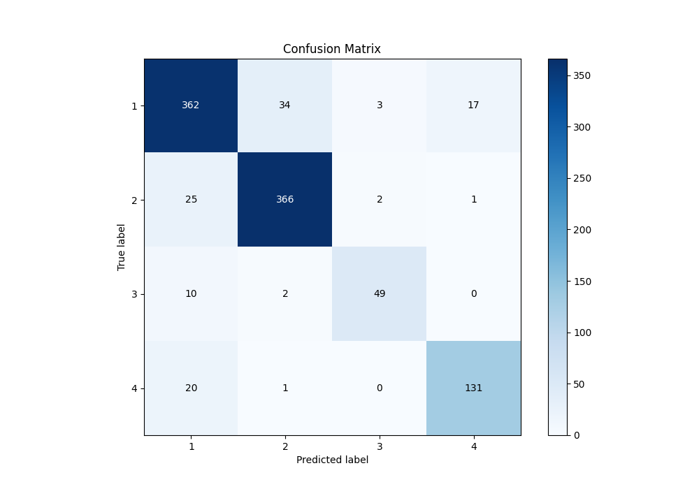
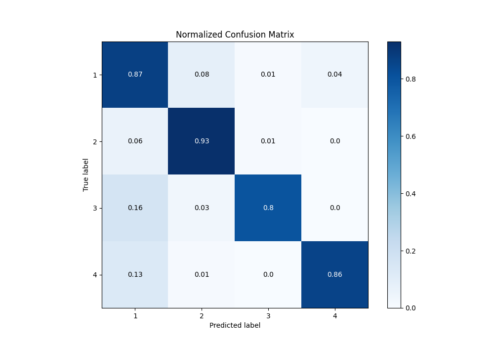
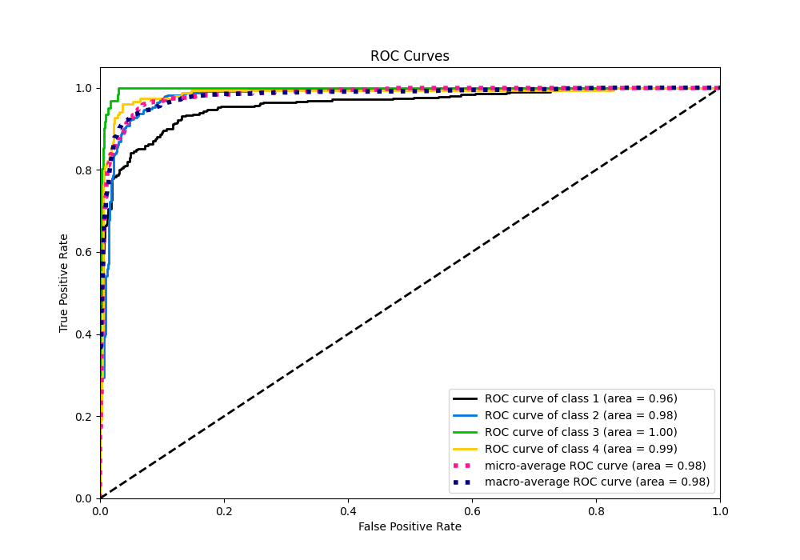
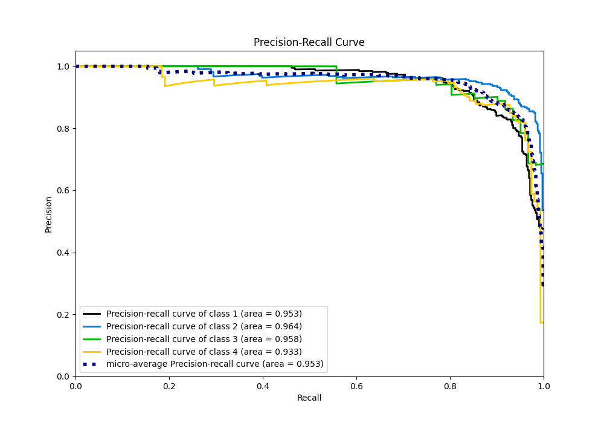

# Summary of 3_Default_NeuralNetwork

[<< Go back](../README.md)

## Neural Network
- **n_jobs**: -1
- **dense_1_size**: 32
- **dense_2_size**: 16
- **learning_rate**: 0.05
- **num_class**: 4
- **explain_level**: 1

## Validation
 - **validation_type**: split
 - **train_ratio**: 0.75
 - **shuffle**: True
 - **stratify**: True

## Optimized metric
f1

## Training time

1.6 seconds

### Metric details
|           |          1 |          2 |         3 |          4 |   accuracy |   macro avg |   weighted avg |   logloss |
|:----------|-----------:|-----------:|----------:|-----------:|-----------:|------------:|---------------:|----------:|
| precision |   0.868106 |   0.908189 |  0.907407 |   0.879195 |   0.887586 |    0.890724 |       0.887534 |   0.38049 |
| recall    |   0.870192 |   0.928934 |  0.803279 |   0.861842 |   0.887586 |    0.866062 |       0.887586 |   0.38049 |
| f1-score  |   0.869148 |   0.918444 |  0.852174 |   0.870432 |   0.887586 |    0.877549 |       0.887312 |   0.38049 |
| support   | 416        | 394        | 61        | 152        |   0.887586 | 1023        |    1023        |   0.38049 |

## Confusion matrix
|              |   Predicted as 1 |   Predicted as 2 |   Predicted as 3 |   Predicted as 4 |
|:-------------|-----------------:|-----------------:|-----------------:|-----------------:|
| Labeled as 1 |              362 |               34 |                3 |               17 |
| Labeled as 2 |               25 |              366 |                2 |                1 |
| Labeled as 3 |               10 |                2 |               49 |                0 |
| Labeled as 4 |               20 |                1 |                0 |              131 |

## Learning curves

## Permutation-based Importance

## Confusion Matrix

## Normalized Confusion Matrix

## ROC Curve

## Precision Recall Curve

[<< Go back](../README.md)
