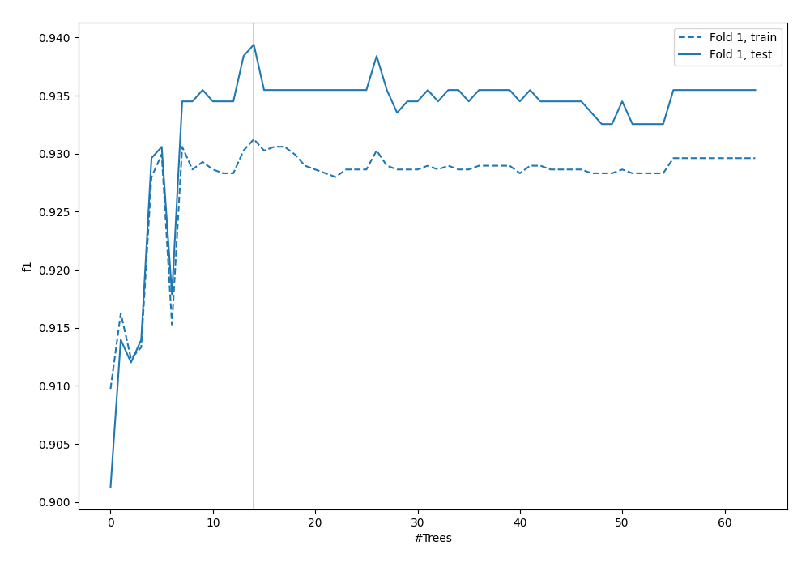
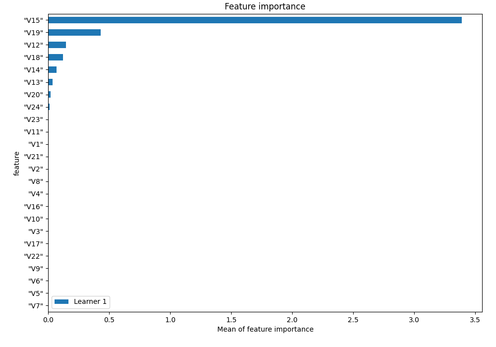
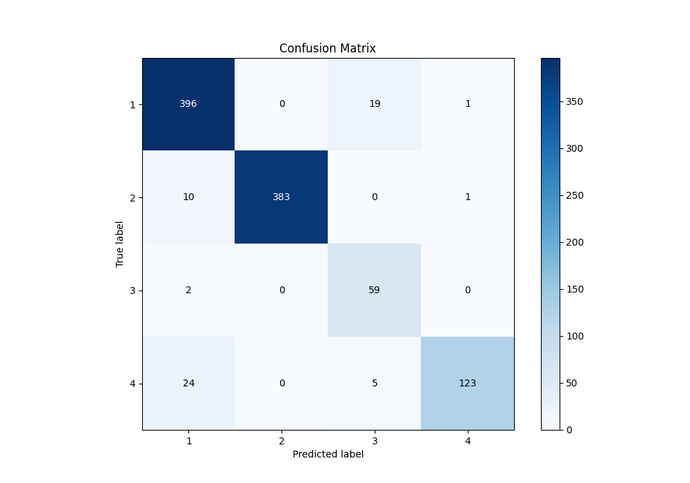
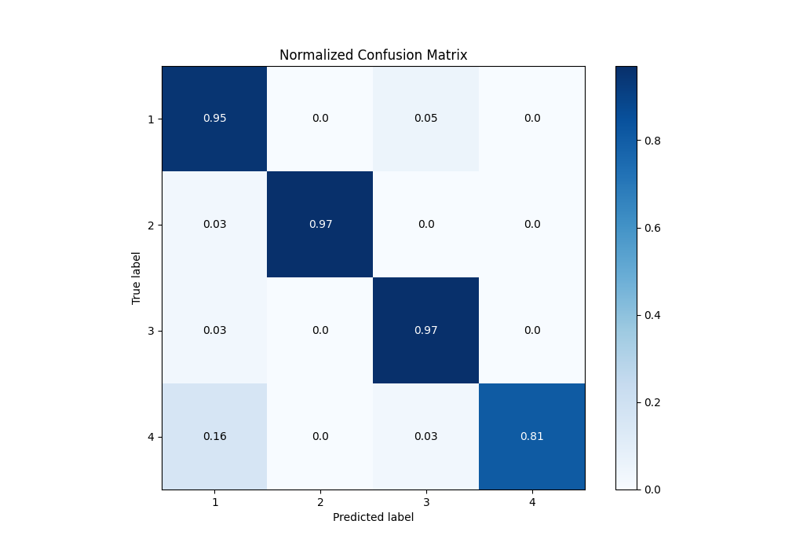
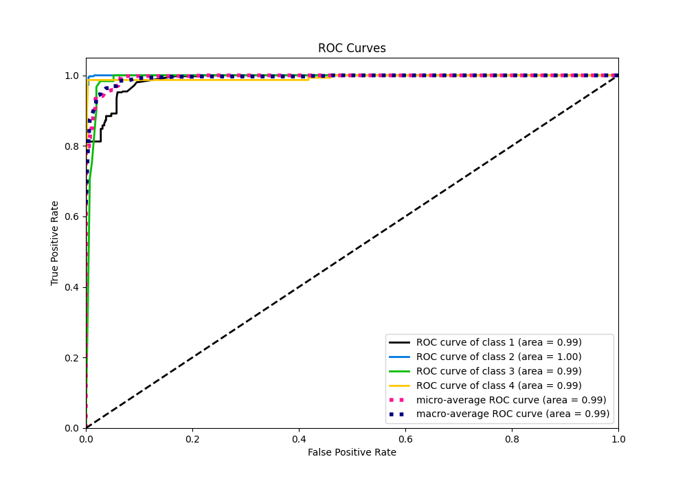

# Summary of 4_Default_RandomForest

[<< Go back](../README.md)

## Random Forest
- **n_jobs**: -1
- **criterion**: gini
- **max_features**: 0.9
- **min_samples_split**: 30
- **max_depth**: 4
- **eval_metric_name**: f1
- **num_class**: 4
- **explain_level**: 1

## Validation
 - **validation_type**: split
 - **train_ratio**: 0.75
 - **shuffle**: True
 - **stratify**: True

## Optimized metric
f1

## Training time

1.4 seconds

### Metric details
|           |          1 |          2 |         3 |          4 |   accuracy |   macro avg |   weighted avg |   logloss |
|:----------|-----------:|-----------:|----------:|-----------:|-----------:|------------:|---------------:|----------:|
| precision |   0.916667 |   1        |  0.710843 |   0.984    |   0.939394 |    0.902878 |       0.946493 |  0.206767 |
| recall    |   0.951923 |   0.972081 |  0.967213 |   0.809211 |   0.939394 |    0.925107 |       0.939394 |  0.206767 |
| f1-score  |   0.933962 |   0.985843 |  0.819444 |   0.888087 |   0.939394 |    0.906834 |       0.940299 |  0.206767 |
| support   | 416        | 394        | 61        | 152        |   0.939394 | 1023        |    1023        |  0.206767 |

## Confusion matrix
|              |   Predicted as 1 |   Predicted as 2 |   Predicted as 3 |   Predicted as 4 |
|:-------------|-----------------:|-----------------:|-----------------:|-----------------:|
| Labeled as 1 |              396 |                0 |               19 |                1 |
| Labeled as 2 |               10 |              383 |                0 |                1 |
| Labeled as 3 |                2 |                0 |               59 |                0 |
| Labeled as 4 |               24 |                0 |                5 |              123 |

## Learning curves

## Permutation-based Importance

## Confusion Matrix

## Normalized Confusion Matrix

## ROC Curve

## Precision Recall Curve

[<< Go back](../README.md)
