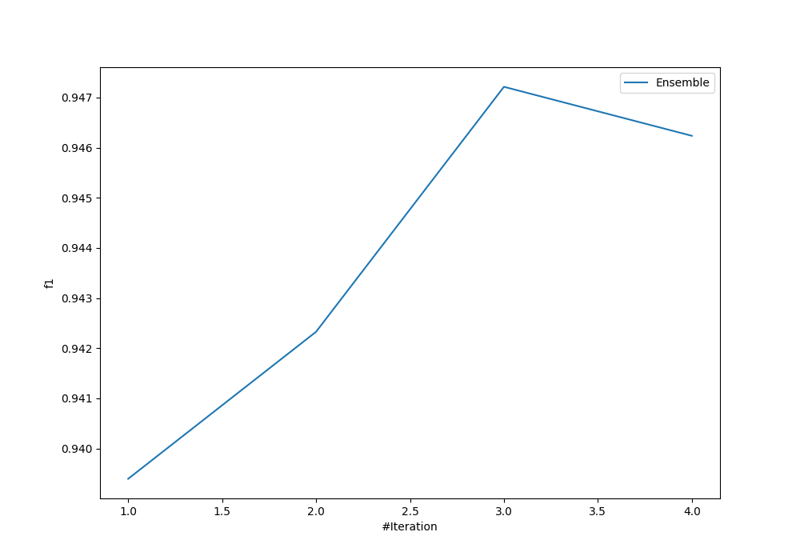
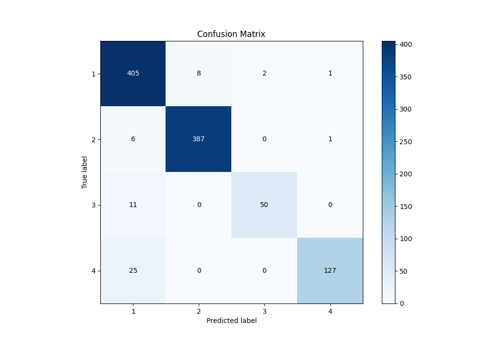
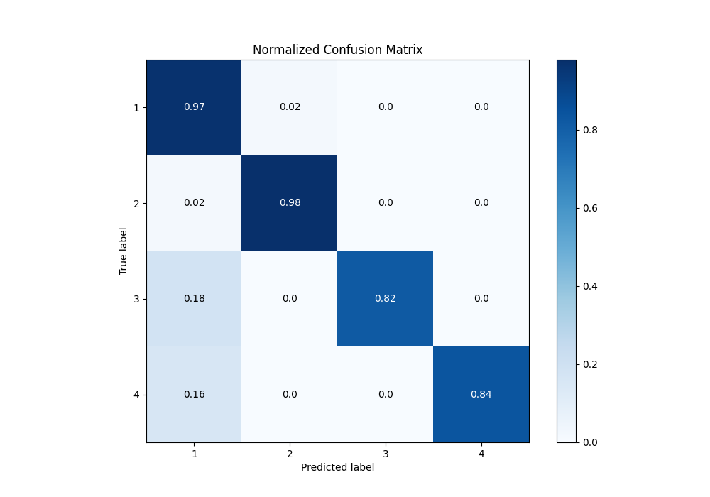
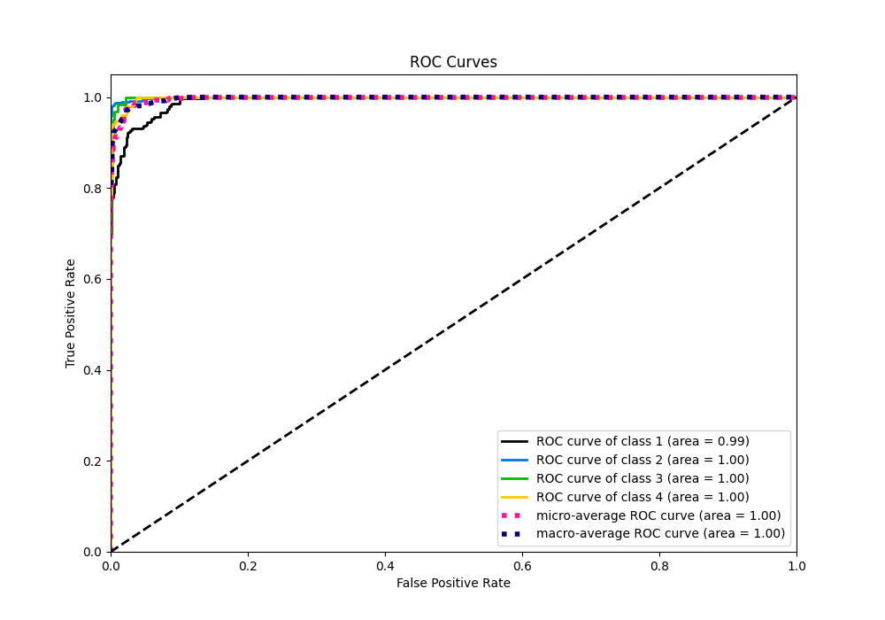
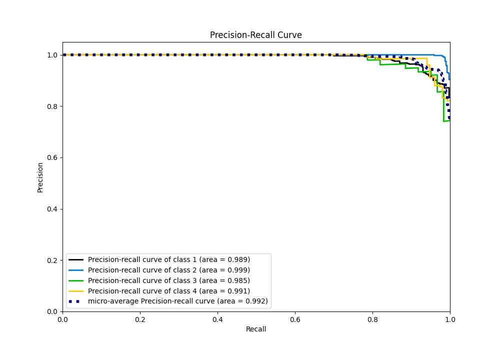

# Summary of Ensemble

[<< Go back](../README.md)

## Ensemble structure
| Model                   |   Weight |
|:------------------------|---------:|
| 3_Default_NeuralNetwork |        1 |
| 4_Default_RandomForest  |        2 |

### Metric details
|           |          1 |          2 |         3 |          4 |   accuracy |   macro avg |   weighted avg |   logloss |
|:----------|-----------:|-----------:|----------:|-----------:|-----------:|------------:|---------------:|----------:|
| precision |   0.90604  |   0.979747 |  0.961538 |   0.984496 |   0.947214 |    0.957955 |       0.949394 |  0.175253 |
| recall    |   0.973558 |   0.982234 |  0.819672 |   0.835526 |   0.947214 |    0.902747 |       0.947214 |  0.175253 |
| f1-score  |   0.938586 |   0.980989 |  0.884956 |   0.903915 |   0.947214 |    0.927111 |       0.946568 |  0.175253 |
| support   | 416        | 394        | 61        | 152        |   0.947214 | 1023        |    1023        |  0.175253 |

## Confusion matrix
|              |   Predicted as 1 |   Predicted as 2 |   Predicted as 3 |   Predicted as 4 |
|:-------------|-----------------:|-----------------:|-----------------:|-----------------:|
| Labeled as 1 |              405 |                8 |                2 |                1 |
| Labeled as 2 |                6 |              387 |                0 |                1 |
| Labeled as 3 |               11 |                0 |               50 |                0 |
| Labeled as 4 |               25 |                0 |                0 |              127 |

## Learning curves

## Confusion Matrix

## Normalized Confusion Matrix

## ROC Curve

## Precision Recall Curve

[<< Go back](../README.md)
