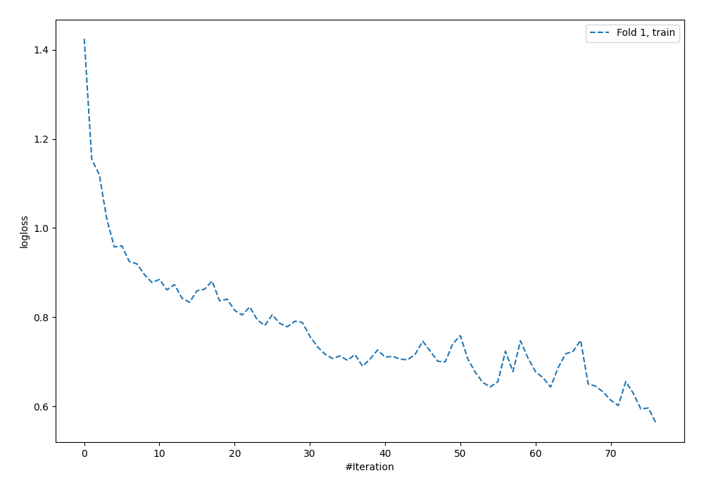
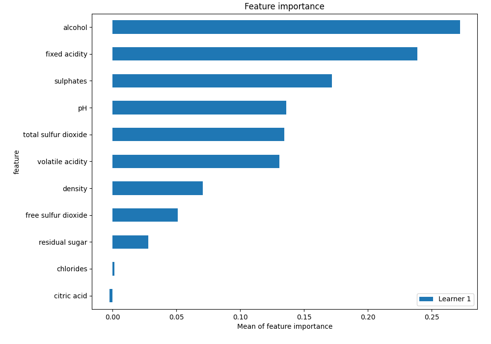
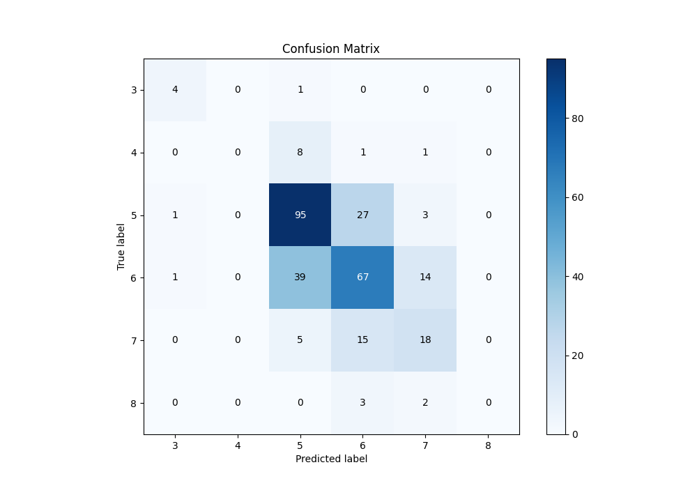
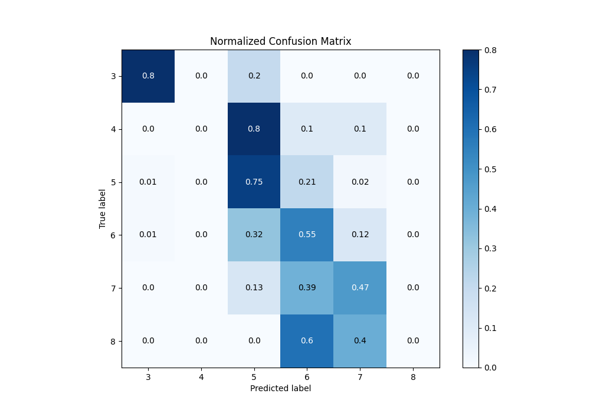
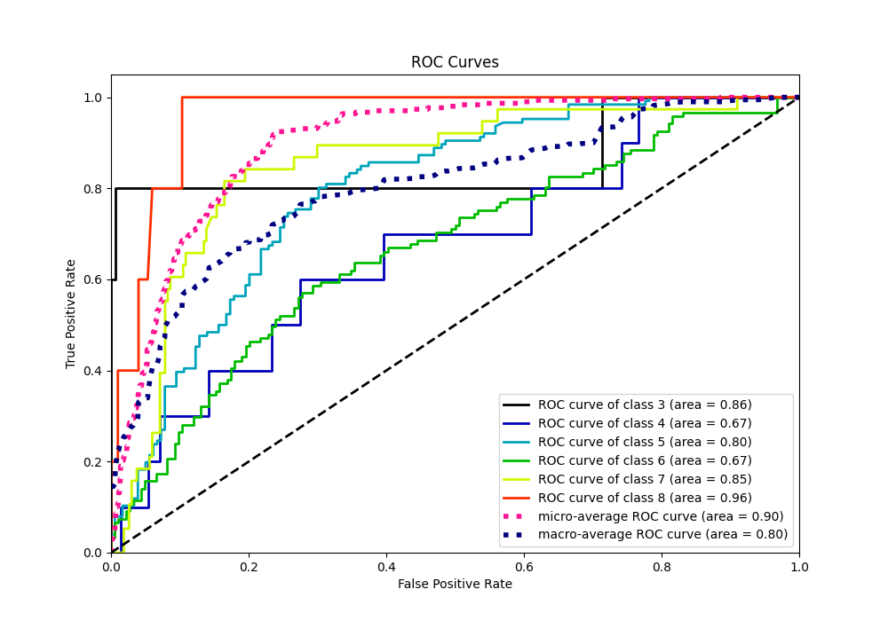
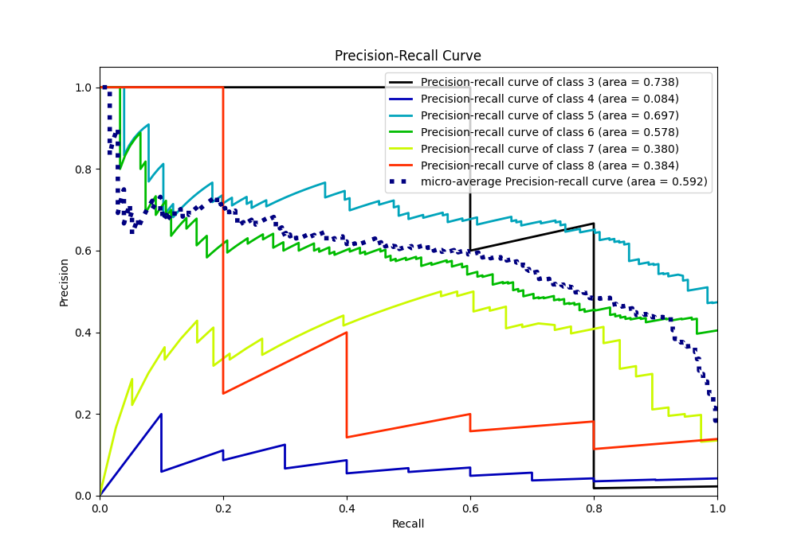

# Summary of 3_Default_NeuralNetwork

[<< Go back](../README.md)

## Neural Network
- **n_jobs**: -1
- **dense_1_size**: 32
- **dense_2_size**: 16
- **learning_rate**: 0.05
- **num_class**: 6
- **explain_level**: 1

## Validation
 - **validation_type**: split
 - **train_ratio**: 0.75
 - **shuffle**: True
 - **stratify**: True

## Optimized metric
f1

## Training time

0.8 seconds

### Metric details
|           |        3 |   4 |          5 |          6 |         7 |   8 |   accuracy |   macro avg |   weighted avg |   logloss |
|:----------|---------:|----:|-----------:|-----------:|----------:|----:|-----------:|------------:|---------------:|----------:|
| precision | 0.666667 |   0 |   0.641892 |   0.59292  |  0.473684 |   0 |   0.603279 |    0.395861 |       0.570345 |   1.03538 |
| recall    | 0.8      |   0 |   0.753968 |   0.553719 |  0.473684 |   0 |   0.603279 |    0.430229 |       0.603279 |   1.03538 |
| f1-score  | 0.727273 |   0 |   0.693431 |   0.57265  |  0.473684 |   0 |   0.603279 |    0.411173 |       0.584588 |   1.03538 |
| support   | 5        |  10 | 126        | 121        | 38        |   5 |   0.603279 |  305        |     305        |   1.03538 |

## Confusion matrix
|              |   Predicted as 3 |   Predicted as 4 |   Predicted as 5 |   Predicted as 6 |   Predicted as 7 |   Predicted as 8 |
|:-------------|-----------------:|-----------------:|-----------------:|-----------------:|-----------------:|-----------------:|
| Labeled as 3 |                4 |                0 |                1 |                0 |                0 |                0 |
| Labeled as 4 |                0 |                0 |                8 |                1 |                1 |                0 |
| Labeled as 5 |                1 |                0 |               95 |               27 |                3 |                0 |
| Labeled as 6 |                1 |                0 |               39 |               67 |               14 |                0 |
| Labeled as 7 |                0 |                0 |                5 |               15 |               18 |                0 |
| Labeled as 8 |                0 |                0 |                0 |                3 |                2 |                0 |

## Learning curves

## Permutation-based Importance

## Confusion Matrix

## Normalized Confusion Matrix

## ROC Curve

## Precision Recall Curve

[<< Go back](../README.md)
