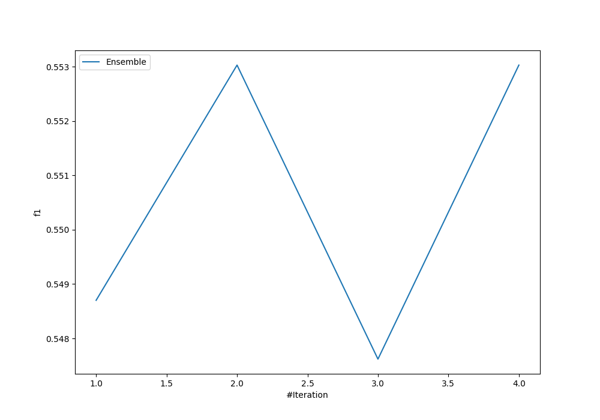
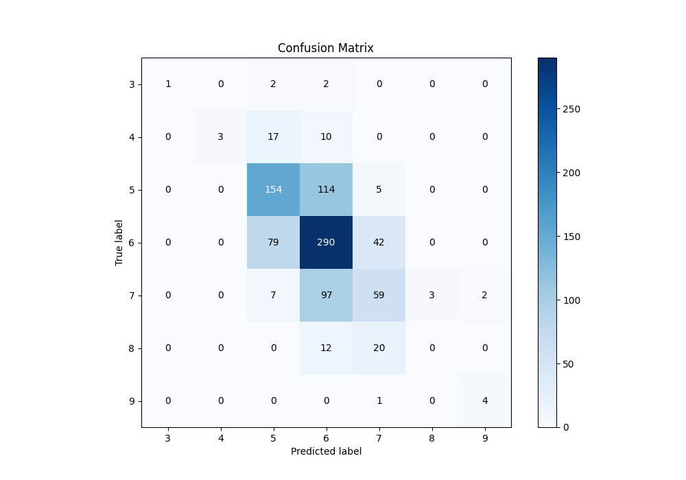
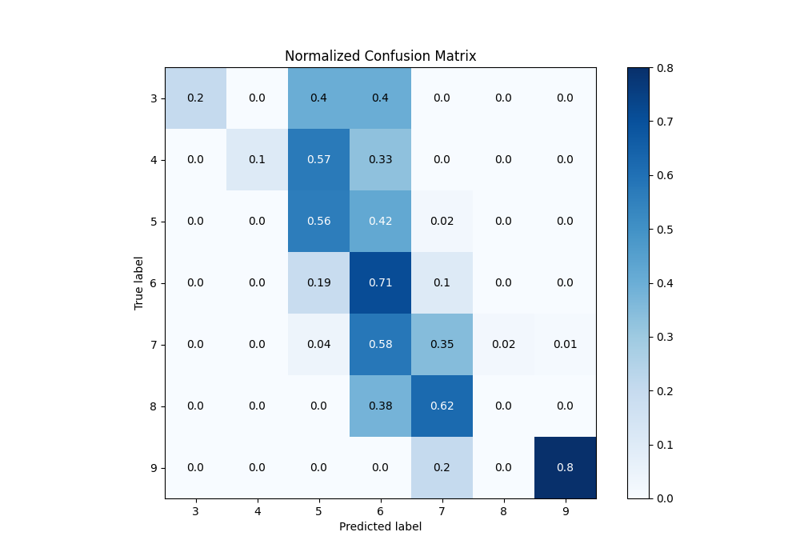
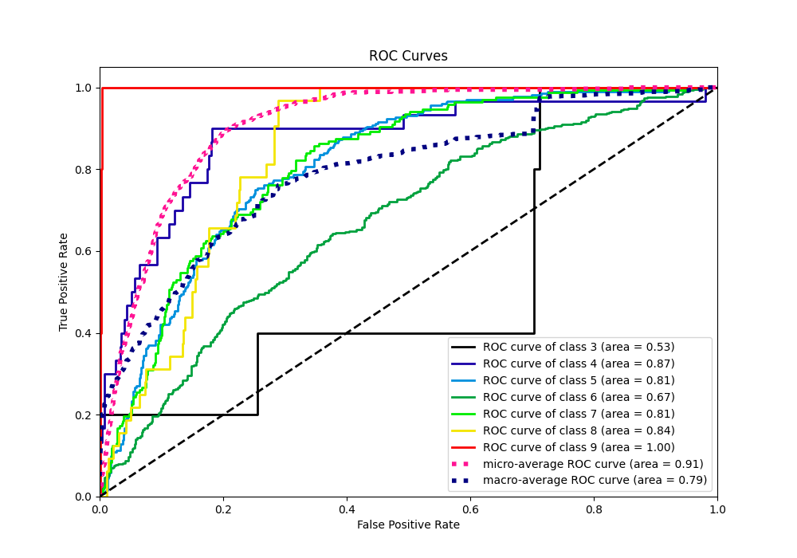
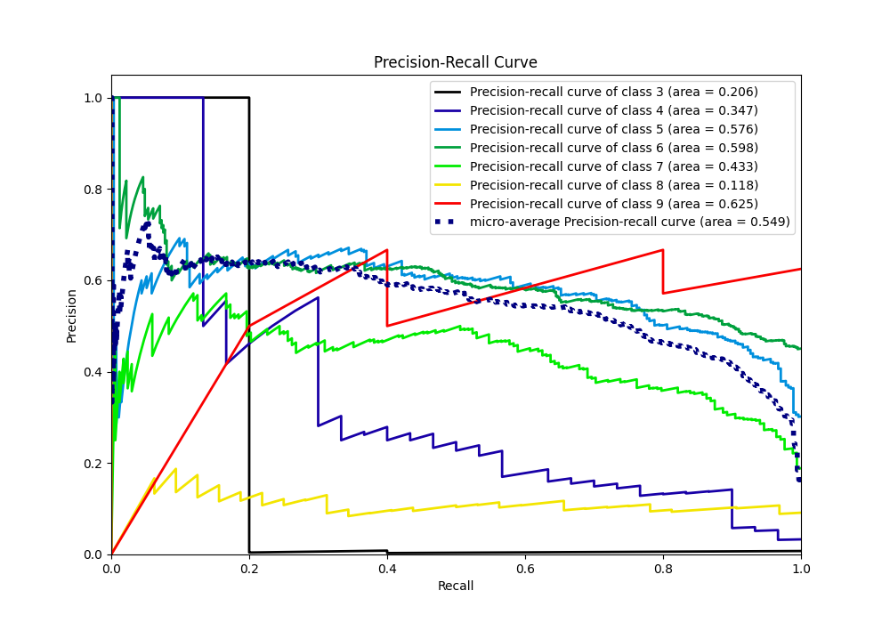

# Summary of Ensemble

[<< Go back](../README.md)

## Ensemble structure
| Model                   |   Weight |
|:------------------------|---------:|
| 2_Linear                |        1 |
| 3_Default_NeuralNetwork |        1 |

### Metric details
|           |        3 |         4 |          5 |          6 |          7 |   8 |        9 |   accuracy |   macro avg |   weighted avg |   logloss |
|:----------|---------:|----------:|-----------:|-----------:|-----------:|----:|---------:|-----------:|------------:|---------------:|----------:|
| precision | 1        |  1        |   0.594595 |   0.552381 |   0.464567 |   0 | 0.666667 |    0.55303 |    0.611173 |       0.547331 |   1.04205 |
| recall    | 0.2      |  0.1      |   0.564103 |   0.705596 |   0.35119  |   0 | 0.8      |    0.55303 |    0.388698 |       0.55303  |   1.04205 |
| f1-score  | 0.333333 |  0.181818 |   0.578947 |   0.619658 |   0.4      |   0 | 0.727273 |    0.55303 |    0.405861 |       0.531049 |   1.04205 |
| support   | 5        | 30        | 273        | 411        | 168        |  32 | 5        |    0.55303 |  924        |     924        |   1.04205 |

## Confusion matrix
|              |   Predicted as 3 |   Predicted as 4 |   Predicted as 5 |   Predicted as 6 |   Predicted as 7 |   Predicted as 8 |   Predicted as 9 |
|:-------------|-----------------:|-----------------:|-----------------:|-----------------:|-----------------:|-----------------:|-----------------:|
| Labeled as 3 |                1 |                0 |                2 |                2 |                0 |                0 |                0 |
| Labeled as 4 |                0 |                3 |               17 |               10 |                0 |                0 |                0 |
| Labeled as 5 |                0 |                0 |              154 |              114 |                5 |                0 |                0 |
| Labeled as 6 |                0 |                0 |               79 |              290 |               42 |                0 |                0 |
| Labeled as 7 |                0 |                0 |                7 |               97 |               59 |                3 |                2 |
| Labeled as 8 |                0 |                0 |                0 |               12 |               20 |                0 |                0 |
| Labeled as 9 |                0 |                0 |                0 |                0 |                1 |                0 |                4 |

## Learning curves

## Confusion Matrix

## Normalized Confusion Matrix

## ROC Curve

## Precision Recall Curve

[<< Go back](../README.md)
