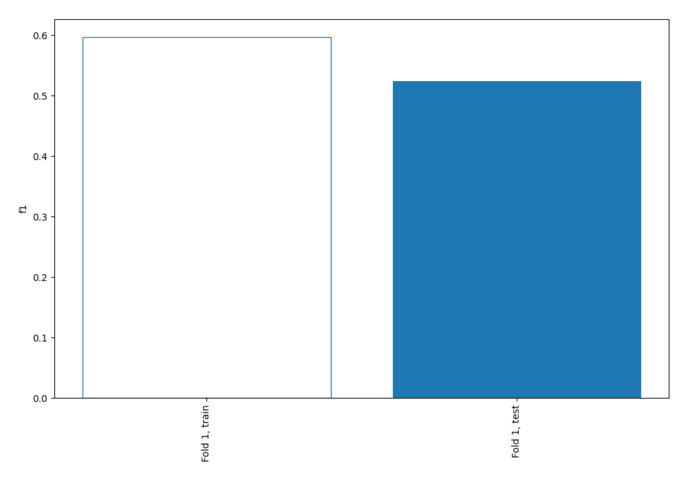
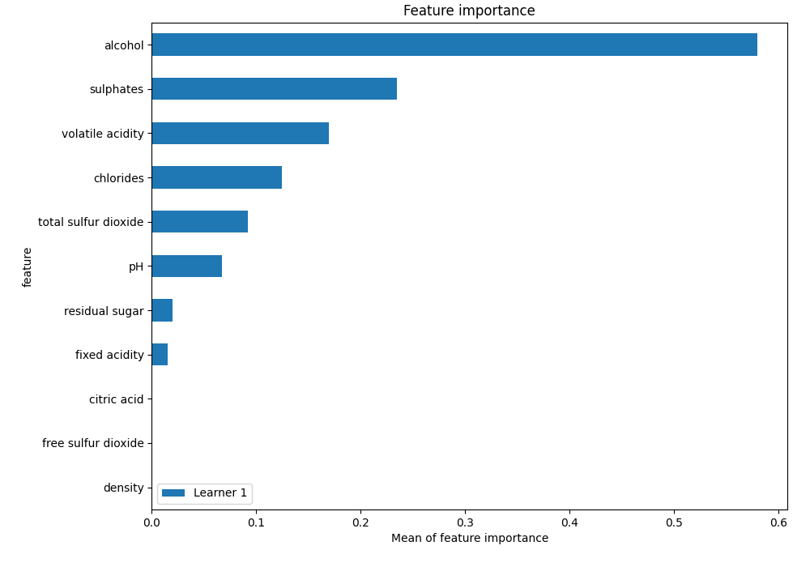
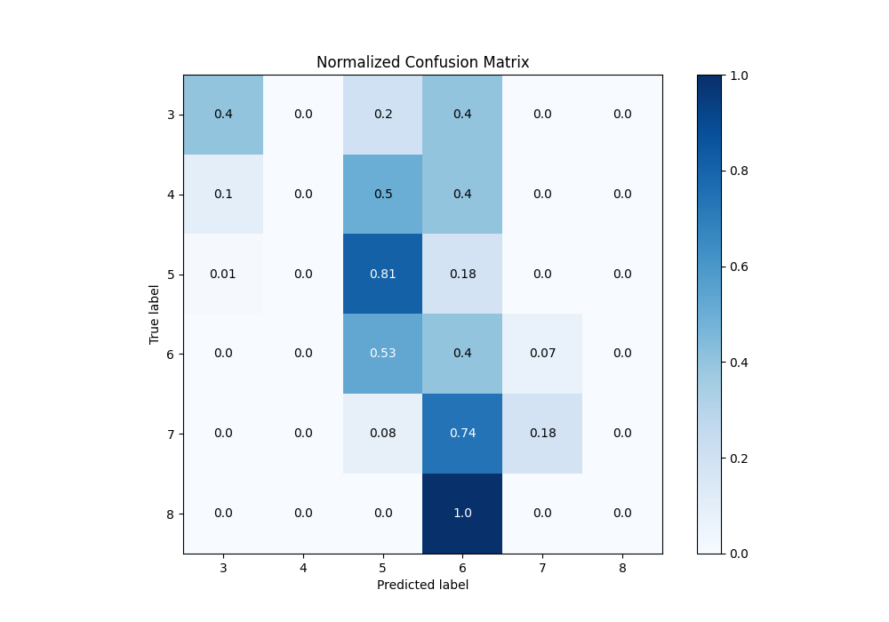
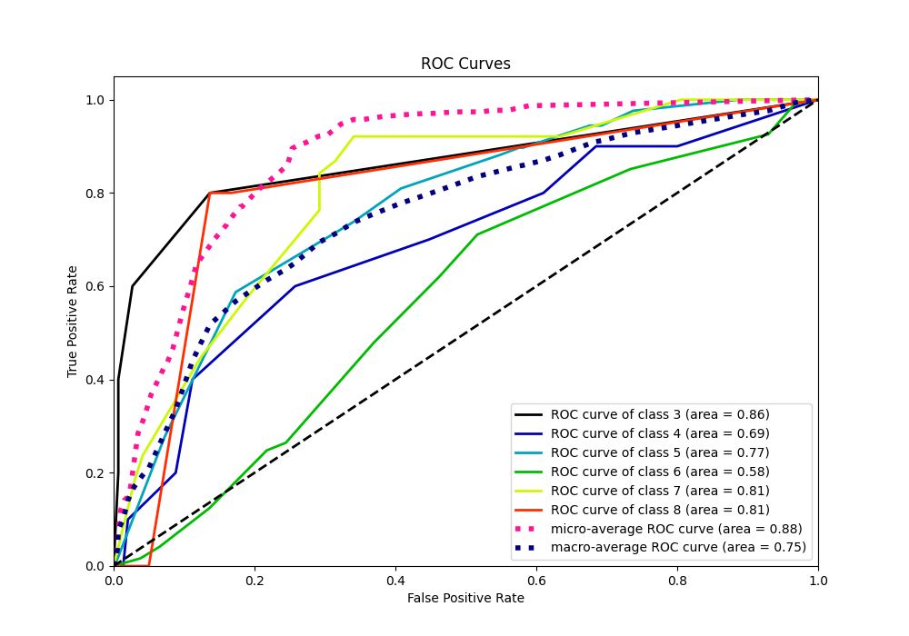
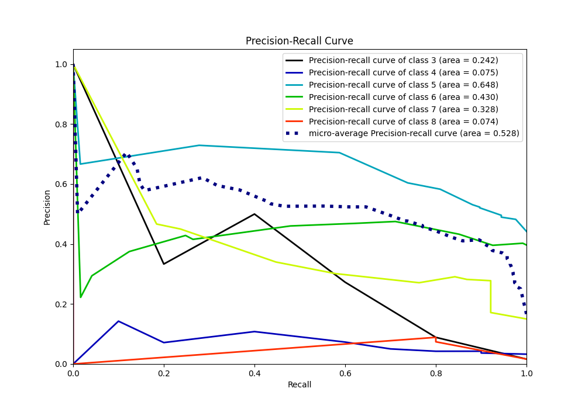

# Summary of 1_DecisionTree

[<< Go back](../README.md)

## Decision Tree
- **n_jobs**: -1
- **criterion**: entropy
- **max_depth**: 4
- **num_class**: 6
- **explain_level**: 1

## Validation
 - **validation_type**: split
 - **train_ratio**: 0.75
 - **shuffle**: True
 - **stratify**: True

## Optimized metric
f1

## Training time

4.8 seconds

### Metric details
|           |        3 |   4 |          5 |          6 |         7 |   8 |   accuracy |   macro avg |   weighted avg |   logloss |
|:----------|---------:|----:|-----------:|-----------:|----------:|----:|-----------:|------------:|---------------:|----------:|
| precision | 0.5      |   0 |   0.582857 |   0.441441 |  0.466667 |   0 |    0.52459 |    0.331828 |       0.482255 |   1.17631 |
| recall    | 0.4      |   0 |   0.809524 |   0.404959 |  0.184211 |   0 |    0.52459 |    0.299782 |       0.52459  |   1.17631 |
| f1-score  | 0.444444 |   0 |   0.677741 |   0.422414 |  0.264151 |   0 |    0.52459 |    0.301458 |       0.487762 |   1.17631 |
| support   | 5        |  10 | 126        | 121        | 38        |   5 |    0.52459 |  305        |     305        |   1.17631 |

## Confusion matrix
|              |   Predicted as 3 |   Predicted as 4 |   Predicted as 5 |   Predicted as 6 |   Predicted as 7 |   Predicted as 8 |
|:-------------|-----------------:|-----------------:|-----------------:|-----------------:|-----------------:|-----------------:|
| Labeled as 3 |                2 |                0 |                1 |                2 |                0 |                0 |
| Labeled as 4 |                1 |                0 |                5 |                4 |                0 |                0 |
| Labeled as 5 |                1 |                0 |              102 |               23 |                0 |                0 |
| Labeled as 6 |                0 |                0 |               64 |               49 |                8 |                0 |
| Labeled as 7 |                0 |                0 |                3 |               28 |                7 |                0 |
| Labeled as 8 |                0 |                0 |                0 |                5 |                0 |                0 |

## Learning curves

## Permutation-based Importance

## Confusion Matrix

## Normalized Confusion Matrix

## ROC Curve

## Precision Recall Curve

[<< Go back](../README.md)
