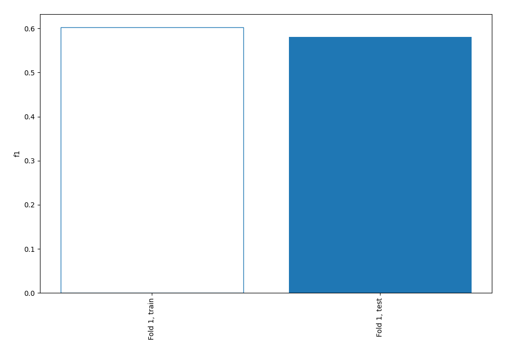
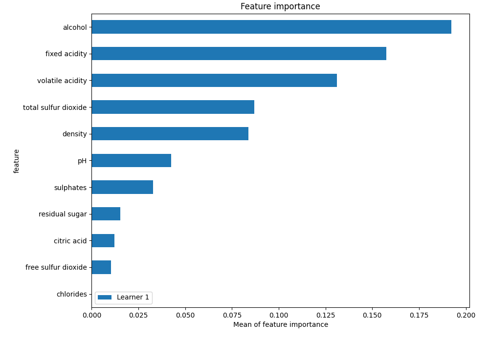
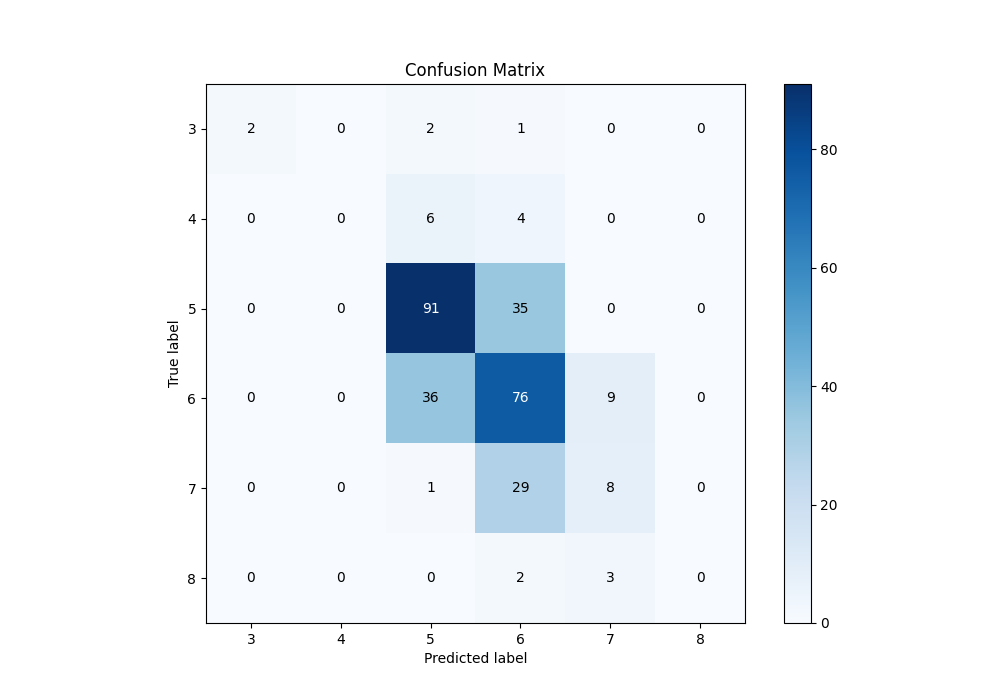
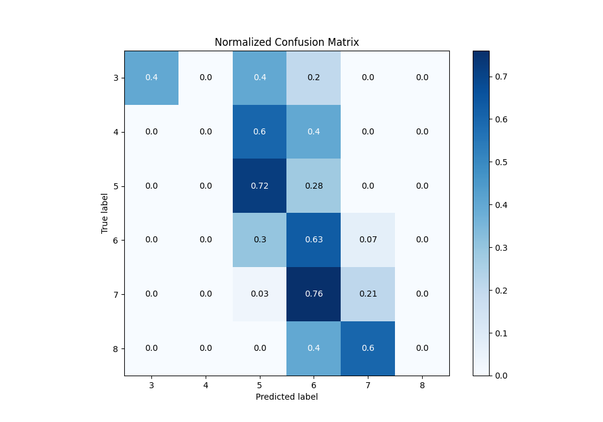
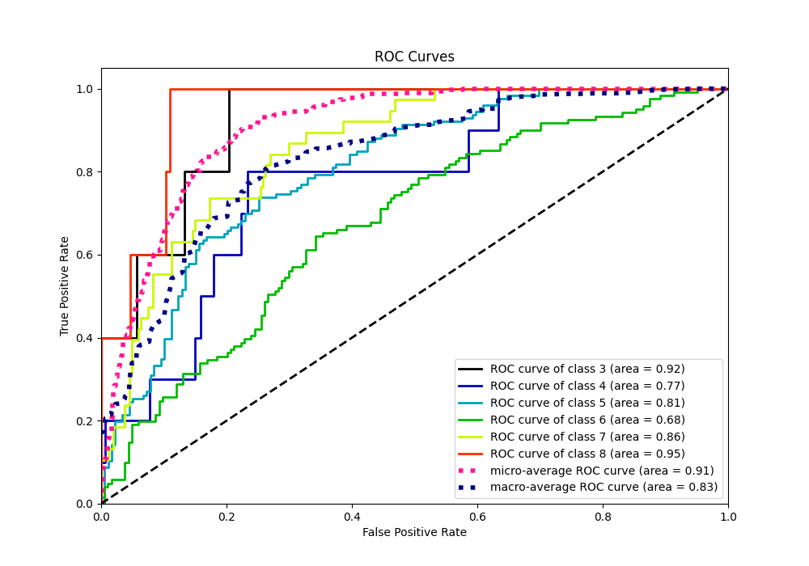
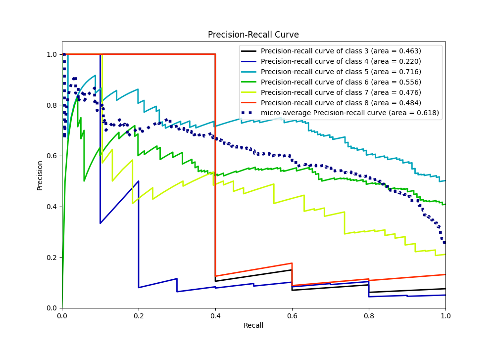

# Summary of 2_Linear

[<< Go back](../README.md)

## Logistic Regression (Linear)
- **n_jobs**: -1
- **num_class**: 6
- **explain_level**: 1

## Validation
 - **validation_type**: split
 - **train_ratio**: 0.75
 - **shuffle**: True
 - **stratify**: True

## Optimized metric
f1

## Training time

0.4 seconds

### Metric details
|           |        3 |   4 |          5 |          6 |         7 |   8 |   accuracy |   macro avg |   weighted avg |   logloss |
|:----------|---------:|----:|-----------:|-----------:|----------:|----:|-----------:|------------:|---------------:|----------:|
| precision | 1        |   0 |   0.669118 |   0.517007 |  0.4      |   0 |   0.580328 |    0.431021 |       0.547759 |  0.946901 |
| recall    | 0.4      |   0 |   0.722222 |   0.628099 |  0.210526 |   0 |   0.580328 |    0.326808 |       0.580328 |  0.946901 |
| f1-score  | 0.571429 |   0 |   0.694656 |   0.567164 |  0.275862 |   0 |   0.580328 |    0.351519 |       0.555716 |  0.946901 |
| support   | 5        |  10 | 126        | 121        | 38        |   5 |   0.580328 |  305        |     305        |  0.946901 |

## Confusion matrix
|              |   Predicted as 3 |   Predicted as 4 |   Predicted as 5 |   Predicted as 6 |   Predicted as 7 |   Predicted as 8 |
|:-------------|-----------------:|-----------------:|-----------------:|-----------------:|-----------------:|-----------------:|
| Labeled as 3 |                2 |                0 |                2 |                1 |                0 |                0 |
| Labeled as 4 |                0 |                0 |                6 |                4 |                0 |                0 |
| Labeled as 5 |                0 |                0 |               91 |               35 |                0 |                0 |
| Labeled as 6 |                0 |                0 |               36 |               76 |                9 |                0 |
| Labeled as 7 |                0 |                0 |                1 |               29 |                8 |                0 |
| Labeled as 8 |                0 |                0 |                0 |                2 |                3 |                0 |

## Learning curves

## Coefficients

### Coefficients learner #1
|                      |          3 |          4 |         5 |          6 |          7 |         8 |
|:---------------------|-----------:|-----------:|----------:|-----------:|-----------:|----------:|
| intercept            | -3.0197    | -0.410208  |  2.27226  |  2.82938   |  0.714677  | -2.38641  |
| fixed acidity        |  0.785079  |  0.115484  | -0.606466 | -0.368107  |  0.300351  | -0.226341 |
| volatile acidity     |  1.03134   |  0.617836  |  0.142721 | -0.43742   | -0.771836  | -0.582638 |
| citric acid          |  0.55051   |  0.680184  |  0.294295 | -0.993717  | -0.195389  | -0.335883 |
| residual sugar       |  0.150298  |  0.139903  | -0.328686 | -0.264839  |  0.11839   |  0.184934 |
| chlorides            |  0.0842169 |  0.250448  |  0.519898 |  0.0875828 | -0.629076  | -0.31307  |
| free sulfur dioxide  |  0.342037  | -0.463538  | -0.162992 |  0.10158   | -0.039985  |  0.222898 |
| total sulfur dioxide | -1.16021   |  0.512834  |  0.767644 |  0.184351  |  0.173675  | -0.478292 |
| density              |  0.737861  | -0.355156  |  0.401039 |  0.348111  | -0.41684   | -0.715015 |
| pH                   |  1.19374   |  0.0131789 | -0.342662 | -0.271217  |  0.0289578 | -0.622001 |
| sulphates            | -0.224608  | -0.191735  | -0.412675 | -0.0992652 |  0.322394  |  0.605889 |
| alcohol              | -0.74716   | -0.585775  | -0.58871  |  0.238357  |  0.585092  |  1.0982   |

## Permutation-based Importance

## Confusion Matrix

## Normalized Confusion Matrix

## ROC Curve

## Precision Recall Curve

[<< Go back](../README.md)
