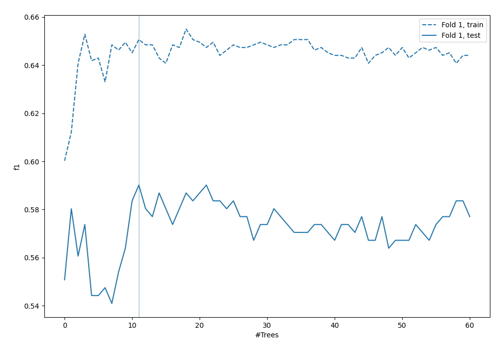
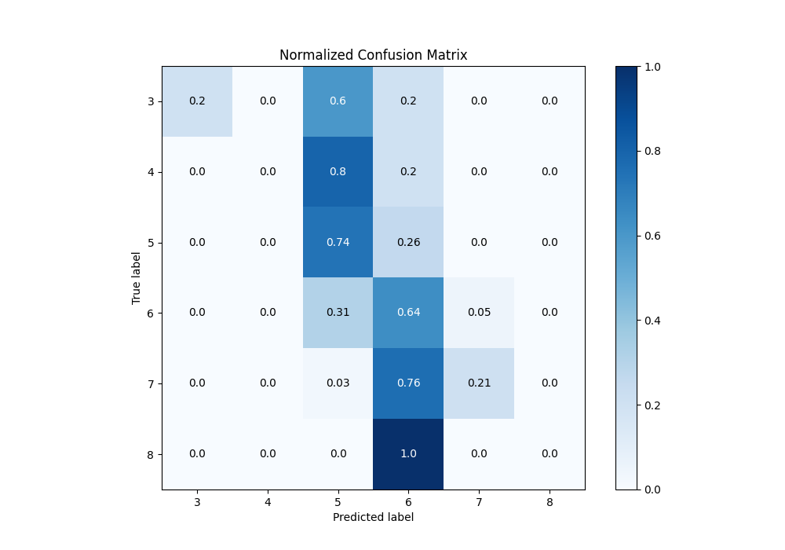
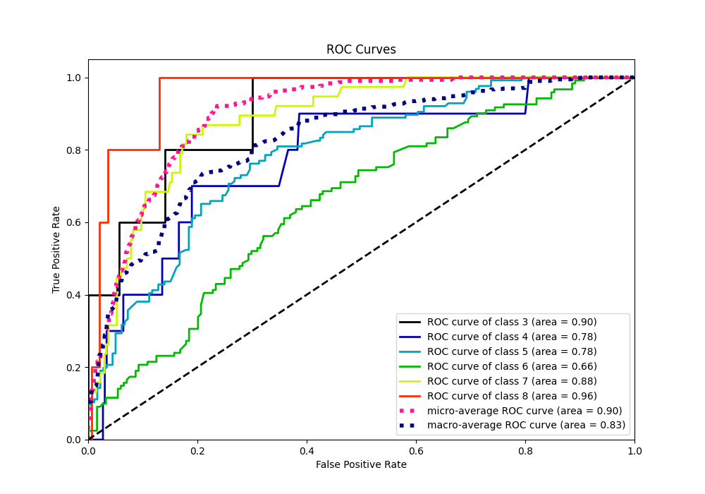
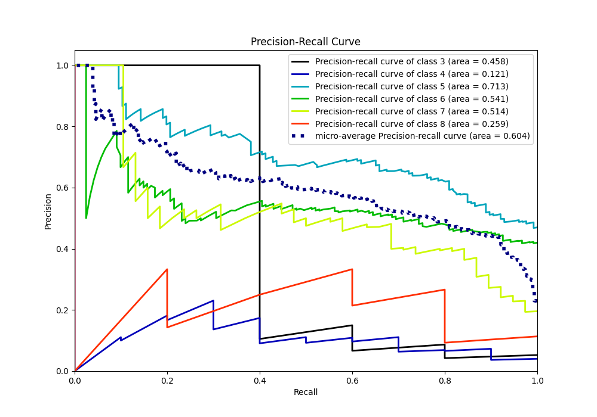

# Summary of 4_Default_RandomForest

[<< Go back](../README.md)

## Random Forest
- **n_jobs**: -1
- **criterion**: gini
- **max_features**: 0.9
- **min_samples_split**: 30
- **max_depth**: 4
- **eval_metric_name**: f1
- **num_class**: 6
- **explain_level**: 1

## Validation
 - **validation_type**: split
 - **train_ratio**: 0.75
 - **shuffle**: True
 - **stratify**: True

## Optimized metric
f1

## Training time

1.0 seconds

### Metric details
|           |        3 |   4 |          5 |          6 |         7 |   8 |   accuracy |   macro avg |   weighted avg |   logloss |
|:----------|---------:|----:|-----------:|-----------:|----------:|----:|-----------:|------------:|---------------:|----------:|
| precision | 1        |   0 |   0.65493  |   0.527027 |  0.571429 |   0 |   0.590164 |    0.458898 |       0.567232 |  0.986082 |
| recall    | 0.2      |   0 |   0.738095 |   0.644628 |  0.210526 |   0 |   0.590164 |    0.298875 |       0.590164 |  0.986082 |
| f1-score  | 0.333333 |   0 |   0.69403  |   0.579926 |  0.307692 |   0 |   0.590164 |    0.319164 |       0.560583 |  0.986082 |
| support   | 5        |  10 | 126        | 121        | 38        |   5 |   0.590164 |  305        |     305        |  0.986082 |

## Confusion matrix
|              |   Predicted as 3 |   Predicted as 4 |   Predicted as 5 |   Predicted as 6 |   Predicted as 7 |   Predicted as 8 |
|:-------------|-----------------:|-----------------:|-----------------:|-----------------:|-----------------:|-----------------:|
| Labeled as 3 |                1 |                0 |                3 |                1 |                0 |                0 |
| Labeled as 4 |                0 |                0 |                8 |                2 |                0 |                0 |
| Labeled as 5 |                0 |                0 |               93 |               33 |                0 |                0 |
| Labeled as 6 |                0 |                0 |               37 |               78 |                6 |                0 |
| Labeled as 7 |                0 |                0 |                1 |               29 |                8 |                0 |
| Labeled as 8 |                0 |                0 |                0 |                5 |                0 |                0 |

## Learning curves

## Permutation-based Importance

## Confusion Matrix

## Normalized Confusion Matrix

## ROC Curve

## Precision Recall Curve

[<< Go back](../README.md)
