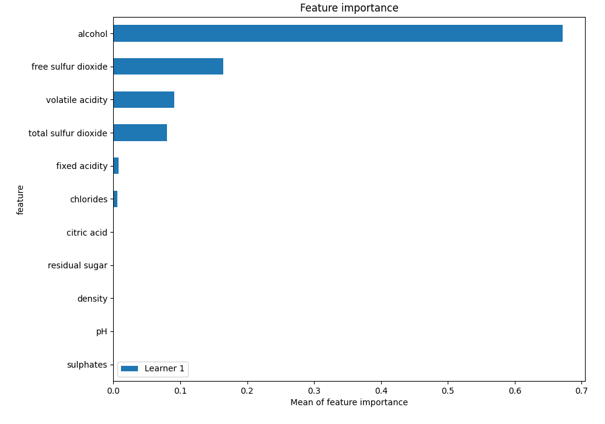
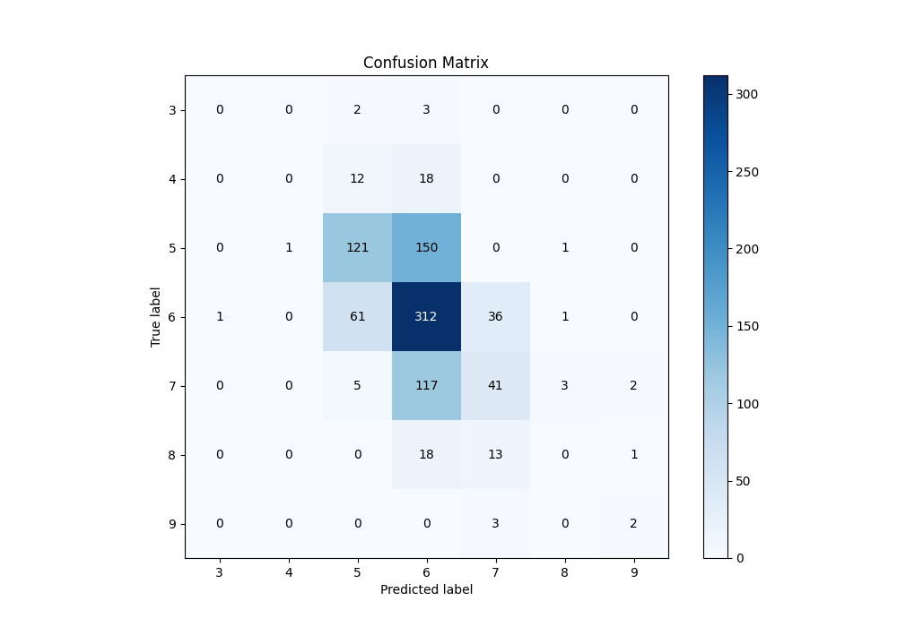
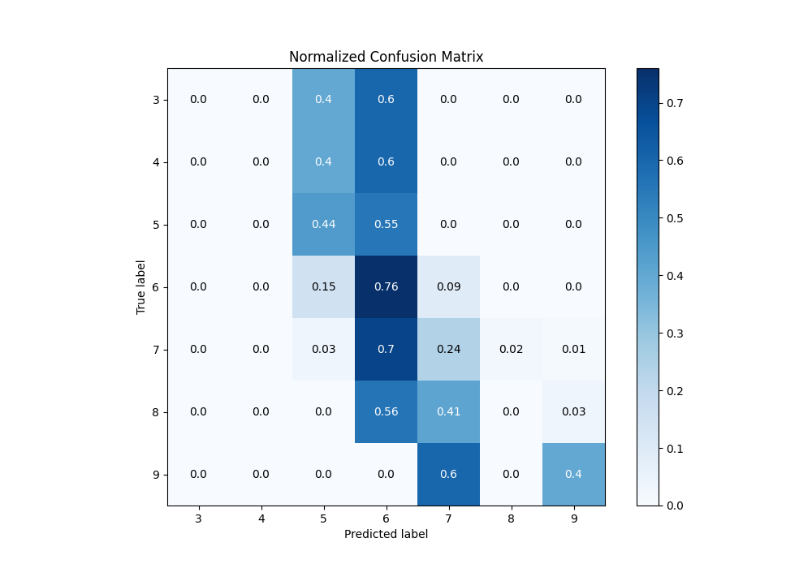
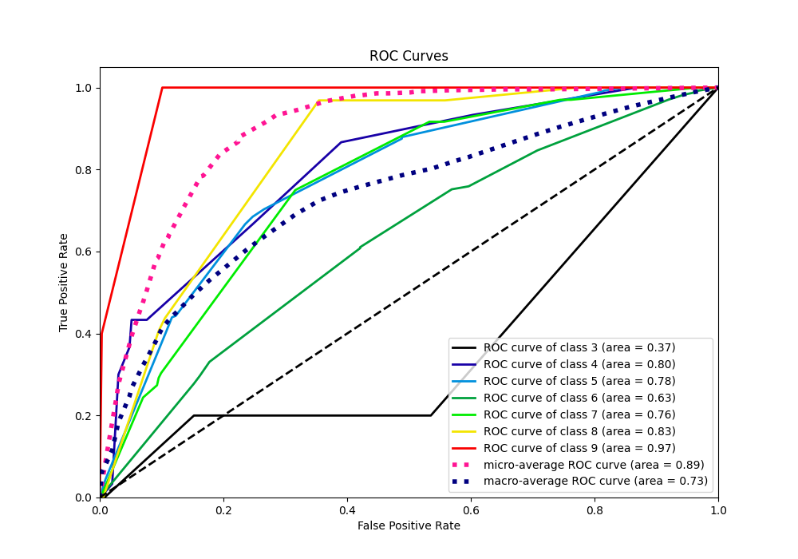
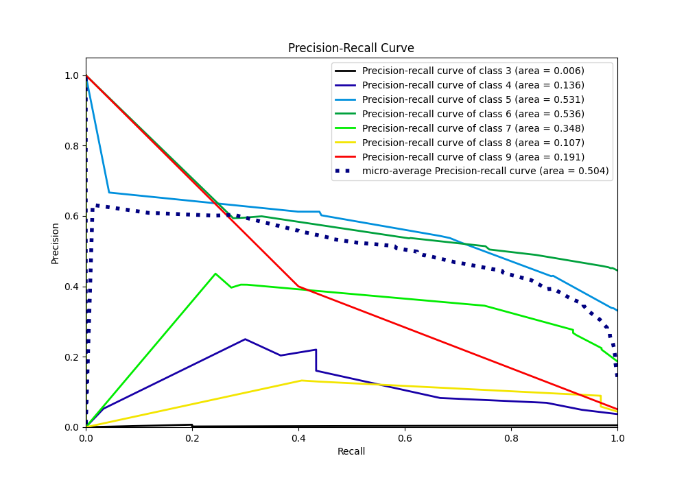

# Summary of 1_DecisionTree

[<< Go back](../README.md)

## Decision Tree
- **n_jobs**: -1
- **criterion**: entropy
- **max_depth**: 4
- **num_class**: 7
- **explain_level**: 1

## Validation
 - **validation_type**: split
 - **train_ratio**: 0.75
 - **shuffle**: True
 - **stratify**: True

## Optimized metric
f1

## Training time

7.3 seconds

### Metric details
|           |   3 |   4 |          5 |          6 |          7 |   8 |   9 |   accuracy |   macro avg |   weighted avg |   logloss |
|:----------|----:|----:|-----------:|-----------:|-----------:|----:|----:|-----------:|------------:|---------------:|----------:|
| precision |   0 |   0 |   0.60199  |   0.504854 |   0.44086  |   0 | 0.4 |   0.515152 |    0.278244 |       0.484743 |   1.14087 |
| recall    |   0 |   0 |   0.443223 |   0.759124 |   0.244048 |   0 | 0.4 |   0.515152 |    0.263771 |       0.515152 |   1.14087 |
| f1-score  |   0 |   0 |   0.510549 |   0.606414 |   0.314176 |   0 | 0.4 |   0.515152 |    0.261591 |       0.479867 |   1.14087 |
| support   |   5 |  30 | 273        | 411        | 168        |  32 | 5   |   0.515152 |  924        |     924        |   1.14087 |

## Confusion matrix
|              |   Predicted as 3 |   Predicted as 4 |   Predicted as 5 |   Predicted as 6 |   Predicted as 7 |   Predicted as 8 |   Predicted as 9 |
|:-------------|-----------------:|-----------------:|-----------------:|-----------------:|-----------------:|-----------------:|-----------------:|
| Labeled as 3 |                0 |                0 |                2 |                3 |                0 |                0 |                0 |
| Labeled as 4 |                0 |                0 |               12 |               18 |                0 |                0 |                0 |
| Labeled as 5 |                0 |                1 |              121 |              150 |                0 |                1 |                0 |
| Labeled as 6 |                1 |                0 |               61 |              312 |               36 |                1 |                0 |
| Labeled as 7 |                0 |                0 |                5 |              117 |               41 |                3 |                2 |
| Labeled as 8 |                0 |                0 |                0 |               18 |               13 |                0 |                1 |
| Labeled as 9 |                0 |                0 |                0 |                0 |                3 |                0 |                2 |

## Learning curves

## Permutation-based Importance

## Confusion Matrix

## Normalized Confusion Matrix

## ROC Curve

## Precision Recall Curve

[<< Go back](../README.md)
