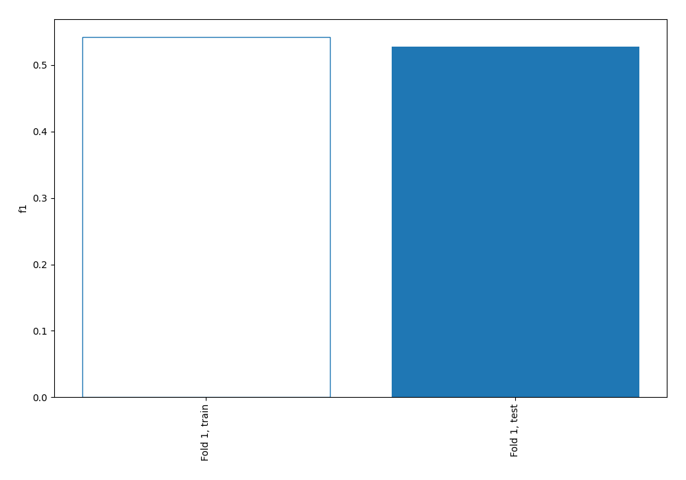
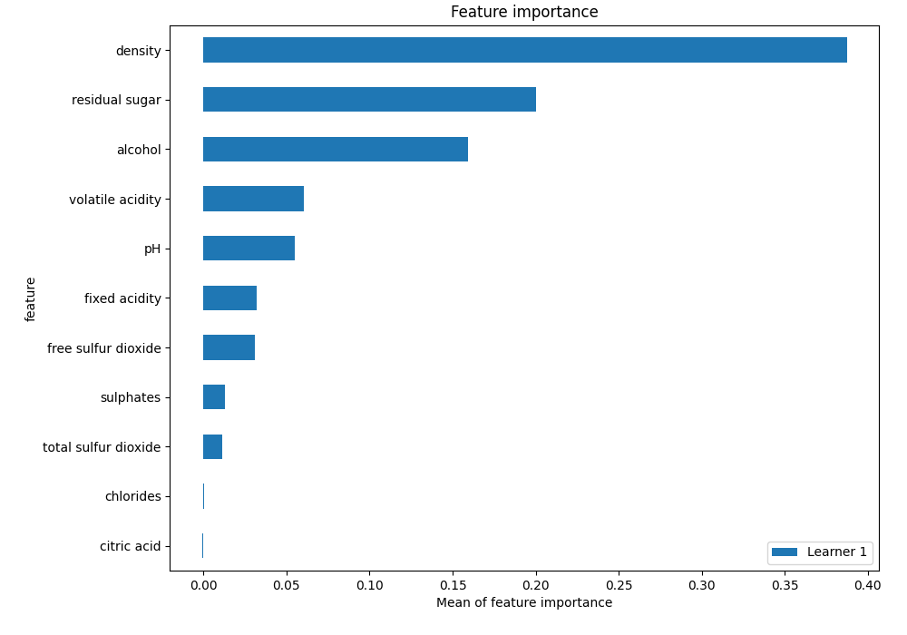
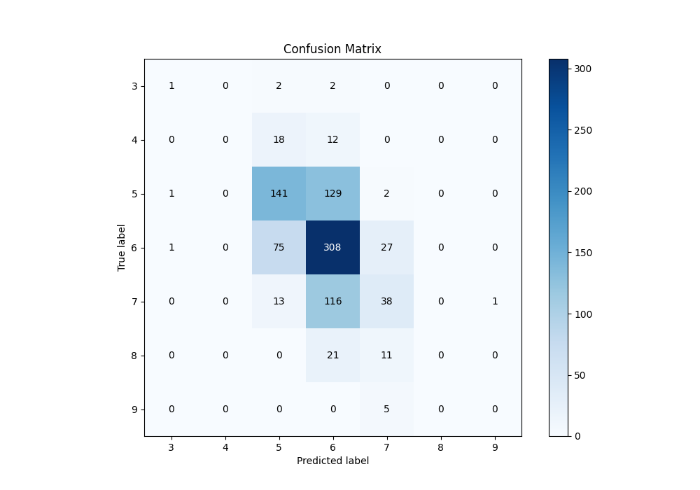
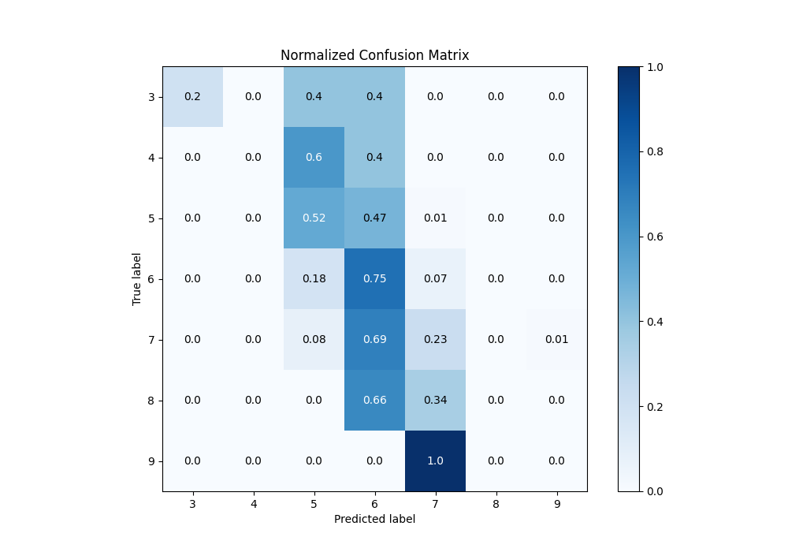
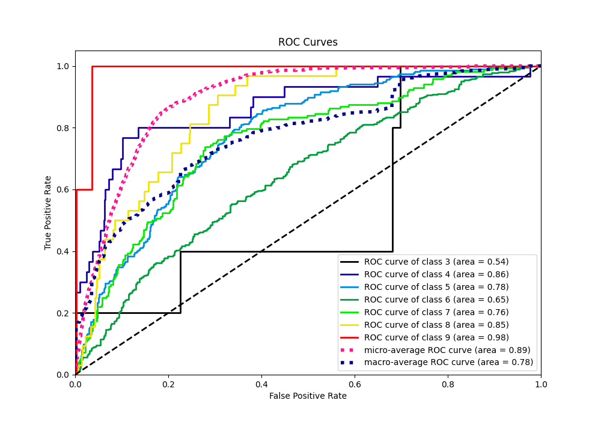
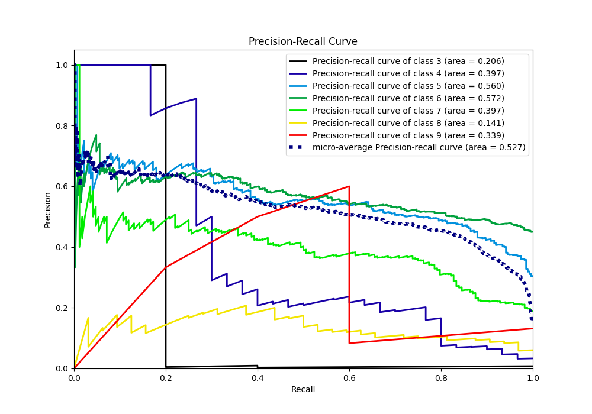

# Summary of 2_Linear

[<< Go back](../README.md)

## Logistic Regression (Linear)
- **n_jobs**: -1
- **num_class**: 7
- **explain_level**: 1

## Validation
 - **validation_type**: split
 - **train_ratio**: 0.75
 - **shuffle**: True
 - **stratify**: True

## Optimized metric
f1

## Training time

1.0 seconds

### Metric details
|           |        3 |   4 |          5 |          6 |          7 |   8 |   9 |   accuracy |   macro avg |   weighted avg |   logloss |
|:----------|---------:|----:|-----------:|-----------:|-----------:|----:|----:|-----------:|------------:|---------------:|----------:|
| precision | 0.333333 |   0 |   0.566265 |   0.52381  |   0.457831 |   0 |   0 |   0.528139 |    0.268748 |       0.485345 |   1.10077 |
| recall    | 0.2      |   0 |   0.516484 |   0.749392 |   0.22619  |   0 |   0 |   0.528139 |    0.241724 |       0.528139 |   1.10077 |
| f1-score  | 0.25     |   0 |   0.54023  |   0.616617 |   0.302789 |   0 |   0 |   0.528139 |    0.244234 |       0.490293 |   1.10077 |
| support   | 5        |  30 | 273        | 411        | 168        |  32 |   5 |   0.528139 |  924        |     924        |   1.10077 |

## Confusion matrix
|              |   Predicted as 3 |   Predicted as 4 |   Predicted as 5 |   Predicted as 6 |   Predicted as 7 |   Predicted as 8 |   Predicted as 9 |
|:-------------|-----------------:|-----------------:|-----------------:|-----------------:|-----------------:|-----------------:|-----------------:|
| Labeled as 3 |                1 |                0 |                2 |                2 |                0 |                0 |                0 |
| Labeled as 4 |                0 |                0 |               18 |               12 |                0 |                0 |                0 |
| Labeled as 5 |                1 |                0 |              141 |              129 |                2 |                0 |                0 |
| Labeled as 6 |                1 |                0 |               75 |              308 |               27 |                0 |                0 |
| Labeled as 7 |                0 |                0 |               13 |              116 |               38 |                0 |                1 |
| Labeled as 8 |                0 |                0 |                0 |               21 |               11 |                0 |                0 |
| Labeled as 9 |                0 |                0 |                0 |                0 |                5 |                0 |                0 |

## Learning curves

## Coefficients

### Coefficients learner #1
|                      |         3 |          4 |         5 |          6 |          7 |          8 |           9 |
|:---------------------|----------:|-----------:|----------:|-----------:|-----------:|-----------:|------------:|
| intercept            | -3.0167   | -0.814162  |  2.37797  |  3.90678   |  2.41037   |  0.386805  | -5.25106    |
| fixed acidity        |  0.786541 | -0.421741  | -0.491651 | -0.572706  | -0.0886905 | -0.190953  |  0.979202   |
| volatile acidity     |  0.374208 |  3.9836    |  2.33738  | -2.14917   | -3.11766   | -1.42217   | -0.00619104 |
| citric acid          | -0.342154 | -0.0153809 | -0.106742 |  0.287022  | -0.259635  |  0.340434  |  0.0964558  |
| residual sugar       |  0.179024 | -0.994666  | -0.579474 | -0.257879  |  0.800488  |  0.727054  |  0.125453   |
| chlorides            |  0.222803 |  0.106814  | -0.137055 |  0.411199  | -0.469013  |  0.0104397 | -0.145187   |
| free sulfur dioxide  |  0.357206 | -0.924258  | -0.213294 | -0.0838176 | -0.022565  |  0.23379   |  0.652938   |
| total sulfur dioxide |  0.757293 | -0.0988488 |  0.113137 | -0.0547116 |  0.0382285 | -0.169086  | -0.586012   |
| density              |  0.342687 |  1.18295   |  0.873062 |  0.755191  | -0.843035  | -0.437789  | -1.87306    |
| pH                   | -0.751184 | -0.364513  | -0.380414 | -0.298841  |  0.127744  |  0.0776749 |  1.58953    |
| sulphates            | -0.231178 | -0.457195  | -0.827936 | -0.284328  |  1.30096   |  0.521142  | -0.0214621  |
| alcohol              |  0.199696 | -0.760016  | -0.938771 |  0.0110216 |  0.0148386 |  0.285515  |  1.18772    |

## Permutation-based Importance

## Confusion Matrix

## Normalized Confusion Matrix

## ROC Curve

## Precision Recall Curve

[<< Go back](../README.md)
